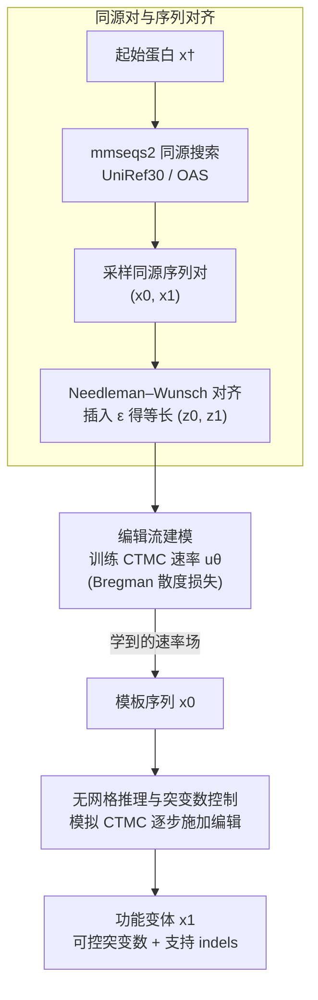

# EvoFlows: Evolutionary Edit-Based Flow-Matching for Protein Engineering

**会议**: ICLR 2026 (Workshop on Foundation Models for Science)  
**arXiv**: [2603.11703](https://arxiv.org/abs/2603.11703)  
**代码**: 无  
**领域**: 生物医学 / 蛋白质设计  
**关键词**: Protein Engineering, Flow Matching, Edit Operations, Sequence-to-Sequence, Evolutionary Trajectories

## 一句话总结

EvoFlows 提出一种基于编辑操作的 Flow Matching 方法，通过学习进化相关蛋白质序列间的突变轨迹，能在模板序列上执行可控数量的突变（插入、删除、替换），同时预测"突变什么"和"在哪里突变"。

## 研究背景与动机

蛋白质工程的核心目标是基于已知蛋白质序列（模板），生成功能性变体。这需要模型能够在模板基础上引入合理的突变。现有蛋白质语言模型在优化任务中存在多重局限：

**自回归模型（如 ESM、ProtGPT2）**: 需要从头生成完整序列，无法直接在模板上做局部修改，也难以控制与模板的距离（突变数量）。

**掩码语言模型/离散扩散模型（如 ESM-MLM、EvoDiff）**: 依赖预先指定的突变位置（哪些位置被 mask），但在实际蛋白质工程中，最优突变位置通常未知。这些方法无法自主发现突变位点。

**不支持插入和删除（indels）**: 绝大多数现有方法仅处理固定长度序列的替换突变，而自然进化中大量的适应性变化来自序列长度的变化——即插入和删除操作。

总结来说，现有方法要么不支持模板条件生成，要么需要已知突变位置，要么忽略了 indels——这使得它们与真实蛋白质工程的需求存在显著差距。

## 方法详解

### 整体框架

EvoFlows 把蛋白质工程看成一条从模板序列到同源变体的「编辑流」。它的底层是**离散流匹配**（Discrete Flow Matching, DFM）：两条进化相关序列之间的差异由一串带位点的基本编辑（替换、插入、删除）连接起来，模型学习一条连续时间马尔可夫链（CTMC）的局部速率 $u_t$，描述这些编辑随时间逐步发生的规律。训练时，先用同源搜索找出成对的相关序列、再用序列对齐把它们补成等长，然后拟合编辑流的速率；推理时从模板出发模拟这条马尔可夫链，逐步累积编辑得到变体，并通过一个归一化超参控制「走多远」（即施加多少个突变）。整条流水线如下图。

### 关键设计

**1. 编辑流建模：把突变表示成离散流匹配的编辑操作，同时回答「在哪改」和「改成什么」**

现有方法的尴尬在于：掩码语言模型只能在外部预先指定的位点上做替换、且假定序列等长，自回归模型则要整条重新生成、难以控制改动量，两者都无法表达插入与删除。EvoFlows 改用 Havasi 等人的**编辑流（Edit Flows）**——离散流匹配（DFM）的一种变体。DFM 在离散字母表上定义一条 CTMC $X_t$，通过学习局部速率 $u_t$ 把源序列 $x_0$ 输运到目标序列 $x_1$、使序列对服从联合分布 $\pi(x_0, x_1)$；编辑流进一步把 $u_t$ 编码的转移扩展成**基本编辑操作**（替换、插入、删除）。为容纳变长序列，作者引入扩展字母表 $\mathcal{Z}=\mathcal{A}\cup\{\varepsilon\}$，用空字符 $\varepsilon$ 把一对序列逐位对齐成等长的 $(z_0, z_1)$，再从一个连续单调的调度 $\kappa_t$ 定义条件路径、边缘化得到 $u_t$。这样位置不再是外部输入、而是编辑操作自带的属性，模型可一并预测改哪里、改成什么；插入与删除天然带来长度变化，覆盖了自然进化（尤其抗体）里大量的 indel——这正是固定长度掩码范式做不到的。

**2. 同源对与序列对齐：用进化关系定义流的起止与轨迹**

编辑流要训练，得先有「从哪到哪」的序列对分布 $\pi(x_0, x_1)$，以及把它们对齐成等长的方法。EvoFlows 用蛋白同源关系来近似「功能相似」：给定起始蛋白 $x^{\dagger}$，用 mmseqs2 在 UniRef30、OAS 等大库里检索可能同源的天然序列，把得到的同源簇 $R(x^{\dagger})$ 当作经验分布，并令 $\pi(x,x')=p_{x^{\dagger}}(x)\,p_{x^{\dagger}}(x')$，于是模型学到的是「采样某序列的同源变体」。拿到一对序列后，再用经典的 **Needleman–Wunsch** 算法做全局对齐、插入 $\varepsilon$ 把二者补成等长的 $(z_0, z_1)$——这一步把序列差异落成一串带位点的基本编辑，而且对齐里的插入/删除恰好对应真实的生化进化事件，让学到的轨迹贴合自然选择，而非随意的编辑路径。

**3. 无网格推理与突变数控制：模拟 CTMC 逐步施加编辑，并用 clock 归一化调节改动量**

训练好速率 $u_\theta$ 后，推理就是从模板 $x_0$ 出发模拟这条 CTMC：每一步先采「下次突变何时发生」——总速率越高、下一次编辑来得越快，作者用逆 CDF（抽 $U\sim\text{Uniform}(0,1)$ 再数值积分到阈值）直接采事件时刻；再按速率采「具体施加哪个编辑」，循环到 $t=1$ 输出变体。这套**无网格（grid-free）推理**与 Havasi 的 Euler 积分形式上很接近，但用一次均匀采样替代反复的 Bernoulli 采样，省去为避免病态分布而加的高阶项，更适合向量化。最关键的是，作者额外引入一个 **clock 归一化超参**，对速率做长度归一化缩放，从而**脱离序列长度地控制模型施加的突变数量**——这就是 EvoFlows 面向实际工程最实用的旋钮：少量编辑得到保守变体、放大则得到探索更远的激进变体。

### 损失函数 / 训练策略

训练目标不是常见的 MSE，而是对编辑流速率 $u_\theta$ 在所有时刻 $t$ 上优化一个 **Bregman 散度**（原文式 6）：因为每步只允许基本编辑，$u$ 仅在「相差一个基本编辑」的序列对上非零，求和可解析、训练可行。数据侧从 UniRef30（通用蛋白质参考簇）与 OAS（抗体序列数据库）提取同源蛋白家族构成序列对；训练前有一步预处理，用 Needleman–Wunsch 预先算好每对的对齐，作为流匹配的目标轨迹。

## 实验关键数据

### 实验设置
- 评估数据：UniRef 和 OAS 中多样化的蛋白质家族
- 评估方式：in silico（计算评估），非湿实验验证
- 核心评估维度：生成变体的自然性（是否与天然蛋白质家族分布一致）和探索范围（与模板的距离）

### 主实验

| 方法 | 家族一致性 | 模板距离 | indels支持 | 位置预测 |
|------|-----------|----------|-----------|----------|
| 自回归模型 | 中 | 不可控 | 有限 | 不适用（全序列生成） |
| 掩码语言模型 | 高（保守） | 需预设位置 | 不支持 | 不支持（需先指定） |
| 离散扩散模型 | 中高 | 需预设位置 | 不支持 | 不支持（需先指定） |
| **EvoFlows** | **高** | **更远且可控** | **支持** | **自动预测** |

### 消融实验

| 配置 | 关键指标 | 说明 |
|------|---------|------|
| 仅替换（无 indels） | 探索范围受限 | 验证了 indels 支持的必要性 |
| 调节 clock 归一化超参 | 突变数量可控 | 脱离序列长度地缩放总速率、调节改动量 |
| 不同蛋白质家族 | 一致表现良好 | 泛化能力可靠 |

### 关键发现

1. **EvoFlows 生成的变体与天然蛋白质家族分布一致**: 说明学到的编辑流确实捕获了自然进化的模式
2. **探索范围远超基线**: 能生成距模板更远的变体同时保持合理性，意味着更大的功能探索空间
3. **同时预测"哪里"和"什么"**: 不需要先验的突变位置知识，这对实际蛋白质工程非常重要

## 亮点与洞察

- **问题定义精准**: 准确识别了现有蛋白质语言模型在工程任务中的三个核心短板（无模板条件、需预知位置、不支持 indels），并用一个统一框架同时解决
- **编辑空间做离散流匹配**: 将 DFM/Edit Flows 用在蛋白序列上，是一个巧妙的建模选择——天然处理变长序列，且基本编辑与生化突变一一对应、物理意义更直观
- **可控性**: 通过 clock 归一化超参对速率做长度归一化缩放来控制突变程度，提供了实用的旋钮，工程师可按需调节保守/激进程度
- **连接进化与生成**: 利用进化相关序列作为训练信号，使生成过程隐式地遵循自然选择的约束

## 局限与展望

1. **仅 in silico 验证**: 所有实验为计算评估，缺乏湿实验验证。生成变体的实际功能性（酶活性、结合亲和力等）未知
2. **Workshop 论文**: 作为 workshop 论文，方法和实验的详细程度有限，大规模评估尚不充分
3. **编辑对齐的质量**: 训练依赖序列对齐计算编辑操作，对齐质量可能影响学到的流场；对于高度发散的序列对，最优编辑路径的选择不唯一
4. **结构信息缺失**: 当前方法仅在序列层面操作，未利用蛋白质三维结构信息。结构约束可能进一步提升变体的合理性
5. **扩展性**: 对超长蛋白质序列（>1000 残基）的处理效率和质量需要进一步验证
6. **多步编辑的组合效应**: 单对序列的编辑轨迹可能无法捕获多步进化中的协同突变效应

## 相关工作与启发

- **与 EvoDiff 的关系**: EvoDiff 使用离散扩散在序列空间直接生成，需预设突变位置；EvoFlows 在编辑空间做连续流匹配，不需预设位置
- **与 ESM 系列的关系**: ESM 的掩码语言模型擅长评估突变效果但不擅长设计突变方案；EvoFlows 直接面向突变设计
- **Flow Matching 在生物学中的应用**: 这是 flow matching 在蛋白质序列建模中的早期尝试，与分子构象生成中的 flow matching 方法形成呼应
- **对药物设计的启发**: 抗体亲和力成熟、酶工程等应用场景中，可控的序列编辑能力尤为关键

## 评分
- 新颖性: ⭐⭐⭐⭐
- 实验充分度: ⭐⭐⭐
- 写作质量: ⭐⭐⭐⭐
- 价值: ⭐⭐⭐⭐

<!-- RELATED:START -->

## 相关论文

- [\[ICML 2025\] Flexibility-conditioned Protein Structure Design with Flow Matching](../../ICML2025/computational_biology/flexibility-conditioned_protein_structure_design_with_flow_matching.md)
- [\[ICML 2025\] Improving Flow Matching by Aligning Flow Divergence](../../ICML2025/computational_biology/improving_flow_matching_by_aligning_flow_divergence.md)
- [\[ICLR 2026\] How to Make the Most of Your Masked Language Model for Protein Engineering](how_to_make_the_most_of_your_masked_language_model_for_protein_engineering.md)
- [\[ICML 2026\] LineageFlow: Flow Matching for High-Fidelity Family-Aware Protein Sequence Generation](../../ICML2026/computational_biology/lineageflow_flow_matching_for_high-fidelity_family-aware_protein_sequence_genera.md)
- [\[ICLR 2026\] scDFM: Distributional Flow Matching for Robust Single-Cell Perturbation Prediction](scdfm_distributional_flow_matching_model_for_robust_single-cell_perturbation_pre.md)

<!-- RELATED:END -->
