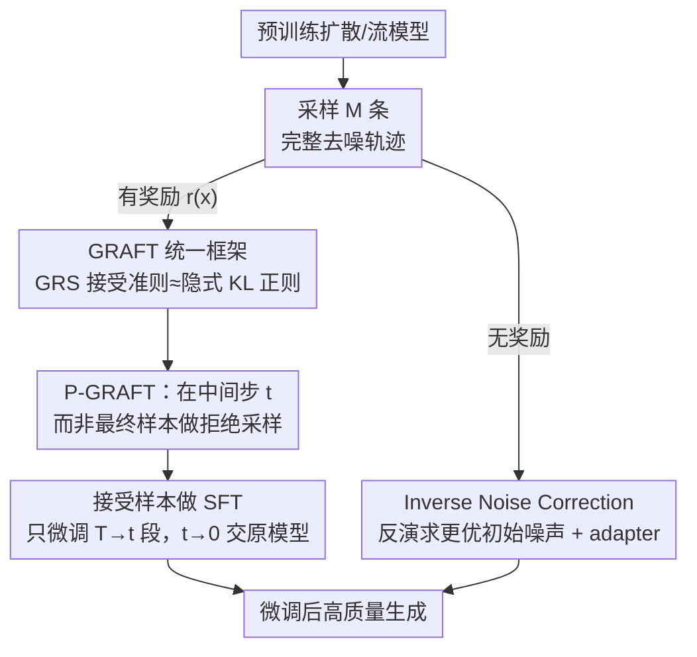

# Fine-Tuning Diffusion Models via Intermediate Distribution Shaping

**会议**: ICLR 2026  
**arXiv**: [2510.02692](https://arxiv.org/abs/2510.02692)  
**代码**: 无  
**领域**: 计算生物
**关键词**: 扩散模型微调, 拒绝采样, KL正则, 中间分布, 逆噪声校正

## 一句话总结
统一拒绝采样微调方法为GRAFT框架并证明其隐式执行KL正则化奖励最大化，进而提出P-GRAFT在中间去噪步骤做分布整形（偏差-方差权衡更优），以及Inverse Noise Correction无需奖励即可改进流模型质量，在T2I上VQAScore提升8.81%。

## 研究背景与动机

**领域现状**：扩散模型微调常用PPO+KL正则化，但扩散模型的边际似然不可计算，导致KL项要么被忽略（不稳定）要么用轨迹KL近似（次优+初始值函数偏差）。

**现有痛点**：(1) 边际KL不可计算→PPO需要放松近似；(2) 拒绝采样方法（RAFT/BoN）虽实用但理论联系不清楚；(3) 只对最终数据分布做整形，没有利用扩散模型中间步骤的结构。

**核心矛盾**：扩散模型需要KL正则化来稳定微调，但边际KL不可计算。

**切入角度**：证明拒绝采样隐式实现了边际KL约束（尽管似然不可计算），然后利用扩散的多步结构在中间分布做整形。

**核心 idea**：拒绝采样=隐式KL正则化 → 在中间去噪步做拒绝采样 → 更优的偏差-方差权衡。

## 方法详解

### 整体框架
论文想解决的是「扩散模型微调时 KL 正则化无法落地」这件事：PPO 类方法要在奖励最大化和 KL 约束之间取平衡，但扩散模型的边际似然不可计算，KL 项只能被忽略或用轨迹 KL 粗糙近似。作者换了一条路——把实践中常用、但理论解释不清的拒绝采样方法统一成 GRAFT 框架，先证明它本身就隐式地在做边际 KL 正则化奖励最大化，再顺着扩散模型「多步去噪」的结构，把拒绝采样从最终样本搬到中间去噪状态上，得到偏差-方差权衡更好的 P-GRAFT；最后利用流模型的可逆性，提出一个连奖励都不需要的 Inverse Noise Correction。整条线分两个分支：有奖励时走 GRAFT→P-GRAFT 这条拒绝采样微调路线，没有奖励时走 Inverse Noise Correction 这条改进初始噪声的路线，二者都指向「微调后生成质量更高」这个目标。

### 关键设计

**1. GRAFT 统一框架：把各种拒绝采样归并成同一个 KL 正则化的解**

经典拒绝采样、Best-of-N、Top-K 这些方法各自被当成独立技巧，和扩散微调的 RL 目标之间缺少桥梁。GRAFT 把它们统一成广义拒绝采样（GRS），并由 Lemma 2.3 给出关键结论：GRS 接受下来的样本，其分布恰好是 KL 正则化奖励最大化的最优解 $p^{\text{RL}}(x) \propto \exp(\hat{r}(x)/\alpha)\bar{p}(x)$，其中奖励被重整形为 $\hat{r}$。这意味着扩散模型那个「算不出来」的边际 KL 根本不必显式计算——只要按接受准则采样，就等价于在 $\exp(\hat r/\alpha)$ 这个温度为 $\alpha$ 的指数倾斜下做带 KL 约束的优化，从而绕开了 PPO 必须放松近似的核心困难。

**2. P-GRAFT：把拒绝采样从最终样本挪到中间去噪状态**

只在最终数据分布上整形，浪费了扩散模型逐步去噪的中间结构。P-GRAFT 改成对某个中间时间 $t$ 的去噪状态 $X_t$ 做拒绝采样，Lemma 3.2 证明这样整形的是中间分布 $\bar p_t$ 而非最终分布：微调后的模型只负责 $T \to t$ 这一段去噪，$t \to 0$ 的剩余部分仍交给原始模型。选哪个 $t$ 是一个明确的偏差-方差权衡——$t$ 取大时离纯噪声近，score 函数简单、学习问题容易，但此处的奖励信号方差大；$t$ 取小时奖励估计更精确，可去噪的学习问题更难。最优 $t$ 是让偏差与方差乘积最小的那个中间点，而非「在最后一步做」这种默认工程选择。

**3. Inverse Noise Correction：靠流模型可逆性改初始噪声，连奖励都不要**

前两点都依赖奖励函数，但有些场景只想提升生成质量、并没有现成奖励。Inverse Noise Correction 利用流模型从数据到噪声映射可逆这一性质，反过来推断出一个更优的初始噪声分布，再用一个参数高效的 adapter 在噪声空间里学习这层修正。整个过程无需显式奖励函数，相当于把「初始噪声采得不够好」这个被忽视的误差来源单独纠正掉。

### 损失函数 / 训练策略
P-GRAFT 的训练流程是：先生成 $M$ 条完整去噪轨迹，用 GRS 在中间步骤 $t$ 上筛选接受样本，再在这些接受样本上做 SFT，只微调 $T \to t$ 这一段。Inverse Noise Correction 则是对噪声空间 adapter 做参数高效微调。

## 实验关键数据

### 主实验
Stable Diffusion v2 T2I微调：

| 方法 | VQAScore | 相对基线提升 | 说明 |
|------|----------|------------|------|
| SD v2 (基线) | 基线 | — | 未微调 |
| Policy Gradient | 中 | 中 | PPO类方法 |
| GRAFT (最终步) | 好 | 好 | 标准拒绝采样 |
| **P-GRAFT** | **最好** | **+8.81%** | 中间步拒绝采样 |
| SDXL-Base | 对比 | — | 更大模型 |

### 多任务验证

| 任务 | 方法 | 效果 |
|------|------|------|
| 布局生成 | P-GRAFT | 显著提升 |
| 分子生成 | P-GRAFT + 去重 | 提升+多样性保持 |
| 无条件图像生成 | Inverse Noise Correction | FID改善 + FLOPs降低 |

### 关键发现
- P-GRAFT在T2I上超越policy gradient方法（PPO）和标准GRAFT
- 假设检验证实：较小 $t$ 的中间状态 $X_t$ 携带更多关于最终奖励的信息（方差分析）
- 分子生成中GRS的去重变体有效防止模式坍缩，重整形后的奖励自动包含多样性项
- Inverse Noise Correction在不需要奖励的情况下改善FID，且降低了每图FLOPs

## 亮点与洞察
- **GRS=隐式KL正则化**：这个理论结果解决了扩散模型微调中一个基本的技术难题。边际KL不可计算→不需要计算，拒绝采样隐式实现了它。
- **中间分布整形的偏差-方差视角**：不只是"在哪个步骤做"的工程选择，而有明确的数学原理支撑——选择使偏差和方差乘积最小的 $t$。
- **分子生成的去重GRS**：重整形后的奖励 $\hat{r}$ 自动包含多样性惩罚——log(1/N_copies)，优雅地防止模式坍缩。

## 局限与展望
- P-GRAFT中最优中间时间 $t$ 需要实验搜索
- Inverse Noise Correction仅适用于流模型（需要可逆性）
- 生成M个完整轨迹的计算开销较大
- 理论依赖"良好训练的去噪器"假设

## 相关工作与启发
- **vs PPO/DPPO**: 避免了KL计算困难，隐式KL约束更稳定
- **vs RAFT/RSO**: GRAFT提供了统一视角，P-GRAFT利用了扩散结构进一步优化
- **vs DPO for diffusion**: DPO用偏好迁移KL，P-GRAFT用拒绝采样更直接

## 评分
- 新颖性: ⭐⭐⭐⭐⭐ GRAFT统一理论+P-GRAFT的偏差方差分析都是重要贡献
- 实验充分度: ⭐⭐⭐⭐ T2I/布局/分子/无条件生成全覆盖
- 写作质量: ⭐⭐⭐⭐⭐ 理论与实践结合紧密，数学推导清晰
- 价值: ⭐⭐⭐⭐⭐ 对扩散模型微调范式有重要理论和实用影响

<!-- RELATED:START -->

## 相关论文

- [\[ICLR 2026\] Thompson Sampling via Fine-Tuning of LLMs](thompson_sampling_via_fine-tuning_of_llms.md)
- [\[ICLR 2026\] Antibody: Strengthening Defense Against Harmful Fine-Tuning for Large Language Models via Attenuating Harmful Gradient Influence](antibody_strengthening_defense_against_harmful_fine-tuning_for_large_language_mo.md)
- [\[ICML 2026\] Constrained Flow Optimization via Sequential Fine-Tuning for Molecular Design](../../ICML2026/computational_biology/constrained_flow_optimization_via_sequential_fine_tuning_for_molecular_design.md)
- [\[NeurIPS 2025\] Iterative Foundation Model Fine-Tuning on Multiple Rewards](../../NeurIPS2025/computational_biology/iterative_foundation_model_fine-tuning_on_multiple_rewards.md)
- [\[ICLR 2026\] DriftLite: Lightweight Drift Control for Inference-Time Scaling of Diffusion Models](driftlite_lightweight_drift_control_for_inference-time_scaling_of_diffusion_mode.md)

<!-- RELATED:END -->
