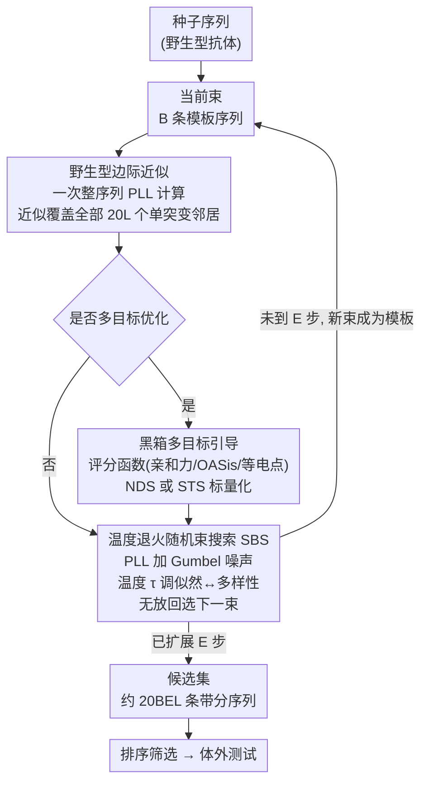

# How to Make the Most of Your Masked Language Model for Protein Engineering

**会议**: ICLR 2026  
**arXiv**: [2603.10302](https://arxiv.org/abs/2603.10302)  
**代码**: 无  
**领域**: 蛋白质工程 / 抗体设计  
**关键词**: 蛋白质语言模型, 掩码语言模型, 随机束搜索, 抗体优化, 多目标优化

## 一句话总结
提出基于温度退火随机束搜索（SBS）的MLM采样方法，利用伪似然的野生型边际近似实现高效全序列评估，在真实抗体治疗优化的体外实验中证明采样算法选择至少与模型选择同等重要，SBS+引导达到100%成功率。

## 研究背景与动机

**领域现状**：大量蛋白质语言模型（ESM-2、AbLang2等）已发布，被广泛用于抗体治疗药物的迭代优化——给定种子序列，用模型生成突变候选，在实验室测试后进入下一轮。但如何从MLM中高效采样高质量序列的研究极度匮乏。

**现有痛点**：(1) 主流MLM采样方法是"突变中心"的（如去噪采样、Gibbs采样），逐位掩码-填充，计算开销 $O(EL^3)$，且经验上倾向生成低质量序列；(2) 现有方法难以整合不可微的评分函数（如OASis免疫原性评分、等电点）；(3) MLM采样算法的系统性评估——特别是体外验证——几乎不存在。

**核心矛盾**：突变中心的采样范式将决策局限于单个位置，无法利用全序列信息做全局评判；同时 $O(EL^3)$ 的计算复杂度限制了候选多样性。

**本文目标** 如何从MLM高效采样出高似然、多样且贴近种子序列的突变序列？如何灵活集成多种评分函数（可微/不可微）进行多目标优化？什么模型+什么采样策略在实际抗体优化中最有效？

**切入角度**：将MLM采样从"突变中心"转变为"序列中心"——不是让模型逐位生成突变，而是让模型评估完整序列的伪似然（PLL），将问题转化为搜索问题。关键发现：计算一个序列的PLL后，其所有单位点邻居的PLL几乎免费。

**核心 idea**：利用野生型边际近似，从单次PLL计算免费获得整个1-编辑邻域的近似PLL，将MLM采样转化为高效的随机束搜索。

## 方法详解

### 整体框架
本文要解决的是抗体迭代优化里被长期忽视的一环：拿到一个种子序列后，**怎么从 MLM 高效采出一批高似然、贴近种子又彼此多样的突变候选**。它把这件事从主流的"突变中心"范式（让模型逐位掩码-填充地生成突变）整个翻转成"序列中心"的搜索问题——不再让模型生成突变，而是让模型评估完整序列的伪似然（PLL），把生成转化为在序列空间里的搜索。整条流水线是这样转的：以种子为初始束，每一步对束内每条模板序列算一次整序列 PLL，借野生型边际近似几乎免费地拿到它全部单点邻居的近似 PLL；这些带分邻居经温度退火的随机束搜索（SBS）筛出下一束，如此扩展 $E$ 步；若要做多目标优化，则在筛选前用评分函数（亲和力、OASis 免疫原性、等电点等）对完整序列打分、标量化后并入搜索信号。最终得到约 $20BEL$ 条带分候选，排序筛选后送体外测试。

### 关键设计

**1. 野生型边际近似：让一次 PLL 计算覆盖整个 1-编辑邻域**

突变中心方法的根本低效在于每生成一个序列都要重新算一遍 PLL，每条代价 $O(EL^3)$，把大量已算好的信息白白丢掉。本文注意到：对模板序列 $\mathbf{x}$ 算一次完整 PLL 本就要做 $L$ 次逐位掩码的前向传播，得到每个位置的精确条件概率 $\hat{p}(x_i \mid x_{j \neq i})$。而对一个只在位置 $k$ 发生替换的邻居 $\mathbf{x}'$，它的 PLL 可近似为 $PLL(\mathbf{x}') \approx \sum_i \log\big(\text{softmax}_\tau(\tilde{Y}^{(i)}_{i,\,\text{index}(x'_i)})\big)$——只在 $k$ 位置用精确条件概率，其余位置直接复用模板已算好的条件概率，即假设单点突变不显著扰动远处位置的分布（这就是零样本突变效应预测里常用的野生型边际近似）。于是一次模板 PLL 计算就近似免费地覆盖了它全部 $20L$ 个单突变邻居。束搜索每步只对 $B$ 条束序列做这件事，单步 $O(BL^3)$、$E$ 步共 $O(BEL^3)$，却产出约 $20BEL$ 个带分候选；在 $E=5,L=100$ 的现实设置下相对突变中心范式是 $20EL\times$ 量级的加速，正是这一点让"以整序列为单位的搜索"在长序列上变得可行。每次从束里展开一条序列时它会成为新模板、重算一次精确 PLL，把近似误差限制在一步之内。

**2. 温度退火随机束搜索（SBS）：用一个温度同时调似然与多样性**

纯贪心取 argmax 会让一批候选高度雷同，纯随机采样又容易给出低质量序列，而实验室一轮要的是"既高质量又多样"的一批。SBS 借 Gumbel-top-$k$ 技巧在两者间连续插值：给每条候选的 PLL 加上独立 Gumbel 噪声 $g\sim\text{Gumbel}(0,1)$ 后再排序，从中无放回地选出下一束。关键在于 softmax 温度 $\tau$ 只缩放似然项、不缩放 Gumbel 项——$\tau$ 越低似然项主导、搜索偏确定性高似然，$\tau$ 越高噪声相对放大、批内多样性增强（实验用 $\tau=1.5$）。而"从种子出发只走 $E$ 步"本身就是一个天然的近端约束，把候选限制在距种子有限编辑距离内，无需额外正则项。

**3. 黑箱多目标引导：让不可微评分函数直接进搜索**

因为评估对象始终是完整序列而非部分掩码序列，MLM 和任何评分函数都被当成纯黑箱：输入一条干净序列、输出一个分数，既不要求接受带掩码输入、也不要求提供梯度。这恰好解开了突变中心方法的死结——OASis 免疫原性、等电点这类评分根本无法对不完整的掩码序列打分，先前工作要么强行要求评分函数吃掩码输入，要么假设评分是各位置的专家乘积。本文则支持任意标量化把多目标合成单一搜索信号：Pareto 非支配排序（NDS）在各目标间做权衡、保留前沿；平滑切比雪夫标量化（STS）则推动序列同时满足所有目标，且允许对不同目标加权。两者都不要求可微，因此亲和力模型、免疫原性、电荷性质可混搭进同一次搜索。

### 损失函数 / 训练策略
方法本身不训练任何参数，MLM 与 CLM 均为现成预训练模型。系统比较覆盖 9 种 MLM（ESM-2 35M/150M/650M、Sapiens、AbLang2、AMPLIFY 120M/350M、DiffAbOpt、内部 SAbDabMLM）和 3 种 CLM（pIgGen、pIgGen-dev、CloneLM）；体外实验固定单一 FAb 抗体种子，每种方法生成不少于 21 个样本送实验室验证。

## 实验关键数据

### 主实验（体外）

| 方法 | 成功率↑ | 说明 |
|--------|------|------|
| AbLang2 + Beam Search | ~65% | 无监督最佳之一 |
| ESM2-650M + Beam Search | ~60% | 非抗体专属模型表现优秀 |
| AbLang2 + Gibbs | ~40% | 同模型，束搜索显著优于Gibbs |
| Sapiens + Gibbs | ~25% | 弱模型+弱采样 |
| AbLang2 + 监督排序 | ~75% | 利用729样本训练的分类器排序 |
| AbLang2 + STS引导 | **100%** | 多目标引导生成+排序 |
| AbLang2 + NDS引导 | ~90% | Pareto排序也显著提升 |

### 消融实验

| 配置 | 关键观察 | 说明 |
|------|---------|------|
| Beam vs Gibbs (同模型) | Beam在所有3个模型上均胜出 | 采样算法比模型选择更重要 |
| ESM2-650M（通用蛋白） | 与抗体专属AbLang2相当 | 通用模型意外地适用于抗体 |
| Gibbs-argmax vs Gibbs | argmax更高成功率但多样性低 | Gibbs倾向生成低质量序列 |
| 有/无监督引导 | 引导后弱结合被消除 | 但引导降低了人源性得分 |

### 关键发现
- 采样算法的选择至少与模型选择同样重要——同一模型换不同采样器可导致成功率翻倍差距
- ESM2-650M虽然训练于通用蛋白质数据（非抗体特异），在抗体优化中仍表现优秀，说明蛋白质通用分布的捕获比抗体特异性更重要
- Gibbs采样倾向于未能忠实反映模型偏好的序列——模型"想要"的序列和Gibbs"给出"的序列之间存在系统性偏差
- 监督引导方法消除了弱结合抗体的生成，但带来了人源性降低的副作用，需要将人源性纳入多目标优化

## 亮点与洞察
- 将MLM采样从"突变中心"思维转变为"序列中心"思维是关键洞察：利用野生型边际近似实现了指数级的效率提升，使束搜索成为可能。这一视角揭示了之前MLM采样方法的根本低效——它们丢弃了大量已计算的信息。
- 罕见的体外验证：不仅做了in silico评估，还在真实抗体治疗项目中进行了289个样本的head-to-head比较，结果可直接指导工业实践。

## 局限与展望
- 体外实验基于单一FAb抗体种子，泛化性有待更多治疗项目验证
- 野生型边际近似对多位点突变的精度随编辑距离增加而下降，束搜索每步展开时刷新模板缓解了这一问题，但累积误差仍需研究
- STS引导在获得100%成功率的同时降低了人源性，多目标优化中的trade-off管理需进一步研究

## 相关工作与启发
- **vs ESM-3 (Hayes et al., 2025)**: ESM-3用去噪采样+无导数引导做蛋白质优化，但需要评分函数接受部分掩码输入。本文方法使用完整序列评估，兼容任何评分函数
- **vs DiffAbOpt/DiffAb+ (Raghu et al., 2025)**: 基于结构的扩散方法仅在CDR区域操作。本文方法可在序列任意区域采样，且体外实验中DiffAb+表现一般

## 评分
- 新颖性: ⭐⭐⭐⭐ 序列中心+PLL近似的采样范式转变简洁有力，但技术原理相对直接
- 实验充分度: ⭐⭐⭐⭐⭐ 罕见的大规模体外验证，9种MLM+3种CLM的系统比较，监督/无监督/引导的完整对比
- 写作质量: ⭐⭐⭐⭐ 结构清晰，实验发现的呈现和讨论到位
- 价值: ⭐⭐⭐⭐⭐ 对抗体工程实践有直接指导价值，"采样算法比模型更重要"的结论颠覆性强

<!-- RELATED:START -->

## 相关论文

- [\[ICLR 2026\] Reverse Distillation: Consistently Scaling Protein Language Model Representations](reverse_distillation_consistently_scaling_protein_language_model_representations.md)
- [\[ICLR 2026\] EvoFlows: Evolutionary Edit-Based Flow-Matching for Protein Engineering](evoflows_evolutionary_edit-based_flow-matching_for_protein_engineering.md)
- [\[ICML 2026\] Protein Language Model Embeddings Improve Generalization of Implicit Transfer Operators](../../ICML2026/computational_biology/protein_language_model_embeddings_improve_generalization_of_implicit_transfer_op.md)
- [\[ICLR 2026\] Protein as a Second Language for LLMs](protein_as_a_second_language_for_llms.md)
- [\[ICLR 2026\] Controlling Repetition in Protein Language Models](controlling_repetition_in_protein_language_models.md)

<!-- RELATED:END -->
