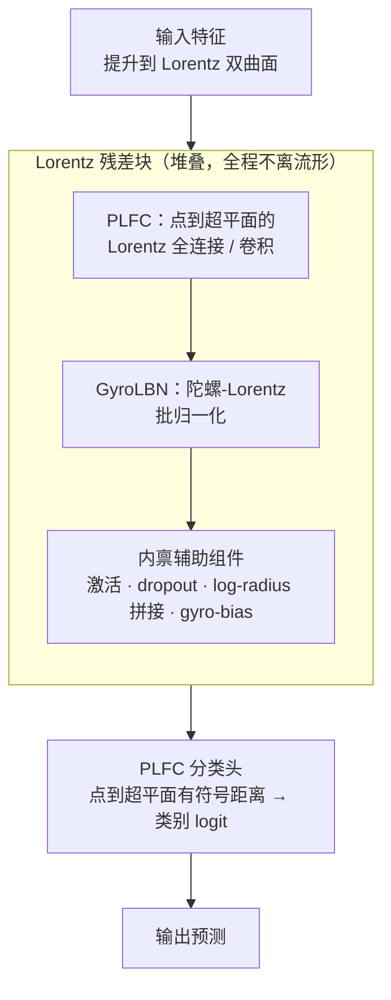

# Intrinsic Lorentz Neural Network

**会议**: ICLR 2026  
**arXiv**: [2602.23981](https://arxiv.org/abs/2602.23981)  
**代码**: 待确认  
**领域**: 计算生物
**关键词**: hyperbolic neural network, Lorentz model, intrinsic operations, batch normalization, geometric deep learning  

## 一句话总结
提出完全内禀（fully intrinsic）的双曲神经网络 ILNN，所有运算均在 Lorentz 模型内完成，消除了现有方法中混合欧几里得操作的几何不一致性，在图像分类、基因组学和图分类上取得 SOTA。

## 研究背景与动机
**领域现状**：双曲神经网络利用双曲空间的指数增长体积表示层次结构数据，Lorentz 模型因数值稳定性好于 Poincare 模型成为首选。

**现有痛点**：现有双曲网络在某些操作中"退回"欧几里得空间（如 tangent space 线性变换、欧几里得 BN），导致几何不一致。

**核心矛盾**：如何在保持所有运算在双曲流形上的同时，设计足够表达且数值稳定的组件？

**本文要解决**：构建一套完全内禀的 Lorentz 空间操作集。

**切入角度**：用 Lorentz 超平面有符号距离替代仿射变换，用 gyro 结构实现内禀统计量。

**核心idea**：点到超平面距离 → FC 层；gyro-centering + gyro-scaling → BatchNorm。

## 方法详解

### 整体框架
ILNN 把一整套神经网络组件都重写在 Lorentz 双曲面 $\mathbb{L}_K^n$（$K<0$）上，让特征从输入到输出始终待在同一张流形上，不再像现有方法那样在中途借道切空间或欧几里得空间做线性变换、归一化。前向通路可以理解成一串"Lorentz 残差块"的堆叠：每一块里特征先过 PLFC（充当流形上的全连接 / 卷积），再过 GyroLBN 做归一化，再经一组内禀辅助组件（激活、dropout、log-radius 拼接、gyro-bias）补齐非线性与正则化，最后由一个 PLFC 分类头把特征点到超平面的有符号距离读成类别 logit。整套设计还有一个共同的约束：当曲率 $K \to 0$、流形被压平时，每个组件都应当解析地退化为它对应的标准欧几里得版本，从而保证双曲网络在平坦极限下不会比欧几里得网络更差。

### 关键设计

**1. PLFC（点到超平面的 Lorentz 全连接）：把仿射变换换成内禀的有符号距离**

欧几里得全连接层 $y = Wx + b$ 的几何本质，是把输入投影到由权重定义的一组超平面上、读出带符号的距离。现有双曲网络要复现这一步，往往得先用对数映射把点拉回切空间、做线性变换、再指数映射回流形，一来一回引入几何失真。PLFC 直接在流形上学习 $m$ 个 Lorentz 超平面，把输入点到每个超平面的**有符号双曲距离**当作该维的 logit，整个过程不离开双曲面。得到这组距离后，再用 $\sinh$ 把它们映射回空间坐标，最后依据双曲面约束 $-x_0^2 + \sum_i x_i^2 = 1/K$ 解析地反解出时间坐标 $x_0$，使输出仍是流形上的合法点。这套距离公式在 $K \to 0$ 时正好收敛到 $Wx + b$，所以 PLFC 可以无缝替换任意标准 FC 层。

**2. GyroLBN（陀螺-Lorentz 批归一化）：用闭式双曲统计量替代迭代均值与欧几里得归一化**

要在双曲面上做 BatchNorm，先得有一个"双曲均值"和"双曲方差"，但 Fréchet 均值通常没有闭式解、需要迭代求解，而退回欧几里得空间算均值又破坏了内禀性。GyroLBN 用 gyro 结构两步解决：**gyro-centering** 用闭式的 Lorentzian centroid 直接算出一批样本的双曲质心、把整批数据平移到原点，省去迭代；**gyro-scaling** 再以 Fréchet 方差为基准做归一化、控制特征的弥散尺度。和需要迭代求 Fréchet mean 的 GyroBN 相比它更快（闭式 vs 迭代），和直接用欧几里得均值的 LBN 相比它更内禀（真正的双曲均值 vs 欧氏近似），实验里速度和精度都同时占优。

**3. 内禀辅助组件：把剩下的网络零件也搬上流形**

为了让整条前向通路全程不脱离双曲面，ILNN 还把若干常规组件一并内禀化：其中最关键的是 **log-radius 拼接**——直接堆叠 $N$ 个 Lorentz patch 的空间分量会让特征范数随维度 $Nd$ 系统性变大、压垮后续层，于是它用一个 digamma 推出的标度把"期望对数半径"对齐，使拼接结果的尺度不随被拼块数变化（无参数、对重尾半径鲁棒、且保持双曲面约束）；正是靠 PLFC + log-radius 拼接，卷积层才被改写成完全内禀的 Lorentz 卷积。其余还有 Lorentz dropout、Lorentz activation 以及 gyro-additive bias（用 gyro 加法把偏置/残差直接加在流形上）。它们各自补齐了非线性、正则化和偏置这些环节，使得"输入到输出全程留在 $\mathbb{L}_K^n$ 上"这一目标真正闭合，而不会因为某个零件偷偷退回欧几里得空间而破功。

## 实验关键数据

### 图像分类

| 方法 | CIFAR-10 | CIFAR-100 |
|------|----------|----------|
| Euclidean ResNet-18 | 95.14% | 77.72% |
| HCNN-Lorentz | 95.14% | 78.07% |
| **ILNN** | **95.36%** | **78.41%** |

### 基因组学 (TEB) — MCC 指标

| 任务 | Euclidean | **ILNN** | 提升 |
|------|-----------|---------|------|
| Processed Pseudogene | 60.66 | **70.26** | +9.6 |
| Unprocessed Pseudogene | 51.94 | **64.90** | +13.0 |

### 基因组学 (GUE)

| 任务 | Best Prior | **ILNN** |
|------|-----------|----------|
| Covid 分类 | 36.71 | **64.76** |
| Core Promoter (tata) | 79.87 | **83.90** |

### 图分类
Airport 96.03%, Cora 85.68%, PubMed 82.52%——均为 SOTA。

### 关键发现
- CIFAR 上提升较小（+0.2-0.7pp），但基因组学任务提升巨大（+10-28pp）
- HCNN-S 在 Covid 分类上崩溃（36.71），ILNN 稳健——内禀操作带来数值稳定性
- GyroLBN 速度和效果都优于 GyroBN 和 LBN

## 亮点与洞察
- **完全内禀的设计哲学**：始终在双曲面操作 > 映射到切空间再映射回来
- **闭式 centroid 替代迭代求解**：GyroLBN 既快又准
- **$K \to 0$ 退化**性质优雅——双曲网络在平坦极限不应比欧几里得差
- 基因组学大幅提升暗示双曲表示对生物序列特别有效

## 局限与展望
- 仅基于 ResNet-18，未验证 ViT 等现代架构
- CIFAR 上绝对提升很小
- 固定曲率 $K=-1$，未探索可学习曲率
- 仅验证分类任务

## 相关工作与启发
- **vs HCNN**: HCNN 某些操作回到 tangent space，ILNN 全程内禀
- **vs Poincare 网络**: Lorentz 更数值稳定，ILNN 强化此优势
- 可启发 LLM 双曲嵌入设计

## 补充技术细节

### PLFC 的几何直觉
在欧几里得空间中，全连接层计算 $y = Wx + b$，本质上是将输入投影到多个超平面上。PLFC 将这一操作内禀化：在 Lorentz 双曲面上定义超平面，计算点到超平面的双曲距离作为特征。这个距离在 $K \to 0$ 时自然退化为欧几里得距离，保证了兼容性。

### 为什么基因组学提升巨大？
基因序列具有天然的层次结构（基因家族 → 基因 → 外显子 → 序列基元），双曲空间能用有限维度更好地捕捉这种指数增长的层级关系，而欧几里得空间在低维时会产生严重的表示拥挤。HCNN-S 在 Covid 分类上崩溃可能正是因为其混合操作丢失了关键的层次信息。

### Lorentz vs Poincaré 模型
Lorentz 模型使用 $(n+1)$ 维环境空间，坐标 $(x_0, x_1, ..., x_n)$ 满足 $-x_0^2 + x_1^2 + ... + x_n^2 = 1/K$。相比 Poincaré 球模型在边界附近有数值不稳定性，Lorentz 模型通过将时间坐标 $x_0$ 解析计算来避免数值问题。

## 评分
- 新颖性: ⭐⭐⭐⭐ 完全内禀操作设计有价值
- 实验充分度: ⭐⭐⭐⭐ 覆盖图像/基因组/图三类任务
- 写作质量: ⭐⭐⭐⭐ 数学清晰，退化分析优雅
- 价值: ⭐⭐⭐⭐ 双曲几何在深度学习中的重要推进

<!-- RELATED:START -->

## 相关论文

- [\[CVPR 2026\] Cell-Type Prototype-Informed Neural Network for Gene Expression Estimation from Pathology Images](../../CVPR2026/computational_biology/cell-type_prototype-informed_neural_network_for_gene_expression_estimation_from_.md)
- [\[ICML 2026\] Demystifying Multimodal Biomolecular Co-design with Intrinsic Geodesic Coupling](../../ICML2026/computational_biology/demystifying_multimodal_biomolecular_co-design_with_intrinsic_geodesic_coupling.md)
- [\[CVPR 2026\] Hyperbolic Busemann Neural Networks](../../CVPR2026/computational_biology/hyperbolic_busemann_neural_networks.md)
- [\[AAAI 2026\] Dual-Path Knowledge-Augmented Contrastive Alignment Network for Spatially Resolved Transcriptomics](../../AAAI2026/computational_biology/dual-path_knowledge-augmented_contrastive_alignment_network_for_spatially_resolv.md)
- [\[ICML 2026\] Neural Estimation of Pairwise Mutual Information in Masked Discrete Sequence Models](../../ICML2026/computational_biology/neural_estimation_of_pairwise_mutual_information_in_masked_discrete_sequence_mod.md)

<!-- RELATED:END -->
