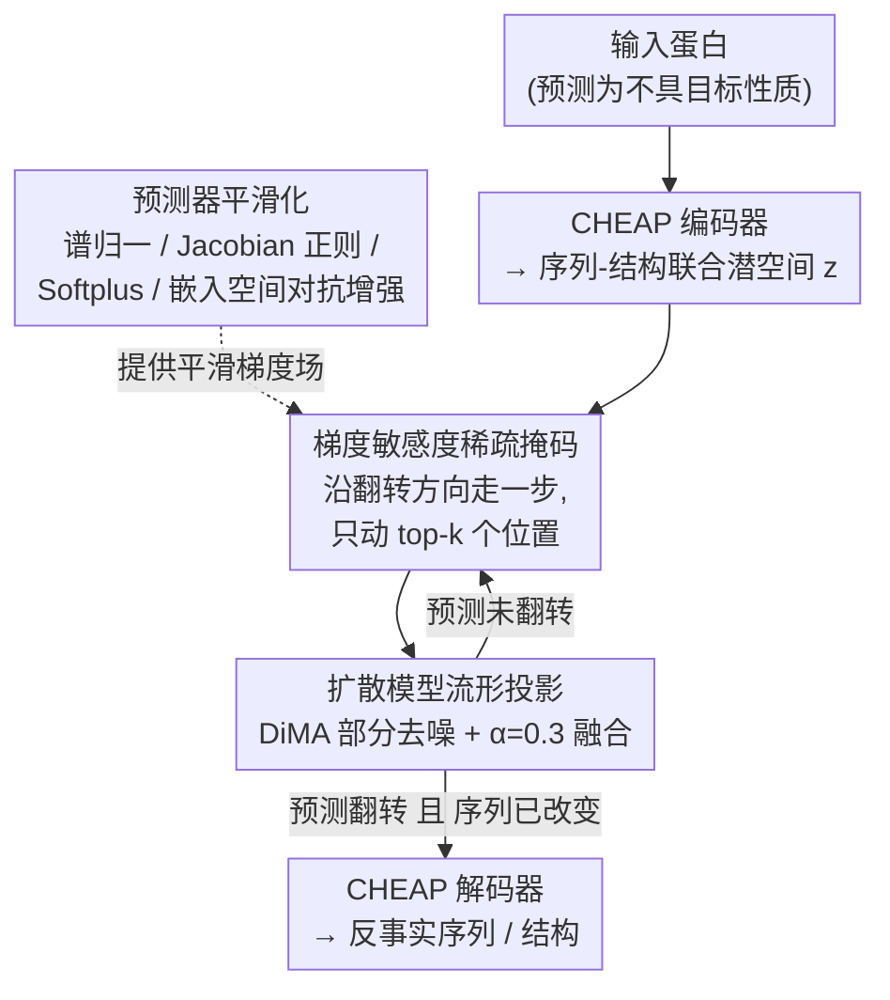

# Protein Counterfactuals via Diffusion-Guided Latent Optimization

**会议**: ICLR 2026  
**arXiv**: [2603.10811](https://arxiv.org/abs/2603.10811)  
**代码**: [GitHub](https://github.com/weroks/mccop)  
**领域**: 蛋白质工程 / 可解释AI  
**关键词**: 反事实解释, 蛋白质工程, 扩散模型, 流形约束, 序列-结构嵌入

## 一句话总结
提出MCCOP框架，在蛋白质的连续序列-结构联合潜空间中，利用预训练扩散模型作为流形先验进行梯度引导的反事实优化，以最少突变（2-3个）生成生物学可信的蛋白质变体来翻转预测器输出，同时实现模型解释和蛋白质设计假说生成。

## 研究背景与动机

**领域现状**：深度学习模型能高精度预测蛋白质性质（稳定性、荧光等），但仅作为"黑箱预言机"——当模型预测一个抗体不稳定时，工程师不知道做什么突变可以挽救。

**现有痛点**：(1) 朴素梯度优化在蛋白质上会产生对抗样本（满足预测器但无法折叠的序列）；(2) 离散搜索方法（遗传算法、爬山法）需要大量突变（8-11个），效率低且难以保证结构合理性；(3) 现有可解释方法（注意力可视化、特征归因）只回答"为什么"，不提供"怎么修"的可操作指导。

**核心矛盾**：蛋白质的离散序列与连续3D结构之间存在张力——梯度方法需要连续松弛，但直接在序列空间操作忽略了空间关系；同时需要保证优化轨迹不偏离生物学可行的流形。

**本文目标** 给定预测为"不具备目标性质"的蛋白质，如何找到最小且生物学合理的序列编辑使预测翻转？如何在稀疏性、有效性和生物学可信性之间取得平衡？

**切入角度**：在CHEAP编码器提供的连续序列-结构联合嵌入空间中操作，利用预训练扩散模型DiMA作为流形先验——扩散去噪步骤充当流形投影，与分类器引导的梯度优化交替执行。

**核心 idea**：在蛋白质的联合嵌入空间中，交替执行稀疏梯度下降和扩散模型流形投影，生成最少突变、结构合理的反事实蛋白质序列。

## 方法详解

### 整体框架
MCCOP把蛋白质先用CHEAP编码器映射到一个连续的序列-结构联合潜空间 $z \in \mathbb{R}^{L' \times D}$，然后在这个潜空间里反复迭代：每一步先沿分类器梯度往"翻转预测"的方向走一小步，但只动最敏感的少数位置（梯度敏感度稀疏掩码）；再用预训练扩散模型DiMA把走偏的嵌入拉回合法蛋白质流形（扩散模型流形投影）。这条迭代之所以能跑通，前提是分类器先经过预测器平滑化、不会被无约束梯度引到对抗样本上去。如此交替直到预测器被翻转，最后用CHEAP解码器把潜向量还原成新的序列和结构。整个框架的精髓在于让平滑后的梯度优化负责定向、扩散投影负责合理性、稀疏掩码负责最小改动，三者各司其职。

### 关键设计

**1. 预测器平滑化：堵住对抗样本这个致命漏洞**

如果直接拿一个普通训练出来的分类器做梯度优化，结果是灾难性的——无约束梯度下降会100%生成对抗样本，也就是能骗过预测器、解码回去却和原序列几乎一样的"假翻转"。根源在于非平滑分类器的梯度场充满高频成分，优化会顺着这些尖锐方向滑向语义无关的扰动。MCCOP用四种互补机制把梯度场磨平：谱归一化约束每个线性层的Lipschitz常数，Jacobian正则化直接惩罚梯度范数 $\|\nabla_z f_\theta(z)\|_F^2$，用Softplus（$\beta=1$）替换会产生硬拐点的ReLU，再加上嵌入空间的FGSM对抗增强——把解码回原序列的扰动样本以原始标签喂回训练，教模型对这类语义无关扰动保持不变。平滑后梯度范数最多降低4倍，而AUROC不降反升（稳定性任务从0.94提到0.98）。这一步是整个框架能跑通的前提，没有它后面的稀疏优化和流形投影都无从谈起。

**2. 梯度敏感度稀疏掩码：把改动压到2-3个位置**

蛋白质工程里每多一个突变就多一份实验成本和失败风险，所以"最小编辑"是硬约束。MCCOP的做法是先算出每个位置对翻转预测的敏感度 $s_i = \|\nabla_{z_i} \mathcal{L}_{\text{CF}}\|_2$，按敏感度选出top-$k$个位置构成二值掩码 $M_i = \mathbf{1}[s_i \geq s_{(k)}]$，梯度只在这些位置生效，其余位置硬性重置回原始嵌入。这样优化天然只在最关键的几个残基上动刀。之所以潜空间的稀疏能干净地映射到序列稀疏，是因为CHEAP解码器是逐位MLP——每个 $\hat{S}_i$ 只依赖对应的 $z_i$，于是潜空间的行级掩码就直接等价于序列空间的稀疏突变，不会出现"动一个潜向量牵连一片序列"的串扰。

**3. 扩散模型流形投影：把扩散当正则器而不是生成器**

纯梯度优化即便平滑了也会逐渐脱离可行蛋白质空间，产出无法折叠的序列。MCCOP借预训练的DiMA扩散模型来兜底：每走完一步优化，先把当前嵌入部分加噪到噪声水平 $t_{\text{diff}}$，再去噪得到流形投影 $\Pi_\phi(z'_t)$，最后以混合系数 $\alpha=0.3$ 把投影结果和优化结果融合，$z_{t+1} = (1-\alpha)z'_t + \alpha \Pi_\phi(z'_t)$。这相当于把图像领域"分类器引导生成"的思路反过来用——扩散不再负责从噪声里造样本，而是作为优化循环中的一个温和拉力，每步都把轨迹往数据流形上拽一点。$\alpha$ 的取值很关键：消融显示 $\alpha=0$ 退化成纯对抗优化，$\alpha=1$ 完全投影又会让优化不稳定，0.3 是有效性和合理性之间的甜点。

### 损失函数 / 训练策略
反事实优化的目标函数是 $\mathcal{L}_{\text{CF}}(z_t) = \log(1+\exp(m - \tilde{y} \cdot f_\theta(z_t))) + \lambda_{\text{dist}} \|z_t - z_{\text{orig}}\|_2^2$：第一项是带置信度裕量 $m$ 的软铰链损失，推动预测越过决策边界；第二项用 $\lambda_{\text{dist}}$ 控制嵌入距离的近端约束，平衡"改得够狠翻转预测"和"改得够少保持近似"。迭代在 $\sigma(\tilde{y} \cdot f_\theta(z_{t+1})) \geq \tau$ 且解码序列确实与原序列不同时早停。预测器本身只用一个浅层MLP，配合上面四种平滑化手段训练。

## 实验关键数据

### 主实验

| 数据集 | 方法 | 成功率↑ | 对抗率↓ | 编辑距离↓ |
|--------|------|------|----------|------|
| Stability | MCCOP | **1.00** | 0.03 | **2.32** |
| Stability | 遗传算法 | 0.55 | 0.00 | 7.76 |
| Stability | 爬山法 | 0.23 | 0.00 | 9.46 |
| Stability | 梯度下降（无约束） | 1.00 | **1.00** | - |
| Fluorescence | MCCOP | 0.19 | 0.01 | **1.37** |
| Activity | MCCOP | **1.00** | 0.02 | **2.46** |
| Activity | 遗传算法 | 0.17 | 0.00 | 6.24 |

### 消融实验

| 配置 | 说明 |
|------|------|
| 无平滑化 | 100%对抗率，梯度下降完全失败 |
| 平滑后梯度范数 | 降低2-4倍，AUROC不降反升（Stability: +0.04） |
| $\alpha=0$（无流形投影） | 退化为对抗优化 |
| $\alpha=1$（完全投影） | 优化不稳定 |
| $\alpha=0.3$（默认） | 最佳平衡 |

### 关键发现
- 无约束梯度下降的对抗率为100%，验证了流形约束和平滑化的必要性
- MCCOP以2-3个突变实现近完美成功率，而离散方法需要8-11个突变
- 突变集中在功能相关区域：GFP荧光的发色团附近（残基63-69）、Ube4b活性的E2结合界面（残基66-71）
- MCCOP能精确恢复数据集中已知的反事实序列（荧光16例、活性18例、稳定性4例），部分来自held-out测试集

## 亮点与洞察
- 将反事实解释从图像/表格领域首次扩展到蛋白质，巧妙利用CHEAP的逐位解码特性实现潜空间稀疏性到序列空间稀疏性的直接映射。发现的突变与已知生物物理机制吻合（发色团堆积、疏水核心固化），说明预测器确实学到了有意义的序列-功能关系。
- 扩散模型作为"正则器"而非"生成器"的使用方式新颖，提供了一种通用的流形约束优化范式。

## 局限与展望
- 生物学可信性评估依赖计算代理（ESM3 pLDDT、回旋半径等），缺少湿实验验证
- CHEAP编码器-解码器引入的重建误差对远离ESMFold训练分布的蛋白质可能产生伪影
- 仅评估了二分类任务，连续回归目标（如精确的Tm值预测）需要替换损失函数

## 相关工作与启发
- **vs DVCE/DIME (图像反事实)**: 这些方法通过引导去噪生成反事实图像，MCCOP反转了这一思路——用扩散作为优化循环中的正则投影而非生成器，更适合蛋白质的离散-连续混合特性
- **vs 潜空间适应度优化 (ReLSO等)**: 这些方法寻找全局最优而非最小编辑，且需要任务特定的生成模型训练，MCCOP无需重训练且聚焦最小修改

## 评分
- 新颖性: ⭐⭐⭐⭐⭐ 首次将扩散引导的反事实解释引入蛋白质领域，框架设计优雅
- 实验充分度: ⭐⭐⭐⭐ 三个数据集、多种基线、物理化学可信性全面评估，但缺少湿实验
- 写作质量: ⭐⭐⭐⭐ 问题定义清晰，算法描述严谨，讨论部分坦诚
- 价值: ⭐⭐⭐⭐ 同时服务于模型可解释性和蛋白质工程，具有实际应用潜力

<!-- RELATED:START -->

## 相关论文

- [\[ICLR 2026\] Contact-Guided 3D Genome Structure Generation of E. coli via Diffusion Transformers](contact-guided_3d_genome_structure_generation_of_e_coli_via_diffusion_transforme.md)
- [\[NeurIPS 2025\] Towards Unified and Lossless Latent Space for 3D Molecular Latent Diffusion Modeling](../../NeurIPS2025/computational_biology/towards_unified_and_lossless_latent_space_for_3d_molecular_latent_diffusion_mode.md)
- [\[NeurIPS 2025\] Generative Modeling of Full-Atom Protein Conformations using Latent Diffusion on Graph Embeddings](../../NeurIPS2025/computational_biology/generative_modeling_of_full-atom_protein_conformations_using_latent_diffusion_on.md)
- [\[ICLR 2026\] Scalable Spatio-Temporal SE(3) Diffusion for Long-Horizon Protein Dynamics](scalable_spatio-temporal_se3_diffusion_for_long-horizon_protein_dynamics.md)
- [\[ICLR 2026\] Diffusion Alignment as Variational Expectation-Maximization](diffusion_alignment_as_variational_expectation-maximization.md)

<!-- RELATED:END -->
