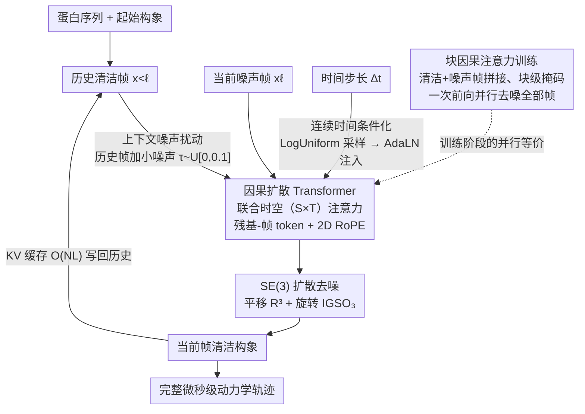

# Scalable Spatio-Temporal SE(3) Diffusion for Long-Horizon Protein Dynamics

**会议**: ICLR 2026  
**arXiv**: [2602.02128](https://arxiv.org/abs/2602.02128)  
**代码**: [https://bytedance-seed.github.io/ConfRover/starmd](https://bytedance-seed.github.io/ConfRover/starmd)  
**领域**: 计算生物
**关键词**: 蛋白质构象生成, SE(3)扩散模型, 时空注意力, 自回归轨迹生成, 分子动力学加速

## 一句话总结
提出 STAR-MD，一个 SE(3) 等变的因果扩散 Transformer，通过联合时空注意力和上下文噪声扰动实现微秒级蛋白质动力学轨迹生成，在 ATLAS 基准上所有指标达到 SOTA，且能稳定外推到训练中未见的微秒时间尺度。

## 研究背景与动机

**领域现状**：分子动力学（MD）模拟是研究蛋白质动力学的金标准，但需要飞秒级积分步长，计算成本极高（微秒级模拟需要 $10^9$ 步）。近年来生成模型被用于加速 MD，如 MDGen（扩散模型生成 100ns 轨迹）、AlphaFolding（多帧同时生成）、ConfRover（自回归生成）。

**现有痛点**：(a) 现有方法受限于短时间范围（纳秒级），无法扩展到生物学相关的微秒-毫秒尺度；(b) 使用 AlphaFold2 风格的 Pairformer + 三角注意力导致 $O(N^3L)$ 的立方计算成本和 $O(N^2L)$ 的 KV 缓存内存需求；(c) 现有架构将空间和时间模块交替使用（space-then-time），限制了捕获非可分离时空耦合的表达能力；(d) 长轨迹自回归生成时误差累积严重。

**核心矛盾**：粗粒化（每残基表示代替全原子）使得动力学变为非马尔可夫过程（需要历史记忆），但计算昂贵的成对特征处理阻碍了在更长历史上下文上的建模。

**本文目标** 设计一个既能高效处理时空依赖、又能稳定生成微秒级长轨迹的蛋白质构象生成模型。

**切入角度**：用 Mori-Zwanzig 形式主义从理论上论证：(a) 粗粒化迫使需要历史记忆（非马尔可夫），(b) 不使用成对特征后记忆核"膨胀"且变得时空不可分——这直接论证了联合时空注意力的必要性。

**核心 idea**：用联合时空注意力替代交替式空间+时间模块，结合因果扩散训练和上下文噪声扰动，实现可扩展的长程蛋白质动力学生成。

## 方法详解

### 整体框架

STAR-MD 要做的事是：给定蛋白质序列和一个起始构象，逐帧滚动生成后续的动力学轨迹。它把整条轨迹建模成一个自回归过程 $\prod_{\ell=1}^{L} p(\mathbf{x}_\ell | \mathbf{x}_{<\ell}, \Delta t_\ell)$——第 $\ell$ 帧的构象由之前所有帧和该步的时间间隔 $\Delta t_\ell$ 共同决定。每一帧的生成本身是一个 SE(3) 扩散过程：模型从纯噪声出发，用去噪分数匹配把构象一步步还原到合理的几何位置。串起这两层的是一个因果扩散 Transformer，它同时看历史的清洁帧和当前正在去噪的噪声帧，从中抽取条件信息，去噪出当前帧的清洁构象后写回历史、再去生成下一帧。下面四个设计分别解决"时空怎么建模""怎么并行训练""长轨迹怎么不崩""怎么跨时间尺度"四个问题。

### 关键设计

**1. 联合时空（S×T）注意力：用一次注意力同时建模空间和时间耦合**

现有架构（如 ConfRover）把空间和时间拆成交替的两个模块（space-then-time），这限制了它表达"非可分离"时空耦合的能力。STAR-MD 改成在残基-帧对 $(i, \ell)$ 的联合 token 上做注意力：每个 token 直接对应一个（残基, 时间帧），任意一个 token 都能注意到之前任意帧的任意残基特征，空间和时间的依赖在同一个注意力里被联合捕获。残基索引和帧索引用 2D RoPE 编码，因此训练时学到的位置关系能外推到更多帧。这种做法之所以必要而非锦上添花，来自 Mori-Zwanzig 理论的论证：一旦去掉昂贵的成对特征，刻画历史依赖的记忆核就会"膨胀"并变得时空不可分——分离式注意力原则上无法表达这种耦合，只有联合注意力可以。复杂度上，联合注意力是 $O(N^2 L^2)$，而 Pairformer+时间注意力是 $O(N^3 L + N^2 L^2)$，去掉了对残基数立方的那一项。

**2. 块因果注意力训练（Block-Causal Attention）：并行训练但保持自回归的因果结构**

自回归推理是顺序的（一帧依赖前面已生成的帧），但若训练也顺序进行则极慢。STAR-MD 把所有清洁帧和噪声帧拼接成一条输入序列，再用一个块级注意力掩码约束信息流：每一帧只能注意到它之前那些帧的清洁版本。这样一次前向传播就能同时对所有帧计算去噪损失，等价于并行的 teacher-forcing，却仍然遵守"未来不能看"的因果约束，从而让训练阶段的信息可见性和推理阶段的顺序生成对齐。代价是输入序列长度翻倍（清洁+噪声两份），换来的是单次前向同时优化所有帧。

**3. 上下文噪声扰动（Contextual Noise Perturbation）：让模型在训练时就习惯不完美的历史**

长程自回归生成的通病是误差累积——一帧的小偏差会被后续帧不断放大，最终轨迹漂移崩溃。根源在于训练时模型看到的历史永远是完美的真值，推理时却要依赖自己（带误差）的预测。STAR-MD 的做法是在训练时也给历史清洁帧加一点小噪声 $\tau \sim \mathcal{U}[0, 0.1]$，推理时同样加，使训练和推理看到的历史质量一致，模型因此对自身预测误差变得鲁棒。这个想法受 Diffusion Forcing 启发，作用类似 scheduled sampling，但在扩散框架里实现得很自然——消融显示它正是长轨迹（>250ns）稳定性的关键。

**4. 连续时间条件化：用单一模型覆盖多个时间尺度**

如果想让一个模型既能生成密集的短步长轨迹、又能跨大时间跨度，传统做法要靠复杂的上下文长度外推。STAR-MD 改为把时间步长本身作为条件：训练时 $\Delta t \sim \text{LogUniform}[10^{-2}, 10^1]$ ns 随机采样，再通过 AdaLN 注入网络。关键在于这把"物理轨迹时长"和"上下文帧数"解耦了——即便上下文窗口只有有限几帧，只要采样到大步长，模型就被暴露在跨越很长物理时间的依赖上。于是单一模型就能覆盖从 $10^{-2}$ 到 $10^1$ ns 的步长范围，把"时间外推"问题转化成了"条件化"问题。

### 损失函数 / 训练策略

训练目标是 SE(3) 扩散的去噪分数匹配损失，对刚体运动的两个分量分别建模：平移用 $\mathbb{R}^3$ 上的高斯噪声，旋转用 $\text{IGSO}_3$ 上的各向同性高斯，分别预测各自的噪声。推理时用 KV 缓存做高效的自回归滚动生成，内存只需 $O(NL)$，相比 ConfRover 的 $O(N^2 L)$ 显著降低——这也是去掉成对特征带来的连锁收益。

## 实验关键数据

### 主实验

ATLAS 基准 100ns 轨迹生成：

| 方法 | Cα-level 有效性↑ | 全原子有效性↑ | 构象覆盖率↑ | 动力学保真度↑ |
|------|-----------------|-------------|-----------|------------|
| MDGen | 较低 | 较低 | 中等 | 较低 |
| AlphaFolding | 中等 | 中等 | 中等 | 中等 |
| ConfRover | 高 | 高 | 高 | 高 |
| **STAR-MD** | **最高** | **最高** | **最高** | **最高** |

STAR-MD 在所有指标上均达 SOTA。

### 消融实验

| 配置 | 说明 |
|------|------|
| 去掉联合S×T注意力→交替模块 | 性能显著下降，验证时空耦合建模的价值 |
| 去掉上下文噪声扰动 | 长轨迹（>250ns）稳定性严重退化 |
| 去掉连续时间条件化 | 跨时间尺度泛化能力下降 |
| 去掉块因果训练 | 训练效率大幅降低 |

### 关键发现
- **长程外推**：STAR-MD 在微秒尺度（1μs=10×训练长度）仍保持高结构质量，而 baseline 方法在 250ns 后即出现灾难性退化
- 上下文噪声扰动是长程稳定性的关键——没有它，即使是 STAR-MD 也会在长轨迹中退化
- 联合 S×T 注意力不仅计算更高效（去掉了三角注意力的 $O(N^3)$ 项），而且表达力更强
- 连续时间条件化使单一模型覆盖从 $10^{-2}$ 到 $10^1$ ns 的步长范围

## 亮点与洞察
- **理论与架构设计的严密对应**：用 Mori-Zwanzig 形式主义论证联合时空注意力的必要性（记忆核膨胀+不可分离），而非仅凭直觉或消融。这种"理论先行→指导架构"的路线值得学习
- **上下文噪声扰动的训练-推理对齐**：核心是一个简单的想法——训练时也给历史帧加噪——但对长程稳定性至关重要。类似于 scheduled sampling，但通过 diffusion 框架自然实现
- **去掉 Pairformer 的连锁效应**：不使用成对特征既减少了计算（$O(N^3) \to O(N^2)$），又减少了 KV 缓存（$O(N^2L) \to O(NL)$），使得长轨迹生成在内存上变得可行
- **连续时间条件化的巧妙之处**：通过 LogUniform 采样步长，小上下文窗口也能学到大时间跨度的依赖——"化时间外推为条件化"

## 局限与展望
- 仅在 Cα 级别粗粒化下验证，未直接处理全原子表示——侧链的精细动力学可能被遗漏
- ATLAS 数据集的 MD 轨迹质量受限于力场精度，模型学到的动力学也受此上界约束
- 联合 S×T 注意力的 $O(N^2 L^2)$ 复杂度在极大蛋白质+极长轨迹时仍可能成为瓶颈
- 训练仅在 100ns 尺度数据上进行，微秒级外推的可靠性缺乏直接的物理验证（如自由能面的准确性）
- 缺乏与增强采样方法（如 Metadynamics）的对比

## 相关工作与启发
- **vs ConfRover**: ConfRover 使用 Pairformer+IPA+KV缓存的自回归架构，但承受 $O(N^3L)$ 计算和 $O(N^2L)$ KV缓存。STAR-MD 用 S×T 注意力替代，在效率和性能上双重超越
- **vs MDGen**: MDGen 将轨迹锚定到关键帧，使用标准 Transformer 但性能次优。STAR-MD 保留全自回归结构且更有效
- **vs AlphaFolding**: AlphaFolding 同时生成多帧但丢弃早期窗口记忆。STAR-MD 通过 KV 缓存保持完整历史记忆
- **视频生成的类比**：STAR-MD 的架构思路（因果扩散 Transformer + 块级注意力训练 + 噪声扰动防漂移）与视频生成领域高度一致，说明蛋白质动力学生成正在与视频生成技术趋同

## 评分
- 新颖性: ⭐⭐⭐⭐⭐ Mori-Zwanzig 理论驱动的架构设计非常优雅，微秒级外推是突破性进展
- 实验充分度: ⭐⭐⭐⭐⭐ 多时间尺度评估（100ns/250ns/1μs）+全面消融+结构质量/覆盖/动力学多维度指标
- 写作质量: ⭐⭐⭐⭐ 理论和方法描述清晰，但符号密集需要领域背景
- 价值: ⭐⭐⭐⭐⭐ 对蛋白质动力学模拟有重大推进，可能开启生成模型驱动的药物发现新范式

<!-- RELATED:START -->

## 相关论文

- [\[CVPR 2025\] Towards Spatio-Temporal World Scene Graph Generation from Monocular Videos](../../CVPR2025/computational_biology/towards_spatio-temporal_world_scene_graph_generation_from_monocular_videos.md)
- [\[ICLR 2026\] Protein Counterfactuals via Diffusion-Guided Latent Optimization](protein_counterfactuals_via_diffusion-guided_latent_optimization.md)
- [\[ICML 2026\] Temporal Score Rescaling for Temperature Sampling in Diffusion and Flow Models](../../ICML2026/computational_biology/temporal_score_rescaling_for_temperature_sampling_in_diffusion_and_flow_models.md)
- [\[ICML 2026\] Scalable Single-Cell Gene Expression Generation with Latent Diffusion Models](../../ICML2026/computational_biology/scalable_single-cell_gene_expression_generation_with_latent_diffusion_models.md)
- [\[ICLR 2026\] Diffusion Alignment as Variational Expectation-Maximization](diffusion_alignment_as_variational_expectation-maximization.md)

<!-- RELATED:END -->
