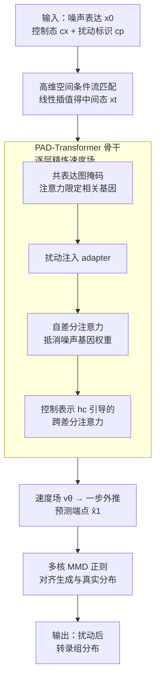

# scDFM: Distributional Flow Matching for Robust Single-Cell Perturbation Prediction

**会议**: ICLR 2026  
**arXiv**: [2602.07103](https://arxiv.org/abs/2602.07103)  
**代码**: [GitHub](https://github.com/AI4Science-WestlakeU/scDFM)  
**领域**: 计算生物
**关键词**: 单细胞扰动预测, 条件流匹配, MMD正则化, 差分注意力, 基因共表达图

## 一句话总结
提出 scDFM，基于条件流匹配（CFM）的生成式框架，通过 MMD 正则化保证分布级保真度，并设计 PAD-Transformer 骨干处理噪声稀疏的单细胞数据，在组合扰动预测上比最强基线 CellFlow 的 MSE 降低 19.6%。

## 研究背景与动机
- 预测细胞在基因/药物扰动后的转录组响应是系统生物学和药物发现的核心挑战
- 由于 RNA 测序的破坏性本质，无法观察同一细胞扰动前后的状态（未配对数据）
- 现有方法（CPA、GEARS 等）主要关注均值表达谱，忽略了更高阶的分布统计量（方差、偏度、亚群比例变化）
- 单细胞数据稀疏、零膨胀、噪声严重，基因间存在复杂调控网络但大多数模型将基因视为独立特征
- **核心动机**：需要一个能建模完整分布变化、同时鲁棒处理噪声和稀疏性的生成框架

## 方法详解

### 整体框架
scDFM 要解决的问题是：给定一群控制态细胞和一个扰动（基因敲除或加药），预测扰动后整群细胞的转录组**分布**长什么样——不只是均值，还包括方差和亚群结构。它把这件事建模成一个条件流匹配（CFM）问题：从噪声基因表达 $x_0$ 出发，沿连续时间 $t\in[0,1]$ 逐步搬运成扰动后真实表达 $x_1$，搬运方向由一个时间依赖的速度场 $v_\theta(x_t \mid t, c_x, c_p)$ 决定，条件 $c_x$ 是控制态细胞、$c_p$ 是扰动标识。速度场用专门设计的 PAD-Transformer 骨干来预测，它带着共表达图先验和差分注意力，逐层用控制态信号校准扰动态。训练时除了让速度场对齐参考轨迹，还在外推出的终端点上叠一项多核 MMD 正则，把生成的整群分布拉向真实分布。

### 关键设计

**1. 高维表达空间里的条件流匹配：在原始基因维度上直接学扰动变换**

由于 RNA 测序是破坏性的，同一细胞扰动前后无法配对观测，传统回归"均值表达谱"会丢掉方差、亚群比例这些高阶信息。scDFM 把源分布 $x_0$ 取为噪声基因表达、目标 $x_1$ 为扰动后表达，用线性插值路径 $\pi_t(x_0, x_1) = (1-t)x_0 + tx_1$ 定义中间态，再回归条件速度场，训练目标为

$$\mathcal{L}_{\text{CFM}}(\theta) = \mathbb{E}\big[\|v_\theta(x_t \mid t, c_x, c_p) - v(x_t \mid x_0, x_1, t, c_x, c_p)\|_2^2\big].$$

和在 50 维 PCA 空间做流匹配的 CellFlow 不同，scDFM 首次直接在高维基因表达空间操作，避免降维丢失分布细节，让生成式框架天然适配"从噪声中间态连续映射到真实扰动态"的需求。

**2. PAD-Transformer：用差分注意力和基因图先验扛住单细胞噪声**

预测速度场的骨干必须扛住单细胞数据零膨胀、噪声重的本质——标准 Transformer 容易把注意力浪费在无关基因 token 上，而真正响应扰动的往往只是部分基因。scDFM 先用绝对 Pearson 相关 $w_{ij} = |\text{Cov}(x_i, x_j) / (\sigma(x_i)\sigma(x_j))|$ 构建共表达图作为注意力掩码，让每个基因 token 只和生物学相关的邻居交互；再用差分注意力 $\alpha_{\text{diff}} = A_1 - \lambda A_2$ 让两路 softmax 注意力相减，抵消掉噪声基因贡献的无关权重。每一层走"扰动注入 → 自差分注意力 → 跨差分注意力"三步精炼：先把扰动嵌入 $e_p$ 经 MLP adapter 注入潜表示，再用自差分注意力压掉噪声激活，最后以控制态表示 $h_c$ 为参考做跨差分注意力，逐层用控制信号校准扰动态预测；时间步还通过 adaLN-Zero 调制每一层。消融显示去掉共表达图会让 DE-Spearman 下降、去掉差分注意力会让噪声敏感度上升，两个组件互补缺一不可。

**3. 多核 MMD 正则：补上 CFM 不管全局分布对齐的短板**

CFM 损失只约束逐点的局部速度一致，不保证生成的端点群体 $\hat{X}_1$ 在分布层面贴合真实 $X_1$，群体方差和亚群结构可能跑偏。scDFM 在每个训练步用一步外推预测端点 $\hat{x}_1 = x_t + (1-t)\cdot v_\theta(x_t \mid t, c_x, c_p)$，再用混合高斯 RBF 核的最大均值差异直接比较两个群体分布，核为 $k_{\text{mix}}(x, x') = \frac{1}{L}\sum_{\ell=1}^L \exp\!\big(-\frac{\|x-x'\|^2}{2\sigma_\ell^2}\big)$，多个带宽 $\sigma_\ell$（由 median heuristic 自适应）覆盖不同尺度的分布差异。选 MMD 而非 KL 或 Wasserstein，是因为它直接基于样本、计算高效、对支撑集不匹配鲁棒，适配高维单细胞场景。消融里去掉 MMD 后 MSE 上升幅度最大、判别得分 DS 下降最明显，印证它对群体水平保真不可或缺。

### 损失函数 / 训练策略
总损失 $\mathcal{L} = \mathcal{L}_{\text{CFM}} + \lambda \mathcal{L}_{\text{MMD}}$ 用 $\lambda > 0$ 平衡轨迹一致性与终端分布保真度，MMD 带宽通过 median heuristic 自适应选择。时间步 $t$ 经正弦余弦嵌入接 MLP，提供 adaLN-Zero 调制注入到骨干每一层。

## 实验关键数据

### 主实验（Norman Additive Split）

| 模型 | MSE ↓ | MAE ↓ | DE-Spearman ↑ | DS ↑ | Pearson $\hat{\Delta}_{20}$ ↑ |
|------|-------|-------|---------------|------|------|
| scDFM (Ours) | **0.00315** | **0.02155** | **0.5705** | **0.9737** | **0.9260** |
| CellFlow | 0.00392 | 0.02207 | 0.5503 | 0.9321 | 0.8988 |
| GEARS | 0.01387 | 0.06624 | 0.5624 | 0.8601 | 0.2032 |
| scGPT | 0.01349 | 0.03796 | 1.07e-5 | 0.5404 | 0.2414 |
| CPA | 0.03435 | 0.07894 | 0.0713 | 0.6021 | 0.2254 |

### 消融实验

| 配置 | 关键指标变化 | 说明 |
|------|---------|------|
| w/o MMD | MSE 上升, DS 下降 | MMD 对分布级保真度至关重要 |
| w/o 基因共表达图 | DE-Spearman 下降 | 生物先验引导注意力有效 |
| w/o 差分注意力 | 噪声敏感度增加 | 差分注意机制抑制噪声 |
| 标准 Transformer 替代 PAD | 全面下降 | PAD-Transformer 各组件互补 |

### 关键发现
- scDFM 比 CellFlow 的 MSE 降低 19.6%（0.00315 vs 0.00392），同时判别得分（DS）达到 0.9737
- 在 Holdout 设置（未见过的扰动）下同样表现优异，验证了泛化能力
- scGPT 等预训练模型在 DE-Spearman 上几乎为零，表明基础模型难以捕捉扰动特异性效应
- Additive 基线本身就有竞争力（与 Ahlmann-Eltze 一致），说明组合扰动常具有近似加性效应

## 亮点与洞察
- 首次在高维基因表达空间中直接应用条件流匹配，相比在 PCA 空间操作的 CellFlow 更直接
- MMD 正则化巧妙弥补了 CFM 只保证局部一致性的缺陷，实现局部（轨迹）+ 全局（分布）双保真
- 基因共表达图作为生物学先验注入注意力掩码，有效过滤噪声、保留调控结构
- 差分注意力机制对噪声生物数据特别适用——只有部分基因响应扰动，其余应被抑制

## 局限与展望
- 仅在 Norman（基因扰动）和 ComboSciPlex（药物扰动）两个数据集验证
- 需要预先计算基因共表达图，增加了数据准备的计算开销
- 分布级评估指标（DS）虽有用但对实际生物意义的反映不够直接
- 未与最新的 diffusion-based 方法（scDiffusion）进行详细对比

## 相关工作与启发
- CellFlow (Klein et al. 2025)：在 PCA 空间做流匹配，scDFM 在原始表达空间操作
- GEARS (Roohani et al. 2024)：引入基因本体等生物先验，scDFM 使用共表达图
- Diff Transformer (Ye et al. 2025)：差分注意力原始提出，scDFM 将其适配到扰动预测

## 评分
- 新颖性: ⭐⭐⭐⭐⭐ CFM + MMD + PAD-Transformer 的组合很创新且设计合理
- 实验充分度: ⭐⭐⭐⭐ 多设置评估、多指标覆盖、有消融
- 写作质量: ⭐⭐⭐⭐ 技术描述清晰，动机充分
- 价值: ⭐⭐⭐⭐⭐ 对计算生物学有重要价值，代码开源

<!-- RELATED:START -->

## 相关论文

- [\[ICML 2026\] What Makes a Representation Good for Single-Cell Perturbation Prediction?](../../ICML2026/computational_biology/what_makes_a_representation_good_for_single-cell_perturbation_prediction.md)
- [\[ICLR 2026\] EvoFlows: Evolutionary Edit-Based Flow-Matching for Protein Engineering](evoflows_evolutionary_edit-based_flow-matching_for_protein_engineering.md)
- [\[AAAI 2026\] Gene Incremental Learning for Single-Cell Transcriptomics](../../AAAI2026/computational_biology/gene_incremental_learning_for_single-cell_transcriptomics.md)
- [\[ICLR 2026\] Verifier-Constrained Flow Expansion for Discovery Beyond the Data](verifier-constrained_flow_expansion_for_discovery_beyond_the_data.md)
- [\[ACL 2026\] AROMA: Augmented Reasoning Over a Multimodal Architecture for Virtual Cell Genetic Perturbation Modeling](../../ACL2026/computational_biology/aroma_augmented_reasoning_over_a_multimodal_architecture_for_virtual_cell_geneti.md)

<!-- RELATED:END -->
