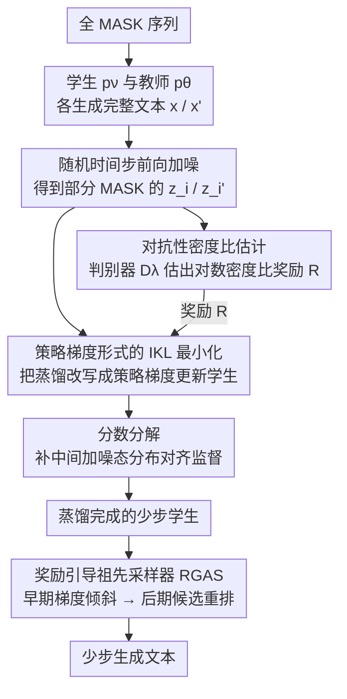

# Ultra-Fast Language Generation via Discrete Diffusion Divergence Instruct

**会议**: ICLR 2026  
**arXiv**: [2509.25035](https://arxiv.org/abs/2509.25035)  
**代码**: [https://github.com/haoyangzheng-ai/didi-instruct](https://github.com/haoyangzheng-ai/didi-instruct)  
**领域**: LLM效率
**关键词**: Discrete Diffusion, Distillation, Masked Diffusion Model, KL Divergence, Few-Step Generation, Policy Gradient

## 一句话总结

提出 DiDi-Instruct，一种基于积分 KL 散度 (IKL) 最小化的蒸馏框架，将预训练的扩散大语言模型 (dLLM) 蒸馏为少步学生模型，通过对抗性密度比估计 + 分组奖励归一化 + 分数分解 + 奖励引导祖先采样器 (RGAS) 四大关键设计，在 OpenWebText 上仅用 16 步即超越 1024 步教师模型的 PPL，实现最高 64× 推理加速，同时训练成本仅需 1 GPU 小时。

## 研究背景与动机

**领域现状**：自回归 (AR) 大语言模型（GPT 系列）在 NLP 各任务上取得巨大成功，但受限于从左到右逐 token 生成的串行瓶颈，吞吐量存在天花板。扩散大语言模型 (dLLM) 借鉴图像扩散模型的思想，将文本生成重新定义为迭代去噪过程，利用双向注意力实现并行生成，成为 AR 模型的有力替代方案。

**现有痛点**：
   - **推理步数过多**：dLLM 在 OpenWebText 基准上需要 256 步才能匹配 GPT-2 的生成质量，推理效率依然不够理想
   - **已有蒸馏方法不足**：SDTT（自蒸馏）在 32 步内仍无法媲美 GPT-2；DUO（一致性蒸馏）需要多轮训练，GPU 开销大（20+ GPU 小时）；DSDD 虽然做了分布匹配但在文本生成上效果有限
   - **缺乏理论基础**：现有 dLLM 蒸馏方法多基于启发式设计，缺少统一且严格的理论框架
   - **离散空间的挑战**：连续扩散模型上的 IKL 方法依赖可微分的采样路径，但 dLLM 的离散状态空间（argmax 等不可微操作）使得梯度无法直接从采样路径传播

**核心矛盾**：如何在离散 token 空间中建立一个理论上有保障、实践中高效稳定的蒸馏框架，使少步学生模型能匹配甚至超越多步教师的生成质量？

**切入角度**：将连续扩散模型的积分 KL 散度 (IKL) 思想迁移到 Masked Diffusion Model (MDM)，通过策略梯度 (policy gradient) 绕过离散不可微问题，结合对抗训练估计密度比作为奖励信号。

## 方法详解

### 整体框架

DiDi-Instruct 要解决的事很直白：把一个需要上千步去噪的扩散语言模型（dLLM）教师 $\mathbf{p}_\theta$，蒸馏成结构相同、却只需几步就能生成同等质量文本的学生 $\mathbf{p}_\nu$。它的总思路是把"让学生分布逼近教师分布"这件事，转化成一个能用策略梯度优化的奖励最大化问题——因为离散文本空间里梯度没法从采样路径直接传回来，只能换成 REINFORCE 这类不依赖可微采样的优化方式。

一轮训练这样转：学生和教师各自从全 MASK 序列出发生成一段完整文本，再在随机时间步上做前向加噪、得到部分 MASK 的中间态 $\mathbf{z}_i$ / $\mathbf{z}_i'$；一个判别器去区分"这个加噪样本来自学生还是教师"，它的输出天然就是学生与教师的对数密度比，正好当作奖励信号；学生拿这个奖励做策略梯度更新，把自己的分布往教师那边推，更新时再用分数分解额外对齐中间加噪态、避免一步到位带来的熵坍塌。蒸馏收敛后，推理阶段还能用 RGAS 采样器借同一套奖励信号把质量榨得更高。

### 关键设计

**1. 策略梯度形式的 IKL 最小化：绕开离散采样路径不可微**

连续扩散里的 IKL 蒸馏要对采样路径求导，可 dLLM 的状态空间是离散的，argmax 这类操作根本传不回梯度——这是把 Diff-Instruct 那套搬到文本上的第一道坎。论文的破解办法是 **Score-Function Identity（定理 3.1）**：把 IKL 目标的梯度改写成 score function 的期望形式，让梯度只落在学生对数概率 $\log \mathbf{p}_\nu$ 上、完全不碰采样过程本身：

$$\nabla_\nu \mathcal{L}(\nu) = \mathbb{E}_{t,\mathbf{x},\mathbf{z}_t}\left[\frac{\omega(t)}{\pi(t)} \cdot R(\mathbf{z}_t, t) \cdot \nabla_\nu \log \mathbf{p}_\nu(\mathbf{z}_t = \mathbf{m}, t=1)\right]$$

其中奖励 $R(\mathbf{z}_t, t) = \log \mathbf{q}_\nu(\mathbf{z}_t, t) - \log \mathbf{q}_\theta(\mathbf{z}_t, t)$ 就是学生与教师的对数密度比。这样一来蒸馏被完整翻译成一个策略梯度问题，REINFORCE 那套现成机器直接可用，离散不可微的障碍被整个绕了过去。策略梯度的老毛病是方差大、奖励尺度一抖训练就不稳，所以论文照 GRPO 的做法对每个 mini-batch（一组 $G$ 个样本）内的奖励做组内标准化 $\widetilde{R}_i = (R_i - \mu_g)/(\sigma_g + \epsilon)$（$\mu_g$、$\sigma_g$ 为组内奖励的均值与标准差），把不同样本的奖励尺度拉齐，梯度方差显著下降、训练曲线更平稳。

**2. 对抗性密度比估计：把"算不出的密度比"换成"训得出的奖励"**

策略梯度需要奖励 $R = \log \mathbf{q}_\nu - \log \mathbf{q}_\theta$，但学生和教师的边际密度都没法直接算出来。论文借对抗思路训一个辅助判别器 $D_\lambda$ 去区分两边来源的加噪样本，用标准二元交叉熵作目标：

$$\mathcal{L}_D(\lambda) = -\frac{1}{G}\sum_{i=1}^G \left[\log D_\lambda(\mathbf{z}_i, t_i) + \log(1 - D_\lambda(\mathbf{z}_i', t_i))\right]$$

最优判别器的 logit 输出天然就等于对数密度比 $\log \frac{\mathbf{q}_\nu}{\mathbf{q}_\theta}$，于是判别器一边训练、一边把奖励信号源源不断喂给策略梯度。判别器用 131M 参数、从教师模型骨干初始化，分类头加谱归一化来稳住对抗训练。

**3. 分数分解：在中间加噪态匹配分布，防止熵坍塌**

让学生从全 MASK 一步跳到完整序列，分布太集中很容易模式坍塌、熵直接塌掉。论文的对策是把 score function 在中间状态 $\mathbf{z}_i$ 处拆开：

$$\nabla_\nu \log \mathbf{p}_\nu(\mathbf{z}_t=\mathbf{m}, t=1) \approx \nabla_\nu \log \mathcal{P}_\nu(\mathbf{z}_i | \mathbf{z}_t=\mathbf{m}) + \nabla_\nu \log \mathbf{p}_\nu(\mathbf{z}_i, t_i)$$

这等于逼着学生不只对齐最终输出，还要对齐中间加噪态的分布，多接收了一层更密的监督。这一块是全篇最关键的组件——消融里把它去掉，PPL 直接从 62 爆到 33584（500×+）。

**4. 奖励引导祖先采样器 (RGAS)：推理时分阶段用奖励再榨一遍质量**

蒸馏好的学生在推理阶段还能靠奖励信号继续提质，RGAS 按去噪进度切换两套策略。早期步骤（$t_n \approx 1$）用梯度倾斜（$h>0, M=1$），拿奖励梯度去微调 logits、先把全局结构定下来；后期步骤（$t_n \approx 0$）切成多候选重排（$h=0, M>1$），一次生成 $M$ 个候选再按奖励做 softmax 加权采样、精修局部细节。先定骨架、后抠细节，比全程用同一套采样更灵活。

### 训练策略

- **参数初始化**：学生和判别器均从预训练教师模型初始化
- **判别器预热**：先冻结学生参数单独训练判别器，避免训练初期不稳定
- **梯度/奖励裁剪**：防止爆炸更新
- **交替训练**：每个训练步先更新判别器再更新学生
- **高效训练**：仅需 10,000 步迭代，AdamW 优化器（lr=1e-6），单卡 H100 约 1 小时完成蒸馏
- **混合精度**：使用 bfloat16 加速

## 实验关键数据

### 主实验：OpenWebText 生成质量 (PPL↓ / Entropy)

| 方法 | 8 NFEs | 16 NFEs | 32 NFEs | 64 NFEs | 128 NFEs |
|------|--------|---------|---------|---------|----------|
| GPT-2 (AR) | — | — | — | — | PPL=18.3 |
| MDLM Teacher (1024步) | — | — | — | — | PPL=38.5 |
| SDTT | 无法收敛 | ~100+ | ~60+ | ~40+ | ~30+ |
| DUO | ~150+ | ~80+ | ~50+ | ~35+ | ~25+ |
| **DiDi-Instruct** | **62.2** | **38.2** | **25.0** | **21.9** | **18.4** |

- 16 步即超越 1024 步教师模型
- 128 步 PPL=18.4，接近 GPT-2 的 18.3，比最强基线降低 24%+
- 熵损失极小（约 1%），样本多样性几乎无损

### 累积消融实验 (169M 模型)

| 配置 | 8 NFEs PPL | 16 NFEs PPL | 32 NFEs PPL | 64 NFEs PPL | 128 NFEs PPL |
|------|-----------|-------------|-------------|-------------|--------------|
| Baseline (无技巧) | 803.9 | 311.5 | 174.8 | 113.1 | 96.6 |
| + Score Decompose | 667.8 | 289.7 | 165.8 | 105.9 | 89.4 |
| + Coupled Time | 101.0 | 75.2 | 48.4 | 35.8 | 30.6 |
| + ω(t) Correction | 95.0 | 75.6 | 31.7 | 25.3 | 21.0 |
| + π(t) Weighting | 92.1 | 44.0 | 32.3 | 26.1 | 21.4 |
| + Regularization | 88.3 | 44.0 | 28.4 | 21.9 | 18.3 |
| + Guided Inference (完整) | **62.2** | **38.2** | **25.0** | **21.9** | **18.4** |

### 模型规模与效率

| 指标 | 数值 |
|------|------|
| 教师模型参数 | 169M (DiT, 12层/12头/768维) |
| 学生模型参数 | 169M（结构相同） |
| 判别器参数 | 131M |
| 蒸馏训练时间 | ~1 H100 GPU 小时 |
| 竞品训练时间 | 20+ GPU 小时 (SDTT/DUO) |
| 推理吞吐 | 2366 tokens/sec |
| 相比 AR 模型加速 | 13.2× (matched PPL) |
| 424M 扩展后 16 步 PPL | 32.79（比 1024 步教师提升 11.4%） |

## 亮点与洞察

1. **理论-实践闭环**：从连续扩散 IKL → 离散 MDM 的 score-function identity → 策略梯度 → 对抗奖励估计，形成完整且严谨的理论链条。不是拼凑技巧，而是从一个统一目标出发推导出所有组件的必要性。

2. **训练效率惊人**：仅 1 GPU 小时 vs 竞品 20+ GPU 小时，降低 20× 训练成本。关键在于单轮蒸馏 + 对抗训练的高效性，无需像 DUO 那样多轮迭代。

3. **少步生成突破性**：16 步即超越 1024 步教师，这意味着 64× 推理加速几乎没有质量损失。这一结果在 dLLM 加速文献中前所未有。

4. **分数分解是核心**：消融实验揭示 Score Decomposition 是不可或缺的组件——去掉后 PPL 从 62 爆到 33584（500×+），说明中间状态匹配对多步蒸馏至关重要。

5. **跨领域验证**：不仅在自然语言上有效，还成功应用于蛋白质序列生成（pLDDT > 70，仅需 8-32 步），证明框架的通用性。

6. **RGAS 的精妙设计**：早期梯度引导 + 后期多候选重排的分阶段策略，既保证全局结构又精细化局部细节，比统一策略更灵活。

## 局限性

1. **模型规模有限**：实验仅覆盖 169M 和 424M，尚未验证在 billion 级参数模型上的效果。作者坦言同时维护教师+学生+判别器三个模型的显存开销是扩展的主要瓶颈。

2. **仅在非条件生成上验证**：所有实验均为无条件文本生成（OpenWebText），未涉及条件生成任务（如指令跟随、对话、翻译），实际应用场景有限。

3. **对抗训练的固有风险**：判别器-生成器的对抗框架在训练过程中可能不稳定，虽然作者通过预热和裁剪缓解了问题，但在更大规模或更复杂任务上是否可靠需要进一步验证。

4. **教师模型质量受限**：基线教师 MDLM 的 1024 步 PPL 为 38.5，远高于 GPT-2 的 18.3。学生最终 PPL 逼近 18.4 部分得益于蒸馏过程的"超越教师"效应，但教师本身的能力天花板仍是 dLLM 的根本瓶颈。

5. **8 步生成仍有明显缺陷**：8 NFEs 下 PPL=62.2，且文本样本存在明显重复现象，说明极端少步场景下的生成质量还有较大提升空间。

## 相关工作

- **Masked Diffusion Models**：MDLM (Sahoo et al., 2024)、D3PM (Austin et al., 2021)、SEDD (Lou et al., 2024) 等建立了离散扩散的基础框架
- **dLLM 加速**：SDTT（时间自蒸馏，Deschenaux & Gulcehre 2025）、DUO（一致性蒸馏，Sahoo et al. 2025）、DSDD（分布匹配，Zhu et al. 2025）
- **连续扩散蒸馏**：Diff-Instruct (Luo et al., 2023b) 提出 IKL 框架用于连续扩散模型，是本文理论基础的直接来源
- **策略梯度**：REINFORCE (Williams, 1992)、PPO (Schulman et al., 2017)、GRPO (Shao et al., 2024) 等为离散优化提供了方法论基础
- **蛋白质生成**：DPLM (Wang et al., 2024) 为本文蛋白质序列实验的基线
- **Block Diffusion**：Arriola et al. (2025) 探索了 AR 与扩散的混合范式

## 评分

| 维度 | 分数 (1-10) | 说明 |
|------|-----------|------|
| 新颖性 | 8 | 首次将 IKL 蒸馏成功迁移到离散扩散模型，策略梯度绕过离散不可微的思路优雅 |
| 理论深度 | 9 | 完整的理论推导链（IKL → Score-Function Identity → 密度比估计），附录证明严谨 |
| 实验充分性 | 8 | 累积+留一消融、规模扩展、跨领域（蛋白质）、下游任务，覆盖全面 |
| 实用价值 | 7 | 训练高效、加速显著，但仅验证非条件生成，且模型规模有限 |
| 写作质量 | 8 | 结构清晰，公式推导连贯，图示（Figure 2）直观展示了流水线 |
| **总分** | **8.0** | 理论贡献扎实、实验结果令人印象深刻的 dLLM 加速工作 |

<!-- RELATED:START -->

## 相关论文

- [\[ICLR 2026\] Discrete Diffusion Trajectory Alignment via Stepwise Decomposition](discrete_diffusion_trajectory_alignment_via_stepwise_decomposition.md)
- [\[NeurIPS 2025\] KLASS: KL-Guided Fast Inference in Masked Diffusion Models](../../NeurIPS2025/computational_biology/klass_kl-guided_fast_inference_in_masked_diffusion_models.md)
- [\[ICML 2026\] TD3B: Transition-Directed Discrete Diffusion for Allosteric Binder Generation](../../ICML2026/computational_biology/td3b_transition-directed_discrete_diffusion_for_allosteric_binder_generation.md)
- [\[NeurIPS 2025\] Constrained Discrete Diffusion](../../NeurIPS2025/computational_biology/constrained_discrete_diffusion.md)
- [\[ICLR 2026\] CORDS: Continuous Representations of Discrete Structures](cords_continuous_representations_of_discrete_structures.md)

<!-- RELATED:END -->
