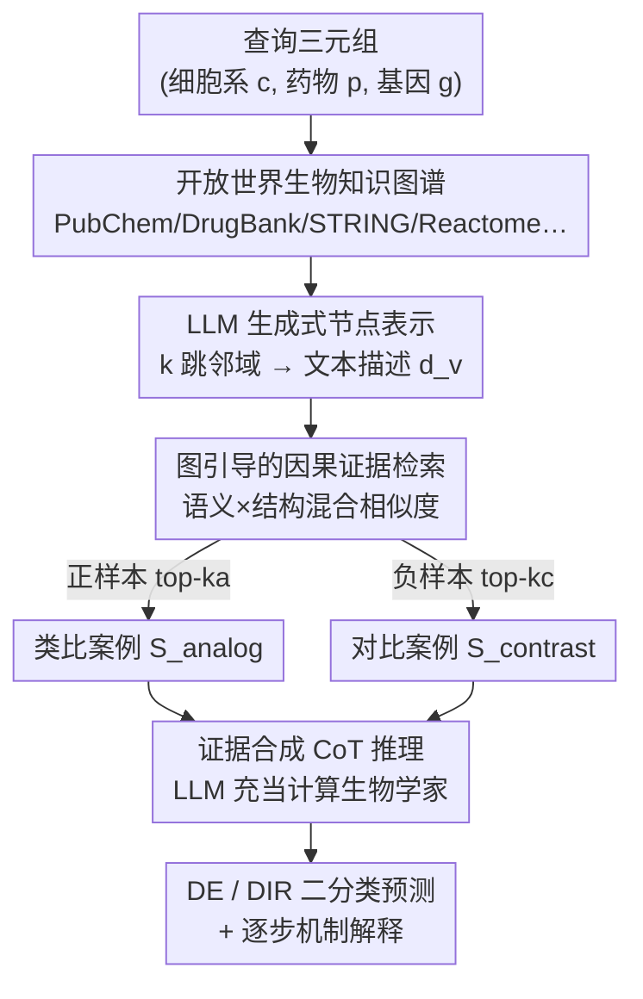

# VCWorld: A Biological World Model for Virtual Cell Simulation

**会议**: ICLR2026  
**arXiv**: [2512.00306](https://arxiv.org/abs/2512.00306)  
**代码**: 无  
**领域**: 计算生物
**关键词**: Virtual Cell, world model, LLM Reasoning, Signaling Cascade, Drug Perturbation

## 一句话总结

提出 VCWorld，一个细胞级白盒模拟器，整合结构化生物知识图谱与大语言模型的迭代推理能力，以数据高效的方式模拟药物扰动引发的信号级联，生成可解释的逐步预测和显式机制假说，在药物扰动基准上达到 SOTA。

## 研究背景与动机

**领域现状**：虚拟细胞建模（Virtual Cell Modeling）是计算生物学的前沿方向，目标是预测细胞在各种扰动（药物处理、基因敲除等）下的响应。这对药物发现、疾病机制理解和精准医疗至关重要。近年来，以 scGPT、GEARS 为代表的深度学习模型通过大规模单细胞 RNA-seq 数据学习基因表达与扰动之间的映射关系，取得了一定进展。

**现有痛点**：（1）**数据依赖过重**——现有模型严重依赖大规模高质量单细胞数据集，但此类数据采集成本高、覆盖范围有限；（2）**泛化能力受限**——数据质量、覆盖范围和批次效应（batch effects）三重因素制约模型在新细胞类型、新扰动条件下的泛化性能；（3）**黑盒问题**——端到端训练的模型只输出基因表达预测值，无法提供扰动如何在细胞内传播的机制解释。

**核心矛盾**：科学研究对可解释性和机制一致性的需求与深度学习模型"黑盒"特性之间的根本冲突。缺乏机制解释的预测结果在科学研究中难以获得认可，无法真正推动生物学认知。即使预测数值准确，研究者也无法从中提取可验证的生物学假说。

**本文方案**：VCWorld 跳出"数据驱动端到端拟合"的范式，转而将结构化生物学知识（如蛋白质相互作用网络、信号通路图谱）与 LLM 在生物医学文献上训练获得的先验知识相结合。模型不再学习 $\text{扰动} \to \text{基因表达}$ 的黑盒映射，而是显式模拟扰动从靶点蛋白到下游基因表达的信号级联传播过程，每一步推理都产生可追溯的机制路径。

## 方法详解

### 整体框架

VCWorld 把"预测细胞对扰动的响应"从黑盒数值回归，改造成一个有知识依据、可逐步追溯的分类推理问题。它的最小预测单元是一个三元组查询 $(c, p, g)$——在细胞系 $c$ 中、药物扰动 $p$ 会让基因 $g$ 怎样变化，对应两个二分类任务：是否差异表达（DE）、以及上调还是下调（DIR）。围绕这个查询，VCWorld 先从七个公开数据库（PubChem、DrugBank、UniProt、GO、Reactome、STRING、CORUM）拼出一张开放世界生物知识图谱，再让 LLM 走三步：先把图谱里每个实体节点改写成富含上下文的文本描述；再按"语义 + 结构"混合相似度，从训练库里检索一组类比案例和一组对比案例当证据；最后把查询描述和正反证据喂给 LLM 做思维链（CoT）推理，输出二分类标签外加一段逐步的机制解释。整条链路不学 $f_\theta(\text{扰动}) \to \text{表达谱}$ 的黑盒映射，而是把每个预测都锚在可读的生物学知识和历史证据上，因此既数据高效、又自带白盒解释。

### 关键设计

**1. 以基因为中心的分类重构与 GeneTAK 基准：让低数据场景下的预测可学、可比**

端到端模型把"扰动 → 高维稀疏表达谱"当回归学，数据一稀缺、维度一高就难准。VCWorld 把任务重写成以基因为中心的三元组 $(c, p, g)$ 二分类：DE 任务判断基因是否差异表达（$l=1$ 为差异表达、$l=0$ 否），DIR 任务判断上调（$l=1$）还是下调（$l=0$）。配套构建 GeneTAK 基准——从 Tahoe-100M 取 5 个细胞系、348 种药物扰动，先压到 2000 个高变基因，用 Wilcoxon 符号秩检验定 DEG 标签，再按扰动以 3:7 划分训练/测试，刻意营造 few-shot 场景。这样把一个高维稀疏的回归问题拆成大量带标签的离散三元组，既便于知识驱动推理，也让不同模型在同一低数据条件下公平对比。

**2. 开放世界知识图谱 + LLM 生成式节点表示：把死的图结构变成 LLM 读得懂的语义**

知识图谱里的节点本是符号 ID，静态 embedding 丢掉了生物语义、LLM 也读不动。VCWorld 先整合七库建异构图 $G=(V, E, R)$，再对每个节点 $v$ 取其 $k$ 跳邻域子图 $N_k(v)$，用模板把节点属性和邻接关系序列化成自然语言查询 $P_v = f_{\text{prompt}}(v, N_k(v))$，交给 LLM 生成一段上下文感知的文本描述 $d_v = L(P_v)$。这段文本既保留了图谱拓扑里的生物语义，又能直接作为后续检索和推理的节点特征，比静态向量更有表达力，也让"知识"以 LLM 能直接消化的形态进入推理现场。

**3. 图引导的因果证据检索：用类比 + 对比两组历史案例给推理打地基**

纯靠 LLM 内部知识推理容易飘，标准 RAG 又只按语义相似度捞一堆同质样本、缺少反例。VCWorld 设计混合相似度 $\text{Sim}(q_{\text{input}}, q_i) = \alpha \cdot \text{Sim}_{\text{sem}} + (1-\alpha) \cdot \text{Sim}_{\text{struct}}$，既比 LLM 文本描述之间的语义余弦，又比知识图谱上基于路径的结构相似度，用 $\alpha$ 平衡二者。关键是它不捞单一列表，而是在不同结果分组里分别检索两组互斥证据：从正样本（$l=1$）里取 top-$k_a$ 的类比案例 $S_{\text{analog}}$、从负样本（$l=0$）里取 top-$k_c$ 的对比案例 $S_{\text{contrast}}$，合成 $S = S_{\text{analog}} \cup S_{\text{contrast}}$。一正一反的证据让 LLM 既有"长得像、结果为正"的样板，也有"长得像、结果却为负"的反例，避免一边倒地下判断。

**4. 证据合成的思维链推理：让 LLM 当计算生物学家，边判边解释**

黑盒模型只吐数值、给不出可验证的机制。VCWorld 把查询描述 $d_{q_{\text{input}}}$ 和检索到的正反证据拼成最终提示 $P_{\text{CoT}} = f_{\text{CoT\_prompt}}(d_{q_{\text{input}}}, S_{\text{analog}}, S_{\text{contrast}})$，指示 LLM（实现用 Gemini2.5-Flash）以计算生物学家的身份逐步推理，产出文本 $O_{\text{final}} = L(P_{\text{CoT}})$，再用解析函数抽出结构化标签和解释 $(\hat{l}, E) = f_{\text{parse}}(O_{\text{final}})$。CoT 强制 LLM 把定性知识（$d$）和经验证据（$S$）显式结合，每个预测都带一条逐步、可追溯、可被湿实验验证的机制路径——这正是"白盒"落地的地方。

### 一个完整示例

以一次预测为例，输入三元组是「PANC-1 细胞系 + 某激酶抑制剂 + 基因 FN1，问 FN1 是否差异表达（DE）」。VCWorld 先在知识图谱里定位 FN1、该药物及其靶点，取它们的 $k$ 跳邻域生成文本描述 $d$；接着算混合相似度，从训练库里捞出若干"同样涉及相关通路、结果为差异表达"的类比案例 $S_{\text{analog}}$，和若干"条件相近、结果却为不差异表达"的对比案例 $S_{\text{contrast}}$；最后把 FN1 的描述连同这两组案例拼成 CoT 提示，LLM 逐步推断"该药抑制靶点 → 相关信号通路活性改变 → FN1 所在调控模块受影响"，给出 DE$=1$ 的判断并附上这条推理链。研究者可以顺着每一步审查逻辑、定位可疑环节。

## 实验关键数据

### 药物扰动基准测试

| 方法 | 类型 | 核心特点 | 预测精度 |
|------|------|---------|---------|
| scGPT | 数据驱动 | 大规模预训练+微调 | 基线水平 |
| GEARS | 数据驱动 | 图神经网络建模基因关系 | 中等 |
| 多源信息融合方法 | 数据驱动 | 整合多组学数据 | 改善有限 |
| **VCWorld (本文)** | **知识+LLM 推理** | **白盒，可解释** | **SOTA** |

VCWorld 在药物扰动预测基准上达到最先进性能，同时是唯一提供完整机制解释的方法。

### 消融实验

| 配置 | 效果 | 说明 |
|------|------|------|
| 去除结构化知识 | 性能显著下降 | 仅靠 LLM 内部知识推理不够可靠 |
| 去除迭代推理 | 性能下降 | 单步预测丢失信号级联的逐步传播信息 |
| 去除 LLM 推理 | 性能大幅下降 | 纯知识图谱无法处理知识缺口 |
| 完整 VCWorld | **最优** | 结构化知识 + LLM 推理的协同效应 |

### 关键发现

1. **机制一致性**：VCWorld 推断的信号传导路径与已发表的生物学文献证据高度一致，验证了推理过程的生物学合理性
2. **可解释性优势**：每个预测附带完整的信号级联路径，研究者可逐步审查推理逻辑并定位潜在错误
3. **数据效率**：在有限训练数据下的表现优于依赖大规模数据集的数据驱动基线方法

## 亮点与洞察

- **白盒模拟器的理念**突破了 AI for Science 中"预测精度至上"的现状——在科学研究中，一个能给出合理机制解释的中等精度预测往往比一个无法解释的高精度预测更有价值
- **LLM 作为"生物推理引擎"**是一个巧妙的设计——LLM 在 PubMed 等海量生物医学文献上训练后，隐式编码了大量分子间关系和生物学原理，VCWorld 将这种隐式知识转化为显式的推理能力
- **"世界模型"视角**将细胞响应预测从统计拟合上升为因果模拟——给定初始扰动条件，模型能够"预演"细胞的动态响应过程
- **跨领域方法论启发**：将 LLM 推理能力与领域知识图谱结合的范式可推广到材料科学、化学反应预测等其他科学领域

## 局限与展望

- **LLM 幻觉风险**：LLM 可能生成看似合理但生物学上错误的推理链条，需要额外的校验机制来过滤不可靠推断
- **知识图谱覆盖不完整**：KEGG/Reactome 等数据库仍有大量未知的信号传导关系，在知识空白区域模型performance会下降
- **推理效率**：迭代调用 LLM 进行逐步推理的计算成本显著高于端到端前向传播
- **扰动类型覆盖**：当前主要聚焦药物扰动验证，基因敲除（gene knockout）、过表达（overexpression）等其他扰动类型的泛化效果有待验证
- **单细胞层面异质性**：同一细胞类型内部存在显著的细胞间异质性，当前框架对此建模有限

## 相关工作与启发

- **vs scGPT / GEARS**：端到端数据驱动方法，预测精度依赖数据规模，无法提供机制解释；VCWorld 以知识+推理换取可解释性和数据效率
- **vs Virtual Cell Initiative (CZI)**：Chan Zuckerberg Initiative 推动的虚拟细胞研究项目，VCWorld 从"白盒世界模型"角度提供了一种 complementary 的技术路线
- **vs GeneGPT / BioGPT**：LLM 在生物学中的早期应用侧重知识问答，VCWorld 进一步将 LLM 用于结构化的因果推理和动态模拟
- **启发**：LLM 推理 + 领域知识图谱的"白盒世界模型"范式有望在其他知识密集型科学领域（如药物化学、材料设计）中复现

## 评分

- 新颖性: ⭐⭐⭐⭐⭐ 白盒生物世界模型概念新颖，LLM 推理与知识图谱结合的思路在虚拟细胞领域属首创
- 实验充分度: ⭐⭐⭐⭐ 药物扰动基准全面，机制验证有说服力
- 写作质量: ⭐⭐⭐⭐ 概念清晰，跨领域读者友好
- 价值: ⭐⭐⭐⭐⭐ 对 AI for Science 和可解释 AI 均有重要方向性启发

<!-- RELATED:START -->

## 相关论文

- [\[ACL 2026\] AROMA: Augmented Reasoning Over a Multimodal Architecture for Virtual Cell Genetic Perturbation Modeling](../../ACL2026/computational_biology/aroma_augmented_reasoning_over_a_multimodal_architecture_for_virtual_cell_geneti.md)
- [\[ICLR 2026\] Controllable Sequence Editing for Biological and Clinical Trajectories](controllable_sequence_editing_for_biological_and_clinical_trajectories.md)
- [\[NeurIPS 2025\] scPilot: Large Language Model Reasoning Toward Automated Single-Cell Analysis and Discovery](../../NeurIPS2025/computational_biology/scpilot_large_language_model_reasoning_toward_automated_single-cell_analysis_and.md)
- [\[ICCV 2025\] Integrating Biological Knowledge for Robust Microscopy Image Profiling on De Novo Cell Lines](../../ICCV2025/computational_biology/integrating_biological_knowledge_for_robust_microscopy_image_profiling_on_de_nov.md)
- [\[CVPR 2026\] HINGE: Adapting a Pre-trained Single-Cell Foundation Model to Spatial Gene Expression Generation from Histology Images](../../CVPR2026/computational_biology/adapting_a_pre-trained_single-cell_foundation_model_to_spatial_gene_expression_g.md)

<!-- RELATED:END -->
