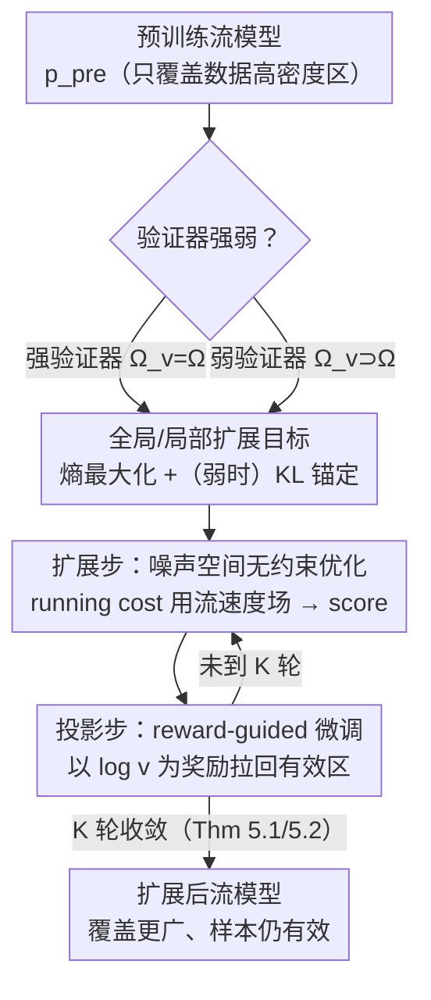

# Verifier-Constrained Flow Expansion for Discovery Beyond the Data

**会议**: ICLR 2026  
**arXiv**: [2602.15984](https://arxiv.org/abs/2602.15984)  
**代码**: 无  
**领域**: 计算生物
**关键词**: Flow Expansion, 验证器约束, 熵最大化, Mirror Descent, 分子设计

## 一句话总结
提出Flow Expander (FE)，通过验证器约束的熵最大化在概率空间中扩展预训练流模型的覆盖范围，使其生成超越训练数据分布但保持有效性的设计样本，在分子构象设计中增加多样性同时保持化学有效性。

## 研究背景与动机

**领域现状**：流模型和扩散模型通过散度最小化训练，仅覆盖训练数据分布对应的设计空间的极小子集。在科学发现任务中（如药物设计、材料设计），需要探索超越数据分布的有效设计。

**现有痛点**：(1) 预训练流模型集中在高数据密度区域，低概率区域可能是无效设计；(2) 流形探索方法（如密度重平衡）在数据稀疏区域失去有效性信号；(3) 缺乏利用外部验证器（如原子键检查器）来引导探索的原则性方法。

**核心矛盾**：探索超越数据分布的设计空间需要增加覆盖范围（熵最大化），但无约束扩展会生成无效设计。需要在扩展和有效性之间取得平衡。

**本文目标**：如何利用给定验证器调整预训练流模型，使其密度扩展到高数据可用性区域之外，同时保持样本有效性？

**切入角度**：形式化强/弱验证器概念，针对两种情况分别提出全局和局部流扩展的数学框架。

**核心 idea**：通过验证器约束的熵最大化和噪声空间上的Mirror Descent优化，实现预训练流模型的有原则扩展。

## 方法详解

### 整体框架
预训练流模型只覆盖了数据高密度区的一小块，可科学发现恰恰需要往数据之外、但仍有效的区域探索。Flow Expander（FE）的整体思路是：先看手里的验证器有多强，据此选一条扩展路线，再用同一套"先扩散、后拉回有效区"的迭代去逼近目标分布。具体地，强验证器（$\Omega_v = \Omega$，能精确判定有效与否）走**全局扩展**，目标是把密度直接铺成有效空间上的均匀分布 $\mathcal{U}(\Omega)$；弱验证器（$\Omega_v \supset \Omega$，只能当过滤器、有盲区）走**局部扩展**，在预训练分布附近做受KL约束的扩散。两条路线被统一写成噪声空间上的一个Mirror Descent优化，由 **ExpandThenProject** 算法把"扩展"和"投影回有效区"交替迭代K次来求解；其中扩展步只用到流速度场线性变换出的score，无需额外训练。

### 关键设计

**1. 验证器分级：强者逼近均匀、弱者用KL锚回先验**

科学发现要往数据之外探，但"无约束地扩"必然生成大量无效设计——扩展力度该放到多大，取决于验证器能不能信。FE据此把问题分成两档。验证器**够强**（能完整刻画有效空间 $\Omega$）时，问题就是带有效性约束的纯熵最大化 $\pi^* = \arg\max_{\pi} \mathcal{H}(p_1^\pi)$，s.t. $\mathbb{E}_{x \sim p_1}[v(x)] = 1$、起点 $p_0^\pi = p_0^{\text{pre}}$；这个凸问题的最优解非常干净——终端分布就是有效空间上的均匀分布 $p_1^{\pi^*} = \mathcal{U}(\Omega)$，此时**完全不必依赖预训练模型**，因为有效区已被验证器说清，最大熵的答案只由 $\Omega$ 决定。但现实验证器（如原子键检查器）通常只是**弱**过滤器、有检测不到的无效区；照搬全局扩展会把密度灌进这些盲区。FE的修法是在目标里加一项KL正则 $\max_\pi \mathcal{H}(p_1^\pi) - \alpha D_{\text{KL}}(p_1^\pi \| p_1^{\text{pre}})$，借预训练先验把分布拉回数据附近来兜住盲区；超参 $\alpha$ 就是保守度旋钮——$\alpha$ 越大越贴近预训练分布、越不敢外探，因此 $\alpha$ 应随验证器质量调（强验证器小 $\alpha$、弱验证器大 $\alpha$）。

**2. ExpandThenProject：把约束优化拆成"扩散—投影"交替，扩展步只复用流速度场**

上面的约束优化直接解很难，FE把它化成噪声空间上的Mirror Descent，并把每一步更新拆成两个好实现的子步、迭代K次。**扩展步**做一次无约束优化（Eq. 15），用 running cost $f_t = \lambda_t \delta\mathcal{G}_t$ 驱动密度向外摊开；**投影步**做一次 reward-guided fine-tuning（Eq. 16），把验证器对数 $\log v$ 当奖励、把刚扩出去的密度拉回有效区。"先放后收"恰好对应Mirror Descent的一步更新，既保留探索力度又不会失控。关键在于扩展步并不需要单独估计score：running cost的梯度有闭式——全局情形 $\nabla_x \delta\mathcal{G}_t = -s_t^\pi$，弱验证器情形多一项KL的贡献 $\nabla_x \delta\mathcal{G}_t = -s_t^\pi - \alpha_t(s_t^\pi - s_t^{\text{pre}})$，而 score 本身可由流速度场 $\pi(x,t)$ 经线性变换得到

$$s_t^\pi(x) = \frac{1}{\kappa_t\left(\frac{\dot{\omega}_t}{\omega_t}\kappa_t - \dot{\kappa}_t\right)}\left(\pi(x,t) - \frac{\dot{\omega}_t}{\omega_t}x\right),$$

于是整套优化直接复用预训练流模型的输出、无需额外训练一个score网络。

**3. 噪声空间探索（NSE）：用整段轨迹的score稳住高维探索**

NSE是FE去掉投影步后剩下的扩展机制，却单独解决了一个老痛点：现有流探索方法只取终端 $t=1$ 处的 score $s_1^\pi$ 来引导，而它在数据稀疏处会发散、把探索带偏。FE的扩展步改用整个流过程 $t \in [0,1]$ 的 score 信息，相当于把探索信号沿时间均摊、避开终端奇异点，因此在高维分子设定下比只看终端的方法稳定得多——这也是FE在高维有效的直接原因。

**4. 收敛保证：从精确更新到近似更新的两级理论兜底**

交替迭代会不会真的收敛、收敛到哪，FE给了理论支撑。Proposition 1 证明 ExpandThenProject 恰好精确求解一步 Mirror Descent；Theorem 5.1 在理想化的精确更新下给出有限时间收敛率 $D_{\text{KL}}(\mathbf{Q}^* \| \mathbf{Q}^K) \leq \frac{C}{K}$；Theorem 5.2 进一步放宽到现实——扩展步和投影步都只是近似时，在温和的噪声/偏差假设下仍保证渐近收敛。这条从"精确"到"近似"的链条把实际可实现的算法也纳入了保证范围。

## 实验关键数据

### 合成实验（可视化验证）
- FE成功将预训练分布扩展到整个有效区域
- NSE在高维设置中稳定性显著优于现有方法

### 分子设计实验
- FE增加构象多样性的同时比现有流探索方法更好地保持有效性
- 弱验证器（原子键检查器）有效过滤无效构象
- 多弱验证器组合 $\Omega_v = \bigcap_i \Omega_{v_i}$ 进一步收紧有效区域

### 关键发现
- 噪声空间探索（使用整个过程而非终端score）在高维中显著提升稳定性
- 验证器约束的投影步至关重要——无约束扩展会产生大量无效样本
- $\alpha$ 的选择应反映验证器质量：强验证器→小 $\alpha$，弱验证器→大 $\alpha$

## 亮点与洞察
- **问题形式化优雅**：强/弱验证器的区分及对应的全局/局部扩展框架，概念清晰且实用
- **理论严谨**：从连续时间RL到Mirror Descent的理论链条完整，convergence guarantees扎实
- **噪声空间优化是关键创新**：解决了终端score发散的实际问题，且NSE作为副产品本身就有价值
- **通用框架**：适用于任何有验证器的科学发现任务

## 局限与展望
- score function的近似精度影响实际性能，需要高质量预训练模型
- $\alpha_t$ 和 $\lambda_t$ 的选择缺乏自动调节机制
- 分子设计实验规模相对较小，大规模评估有待进一步开展
- 可以探索学习型验证器（如GNN）替代手工规则

## 相关工作与启发
- **vs De Santi et al. 2025**：仅使用终端score $s_1^\pi$ 进行探索，存在发散问题；FE利用整个过程稳定
- **vs reward-guided fine-tuning**：FE额外提供验证器约束，防止扩展到无效区域
- **连续时间RL视角**：将流模型微调统一为最优控制问题的创新

## 评分
- 新颖性: ⭐⭐⭐⭐⭐ 验证器约束的流扩展是全新问题，理论框架完整
- 实验充分度: ⭐⭐⭐⭐ 合成+分子设计实验，但大规模实验有待进一步验证
- 写作质量: ⭐⭐⭐⭐ 理论密集但逻辑清晰，图示有效
- 价值: ⭐⭐⭐⭐⭐ 对科学发现中的生成模型应用有重要推动

<!-- RELATED:START -->

## 相关论文

- [\[ICML 2026\] Constrained Flow Optimization via Sequential Fine-Tuning for Molecular Design](../../ICML2026/computational_biology/constrained_flow_optimization_via_sequential_fine_tuning_for_molecular_design.md)
- [\[NeurIPS 2025\] Flow Density Control: Generative Optimization Beyond Entropy-Regularized Fine-Tuning](../../NeurIPS2025/computational_biology/flow_density_control_generative_optimization_beyond_entropy-regularized_fine-tun.md)
- [\[NeurIPS 2025\] Constrained Discrete Diffusion](../../NeurIPS2025/computational_biology/constrained_discrete_diffusion.md)
- [\[AAAI 2026\] Constrained Best Arm Identification with Tests for Feasibility](../../AAAI2026/computational_biology/constrained_best_arm_identification_with_tests_for_feasibility.md)
- [\[ICLR 2026\] Zatom-1: A Multimodal Flow Foundation Model for 3D Molecules and Materials](zatom-1_a_multimodal_flow_foundation_model_for_3d_molecules_and_materials.md)

<!-- RELATED:END -->
