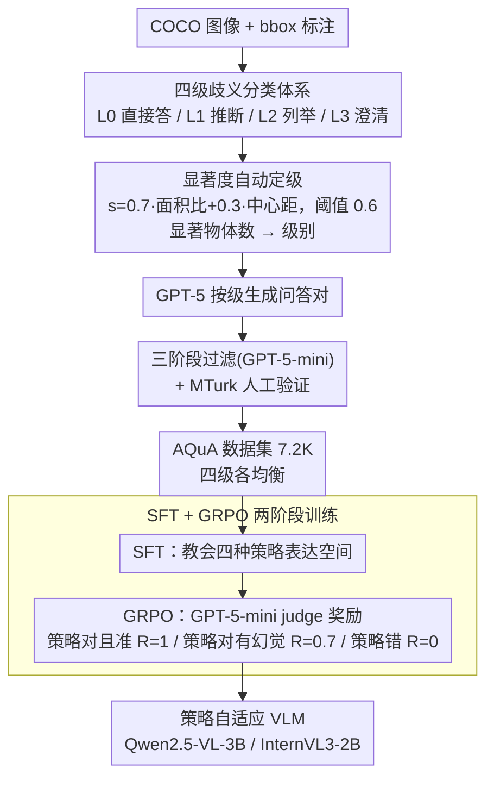

# AQuA: Toward Strategic Response Generation for Ambiguous Visual Questions

**会议**: ICLR 2026  
**arXiv**: [2603.07394](https://arxiv.org/abs/2603.07394)  
**代码**: [https://aqua-iclr2026.github.io/](https://aqua-iclr2026.github.io/)  
**领域**: 对话系统  
**关键词**: ambiguity, VQA, response strategy, uncertainty handling, GRPO  

## 一句话总结
提出 AQuA，首个按模糊度细粒度分级（4 级）的视觉问答数据集（7.2K 样本），为每级定义最优回应策略（直接回答/推断/列举/请求澄清），发现 GPT-5 和 Gemini 在模糊 VQA 上都过度自信地直接回答，通过 SFT+GRPO 训练的 3B 模型反而能超越闭源大模型的策略适应能力。

## 研究背景与动机
**领域现状**：VQA benchmark 主要使用清晰无歧义的图像-问题对，但真实场景中歧义无处不在（指代不明、多个合理对象、场景复杂等）。

**现有痛点**：(1) 现有模糊 VQA 研究采用二元策略——要么回答要么询问——不反映人类实际的灵活应对；(2) GPT-5、Gemini 等 SOTA 模型面对模糊问题时倾向于过度自信地直接回答，而非根据歧义程度调整策略。

**核心矛盾**：不同类型和程度的歧义需要不同的回应策略，但模型缺乏对歧义的细粒度感知和策略选择能力。

**本文目标** 如何让 VLM 根据视觉问题的歧义程度自适应选择最优回应策略？

**切入角度**：定义 4 级歧义分类体系 + 对应策略，构建训练数据，用 SFT+GRPO 训练模型。

**核心 idea**：教 VLM 像人一样——简单问题直接答、可推断的目标直接推断、少量候选时列举、高度歧义时请求澄清。

## 方法详解

### 整体框架
AQuA 把"面对模糊视觉问题该怎么回应"拆成两条线：一条是**怎么定义问题**——设计一套从无歧义到高度歧义的四级分类体系，并为每级配上人类会采取的最优回应策略；另一条是**怎么把它落成可训练资源**——基于 COCO 图像，用物体显著度把歧义程度量化成可计算的定级规则，再让 GPT-5 按级生成问答对、经三阶段过滤与人工验证，得到 7.2K 样本（每级约 1.8K）的数据集。最后用两阶段训练把策略能力注入模型：先 SFT 教会四种策略的表达空间，再用 GRPO 强化"在正确时机选对策略"。整条 pipeline 的目标是让一个 3B 小模型学会在歧义面前像人一样灵活应对。

### 关键设计

**1. 四级歧义分类体系：把"答还是问"的二元选择细化成贴近人类的四种策略**

现有模糊 VQA 研究只让模型在"直接回答"和"请求澄清"之间二选一，但人在现实中的应对要灵活得多——能推断的就推断，候选不多时就把可能性都列出来，只有真的无从下手才反问。AQuA 据此把问题分成四级：Level 0 是标准无歧义 VQA，答案唯一，对应直接回答；Level 1 是带"this/that"等指代词但能从上下文推断出目标的低级指代歧义，对应推断后直接回答；Level 2 有 2-3 个同样合理的目标，对应把所有可能答案列举出来；Level 3 是 5 个以上相似对象、无法推断的高度歧义，对应请求澄清。这套划分不是凭空设计，而是模拟人类处理歧义的四种自然反应，人工评估确认它与人类真实的策略选择高度吻合（L0 一致率 100%、L1 96%）。

**2. 基于物体显著度的歧义级别自动分配：用 COCO 标注把"歧义程度"变成可计算的定级规则**

要给 7.2K 样本逐一标注歧义级别，纯人工不现实，AQuA 借 COCO 的 bounding box 把定级自动化。对每个候选物体算一个显著度分数，由它在画面中的面积占比和到画面中心的距离加权而成，即 $s = 0.7 \cdot \text{area\_ratio} + 0.3 \cdot \text{center\_dist}$，面积越大、越靠中心越显著。分数超过阈值 0.6 才算"显著物体"，再按一张图里显著物体的数量决定级别：1 个对应 L1、2-3 个对应 L2、5 个以上对应 L3。这样歧义程度就从一个模糊的主观判断，变成了对图像内容可复现的统计量，也保证了各级样本量的均衡。

**3. SFT + GRPO 两阶段训练：先教策略空间，再用奖励信号校准"何时该说不确定"**

只靠 SFT 微调，模型能学会四种策略的表达格式，却无法稳定地在该列举时列举、该澄清时澄清——它仍会被预训练里"对问题就要给答案"的惯性带偏。于是 AQuA 在 SFT 之上接 GRPO 强化学习，用 LLM-as-judge（GPT-5-mini）评判每条回应：策略选对且事实也准给满奖励 $R=1$，策略选对但答案有幻觉给 $R=1-\lambda$（取 $\lambda=0.3$ 作为事实错误的惩罚），策略选错则 $R=0$。奖励的核心权重压在"策略是否匹配歧义级别"上，事实正确只是次级修正项，这正好对症 GPT-5 那种"答案对、策略错"的过度自信——逼模型把决策重心从"答什么"转到"该不该答"。SFT 用标准交叉熵，整套流程在 Qwen2.5-VL-3B 和 InternVL3-2B 上微调即可。

## 实验关键数据

### 主实验（策略准确率 Strategic Acc.）

| 模型 | L0 | L1 | L2 | L3 | Overall |
|------|-----|-----|-----|-----|---------|
| GPT-5 | 89.7 | 0.7 | 0.3 | 0.8 | 22.9 |
| Gemini 2.5 Flash | 99.0 | 5.2 | 4.4 | 0.9 | 27.4 |
| Qwen2.5-VL-72B | 99.6 | 0.6 | 2.1 | 0.9 | 25.8 |
| **Qwen2.5-VL-3B + AQuA** | - | **高** | **高** | **高** | **>50** |

### 关键发现
- **所有基线模型在 L1-L3 上策略准确率接近 0%**：GPT-5 在 L1/L2/L3 上几乎从不请求澄清或列举选项，默认直接回答
- GPT-5 事实准确率 98.4% 但策略准确率仅 22.9%——模型知道答案但不知道什么时候该说"不确定"
- 3B 参数的 AQuA 训练模型在策略准确率上超越 GPT-5 和 72B 开源模型
- CoT prompting 仅小幅提升策略准确率（22.9→25.7 for GPT-5），说明问题不在推理深度而在策略意识
- 人工评估确认 AQuA 的四级分类与人类策略选择一致性高（L0: 100%, L1: 96%, L2/L3: 64%）

## 亮点与洞察
- **揭示了 VLM 的"过度自信"问题**：即使是最强的模型也倾向于对模糊问题给出单一答案而非表达不确定性——这是安全部署的重大风险
- **四级歧义分类的实用价值**：比二元"答/问"更贴近真实人类行为，为 VLM 的不确定性处理提供了更细粒度的框架
- **小模型+策略训练 > 大模型**：3B 模型经 AQuA 训练后策略能力远超 GPT-5，说明这是一个可学的能力而非需要规模

## 局限与展望
- 数据集规模较小（7.2K），可能限制了策略泛化能力
- 基于 COCO 的物体级歧义，未覆盖更高层次的语义歧义（如隐喻、文化差异）
- Level 2/3 的边界有一定主观性（人工一致率 64%）
- 仅在单轮 VQA 上评估，多轮对话中的策略切换未探索

## 相关工作与启发
- **vs ClearVQA**: ClearVQA 只训练模型"问还是答"（二元），AQuA 定义 4 种策略，更灵活
- **vs VAGUE**: VAGUE 评估视觉上下文如何帮助消解歧义，AQuA 训练模型根据歧义程度选择策略
- **vs "I don't know" 训练**: 简单拒绝回答不是好策略——有时推断或列举比拒绝更有用

## 评分
- 新颖性: ⭐⭐⭐⭐⭐ 首个多策略歧义 VQA 框架，四级分类体系原创
- 实验充分度: ⭐⭐⭐⭐ 多模型对比、人工验证、GRPO 消融
- 写作质量: ⭐⭐⭐⭐⭐ 动机清晰，examples 直观，级别定义精确
- 价值: ⭐⭐⭐⭐⭐ 对 VLM 安全部署有直接启示——模型需要学会说"我不确定"

<!-- RELATED:START -->

## 相关论文

- [\[ACL 2026\] Discourse Coherence and Response-Guided Context Rewriting for Multi-Party Dialogue Generation](../../ACL2026/dialogue/discourse_coherence_and_response-guided_context_rewriting_for_multi-party_dialog.md)
- [\[ACL 2026\] Author-in-the-Loop Response Generation and Evaluation: Integrating Author Expertise and Intent in Responses to Peer Review](../../ACL2026/dialogue/author-in-the-loop_response_generation_and_evaluation_integrating_author_experti.md)
- [\[ACL 2025\] UniConv: Unifying Retrieval and Response Generation for Large Language Models in Conversations](../../ACL2025/dialogue/uniconv_retrieval_response_gen.md)
- [\[ECCV 2024\] BI-MDRG: Bridging Image History in Multimodal Dialogue Response Generation](../../ECCV2024/dialogue/bi-mdrg_bridging_image_history_in_multimodal_dialogue_response_generation.md)
- [\[NeurIPS 2025\] LatentGuard: Controllable Latent Steering for Robust Refusal of Attacks and Reliable Response Generation](../../NeurIPS2025/dialogue/latentguard_controllable_latent_steering_for_robust_refusal_of_attacks_and_relia.md)

<!-- RELATED:END -->
