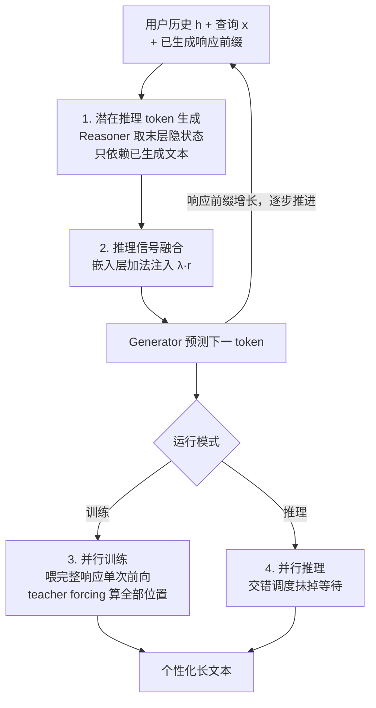

# Think-While-Generating: On-the-Fly Reasoning for Personalized Long-Form Generation

**会议**: ICLR 2026  
**arXiv**: [2512.06690](https://arxiv.org/abs/2512.06690)  
**代码**: 无  
**领域**: 对话系统  
**关键词**: 个性化生成, 长文本生成, 潜在推理, think-while-generating, 并行推理

## 一句话总结

FlyThinker 提出了一种高效的 "think-while-generating" 框架，使用独立的推理模型(Reasoner)在 token 级别并行生成潜在推理信号，动态融入生成模型(Generator)以指导个性化长文本生成，同时保持训练和推理效率。

## 研究背景与动机

偏好对齐使 LLM 更好地反映人类期望，但现有方法主要优化群体级偏好，忽视个体用户需求。个性化长文本生成面临三大挑战：

**隐式偏好难以推理**: 用户兴趣通常隐含在历史行为中，简单的 prompt 定制或微调难以有效推理这些偏好

**"Think-then-generate"的局限**: 现有推理方法在生成前一次性完成所有推理，产生静态分析。对长文本而言，这种一次性推理需要覆盖完整响应的所有信息，学习困难且无法适应内容动态演变

**效率瓶颈**: 交替推理-生成的 "think-while-generating" 范式虽然直觉合理，但频繁推理会显著增加训练和推理时间

FlyThinker 的核心洞察：通过将推理与生成解耦到两个独立模型，并打破推理 token 之间的直接序列依赖，实现推理与生成的真正并行化。

## 方法详解

### 整体框架

FlyThinker 把"边想边写"拆成两个并行运转的模型：一个推理模型 Reasoner $R$ 在每个生成步骤吐出一个潜在推理 token，输入是用户历史 $h$、查询 $x$ 和已经写出的响应前缀；一个生成模型 Generator $G$ 则是被改造过的 LLM，把这些推理信号融进自己的 token 预测里。关键的解耦点在于第 $t$ 步的推理只看已生成的文本 $\hat{y}_{<t}$、不看之前的推理 $r_{<t}$，于是生成链 $(h,x;\hat{y}_{<t}+r_{<t})\to\hat{y}_t$ 和推理链 $(h,x,\hat{y}_{<t})\to r_t$ 之间不再有逐 token 的串行依赖，留出了真正并行化的空间。正因为这条解耦，同一套架构在训练时可以单次前向把所有位置的推理一并算出、在推理时让两个模型错峰并行——这构成了下面四个关键设计：Reasoner 怎么产出无依赖的推理、推理信号怎么注入 Generator、以及这套结构在训练与推理两种模式下如何各自并行。

### 关键设计

**1. 潜在推理 token 生成：让推理摆脱自身的序列依赖**

think-while-generating 之所以慢，是因为传统做法里第 $t$ 步推理要等第 $t-1$ 步推理算完。FlyThinker 把推理塞进一个独立的 Reasoner，并刻意切断推理 token 之间的链条：每步从 Reasoner 最后一层隐状态直接取出潜在推理 $r_t = R_\theta^{(-1)}(h,x; \hat{y}_{<t-1})[-1]$。这里 $r_t$ 只依赖已生成的响应 $\hat{y}_{<t-1}$，而不依赖此前的任何 $r_{<t}$。由于推理信号锚定在不断增长的文本前缀上而非另一条推理链上，它依然能随内容动态演变，却把"必须串行"的约束彻底解掉了——这是后面所有并行优化的前提。

**2. 推理信号融合：用加法把潜在推理注入嵌入空间**

Generator 拿到 Reasoner 给的 $r_t$ 后，不需要改动注意力结构，只在 token 嵌入层做一次加法融合：$f(\hat{y}_{<t}, r_{<t}) = [e(y_1) + \lambda r_1, \dots, e(y_{t-1}) + \lambda r_{t-1}]$。每个历史 token 的嵌入 $e(y_i)$ 叠加一份强度为 $\lambda$ 的推理向量 $\lambda r_i$，$\lambda$ 控制推理信号说话的分量。这种轻量注入让推理信息以最小侵入的方式参与每一步预测；消融实验也显示 $\lambda$ 在 $[0.2, 2.0]$ 区间内都稳定优于 SFT，$\lambda=0$ 退化为纯 SFT、$\lambda=5$ 则因信号过强反而干扰生成。

**3. 并行训练：一次前向算完所有位置的推理**

正因为 $r_t$ 与 $r_{<t}$ 无关，训练时不必逐步生成推理，而是把完整目标序列 $y$ 一次性喂进 Reasoner，单次前向传播就拿到所有位置的推理 token $r^\star = [r_1, \dots, r_T]$。随后 Generator 也能在 teacher forcing 下并行算出每个位置的预测。整套流程的计算图和标准 LLM 训练几乎一致，所以实测训练时间只略高于 SFT，远低于需要逐步推理的 CoT 和 Coconut。

**4. 并行推理：交错调度抹掉等待时间**

推理阶段采用交错(staggered)调度：Generator 在预测当前 token 的同时，Reasoner 就并行准备下一步要用的推理 token。两个模型流水线式错峰运转，谁都不必空等对方，因此端到端推理延迟接近一个不做任何推理的普通 LLM，把"边想边写"原本最致命的速度短板补平。

### 损失函数 / 训练策略

整套系统用标准的下一 token 预测损失端到端联合优化 Reasoner 和 Generator：

$$\mathcal{L} = -\sum_{(h,x,y) \in \mathbb{D}} \sum_{t=1}^{|y|} \log P(\hat{Y}_t = y_t \mid h,x, y_{<t})$$

不需要外部推理标注、也不引入任何辅助目标，Reasoner 在拟合真实响应的过程中自然学会产出对生成有帮助的推理信号。

## 实验关键数据

### 主实验

**LongLaMP Benchmark（Qwen2.5-3B-Instruct 骨干）:**

| 方法 | Product Review (BLEU) | Abstract Gen. (BLEU) | Topic Writing (BLEU) |
|------|---------------------|---------------------|---------------------|
| Non-pers | 1.54 | 4.58 | 1.12 |
| RAG | 3.30 | 3.40 | 1.43 |
| SFT | 3.91 | 5.82 | 3.89 |
| CoT | 3.37 | 5.85 | 3.00 |
| Coconut | 3.32 | 5.24 | 3.07 |
| **FlyThinker** | **4.36** | **6.34** | **4.06** |

FlyThinker 在所有任务上均超越基线，BLEU 相比 SFT 提升约10%。

### 消融实验

| 配置 | 关键指标 | 说明 |
|------|---------|------|
| Reasoner 3B→1.5B | 性能基本持平 | 中等缩减不影响质量，训练更高效 |
| Reasoner 3B→0.5B | ROUGE-L/BLEU 明显下降 | 过小Reasoner容量不足 |
| $\lambda$=0 (无推理) | 退化为SFT | 推理信号不可或缺 |
| $\lambda \in [0.2, 2.0]$ | 均高于SFT | 方法对$\lambda$选择鲁棒 |
| $\lambda$=5 (过大) | 性能下降 | 过强推理信号干扰生成 |

### 关键发现

- **位置敏感评估**: 所有基线方法在后段（100-300 token）的个性化质量显著下降（"上下文漂移"），FlyThinker 在后段仍保持高质量，有效缓解了长文本生成中的偏好遗忘问题
- **训练效率**: FlyThinker 训练时间仅略高于 SFT，远低于 CoT 和 Coconut
- **推理效率**: 推理延迟接近 SFT，远快于 CoT 和 Coconut 的顺序推理
- **Reasoner 可缩小到1.5B而不损失质量**: 提供了有利的成本-性能权衡

## 亮点与洞察

1. **"边想边写"范式的首次高效实现**: 之前的 think-while-generating 概念因效率问题难以落地，FlyThinker 通过独立 Reasoner + 打破序列依赖巧妙解决
2. **类人的长文创作模式**: 人类在写长文时也是"写到哪想到哪"，FlyThinker 的 token 级动态推理与此天然吻合
3. **工程上非常优雅**: 训练时一次前向传播完成所有推理，推理时交错并行，几乎无额外开销
4. **对"上下文漂移"的有效对策**: 位置敏感实验清晰展示了动态推理对长文本后段质量的显著改善

## 局限与展望

1. **内存开销增加**: 虽然时间效率高，但需同时维护两个模型（Reasoner + Generator），内存占用翻倍
2. **评估指标有限**: 仅使用 ROUGE/BLEU/METEOR 等自动指标，缺少人工评估和 GPT-based 评价
3. **任务范围有限**: 仅在个性化长文本生成上验证，未探索其他需要动态推理的任务
4. **推理内容不可解释**: 潜在推理 token 是隐状态向量，无法检查推理逻辑是否合理

## 相关工作与启发

- **Coconut** (ICLR 2025) 在潜在空间做推理但采用 think-then-generate 模式，FlyThinker 扩展为 think-while-generating
- **REST-PG** 和 **R2P** 使用显式推理链做个性化，但效率低
- **LongLaMP** 基准提出了个性化长文本生成的系统评估框架
- 对**推理增强生成**领域有重要启发：推理和生成不必串行，可以并行化

## 评分

- **新颖性**: ⭐⭐⭐⭐⭐ think-while-generating 的高效实现，打破推理序列依赖的设计很精妙
- **实验充分度**: ⭐⭐⭐⭐ 三个任务 + 效率分析 + 位置敏感评估 + 消融，但缺人工评估
- **写作质量**: ⭐⭐⭐⭐⭐ 动机清晰，三种范式对比直观，公式简洁
- **价值**: ⭐⭐⭐⭐ 对个性化生成和推理增强方法都有启发，但应用范围待扩展

<!-- RELATED:START -->

## 相关论文

- [\[ACL 2025\] Exploring Persona Sentiment Sensitivity in Personalized Dialogue Generation](../../ACL2025/dialogue/persona_sentiment_dialogue.md)
- [\[ACL 2026\] APEX-MEM: Agentic Semi-Structured Memory with Temporal Reasoning for Long-Term Conversational AI](../../ACL2026/dialogue/apex-mem_agentic_semi-structured_memory_with_temporal_reasoning_for_long-term_co.md)
- [\[ICLR 2026\] ReIn: Conversational Error Recovery with Reasoning Inception](rein_conversational_error_recovery_with_reasoning_inception.md)
- [\[ICLR 2026\] AQuA: Toward Strategic Response Generation for Ambiguous Visual Questions](aqua_toward_strategic_response_generation_for_ambiguous_visual_questions.md)
- [\[ACL 2026\] Reasoning Gets Harder for LLMs Inside A Dialogue](../../ACL2026/dialogue/reasoning_gets_harder_for_llms_inside_a_dialogue.md)

<!-- RELATED:END -->
