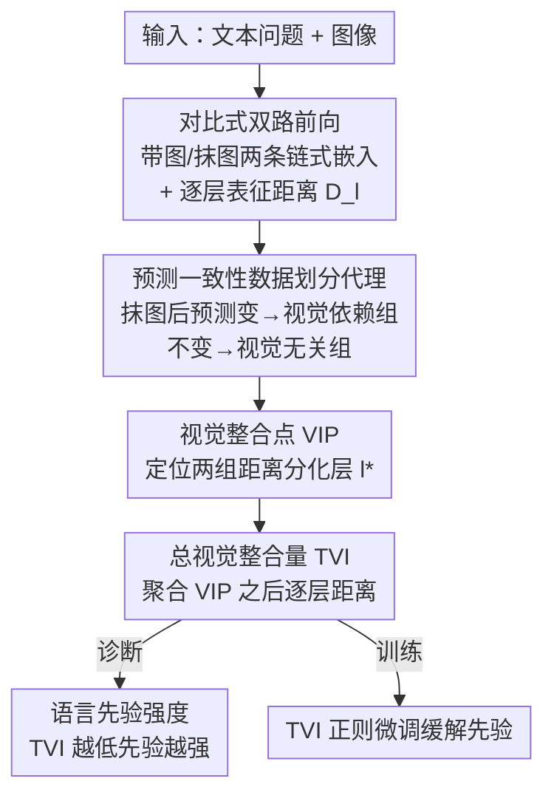

# Understanding Language Prior of LVLMs by Contrasting Chain-of-Embedding

**会议**: ICLR 2026  
**arXiv**: [2509.23050](https://arxiv.org/abs/2509.23050)  
**代码**: 无  
**领域**: 对话系统  
**关键词**: 语言先验, 视觉整合点, 大视觉语言模型, 表征分析, 可解释性

## 一句话总结

通过对比有/无视觉输入的逐层隐藏表征（chain-of-embedding），发现LVLM中存在一个"视觉整合点"(VIP)层，并据此提出Total Visual Integration (TVI)指标来量化语言先验的强度。

## 研究背景与动机

大视觉语言模型（LVLM）在多模态任务中表现优异，但经常过度依赖语言先验（Language Prior, LP），即预训练中记忆的文本统计模式，而忽视实际视觉证据。例如当图片中展示一根绿色香蕉时，模型可能仍回答"黄色"。

现有LP分析方法主要依赖输入-输出探测（probing），存在两大不足：（1）忽略了模型内部丰富的隐层表征信息；（2）无法揭示LP在模型哪一层开始干扰视觉整合。本文提出从**内部表征动态**的角度分析LP，通过对比chain-of-embedding来定位视觉信息开始真正影响推理的关键层。

## 方法详解

### 整体框架

这篇论文想搞清楚 LVLM 到底在哪一层、用了多少视觉信息，从而量化它对语言先验的依赖。核心做法只有一招：把**同一个文本问题分别喂给模型两次**——一次带图、一次把图抹掉，然后逐层对比两条隐藏表征轨迹（chain-of-embedding）的差异。给定输入 $(x_v, x_t)$，记带图轨迹为 $Z_{\text{vis}}^l = f_l(X_v, X_t)$、盲看轨迹为 $Z_{\text{blind}}^l = f_l(\varnothing, X_t)$，二者在第 $l$ 层最后一个 token 嵌入上的距离 $\mathbf{D}_l$ 就刻画了视觉信息在这一层产生了多大扰动。在此基础上，先用一个轻量代理把样本切成视觉依赖组 $\mathcal{D}_{VT}$ 与视觉无关组 $\mathcal{D}_T$，再看两组的逐层距离从哪一层开始分化以定位"视觉整合点"，最后把该层之后的距离聚合成一个标量来量化语言先验的强弱；这个标量还能反过来当训练正则项缓解语言先验。

### 关键设计

**1. 预测一致性数据划分代理：在没有标注的情况下切出视觉依赖与无关两组**

要判断视觉信息从哪一层起作用，前提是手里得有"视觉依赖"和"视觉无关"两类样本作对照，但现成数据集并不标注一道题到底依不依赖图。作者用一个轻量代理绕开标注：若抹掉图后预测发生变化，即 $F_\theta(x_v, x_t) \neq F_\theta(\varnothing, x_t)$，就把样本归入 $\mathcal{D}_{VT}$，否则归入 $\mathcal{D}_T$。逐层距离默认用余弦距离度量——消融显示余弦与 L2 都有效，而把表征先经 logit-lens 投影到输出空间再算 KL/JS 散度则会失效，说明区分视觉整合的信号主要藏在隐空间的方向上、而非输出分布里。

**2. 视觉整合点 VIP：定位视觉信息从哪一层开始真正起作用**

直接看整条轨迹的距离很难判断哪些扰动是有意义的视觉整合、哪些只是通用计算噪声，因为浅层无论有图无图都在做相似的语法/语义编码，视觉特征只是被"看见"还没被"用上"。作者发现存在一个关键层 $l^*$，从该层往后，视觉依赖样本与视觉无关样本的表征距离开始稳定分化，形式化为对所有 $l \geq l^*$ 都满足 $\mathbf{D}_l(\mathcal{P}_{VT}) - \mathbf{D}_l(\mathcal{P}_T) > \tau$。这意味着 VIP 之前模型在做与视觉无关的通用信息处理，VIP 之后才开始把视觉证据用于任务特定推理。最关键的观察是：VIP 的位置在不同数据集上几乎一致，说明它是模型自身的固有属性而非数据偶然，但不同模型的 VIP 落点不同（实验中通常在约 60% 深度处、与模型规模无关），这就为后续只在"有效层段"上度量视觉整合提供了依据。

**3. 总视觉整合量 TVI：把 VIP 之后的距离聚合成语言先验强度的标量**

有了 VIP，就只需关注它之后那些真正承载视觉整合的层，把这一段的逐层距离平均起来即可得到一个可比较的指标：$\text{TVI}(l^*; x, F_\theta) = \frac{1}{L - l^* + 1} \sum_{l=l^*}^{L} d(z_{\text{vis}}^l, z_{\text{blind}}^l)$。TVI 越高，说明带图与盲看的轨迹分得越开、视觉信息被利用得越充分、语言先验越弱；TVI 越低，则说明加不加图模型几乎没变化、仍被文本统计模式主导、语言先验越强（因此 TVI 与语言先验是反向关系）。这样原本只能靠输入-输出探测间接推断的"先验依赖"，被压成了一个可直接和正确率对照的连续量，实验中它与正确率的 Spearman 相关在 post-VIP 段可达 0.72，远高于 pre-VIP 段。

### 损失函数 / 训练策略

TVI 不止是分析工具，还能反过来当训练正则项推高视觉整合。作者在 LLaVA 指令微调目标里加一项把 TVI 顶上去的奖励：

$$\mathcal{L}(x, y; \theta) = -\log F_\theta(y|x) - \lambda \cdot \text{TVI}(l^*; x, F_\theta)$$

取 $\lambda = 0.03$，在标准的下一 token 预测损失之外鼓励模型让带图与盲看轨迹拉得更开、即更强地整合视觉证据，从而在不改架构的前提下缓解语言先验。

## 实验关键数据

### 主实验

| 模型 × 数据集 | TVI与正确率的Spearman相关 | p值 |
|--------------|-------------------------|-----|
| Qwen2.5-VL-7B (post-VIP) | 0.7241 | <0.001 |
| Gemma3-4B (post-VIP) | 0.7174 | <0.001 |
| Qwen2.5-VL-7B (pre-VIP) | 0.1489 | 0.002 |
| Gemma3-4B (pre-VIP) | 0.4659 | <0.001 |

| 指标 | Qwen2.5-VL-7B VLind | Qwen2.5-VL-7B ViLP | InternVL-3-8B VLind | InternVL-3-8B ViLP |
|------|---------------------|---------------------|---------------------|--------------------|
| TVI | **0.7155** | **0.6335** | **0.6727** | **0.5709** |
| Visual Attention | 0.0871 | -0.0364 | 0.4967 | 0.0746 |
| Output Divergence | 0.2978 | 0.5084 | 0.1627 | 0.5615 |

### 消融实验

| 配置 | VLind相关 | ViLP相关 | 说明 |
|------|----------|---------|------|
| Cosine Distance | 0.7155 | 0.6335 | 默认，表现最佳 |
| L2 Distance | 0.7123 | 0.6578 | 接近，仍有效 |
| KL Divergence (logit-lens) | -0.1693 | 0.2901 | 投影到输出空间后失效 |
| JS Divergence (logit-lens) | -0.2261 | 0.2942 | 同上 |

| TVI正则化 | Perception | Reasoning |
|-----------|------------|-----------|
| LLaVA-v1.5 | 1369.75 | 298.21 |
| LLaVA-v1.5 w/ TVI | **1400.44** | **321.43** |

### 关键发现

- VIP在10个LVLM和6个数据集的60种组合中均一致出现
- VIP通常出现在模型约60%深度处，与模型规模无关
- 大模型（Gemma-3-27B）归一化TVI更高，说明对视觉信息利用更强
- 强LP数据集（ViLP）比弱LP数据集（MMBench）TVI显著更低
- 介入实验：使用PAI注意力矫正后，TVI从0.038升至0.144，准确率从50%升至52.33%

## 亮点与洞察

- 首次从模型内部表征动态角度系统分析LVLM的语言先验，比输入-输出探测更精细
- VIP作为模型固有属性的发现具有重要意义，说明视觉整合在模型架构中有固定的"起点"
- TVI在所有模型和数据集上一致优于visual attention和output divergence两种代理指标
- 理论分析将表征散度与KL散度联系起来，提供了信息论解释

## 局限与展望

- 需要白盒访问模型内部状态，无法应用于闭源API
- VIP的选取依赖人工设定阈值 $\tau$（虽然附录给出了自动选择方法）
- 仅分析语言先验，未考虑分布漂移等其他偏差
- TVI正则化实验仅在60K子集上进行，大规模验证待完善

## 相关工作与启发

- 与mechanistic interpretability相关，但聚焦于多模态整合而非单模态
- 可启发基于TVI的层级干预策略，如在VIP之后的层施加更强视觉约束
- 对LVLM幻觉缓解有直接指导意义：低TVI样本可能需要额外视觉注意力矫正

## 评分

- 新颖性: ⭐⭐⭐⭐⭐ 从内部表征角度分析语言先验的全新视角，VIP和TVI概念原创性强
- 实验充分度: ⭐⭐⭐⭐⭐ 10个模型×6个数据集=60种设置，消融全面，含介入验证和理论分析
- 写作质量: ⭐⭐⭐⭐ 论述清晰，公式推导严谨，图表信息丰富
- 价值: ⭐⭐⭐⭐ 为理解和改进LVLM提供了实用分析工具，TVI正则化展示了实际应用潜力

<!-- RELATED:START -->

## 相关论文

- [\[NeurIPS 2025\] Bridging Human and LLM Judgments: Understanding and Narrowing the Gap](../../NeurIPS2025/dialogue/bridging_human_and_llm_judgments_understanding_and_narrowing_the_gap.md)
- [\[ACL 2026\] LOCKET: Robust Feature-Locking Technique for Language Models](../../ACL2026/dialogue/locket_robust_feature-locking_technique_for_language_models.md)
- [\[AAAI 2026\] Auto-PRE: An Automatic and Cost-Efficient Peer-Review Framework for Language Generation Evaluation](../../AAAI2026/dialogue/auto-pre_an_automatic_and_cost-efficient_peer-review_framework_for_language_gene.md)
- [\[NeurIPS 2025\] Less is More: Local Intrinsic Dimensions of Contextual Language Models](../../NeurIPS2025/dialogue/less_is_more_local_intrinsic_dimensions_of_contextual_language_models.md)
- [\[ICML 2025\] Position: Uncertainty Quantification Needs Reassessment for Large-language Model Agents](../../ICML2025/dialogue/position_uncertainty_quantification_needs_reassessment_for_large-language_model_.md)

<!-- RELATED:END -->
