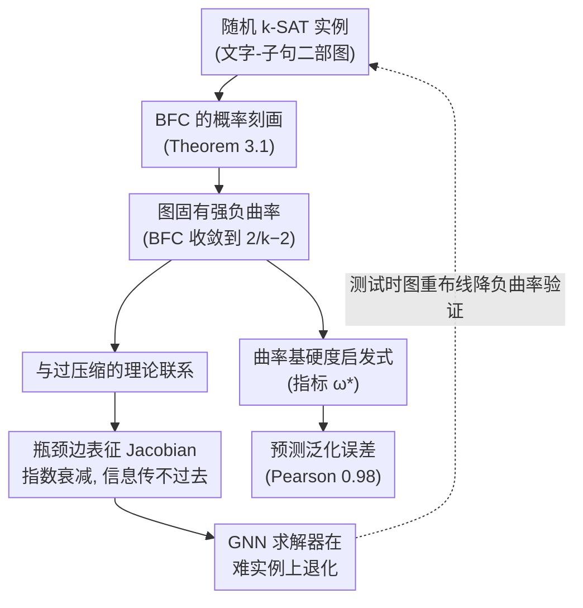

# A Geometric Perspective on the Difficulties of Learning GNN-based SAT Solvers

**会议**: ICLR 2026  
**arXiv**: [2508.21513](https://arxiv.org/abs/2508.21513)  
**代码**: 无  
**领域**: 图神经网络 / 理论  
**关键词**: GNN, SAT求解器, Ricci曲率, 过压缩, 图几何  

## 一句话总结
从图 Ricci 曲率的几何视角证明随机 k-SAT 问题的二部图表示具有固有的负曲率，且曲率随问题难度增加而下降，建立了 GNN 过压缩 (oversquashing) 与 SAT 求解困难之间的理论联系，并通过测试时图重布线验证了该理论。

## 研究背景与动机

**领域现状**：GNN 作为可学习的 SAT 求解器，通过在逻辑公式的二部图表示上做消息传递来求解布尔可满足性问题。

**现有痛点**：GNN 求解器在更难、约束更多的 SAT 实例上性能急剧退化（如 $k$ 值增大时），但缺乏对这种退化的理论解释。

**核心矛盾**：SAT 问题的难度与长程依赖密切相关（远距离变量之间的约束关系），而 GNN 的消息传递机制在处理长程依赖时受限于过压缩现象——来自指数增长邻域的信息必须压缩到固定维度的嵌入中。

**本文目标** 从几何角度理论解释为什么 GNN-based SAT 求解器在困难实例上表现差。

**切入角度**：利用 Balanced Forman Curvature (BFC) 作为图几何工具，建立 SAT 问题难度 → 图曲率 → GNN 过压缩之间的理论链条。

**核心 idea**：随机 k-SAT 二部图的 BFC 在困难极限 ($\alpha \to \infty$) 下以概率收敛到 $2/k - 2$（强负曲率），这直接导致 GNN 过压缩，是求解器性能退化的几何根因。

## 方法详解

### 整体框架
这篇论文要回答一个观察到的现象：把布尔公式写成"文字-子句"二部图、再让 GNN 在上面做消息传递来求解 SAT，为什么实例一变难（约束变多、$k$ 变大）求解器就垮？作者不去改模型，而是从图的几何出发给出一条解释链：先用随机图理论精确刻画这种二部图的 Balanced Forman Curvature（BFC，一种基于边端点度数与四环结构的离散 Ricci 曲率）随难度怎么变，再把这个曲率结果接到已有的 GNN 过压缩理论上，最后用测试时图重布线和泛化误差预测两组实验反过来验证"负曲率确实是性能退化的几何根因"。整条链路是：SAT 难度 → 图的强负曲率 → 消息传递过压缩 → 求解器在难实例上退化。

### 关键设计

**1. BFC 的概率刻画：把"图有多负"算成一个随难度变化的解析量**

要论证几何是元凶，第一步得说清楚随机 k-SAT 二部图的曲率到底长什么样。作者之所以选 BFC，是因为它完全由一条边两个端点的度数和周围的四环拓扑决定，可以解析计算，而且前人已经证明它和 GNN 过压缩直接挂钩——这让它成为连接 SAT 难度和过压缩的天然桥梁。把随机 k-SAT 建模成 Erdős-Rényi 型过程后，文字节点的度数服从 Poisson 分布 $\lambda = \alpha k/2$（$\alpha$ 是子句密度，衡量约束的拥挤程度）。在这个模型上作者证明了三件事：当 $\alpha \to 0$ 时 BFC $\to 0$，即简单问题对应近乎平坦的图；当 $\alpha \to \infty$ 时 BFC 的下界趋向 $2/k - 2$；更强的是 BFC 本身也以概率收敛到 $2/k - 2$（Theorem 3.1），这一步的难点在于要分析四环结构在极限下的行为。结论很直接——问题越难，图越负曲，而且 $k$ 越大这个极限值越靠近 $-2$。

**2. 与过压缩的理论联系：把负曲率翻译成"信息传不过去"**

光证明图很负还不够，得说明这为什么会伤害 GNN。这里作者把第一步的曲率结果接到 Topping 等人关于过压缩的定理上：当某条边的曲率 $\kappa(i,j) \leq -2 + \delta$（对任意小的 $\delta > 0$），且消息传递函数的梯度有界时，这条边 $i \sim j$ 附近节点表征的 Jacobian 会指数衰减——也就是说远处节点的信息在传播中被压扁、几乎无法影响彼此。而 Theorem 3.1 恰好保证：对足够大的 $k$ 或 $\alpha$，图里一定存在这种高负曲率的瓶颈边。两步拼起来就闭合了"SAT 难度 → 负曲率 → 过压缩 → 性能退化"的完整因果链，第一次给"难 SAT 实例上 GNN 学不好"一个几何层面的理论解释。

**3. 曲率基硬度启发式：用曲率而非密度来预测一个数据集有多难学**

传统上判断 SAT 难度只看子句密度 $\alpha$，但这并不可靠——工业类的 CA 数据集 $\alpha$ 很大，本该极难，可它的社区结构让曲率没那么负，于是 GNN 反而没那么吃力。作者据此提出两个基于 BFC 的硬度指标：$\omega(G) = -\mathbb{E}[\kappa(i,j)] \cdot \mathbb{E}[\alpha]$ 把平均负曲率和密度乘在一起综合考量；$\omega^*(G) = \omega(G) / \mathbb{V}[\kappa(i,j)]$ 再除以曲率的方差，进一步引入"浓度"——曲率分布越集中（瓶颈越普遍而非个别），问题越难。实测上 $\omega^*$ 与 GNN 泛化误差的 Pearson 相关系数高达 0.98，远超只看 $\alpha$ 的 0.32，说明曲率维度确实捕捉到了 $\alpha$ 解释不了的学习困难。

### 损失函数 / 训练策略
实验沿用标准的 GNN 求解器训练范式（NeuroSAT 与 GCN），训练 100 epoch，AdamW 优化器。本文重心不在训练技巧而在理论刻画与几何验证，因此没有改动损失或引入额外训练机制。

## 实验关键数据

### 主实验

**测试时图重布线效果 (减少负曲率后的准确率提升):**

| 数据集 | NeuroSAT 原始 | NeuroSAT 重布线 | GCN 原始 | GCN 重布线 |
|--------|-------------|-------------|---------|-----------|
| 3-SAT | 0.690 | **0.820** (+0.130) | 0.510 | **0.626** (+0.116) |
| 4-SAT | 0.436 | **0.686** (+0.250) | 0.180 | **0.374** (+0.194) |
| SR (混合k) | 0.734 | **0.902** (+0.168) | 0.470 | **0.696** (+0.226) |
| CA (工业类) | 0.746 | **0.828** (+0.082) | 0.650 | **0.670** (+0.020) |

### 消融实验

**硬度启发式与泛化误差的相关性:**

| 启发式 | 与泛化误差的 Pearson 相关系数 |
|--------|-------------------------|
| $\bar{\alpha}$ (平均子句密度) | 0.32 |
| $\bar{\omega}$ (曲率×密度) | 0.86 |
| $\bar{\omega^*}$ (含浓度) | **0.98** |

### 关键发现
- BFC 均值随 $\alpha$ 单调下降，在动力学转变阈值 $\alpha_d \approx 3.927$ 附近开始强烈集中
- 4-SAT 问题的重布线改善幅度 (+0.250) 远大于 3-SAT (+0.130)，验证了 $k$ 越大曲率越负、过压缩越严重的理论预测
- CA 数据集 $\alpha$ 很大 (9.73) 但改善很小 (+0.082)，因其社区结构降低了有效瓶颈——曲率比随机图更不负
- 简单的曲率感知 GNN 处理指标**不能**一致改善性能（BFC 在困难区间浓度太高），说明需要更根本的架构变革

## 亮点与洞察
- **双重困难的揭示**：GNN-based SAT 求解器面临两种独立的困难——SAT 的算法计算困难 + 图表征的过压缩学习困难。后者是先前未被理论解释的，本文填补了这个空白
- **$k$ 和 $\alpha$ 的交互效应**：较大的 $k$ 使得即使在"简单"的 $\alpha$ 设置下也会产生严重负曲率，意味着过压缩可能在算法困难之前就已限制了 GNN 的性能
- **重布线实验的说服力**：不重训模型，仅在测试时减少负曲率即获得大幅提升，是因果论证（而非仅相关性）的有力证据
- **递归机制的几何解释**：NeuroSAT 的递归消息传递比 GCN 好得多，文章指出递归已被证明能缓解过压缩，这为现有架构设计提供了理论后见之明

## 局限与展望
- 仅分析了随机 k-SAT，真实工业 SAT 实例的图结构可能有本质不同（如社区结构）
- 证明的消息传递瓶颈仅提供了 BFC 作为先验的新认知，未带来更好的模型设计——简单的曲率感知 GNN 未能改善性能
- 理论分析限于热力学极限 ($N \to \infty$)，有限大小效应未充分讨论
- 未探索用曲率信息指导训练（如曲率加权损失）或采样策略

## 相关工作与启发
- **vs Topping et al. 2022**: 本文将其关于过压缩与负曲率的一般理论具体化到 SAT 二部图，提供了该理论在组合优化中的首个严格应用
- **vs NeuroSAT**: NeuroSAT 的递归设计恰好缓解了过压缩，本文提供了这一经验观察的几何理论解释
- **vs 统计物理 SAT 理论**: 传统用 $\alpha$ 的相变刻画 SAT 难度，本文增加了图曲率维度，捕获了 $\alpha$ 无法解释的学习困难

## 评分
- 新颖性: ⭐⭐⭐⭐⭐ 首次从图曲率角度理论刻画 GNN SAT 求解器的局限性，理论链条完整闭合
- 实验充分度: ⭐⭐⭐⭐ 理论验证、重布线消融和启发式评估覆盖全面，但缺乏大规模工业基准
- 写作质量: ⭐⭐⭐⭐⭐ 理论推导严谨清晰，从简单命题到主定理层层递进
- 价值: ⭐⭐⭐⭐ 为理解和改进神经组合求解器提供了新的几何视角，但尚未转化为实际的架构改进

<!-- RELATED:START -->

## 相关论文

- [\[ICML 2025\] Hyperbolic-PDE GNN: Spectral Graph Neural Networks in the Perspective of A System of Hyperbolic Partial Differential Equations](../../ICML2025/graph_learning/hyperbolic-pde_gnn_spectral_graph_neural_networks_in_the_perspective_of_a_system.md)
- [\[ICLR 2026\] Relatron: Automating Relational Machine Learning over Relational Databases](relatron_automating_relational_machine_learning_over_relational_databases.md)
- [\[ICLR 2026\] GRAPHITE: Graph Homophily Booster — Reimagining the Role of Discrete Features in Heterophilic Graph Learning](graph_homophily_booster_reimagining_the_role_of_discrete_features_in_heterophili.md)
- [\[NeurIPS 2025\] Geometric Imbalance in Semi-Supervised Node Classification](../../NeurIPS2025/graph_learning/geometric_imbalance_in_semi-supervised_node_classification.md)
- [\[ICML 2026\] Structure-Centric Graph Foundation Model via Geometric Bases](../../ICML2026/graph_learning/structure-centric_graph_foundation_model_via_geometric_bases.md)

<!-- RELATED:END -->
