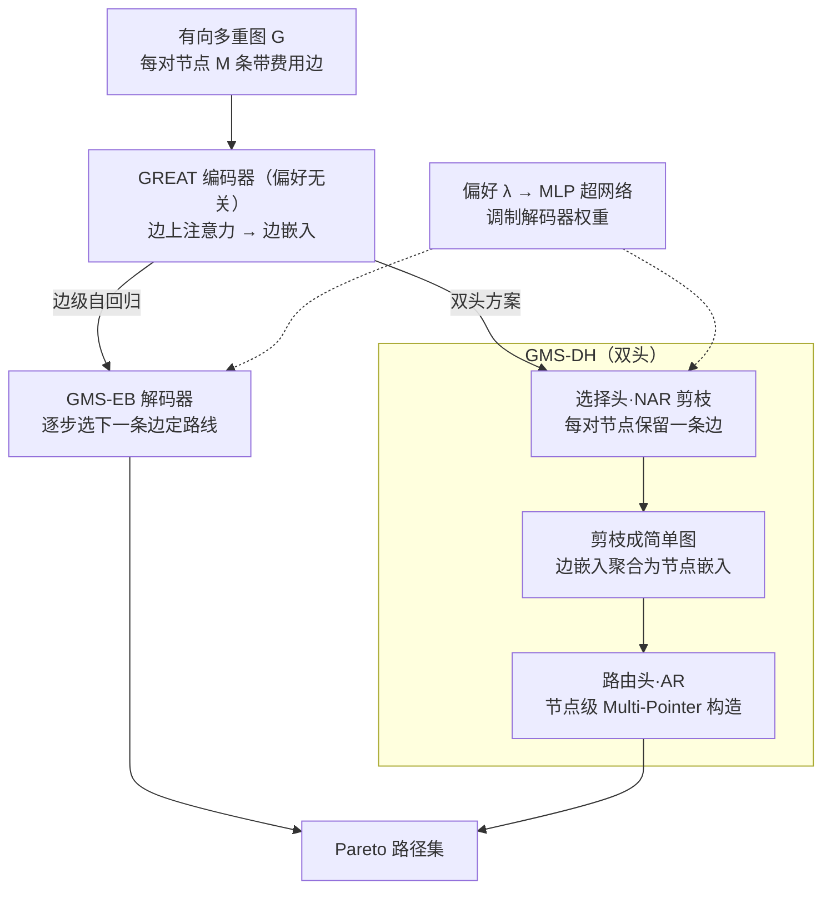

# Beyond Simple Graphs: Neural Multi-Objective Routing on Multigraphs

**会议**: ICLR 2026  
**arXiv**: [2506.22095](https://arxiv.org/abs/2506.22095)  
**代码**: [https://github.com/filiprydin/GMS](https://github.com/filiprydin/GMS)  
**领域**: 组合优化 / 图神经网络 / 车辆路径规划  
**关键词**: 多目标路由, 多重图, 图神经网络, 自回归构造, Pareto优化

## 一句话总结
首次提出针对多重图（multigraph）的神经组合优化路由方法 GMS，包含直接在多重图上边级自回归构造的 GMS-EB 和先学习剪枝再节点级路由的双头 GMS-DH 两个变体，在非对称多目标 TSP 和 CVRP 上实现了接近精确求解器 LKH 的性能且速度快数十倍。

## 研究背景与动机

**领域现状**：近年来，基于深度学习的组合优化求解器在车辆路径问题（VRP）上取得了显著进展，已有方法（Kool et al., POMO, MatNet 等）在 TSP 和 CVRP 上逼近甚至超越经典启发式。然而，所有现有神经求解器都假设问题定义在**简单图**上——即每对节点之间最多只有一条边。

**现有痛点**：现实世界中，多重图（multigraph）表示更加准确——同一对节点间可能有多条不同属性的边（如不同路径的行驶时间和距离不同）。运筹学研究已证明多重图建模可带来 5-10% 的成本优化，但现有神经方法无法处理多重图，原因有二：(i) Transformer 编码器不适合编码多重图结构；(ii) 解码策略需要同时选择节点顺序**和**边，现有方法只选节点。

**核心矛盾**：多重图上的路由问题比简单图复杂得多——不仅要决定访问节点的顺序，还要在每对节点间选择哪条边。在多目标设置下，不同边在不同目标上各有优劣，无法先验地确定最优边选择。

**本文目标** 如何设计能处理多重图输入的神经路由求解器，同时支持多目标优化？

**切入角度**：作者提出两种互补策略——(1) 直接在多重图上做边级自回归构造；(2) 先用学习的剪枝策略将多重图简化为简单图，再做节点级路由。两者都使用图边注意力网络（GREAT）处理多重图结构。

**核心 idea**：用GNN编码多重图边嵌入，通过边级自回归或"非自回归剪枝+自回归路由"的双头解码实现多目标多重图路由。

## 方法详解

### 整体框架
输入是一个有向多重图 $G$，每对节点间有 $M$ 条平行边、每条边带一个多维费用向量；目标是找出 Pareto 前沿——对多个目标都不被支配的一族路径。论文先用 Chebyshev 标量化把多目标问题拆成一族单目标子问题，每个子问题对应一个偏好向量 $\lambda$，于是"求整条前沿"变成"在不同 $\lambda$ 下各求一条最优路线"。整个 GMS（GNN-based Multigraph Solver）的骨架是：多重图先经一个偏好无关的 **GREAT 编码器**得到边嵌入，再分叉成两种互补的解码策略——**GMS-EB** 直接在多重图上逐边自回归地把路线"长"出来；**GMS-DH** 则先用一个选择头把多重图非自回归地剪成简单图，再用路由头在简单图上做节点级自回归路由。偏好 $\lambda$ 始终不进编码器，而是通过一个 MLP 超网络去调制解码器权重，因此一个实例只需编码一次就能服务所有偏好。

### 关键设计

**1. GREAT 编码器：在边上做注意力，让平行边各有各的身份**

标准 Transformer 把信息挂在节点上，遇到同一对节点间的多条平行边就糊成一团，根本区分不开——这正是已有神经求解器无法处理多重图的根因。GREAT 的做法是直接在边上操作：每层先把入边和出边分别加权聚合到节点，得到临时节点表示 $x_i = (\sum_{l \in E^+(i)} \alpha'_{il} W'_1 e_l \,\|\, \sum_{l' \in E^-(i)} \alpha''_{il'} W''_1 e_{l'})$，其中 $\alpha'$、$\alpha''$ 是入边、出边各自的注意力分数；再把一条边首尾两个节点的表示拼起来更新这条边的嵌入 $e'_l = W_2(x_{\text{start}(l)} \,\|\, x_{\text{end}(l)})$。关键是残差连接——它让每条平行边即使共享首尾节点，也能保留自己独立的费用特征，不被聚合抹平。两个 GMS 变体都以它为共享骨干，输出的是边嵌入而非节点嵌入，从而天然支持"既选节点又选边"的解码需求。

**2. GMS-EB：直接在多重图上一条边一条边地构造路径**

普通节点级构造每步只预测"下一个节点"，但多重图还需要在两节点间选"走哪条边"，因此不够用。最直接的对策是让解码器每步选的就是"下一条边"（隐式地也就定了下一个节点）：编码器输出边嵌入后，一个边级 Multi-Pointer 解码器逐步采样 $\pi_t$，概率为 $p_{\theta(\lambda)}(\pi_t \mid \pi_{1:t-1}, s)$，整条路线的概率即各步连乘。偏好 $\lambda$ 不进编码器，而是经 MLP 超网络生成解码器权重 $\theta_{\text{dec}}(\lambda) = \text{MLP}(\lambda)$，编码一次即可服务所有偏好。这样选边与定序端到端一起学，结构简单、表达力强；代价是要为每条候选边算分，内存复杂度升到 $\mathcal{O}(MN^4)$（节点级只需 $\mathcal{O}(N^3)$），规模一大就吃不消。

**3. GMS-DH：把"选边"和"排路线"拆成两个头，换计算效率**

为绕开 EB 的复杂度瓶颈，DH 把任务切成前后衔接的两个头。第一阶段是**选择头（非自回归剪枝）**：在最后一层 GREAT 之前插入一个解码器，用中间层的边嵌入对每对节点 $(i,j)$ 独立地保留一条边，概率 $q_{\tilde{\theta}(\lambda)}(l \mid i, j, s)$，等于一次性把多重图压成一张简单图——因为对所有节点对并行决策、不依赖部分路线，所以是非自回归的。第二阶段是**路由头（自回归构造）**：把被选中边的嵌入按式回灌、聚合成节点嵌入，再过几层标准 Transformer 增强表达，最后用偏好条件化的 Multi-Pointer 解码器在简单图上做节点级路由 $p_{\theta(\lambda)}(\pi_t \mid \pi_{1:t-1}, s, \mathcal{E})$。两个头的权重都由 MLP 超网络从 $\lambda$ 生成，而前 $L_1-1$ 层编码器与偏好无关、整个实例只跑一次。这种"NAR 剪枝 + AR 路由 + 单一联合编码器"的组合是本文为多重图专门设计的新结构，也正是 DH 比 EB 快数倍的来源：编码只算一遍，路由又落在更省的简单图上。其代价是边选择必须在 roll-out 前定死，无法再依赖部分路线给出的上下文。

### 损失函数 / 训练策略

- **多目标 REINFORCE**：GMS-EB 使用标准 POMO 框架，奖励为负 Chebyshev 标量化代价 $R_\lambda(\pi) = -\max_i\{\lambda_i|f_i(\pi) - z_i^*|\}$
- **GMS-DH 双头训练**：选择头和路由头分别有独立的奖励和基线。路由头奖励为 $R^{(2)}_\lambda(\pi) = R_\lambda(\pi)$；选择头奖励用路由头的 $K_2$ 个采样近似最优路径 $R^{(1)}_\lambda(\mathcal{E}) \approx \max_{k=1,...,K_2} R_\lambda(\pi_k)$
- **课程学习（Curriculum Learning）**：从小图开始训练，逐步增大问题规模。GMS-DH 先在简单图上预训练路由头，确保选择头训练初期近似准确

## 实验关键数据

### 主实验
在 MOTSP、MOCVRP（简单图）和 MGMOTSP、MGMOCVRP（多重图）上评估，使用 TMAT/XASY（简单图）和 FLEX/FIX（多重图）分布，规模 50/100 节点，指标为归一化超体积（HV）。

| 问题 | 方法 | HV (50节点) | Gap | HV (100节点) | Gap | 推理时间 |
|------|------|------------|-----|-------------|-----|---------|
| MOTSP-TMAT | LKH (精确) | 0.58 | 0.00% | 0.63 | 0.00% | 6-29m |
| MOTSP-TMAT | MBM (aug) | 0.52 | 10.2% | 0.58 | 9.17% | 27s-2.4m |
| MOTSP-TMAT | **GMS-EB (aug)** | **0.57** | **1.14%** | **0.63** | **1.13%** | 3.3m-29m |
| MOTSP-TMAT | **GMS-DH (aug)** | **0.57** | **1.76%** | **0.62** | **2.19%** | 28s-2.6m |
| MOCVRP-XASY | GMS-EB (aug) | 0.75 | 0.00% | 0.80 | 0.00% | 4.9m-48m |
| MGMOTSP-FLEX2 | GMS-EB (aug) | 0.89 | 1.50% | 0.93 | 1.47% | 7.5m-1.2h |
| MGMOTSP-FLEX2 | GMS-DH (aug) | 0.89 | 1.45% | 0.93 | 1.61% | 1.5m-6.6m |
| MGMOTSP-FLEX2 | GMS-DH PP | 0.77 | 14.24% | 0.83 | 12.53% | 33s-2.3m |

### 消融实验

| 配置 | MGMOTSP HV (50) | 说明 |
|------|-----------------|------|
| GMS-DH (完整) | 0.89 (FLEX2) | 学习边选择+路由 |
| GMS-DH PP (预剪枝) | 0.77 (FLEX2) | 先按线性标量化剪枝，HV 下降 14% |
| GMS-DH Simple (简单剪枝) | 0.83 (FLEX2 MGMOTSPTW) | 用简单函数替代选择头，下降 7% |
| MBM (预剪枝) | 0.86-0.87 (FLEX2) | MatNet+预剪枝，性能不稳定 |

### 零样本泛化（200节点，训练时只见≤100）

| 问题 | 方法 | HV (200节点) | Gap |
|------|------|-------------|-----|
| MOTSP-TMAT | LKH | 0.67 | 0.00% |
| MOTSP-TMAT | GMS-EB | 0.66 | 1.86% |
| MOTSP-TMAT | GMS-DH | 0.65 | 3.59% |
| MGMOTSP-FLEX2 | GMS-EB | 0.95 | 1.74% |
| MGMOTSP-FLEX2 | GMS-DH | 0.95 | 2.27% |

### 关键发现
- GMS-EB 在所有问题上性能最优（接近LKH），但内存和时间开销更大
- GMS-DH 性能略低但推理速度快 5-10 倍，更适合大规模应用
- 预剪枝（GMS-DH PP）性能严重下降（10-15%），说明显式建模多重图结构至关重要
- 在 MGMOTSPTW（带时间窗的复杂问题）上，GMS-EB/DH 大幅超越所有基线，学习边选择 vs 简单剪枝的优势更加明显
- MOEA（进化算法）在所有设置下都显著弱于神经方法，尤其在100节点规模
- 零样本泛化到200节点时性能下降很小（HV gap < 4%）

## 亮点与洞察
- **NAR剪枝+AR路由的双头设计非常巧妙**：将多重图问题分解为两个互补任务，选择头只需运行一次（非自回归），路由头在简化后的简单图上高效运行。这种结构设计同时解决了表达能力和计算效率的矛盾
- **编码器偏好无关的设计**：GREAT 编码器不依赖偏好 $\lambda$，同一实例只需编码一次即可服务所有偏好的推理。MLP 超网络只调制解码器权重，极大减少了多偏好推理的计算量
- **预剪枝失败的反直觉发现**：即使对 MOTSP 有理论保证线性标量化下预剪枝不损失最优（Proposition 1），实际用预剪枝+GMS-DH 的性能仍严重下降。作者猜测预剪枝改变了数据分布，使模型难以建模

## 局限与展望
- GMS-EB 的 $\mathcal{O}(MN^4)$ 复杂度限制了对大规模问题的应用，作者本身也提到需要更可扩展的方案
- 实验中多重图最多只考虑了每对节点2条边（FLEX2/FIX2），更多平行边的场景未测试
- 只在双目标问题上做了主实验，三目标放在附录，更高维目标的扩展性未充分验证
- 训练需要大量随机生成实例（200 epoch × 100K 实例），训练成本较高
- 课程学习策略（先小图后大图）可能对不同问题分布的效果不一致

## 相关工作与启发
- **vs MatNet/POMO**：MatNet+MP（MBM）可以作为多重图的朴素扩展（先剪枝再求解），但在某些分布上表现不稳定（如 XASY100 MOCVRP 差 20%）。GMS 通过显式设计多重图架构获得更好的鲁棒性
- **vs LKH/HGS**：经典精确求解器性能最优但速度慢 10-100 倍。GMS 在 1-3% HV gap 内提供了实时可用的替代方案
- **vs MOEAs**：进化算法在这些问题上远不如神经方法（gap 10-60%），说明学习的归纳偏置远优于无引导搜索
- 双头 AR+NAR 的思路可以迁移到其他需要同时做离散选择和序列构造的组合优化问题

## 评分
- 新颖性: ⭐⭐⭐⭐ 首次将神经组合优化扩展到多重图，边级自回归和双头解码都是新设计
- 实验充分度: ⭐⭐⭐⭐⭐ 多问题（TSP/CVRP/TSPTW）、多分布（TMAT/XASY/FLEX/FIX）、多规模（50/100/200），消融和泛化全面
- 写作质量: ⭐⭐⭐⭐ 结构清晰，Proposition 1 的理论分析为方法设计提供了动机
- 价值: ⭐⭐⭐⭐ 填补了神经路由在多重图上的空白，对物流/交通领域有实用价值

<!-- RELATED:START -->

## 相关论文

- [\[ICML 2026\] Beyond Model Base Retrieval: Weaving Knowledge to Master Fine-grained Neural Network Design](../../ICML2026/graph_learning/beyond_model_base_retrieval_weaving_knowledge_to_master_fine-grained_neural_netw.md)
- [\[AAAI 2026\] Beyond Fixed Depth: Adaptive Graph Neural Networks for Node Classification Under Varying Homophily](../../AAAI2026/graph_learning/beyond_fixed_depth_adaptive_graph_neural_networks_for_node_classification_under_.md)
- [\[ICLR 2026\] Towards Improved Sentence Representations using Token Graphs](towards_improved_sentence_representations_using_token_graphs.md)
- [\[ICML 2025\] Beyond Message Passing: Neural Graph Pattern Machine](../../ICML2025/graph_learning/beyond_message_passing_neural_graph_pattern_machine.md)
- [\[ICLR 2026\] Pairwise is Not Enough: Hypergraph Neural Networks for Multi-Agent Pathfinding](pairwise_is_not_enough_hypergraph_neural_networks_for_multi-agent_pathfinding.md)

<!-- RELATED:END -->
