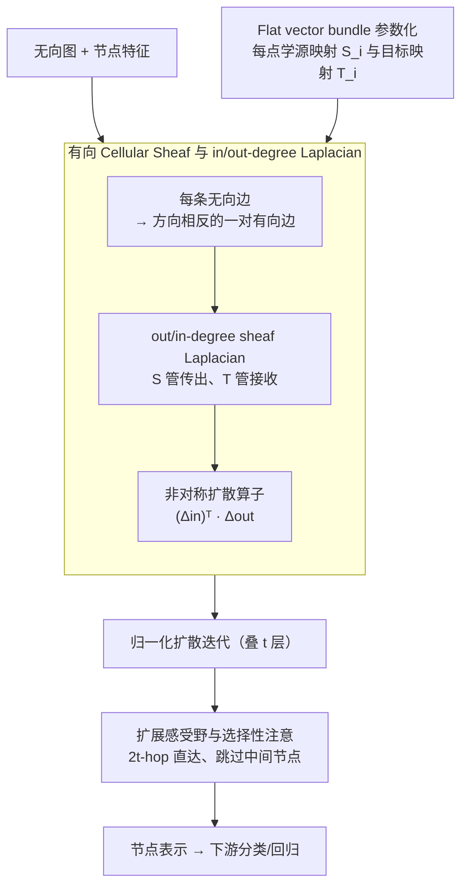

# Cooperative Sheaf Neural Networks

**会议**: ICLR 2026  
**arXiv**: [2507.00647](https://arxiv.org/abs/2507.00647)  
**代码**: 无  
**领域**: 图学习 / 图神经网络  
**关键词**: Sheaf Neural Networks, 协作行为, 有向图, 过度挤压, 异配图

## 一句话总结

提出在有向图上定义 cellular sheaf 的 in/out-degree Laplacian，构建 Cooperative Sheaf Neural Network (CSNN)，使节点能独立选择信息传播/接收策略，从而同时缓解过度挤压(oversquashing)和处理异配(heterophilic)任务。

## 研究背景与动机

**领域现状**：Sheaf Neural Networks (SNNs) 通过在图上定义 cellular sheaf 来泛化 GNN 的扩散机制，已被证明能处理异配任务并缓解过平滑(oversmoothing)。

**现有痛点**：经典 SNNs 基于无向图，节点无法独立选择"仅传播信息"或"仅接收信息"。若某节点 $i$ 要屏蔽所有邻居的输入，必须将所有关联的 restriction map 置零 $\mathcal{F}_{i \unlhd e}=0$，这同时也阻断了 $i$ 向外传播信息的能力。

**核心矛盾**：SNNs 的 sheaf Laplacian 结构使得 PROPAGATE 蕴含 LISTEN，无法实现四种协作行为(STANDARD/LISTEN/PROPAGATE/ISOLATE)的完全解耦。

**本文目标** 让 SNN 中的节点能独立决定是否传播和/或接收信息，实现真正的协作行为，以更好地缓解 oversquashing。

**切入角度**：将无向边拆分为一对有向边，在有向图上定义 cellular sheaf 及其 in/out-degree sheaf Laplacian。

**核心 idea**：通过有向图上的 sheaf Laplacian 分离源映射 $\mathbf{S}_i$ 和目标映射 $\mathbf{T}_i$，使每个节点可独立控制信息流入和流出方向。

## 方法详解

### 整体框架

CSNN 的核心改动是把输入无向图拆成有向图——每条无向边变成方向相反的一对有向边——再为每个节点 $i$ 学习一对 conformal 映射：源映射 $\mathbf{S}_i$ 管它往外传什么，目标映射 $\mathbf{T}_i$ 管它往里收什么。表示更新沿用 NSD 风格的归一化扩散迭代，但把扩散算子换成由 out-degree 和转置 in-degree 两个有向 sheaf Laplacian 组合而成的非对称算子，这样信息流入和流出就被两条独立的通道分开控制了。

### 关键设计

**1. 有向 Cellular Sheaf 与 in/out-degree Laplacian：把"传播"和"监听"解耦**

经典 SNN 建在无向图上，restriction map $\mathcal{F}_{i \unlhd e}$ 同时出现在节点 $i$ 的传入项和传出项里。论文的 Proposition 3.1 指出，若想让节点 $i$ 屏蔽所有邻居输入就必须令 $\mathcal{F}_{i \unlhd e}=0$，而这一步会连带把 $i$ 向外的传播也切断——PROPAGATE 与 LISTEN 在结构上被强行绑死，四种协作行为（STANDARD/LISTEN/PROPAGATE/ISOLATE）无法完全分离。把边拆成有向后，节点作为"源"和作为"目标"时用不同的 restriction map：out-degree sheaf Laplacian 写成 $L_{\mathcal{F}}^{\text{out}}(\mathbf{X})_i = \sum_{j \in N(i)} (\mathbf{S}_i^\top \mathbf{S}_i \mathbf{x}_i - \mathbf{T}_i^\top \mathbf{S}_j \mathbf{x}_j)$，in-degree 形式对称但由 $\mathbf{T}$ 控制接收端，最终扩散算子取 $(\Delta_\mathcal{F}^{\text{in}})^\top \Delta_\mathcal{F}^{\text{out}}$ 这一非对称组合。如此一来 $\mathbf{S}_i=0$（不传播）和 $\mathbf{T}_i=0$（不监听）可以各自单独设置，节点终于能独立选择传播策略。

**2. Flat vector bundle 参数化：把每边一个映射压成每点两个**

一般 cellular sheaf 每条边都要一组 restriction map，$m$ 条边就有 $2m$ 个矩阵要学，开销随边数线性膨胀。CSNN 改用 flat vector bundle：让节点 $i$ 对它的所有邻居 $j$ 共享同一对映射，$\mathcal{F}_{i \unlhd ij} = \mathbf{S}_i$、$\mathcal{F}_{i \unlhd ji} = \mathbf{T}_i$，于是整张图只需 $2n$ 个映射（$n$ 为节点数），参数量从 $O(m)$ 降到 $O(n)$。每个映射本身用 Householder 反射构造一个正交矩阵、再乘以一个可学习的正常数，从而保证是 conformal（保角缩放）映射，在压缩参数的同时维持了扩散算子的良好谱性质。

**3. 扩展感受野与选择性注意：每层够到 $2t$-hop 还能跳过中间点**

传统 GNN 叠 $t$ 层只能触达 $t$-hop 邻居，且信息沿路径被指数压缩，正是 oversquashing 的根源。论文证明在有向 sheaf 下，合理配置 $\mathbf{S}$ 与 $\mathbf{T}$ 可以让 $t$ 层 CSNN 的感受野扩到 $2t$-hop；更关键的是它能做"选择性注意"——通过调节这两组映射，使灵敏度 $\partial \mathbf{x}_i^{(t)} / \partial \mathbf{x}_j^{(0)}$ 对距离为 $t$ 的目标节点 $j$ 保持高值，同时对路径上的中间节点趋近零。信息因此可以"穿过"无关节点直达目标，不再沿途被稀释，这是它在长距离任务上能缓解 oversquashing 的直接原因。

## 实验关键数据

### 主实验

| 数据集 | 指标 | CSNN | 最优对比 | 提升 |
|--------|------|------|----------|------|
| roman-empire | Acc | 92.63 | BuNN 91.75 | +0.88 |
| minesweeper | AUROC | 99.07 | BuNN 98.99 | +0.08 |
| tolokers | AUROC | 85.45 | CO-GNN 84.84 | +0.61 |
| questions | AUROC | 79.31 | BuNN 78.75 | +0.56 |
| Wisconsin | Acc | 90.00 | O(d)-NSD 89.41 | +0.59 |

### 消融实验

| 配置 | NeighborsMatch 准确率 | 说明 |
|------|----------------------|------|
| CSNN (r=2~8) | 100% 全部深度 | 完美解决 oversquashing |
| BuNN (r≥7) | 71%→42% | r=7 开始退化 |
| NSD (r≥4) | 5% | 严重 oversquashing |
| GCN/GIN (r≥4) | 失败 | 无法处理长距离 |

### 关键发现

- CSNN 在 NeighborsMatch 所有树深度上保持 100% 准确率，显著优于所有 sheaf 和非 sheaf 基线
- 在 11 个节点分类数据集中 9 个取得最优，尤其在强异配数据集上表现突出
- 在 peptides-func 图分类任务上达到 73.38 AP，超过 BuNN (72.76)、GPS、SAN 等方法

## 亮点与洞察

- 从代数拓扑角度严格证明 SNNs 无法实现协作行为（Proposition 3.1），然后用有向 sheaf 优雅地解决
- Flat vector bundle 设计使参数量从 $O(m)$ 降到 $O(n)$，在理论优势之外还保证了计算效率
- 理论证明 CSNN 每层感受野为 $2t$-hop 而非传统 $t$-hop，为缓解 oversquashing 提供新思路

## 局限与展望

- 协作行为的选择通过连续参数隐式决定，未显式建模离散动作
- 在 amazon-ratings 等部分数据集上未取得最优，flat vector bundle 的简化可能牺牲了灵活性
- 仅在中等规模图上验证，大规模图（>100K 节点）的可扩展性有待评估

## 相关工作与启发

- **vs CO-GNN**: CO-GNN 使用离散 Gumbel-Softmax 动作网络选择协作模式，CSNN 通过连续参数自然实现，避免了训练不稳定和超参敏感问题
- **vs NSD**: NSD 基于无向 sheaf，CSNN 通过有向 sheaf 扩展了表达能力，在 NeighborsMatch 上表现远超 NSD
- **vs BuNN**: BuNN 也是 sheaf-based，但在 r≥7 的 oversquashing 测试中明显退化，CSNN 始终保持 100%

## 评分

- 新颖性: ⭐⭐⭐⭐ 有向 sheaf Laplacian 是全新数学构造，理论贡献扎实
- 实验充分度: ⭐⭐⭐⭐ 合成 + 11个节点分类 + 2个图分类，覆盖全面
- 写作质量: ⭐⭐⭐⭐ 定义-命题-证明结构清晰，数学严谨
- 价值: ⭐⭐⭐⭐ 为 sheaf-based GNN 提供了新的理论和实践方向

<!-- RELATED:START -->

## 相关论文

- [\[AAAI 2026\] Sheaf Graph Neural Networks via PAC-Bayes Spectral Optimization](../../AAAI2026/graph_learning/sheaf_graph_neural_networks_via_pac-bayes_spectral_optimization.md)
- [\[ICML 2026\] Deep Neural Sheaf Diffusion](../../ICML2026/graph_learning/deep_neural_sheaf_diffusion.md)
- [\[ICLR 2026\] Are We Measuring Oversmoothing in Graph Neural Networks Correctly?](are_we_measuring_oversmoothing_in_graph_neural_networks_correctly.md)
- [\[ICLR 2026\] LogicXGNN: Grounded Logical Rules for Explaining Graph Neural Networks](logicxgnn_grounded_logical_rules_for_explaining_graph_neural_networks.md)
- [\[ICML 2026\] Polynomial Neural Sheaf Diffusion: A Spectral Filtering Approach on Cellular Sheaves](../../ICML2026/graph_learning/polynomial_neural_sheaf_diffusion_a_spectral_filtering_approach_on_cellular_shea.md)

<!-- RELATED:END -->
