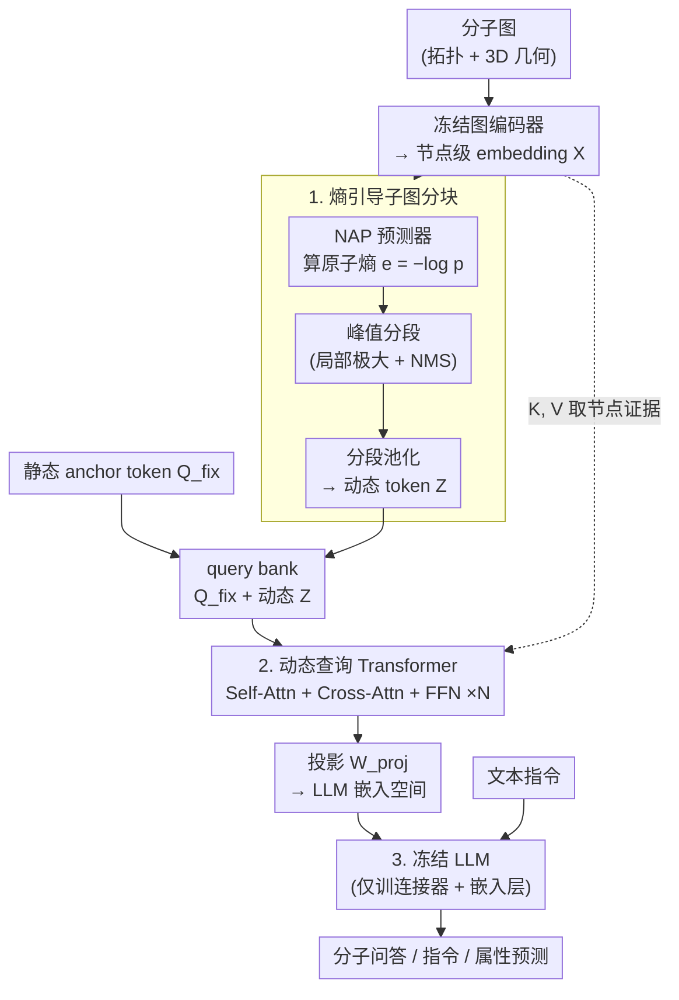

# Entropy-Guided Dynamic Tokens for Graph-LLM Alignment in Molecular Understanding

**会议**: ICLR 2026  
**arXiv**: [2602.02742](https://arxiv.org/abs/2602.02742)  
**代码**: 无  
**领域**: 图学习 / 分子理解  
**关键词**: Graph-LLM对齐, 动态Token, 分子图, Q-Former, 熵引导

## 一句话总结
提出 EDT-Former（Entropy-guided Dynamic Token Transformer），通过熵引导的动态token生成机制，在冻结图编码器和LLM之间建立高效对齐，无需微调LLM主干网络即在分子问答、分子指令和属性预测等多个基准上达到SOTA。

## 研究背景与动机
分子理解是科学发现（药物设计、材料发现等）的核心环节，而大语言模型（LLM）在处理分子图结构方面存在天然的困难——LLM擅长处理序列文本，但分子是图结构数据，包含原子连接关系、立体化学信息和子结构上下文。

现有的图-LLM桥接方案主要借鉴视觉-语言领域的Q-Former架构，使用固定长度的静态查询token来压缩图信息。但这种方案存在三个核心问题：

**静态token的信息损失**：固定长度的token序列无法根据分子复杂度自适应调整，简单分子可能被过度表示，复杂分子则信息不足。Q-Former最初为视觉任务设计，图结构数据的拓扑信息、立体化学特性无法被有效捕获

**忽略立体化学和子结构**：分子的三维构型和功能基团是理解化学性质的关键，但现有的固定token方法难以保留这些局部和全局特征

**昂贵的LLM微调**：大多数方法需要对LLM主干网络进行微调，计算成本高且泛化性受限

核心idea是：利用信息熵来自适应地确定每个分子需要多少个token以及这些token应关注分子的哪些部分，实现动态的、内容感知的图到文本表征转换。

## 方法详解

### 整体框架
EDT-Former 想解决的是：怎么把分子图喂给一个**完全冻结**的 LLM，又不丢掉立体化学和子结构信息。它在一个冻结的图编码器和一个冻结的 LLM 之间插入一个只训练连接器的桥，整条链路分三步走。图编码器先把分子图编成节点级 embedding；**熵引导子图分块**模块用一个轻量的"下一个原子预测器"在 SMILES 序列上算出每个原子的信息熵，按熵的局部峰值把分子切成若干信息密集的子结构补丁，每个补丁池化成一个**动态查询 token**——分子越复杂、信息越分散，切出的补丁和 token 就越多，反之越少；接着**动态查询 Transformer**把这些动态 token 和一组固定的静态 anchor token 拼成一个 query bank，用 self-attention 让两类 token 互相传递上下文、用 cross-attention 回到节点 embedding 取结构证据，再投影进 LLM 的嵌入空间；最后这串对齐好的 token 连同文本指令一起送进冻结 LLM 产生回答。整个训练只更新连接器和 LLM 的嵌入层，图编码器与 LLM 主干始终冻结。

### 关键设计

**1. 熵引导子图分块：让 token 数量和切分位置随分子复杂度自适应**

Q-Former 式方案用固定数量（如 8 个）的静态查询去压缩所有分子，小分子够用、大分子（如 50 个原子）就会把立体化学和功能基团压没，导致预测脆弱不可信，这是静态 token 的根本痛点。EDT-Former 改成由信息熵来驱动切分：先在大规模规范 SMILES 语料上预训练一个轻量的"下一个原子预测器"（Next-Atom Predictor, NAP，一个小 Transformer），它对原子序列建模 $p(a_{t+1}\mid a_{1:t})$；推理时把每个位置预测真实下一个原子的概率取负对数，得到逐原子的信息量 $e_t = -\log p_t$，熵高的位置意味着这里的化学环境更难预测、信息更密集。

切分不用阈值，而是找熵信号 $\{e_t\}$ 的**局部极大值**当分割点（在每个峰之后切一刀），并用非极大值抑制（最小间隔 $\Delta$）和峰显著度 $\gamma$ 去掉杂散小峰，得到一组动态段 $S_1,\dots,S_M$，每段对应一块连续的子结构。把每段内的节点 embedding 池化成一个动态 token，于是复杂分子自动切出更多段、得到更长的 token 序列，简单分子得到更短的序列——既避免小分子上的冗余计算，又保证大分子的子结构不被固定长度截断。

**2. 动态查询 Transformer：用静态 anchor 稳住全局、动态 token 补足局部**

光有动态 token 还不够，它们数量随分子变、彼此孤立，直接喂 LLM 会不稳定。EDT-Former 把 $M$ 个动态 token $Z$ 和 $k$ 个可学习的静态 anchor token $Q_{fix}$ 拼成一个 query bank $[Q_{fix}; Z]$，过 $L$ 层 Transformer：每层先用 self-attention 让 anchor 和动态 token 互相传递上下文（anchor 提供跨分子稳定的"模态锚"、动态 token 提供本分子的局部细节），再用 cross-attention 以 query bank 为 query、回到冻结编码器的节点 embedding $X$ 当 key/value，检索结构证据，最后过一个共享 FFN。$L$ 层之后用投影矩阵 $W_{proj}$ 把整组 query 映射进 LLM 的嵌入空间。这样得到的接口既有 anchor 带来的全局一致性，又有动态 token 带来的局部保真度，正好补上固定 token 方法忽略拓扑和子结构的缺陷。

**3. 冻结主干、只训连接器：不动 LLM 也能对齐**

现有方法大多把连接器和 LLM 一起微调，可训练参数比只训连接器多约 96 倍，还容易过拟合窄数据、迁移到更大主干时对齐失效。EDT-Former 把图编码器和 LLM 主干**全部冻结**，只训练上面的连接器（熵分块 + 动态查询 Transformer）和 LLM 的嵌入层。嵌入层参数量很小，却恰好充当把对齐后的 token 接进 LLM 输入空间的"适配器"——消融显示完全不动 LLM 任何部分效果会明显变差，而只放开嵌入层就能把差距补回来。这套"冻结主干 + 轻量连接器"既把可训练参数和算力压到很低，又因为不破坏主干而保住了泛化能力。

### 损失函数 / 训练策略
训练始终在冻结主干的设定下进行：先做图-文本对齐，让连接器输出的 token 表征对齐到 LLM 的文本嵌入空间；再在下游任务上用生成损失（问答用交叉熵）微调。两个阶段都只更新连接器和嵌入层，可训练参数量远小于全量微调。
> ⚠️ 两阶段训练目标的具体形式（如对齐阶段是否用对比损失）以原文为准。

## 实验关键数据

### 主实验
EDT-Former在四类分子理解基准上进行了评估，在所有基准上均达到或超越SOTA：

| 基准数据集 | 任务类型 | EDT-Former | 之前SOTA | 核心发现 |
|-----------|---------|-----------|---------|---------|
| MoleculeQA | 分子问答 | SOTA | Q-Former variants | 动态token显著优于静态token |
| Mol-Instructions | 分子指令跟随 | SOTA | 需要LLM微调的方法 | 无需微调LLM即超越需微调的方法 |
| TDC | 属性预测 | SOTA | 图模型+LLM微调 | 在多个子任务上一致领先 |
| MoleculeNet | 属性预测 | SOTA | 传统图神经网络 | 特别在低数据量场景优势明显 |

### 消融实验

| 配置 | 关键指标变化 | 说明 |
|------|------------|------|
| 固定token vs 动态token | 动态token显著更优 | 验证了自适应token生成的必要性 |
| 有熵引导 vs 无熵引导 | 有引导更优 | 熵信号有效指导了token分配 |
| 冻结LLM vs 微调LLM | 冻结LLM效果可比 | 说明EDT-Former的对齐质量足够高 |
| 不同图编码器 | EDT-Former在多种编码器上有效 | 框架具有通用性 |

### 关键发现
- 熵引导的动态token在所有任务上一致优于固定长度token，证明了自适应表征长度的重要性
- EDT-Former无需微调LLM主干即超越需要全量微调的方法，展示了高效图-语言对齐的可行性
- 在分子属性预测这种需要精确数值理解的任务上，EDT-Former也表现出色，说明动态token有效保留了分子的定量化学信息
- 仅微调嵌入层是一个关键设计选择——完全不微调LLM的任何部分效果较差，但微调嵌入层即可大幅弥补差距

## 亮点与洞察
- **从视觉到分子的适配思路**：巧妙地将视觉语言领域的Q-Former范式引入分子理解，同时解决了直接搬用的缺陷（静态token、忽略拓扑结构）
- **熵作为信息分配信号**：使用信息熵来决定token数量和分配是一个优雅的设计——高熵区域确实需要更精细的表征
- **冻结主干+轻量连接器的范式**：EDT-Former进一步验证了"冻结大模型+训练小型连接器"这一高效范式在分子领域的有效性
- **动态长度表征的一般性价值**：动态token的思想可推广到其他图-语言任务（如蛋白质理解、材料设计等）

## 局限与展望
- 当前仅验证了2D分子图的场景，对3D分子构象（如蛋白质折叠构型）的处理能力未探索
- 动态token数量的上限和下限如何设定可能影响效率和效果的平衡，需要进一步的灵敏度分析
- 嵌入层的微调虽然参数量小，但仍然需要足够的对齐数据，在低资源化学领域可能受限
- 与最新的分子大模型（如Galactica、Mol-GPT等端到端模型）的对比不够充分
- 熵引导的token生成引入了额外的计算步骤，对于大规模分子筛选场景的推理效率影响需要评估

## 相关工作与启发
- **BLIP-2 / Q-Former**: EDT-Former的设计灵感直接来源于视觉-语言领域的Q-Former，但通过动态化和熵引导解决了图结构数据的特殊挑战
- **MolCA、MoMu等分子-语言方法**: 这些工作建立了分子-语言对齐的基础，EDT-Former在此基础上通过动态token实现了更细粒度的对齐
- **GNN + LLM联合框架**: EDT-Former属于"图编码器+连接器+LLM"范式的一员，其核心贡献在于连接器的设计
- 本文的方法启发我们：在多模态对齐中，连接器的设计（尤其是动态vs静态、内容感知vs固定）可能比增大模型规模更重要

## 评分
- 新颖性: ⭐⭐⭐⭐ （熵引导动态token是一个有效的创新点，但整体框架仍是Q-Former变体）
- 实验充分度: ⭐⭐⭐⭐⭐ （四类基准，全面的消融实验）
- 写作质量: ⭐⭐⭐⭐ （动机清晰，实验设计合理）
- 价值: ⭐⭐⭐⭐ （为分子理解的多模态方法提供了新的高效范式）

<!-- RELATED:START -->

## 相关论文

- [\[NeurIPS 2025\] ReMindRAG: Low-Cost LLM-Guided Knowledge Graph Traversal for Efficient RAG](../../NeurIPS2025/graph_learning/remindrag_low-cost_llm-guided_knowledge_graph_traversal_for_efficient_rag.md)
- [\[AAAI 2026\] Hyperbolic Continuous Structural Entropy for Hierarchical Clustering](../../AAAI2026/graph_learning/hyperbolic_continuous_structural_entropy_for_hierarchical_clustering.md)
- [\[ICLR 2026\] RAS: Retrieval-And-Structuring for Knowledge-Intensive LLM Generation](ras_retrieval-and-structuring_for_knowledge-intensive_llm_generation.md)
- [\[ICLR 2026\] Structurally Human, Semantically Biased: Detecting LLM-Generated References with Embeddings and GNNs](structurally_human_semantically_biased_detecting_llm-generated_references_with_e.md)
- [\[NeurIPS 2025\] The Underappreciated Power of Vision Models for Graph Structural Understanding](../../NeurIPS2025/graph_learning/the_underappreciated_power_of_vision_models_for_graph_structural_understanding.md)

<!-- RELATED:END -->
