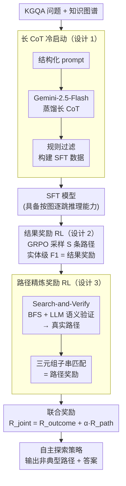

# Explore-on-Graph: Incentivizing Autonomous Exploration of LLMs on Knowledge Graphs

**会议**: ICLR 2026  
**arXiv**: [2602.21728](https://arxiv.org/abs/2602.21728)  
**代码**: [有](https://github.com/ysq111333/EoG)  
**领域**: 图学习  
**关键词**: 知识图谱问答, 自主探索, 强化学习, 路径精炼奖励, GRPO

## 一句话总结
提出 Explore-on-Graph（EoG），通过 SFT + 两阶段强化学习（结果奖励 + 路径精炼奖励），激励 LLM 在知识图谱上自主探索超出训练分布的推理路径，在五个 KGQA 基准上超越 GPT-5 和 Gemini 2.5 Pro。

## 研究背景与动机
- LLM 在 QA 中容易产生幻觉和知识缺失，知识图谱（KG）是接地验证的理想来源
- 现有方法分为两类，均有泛化局限：
    - **规则方法**（如 ToG、DoG）：预定义规则约束推理，训练无关但无法处理分布外模式
    - **模仿方法**（如 RoG、KG-Agent）：模仿训练数据中的推理模式，泛化到新路径困难
- 关键洞察：实际 KG 推理涉及**非典型路径**（如经过 colleague 或 subsidiary 间接关系），需要**自主探索**
- 示例：常见路径 "Google→employee→Carol→lives_in→London"，非典型路径 "Google→employee→Bob→colleague→John→resides_at→London"

## 方法详解

### 整体框架

EoG 把"在知识图谱上找答案"当成一个需要自主探索的决策问题，整条流水线分三步、前后一脉相承。第一步是 SFT 冷启动：用结构化 prompt 让 Gemini-2.5-Flash 蒸馏出一批高质量长 CoT 数据，过滤后做监督微调，让模型先学会按图结构沿三元组逐跳组织推理。第二步是结果奖励强化学习：用 GRPO 采样多条探索路径，只看答案对不对（实体级 F1）把模型推到能稳定找到正确答案。第三步是路径精炼奖励强化学习：先用 Search-and-Verify 流水线挖出问题的真实图路径，再奖励模型的探索过程贴近这条真实路径，使路径更短、更有意义。三步的共同目标是激励模型走出训练分布、敢于探索经过 colleague、subsidiary 这类非典型间接关系的推理路径。

### 关键设计

**1. 长 CoT 冷启动：先教会"怎么按图推理"再让它探索**

直接把一个没见过图推理的 LLM 扔进 KG 里强化学习，会同时撞上两个墙：动作空间巨大（每一步都面对成百上千条候选关系）和奖励极端稀疏（只有走对整条路径才有正反馈），策略几乎无法起步。EoG 因此先做监督冷启动——用精心设计的 prompt 要求推理过程结构化、逻辑严谨、与 KG 对齐，再让 Gemini-2.5-Flash 做知识蒸馏，产出包在 `<think>` 标签里的推理路径和 `<answer>` 标签里的最终答案，并用额外规则过滤掉结构或事实不合格的样本。这批数据让模型在 RL 之前就具备基本的"沿三元组逐跳走"的能力，把后续探索的起点从随机游走抬到了一个有意义的策略空间。

**2. 结果奖励：用实体级 F1 把模型推向正确路径**

冷启动后第一阶段强化学习只关心答案对不对。每个问题用 GRPO 采样 $S$ 条探索路径，奖励取生成答案与标准答案之间的**实体级 F1 分数**而非简单的 Hit@1——KGQA 常有多个正确答案（如"列出某公司所有子公司"），F1 能同时奖励召回和精确，比单点命中更贴合任务。没有按格式生成 `<answer>` 标签的路径直接拿 0 奖励，于是格式合规被隐式地教进策略里。GRPO 不需要额外的价值网络，而是用组内多条采样路径的相对优势做归一化来更新策略，让"在同一问题上比同伴答得更好的路径"获得正梯度，逐步把模型从能找到答案推向稳定找到答案。

**3. 路径精炼奖励：让探索过程贴近真实图路径、变短变准**

只看结果会放任模型用冗长甚至侥幸的路径蒙对答案，第二阶段因此引入过程层面的监督。难点是怎么拿到"真实路径"作监督信号——EoG 设计了一条 Search-and-Verify 流水线：先定位问题中的主题实体和 KG 里的答案实体，用带最大跳数约束的 BFS 搜出所有连接路径保证高召回，再让 Gemini-2.5-Flash 做语义验证，剔除那些拓扑上连通但与问题意图无关的虚假路径。有了这份真实路径，奖励就好算了：检查真实路径里的每个三元组 $(s, r, o)$ 是否作为子串出现在模型生成的思维文本中，取匹配比例作为路径奖励 $R_{path}$。最终用联合奖励 $R_{joint} = R_{outcome} + \alpha \cdot R_{path}$ 训练，$\alpha$ 控制路径信号的权重：太小则路径奖励形同虚设、模型仍生成无意义路径，太大则模型为对齐路径而牺牲答案正确性。实验中这一奖励把 CWQ 上的平均输出从 2067 词压到 1528 词，并在 ≥4-hop 这类深层推理上提升最明显，说明过程信号对长链路探索尤其关键。

### 损失函数 / 训练策略

SFT 阶段用标准的交叉熵语言建模损失在长 CoT 数据上训练；RL 两阶段都用 GRPO 目标，包含重要性采样比率、clipping 和 KL 散度正则以稳定更新。基座模型为 Qwen2.5-7B-Instruct 与 Llama-3.1-8B-Instruct，SFT 数据由 Gemini-2.5-Flash 蒸馏得到，GRPO 训练基于 verl 框架实现。

## 实验关键数据

### 主实验（五个 KGQA 基准）

| 方法 | 模型 | WebQSP Hit@1 | CWQ Hit@1 | GrailQA Hit@1 | QALD10 Hit@1 | 2WikiMH Hit@1 |
|------|------|-------------|-----------|---------------|--------------|---------------|
| DoG | Llama-3.1-8B | 91.4 | 76.2 | - | - | 84.1 |
| GCR | Llama-3.1-8B | 92.2 | 75.8 | - | - | - |
| GPT-5 | - | 86.1 | 74.1 | 90.5 | 59.2 | 84.2 |
| Gemini-2.5-Pro | - | 92.1 | 71.9 | 91.6 | 58.6 | 85.1 |
| **EoG** | Qwen2.5-7B | 90.7 | **82.7** | **91.7** | **67.3** | 83.9 |
| **EoG** | Llama-3.1-8B | **92.8** | **86.6** | **92.1** | **70.6** | **85.3** |

EoG (Llama-3.1-8B) 在 CWQ 上以 86.6 Hit@1 大幅超越 GPT-5 (74.1) 和 Gemini-2.5-Pro (71.9)。

| 复杂推理场景 (CWQ F1) | Conjunction | Superlative | 1-hop | ≥4-hop |
|----------------------|-------------|-------------|-------|--------|
| GCR | 63.7 | 52.6 | 66.3 | 45.8 |
| DoG | 53.3 | 45.9 | 50.3 | 46.7 |
| **EoG** | **70.2** | **64.7** | **76.2** | **69.6** |

EoG 在最困难的 ≥4-hop 推理中优势最大（69.6 vs 45.8/46.7）。

### 消融实验

| 变体 | CWQ Hit@1 | CWQ F1 | WebQSP Hit@1 | WebQSP F1 |
|------|-----------|--------|--------------|-----------|
| EoG 完整 | 82.6 | 73.9 | 92.8 | 81.3 |
| 去除路径奖励 | 81.5 | 70.8 | 90.2 | 77.3 |
| 去除结果奖励 | 62.7 | 51.4 | 65.5 | 56.2 |
| 去除 SFT | 70.3 | 63.1 | 75.9 | 65.8 |
| 去除 SFT + 用 ICL | 70.7 | 63.8 | 77.2 | 66.5 |

### 关键发现
1. 结果奖励是最核心组件（去除后 CWQ Hit@1 从 82.6 降到 62.7）
2. 路径奖励提升探索效率：降低输出长度（CWQ: 2067→1528 词），提升综合性和相关性
3. SFT 冷启动不可或缺，纯 RL（无 SFT）性能大幅下降，ICL 也无法弥补
4. α 过小导致生成错误/无意义路径，过大导致忽略答案正确性
5. 路径奖励使模型在 ≥4-hop 上提升最显著，说明路径信号对深层推理最关键
6. EoG 在六维推理质量评估中全面领先，尤其在推理深度和探索性上

## 亮点与洞察
- 开源 7-8B 模型通过 RL 探索**超越闭源 GPT-5 和 Gemini-2.5-Pro**，展示自主探索的威力
- 路径精炼奖励设计巧妙：通过 BFS + LLM 语义验证获取真实路径，基于三元组子串匹配计算奖励
- "探索"能力与"模仿"能力的对比令人信服：模仿受限于训练分布，探索能发现分布外路径
- 两阶段 RL（先结果奖励再联合奖励）的课程设计值得借鉴
- 在最具挑战性的 ≥4-hop 和 superlative 场景中提升最大，验证了探索对复杂推理的价值

## 局限与展望
- 真实路径获取依赖 BFS + LLM 验证，对于超大规模 KG 可能计算代价高
- 路径奖励基于子串匹配，可能受同一实体不同名称的表述差异影响
- 仅在 Freebase 和 Wikidata 上验证，领域特定 KG（如生物医学）待测试
- 训练数据由 Gemini-2.5-Flash 蒸馏生成，数据质量受限于教师模型
- 未探讨动态 KG（知识随时间变化）的适应性

## 相关工作与启发
- 与 DeepSeek-R1 的 RL 推理范式一致，但将其扩展到**图结构化推理**领域
- 规则方法（ToG、DoG）提供结构保证但缺乏灵活性，EoG 通过 RL 隐式学习结构约束
- 路径精炼奖励与 process reward model（PRM）思路类似，但更直接（基于事实匹配而非模型判断）
- 对 KG-enhanced RAG 有启发：可将探索策略引入知识增强检索

## 评分
- 新颖性: 4/5 （RL 探索 KG 的思路新颖，路径精炼奖励设计独到）
- 实验充分度: 5/5 （五个数据集、多个基线含闭源模型、详尽消融和复杂场景分析）
- 写作质量: 4/5 （框架清晰，示例图解有效）
- 价值: 5/5 （8B 模型超越 GPT-5 的结果极具说服力，实用价值高）

<!-- RELATED:START -->

## 相关论文

- [\[ACL 2026\] Autonomous Knowledge Graph Exploration with Adaptive Breadth-Depth Retrieval](../../ACL2026/graph_learning/autonomous_knowledge_graph_exploration_with_adaptive_breadth-depth_retrieval.md)
- [\[ICLR 2026\] Graph Tokenization for Bridging Graphs and Transformers](graph_tokenization_for_bridging_graphs_and_transformers.md)
- [\[AAAI 2026\] Assessing LLMs for Serendipity Discovery in Knowledge Graphs: A Case for Drug Repurposing](../../AAAI2026/graph_learning/assessing_llms_for_serendipity_discovery_in_knowledge_graphs_a_case_for_drug_rep.md)
- [\[ACL 2025\] The Role of Exploration Modules in Small Language Models for Knowledge Graph Question Answering](../../ACL2025/graph_learning/the_role_of_exploration_modules_in_small_language_models_for_knowledge_graph_que.md)
- [\[ACL 2026\] AgentGL: Towards Agentic Graph Learning with LLMs via Reinforcement Learning](../../ACL2026/graph_learning/agentgl_towards_agentic_graph_learning_with_llms_via_reinforcement_learning.md)

<!-- RELATED:END -->
