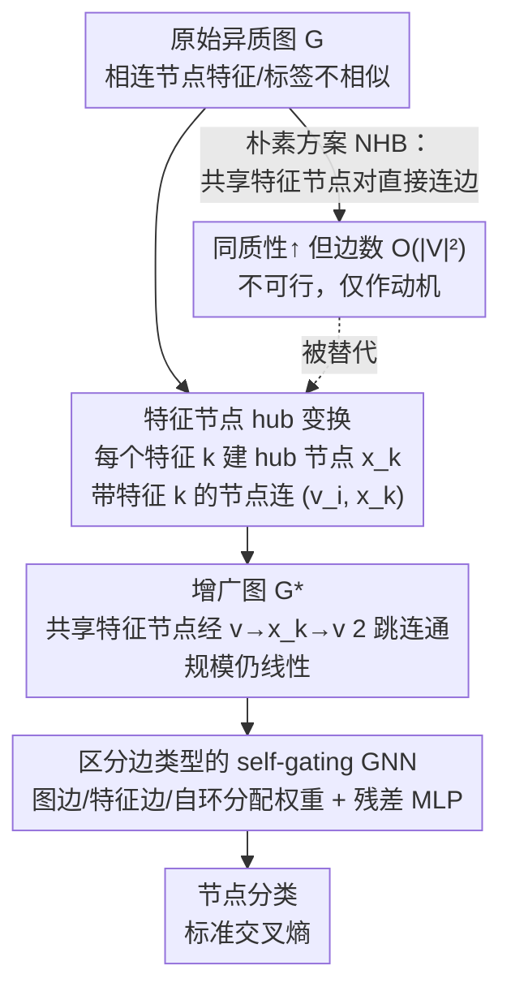

# GRAPHITE: Graph Homophily Booster — Reimagining the Role of Discrete Features in Heterophilic Graph Learning

**会议**: ICLR 2026  
**arXiv**: [2602.07256](https://arxiv.org/abs/2602.07256)  
**代码**: [https://github.com/q-rz/ICLR26-GRAPHITE](https://github.com/q-rz/ICLR26-GRAPHITE)  
**领域**: 图学习  
**关键词**: heterophilic graph, homophily boosting, graph transformation, feature nodes, GNN

## 一句话总结
提出 GRAPHITE，一种通过引入"特征节点"作为 hub 间接连接共享特征的节点来**直接提升图同质性**的非学习图变换方法，首次从"改变图结构"而非"改变 GNN 架构"的角度解决异质图问题，在 Actor 等困难基准上显著超越 27 种 SOTA 方法。

## 背景与动机

1. **异质图困境**：GNN 的核心——邻域聚合——在异质图上失效，因为相连节点的特征/标签本身就不相似，聚合只会稀释有用信号。
2. **架构修补已到瓶颈**：已有大量异质图 GNN（H2GCN、GPR-GNN、FAGCN、OrderedGNN 等）从分离 ego/neighbor embedding、多跳信息、频率滤波等角度设计新架构，但实验表明 23 种最新 GNN 在 Actor 数据集上仍不如最简单的 MLP。
3. **核心观察**：问题根源在于**图结构本身**的同质性低，而非模型能力不足。因此应该直接改变图结构让其更同质，而非设计更复杂的模型。
4. **关键洞察**：同质性定义指出共享特征的节点更可能相邻即为同质。朴素方案——直接在共享特征的节点对间加边——可证明提升同质性，但边数增长达 $O(|V|^2)$，计算不可行。

## 核心问题
如何在不大幅增加图规模的前提下，通过确定性图变换直接提升异质图的同质性，使标准 GNN 也能有效工作？

## 方法详解

### 整体框架

GRAPHITE 把"治异质图"的战场从 GNN 架构搬回到图结构本身。它先想清楚一件事：既然同质性的定义说"共享特征的节点更该相邻"，那最朴素的做法就是给所有共享特征的节点对直接补边（NHB 方案），可这会让边数爆炸到 $O(|V|^2)$ 不可行。GRAPHITE 的破局点是引入"特征节点"当 hub，用间接连接代替两两直连：原图先被一个**确定性、无需学习**的变换重写成同质性更高、规模只线性增长的增广图 $\mathcal{G}^*$，再在这个新图上跑一个**区分边类型**的 self-gating GNN 做节点分类。由于变换不含任何参数，它能挂在任意 GNN 前面即插即用。

### 关键设计

**1. 朴素同质性提升器（NHB）：先证"加边能提同质"，再暴露它为什么不可行**

GRAPHITE 的出发点是同质性的定义本身——共享特征的节点更该相邻。顺着这个定义，最直接的做法就是对每对至少共享一个特征的节点 $(v_i, v_j)$（即 $\|\mathbf{X}[v_i,:] \land \mathbf{X}[v_j,:]\|_\infty > 0$）都补一条"捷径边"，作者称之为朴素同质性提升器（NHB）。Theorem 1 在温和假设下证明这确实严格提升了图的同质性，从理论上确认"改结构"这条路走得通。但它的代价是新增边数高达 $O(|V|^2)$——一个 2000 节点的图就可能塞进近 200 万条边，训练根本扛不住。NHB 因此不是最终方案，而是一块垫脚石：它告诉我们目标方向是对的，但实现方式必须换一种省边的写法。

**2. 特征节点 hub 变换：用间接连接把 $O(|V|^2)$ 压成线性**

针对 NHB 的边数瓶颈，GRAPHITE 不再让共享特征的节点两两直连，而是为每个特征 $k$ 建一个"特征节点" $x_k$（共 $|\mathcal{X}|$ 个）当作 hub。凡是带有特征 $k$ 的图节点 $v_i$（即 $\mathbf{X}[v_i,k]=1$）就连一条"特征边" $(v_i, x_k)$，特征节点自身的特征取其所连图节点特征的均值（消融发现均值、可学习 embedding、attention、多数投票几乎无差异，故选最简单的均值）。这一步把任意共享特征 $k$ 的节点对从"要直接连一条边"变成"经 $v_i \to x_k \to v_j$ 在 2 跳内连通"（Observation 2），等价地恢复了 NHB 想要的同质消息传递，却把边数从 $O(|V|^2)$ 收敛到只随特征出现次数线性增长。Theorem 3 进一步保证它鱼与熊掌兼得——既有同质性提升 $\text{hom}(\mathcal{G}^*) > \text{hom}(\mathcal{G})$，又满足 $|\mathcal{V}^*| \leq O(|\mathcal{V}|)$、$|\mathcal{E}^*| \leq O(|\mathcal{E}|)$ 的线性规模，从根上解决了 NHB 的计算瓶颈。

**3. 区分边类型的 self-gating GNN：让模型知道"图边"和"特征边"不是一回事**

增广图 $\mathcal{G}^*$ 里有两类语义截然不同的边：原始图边承载拓扑邻接，新加的特征边承载属性共享，一视同仁地聚合会浪费结构信息。GRAPHITE 因此给三类连接分配不同权重——图边权基准 $w_\mathcal{E}=1$、特征边权 $w_\mathcal{X}$、自环权 $w_0$，让模型自己学到该多信哪一类。聚合时借鉴 FAGCN 的 self-gating 机制，对每条边算一个门控分数 $\alpha_{u,u'} = \tanh\!\big(\frac{\mathbf{a}^T(\mathbf{h}_u \| \mathbf{h}_{u'}) + b}{\tau}\big)$，自适应判定是吸纳还是排斥邻居信号（$\tau$ 为温度），再用度归一化做加权聚合，聚合后接一个带残差连接和 GELU 的 MLP 稳定训练。这套设计的意义在于：共享特征但标签不同的"假阳性同质连接"会被门控压低，而真正同质的特征边得到放大——这也是 GRAPHITE 虽以 FAGCN 为骨架却能显著超过它的原因。

### 损失函数 / 训练策略

图变换本身是无需学习的确定性预处理，不引入任何额外参数，可与任意现有 GNN 解耦组合；下游节点分类直接用标准交叉熵损失训练即可（异质图上用本文 8 层、隐维 512 的专用 GNN，同质图上直接退化为 FAGCN）。

## 实验关键数据

### 主实验：与 27 种方法对比（6 个数据集）

| 方法 | Actor | Squirrel-F | Chameleon-F | Minesweeper | Cora | CiteSeer |
|------|-------|-----------|------------|------------|------|----------|
| MLP | 35.04 | 33.91 | 38.44 | 50.99 | 75.45 | 71.53 |
| GCN | 30.21 | 35.57 | 40.06 | 72.32 | 87.50 | 75.77 |
| FAGCN | 36.18 | 36.52 | 39.83 | 84.69 | 88.66 | 76.82 |
| JKNet | 28.63 | 40.81 | 40.39 | 81.00 | 86.24 | 73.11 |
| SGFormer | 25.89 | 34.54 | 42.79 | 52.06 | 86.24 | 70.74 |
| **GRAPHITE** | **37.69** | **43.06** | **45.08** | **94.78** | 88.23 | 76.41 |

GRAPHITE 在全部 4 个异质图上显著第一，超越最佳基线 +4.17%/+5.23%/+5.35%/+3.47%；同质图上与 SOTA 持平。

### 同质性提升幅度（GRAPHITE 变换前→后）

| 数据集 | Feature Homophily 提升 | Adjusted Homophily 提升 |
|--------|----------------------|------------------------|
| Actor | +179% | +2767% |
| Squirrel-F | +961% | +215% |
| Chameleon-F | +1739% | +402% |
| Minesweeper | +41% | +1023% |

### GRAPHITE 变换对同质 GNN 的增益（即插即用）

| 方法 | Actor (原图→变换后) | Minesweeper (原图→变换后) |
|------|-------------------|-------------------------|
| GCN | 30.21 → 34.83 | 72.32 → 75.38 |
| GAT | 28.86 → 32.09 | 87.59 → 88.66 |
| JKNet | 28.63 → 35.96 | 81.00 → 85.56 |
| GIN | 28.29 → 33.75 | 75.89 → 87.07 |

### 效率分析

| 数据集 | 无变换训练时间 | 有变换训练时间 |
|--------|----------|----------|
| Minesweeper (10k 节点) | 1.9 min | 2.3 min |
| Actor (7.6k 节点) | 1.5 min | 2.0 min |
| Squirrel-F (2.2k 节点) | 0.7 min | 1.1 min |

运行时间增长可控，远小于准确率提升带来的收益。

### 特征节点聚合方式消融
均值聚合、可学习 embedding、可学习 attention、多数投票四种方式表现几乎无差异，因此选择最简单的均值聚合。

## 亮点
- **全新范式**：首次提出"直接提升图同质性"而非"设计更强 GNN"的思路，这是一个被完全忽视的方向
- **极简却强大**：核心操作仅是添加特征节点和边——无需学习、无需训练、确定性变换，可与任何 GNN 即插即用
- **理论完备**：同质性提升和图规模增长均有严格数学证明
- **实验说服力强**：27 种基线全面对比，GRAPHITE 实现所有异质图 SOTA，且单独图变换就能大幅增强同质 GNN

## 局限与展望
- **依赖离散/二值特征**：连续特征需先离散化（如 one-hot 编码），离散化粒度的选择缺乏理论指导
- **特征维度敏感**：特征节点数等于特征维度 $|\mathcal{X}|$，极高维稀疏特征可能导致大量 hub 节点
- **假阳性同质连接**：共享某特征但标签不同的节点也会被 2 跳连通，self-gating 虽可缓解但无法根除
- **理论假设的适用范围**：Theorem 1/3 依赖"mild and realistic assumptions"，未详细讨论何时假设不成立

## 与相关工作的对比
- **vs H2GCN / GPR-GNN / ACM-GNN**：这些方法从架构层面应对异质（分离 ego/neighbor、多项式滤波器等），GRAPHITE 则直接改图结构——正交且可互补
- **vs FAGCN**：FAGCN 用 self-gating 自适应处理同质/异质信号；GRAPHITE 的 GNN 部分也用了 self-gating，但核心创新在上游的图变换
- **vs 图增强 / 图重构方法**：大多学习边权或删除/添加边（如 DropEdge、IDGL）；GRAPHITE 是**基于特征结构的确定性变换**，不涉及学习
- **vs Virtual Node**：Virtual Node 加一个全局节点连接所有节点，缺乏特征区分度；GRAPHITE 的特征节点按特征类别细粒度连接
- **vs Graph Transformer（NodeFormer, SGFormer, DIFFormer）**：Transformer 通过全局注意力捕获远距离信息，但在异质小图上不一定有效；GRAPHITE 通过结构性变换更直接

## 启发与关联
- **"先改数据再改模型"的通用思路**：GRAPHITE 证明在异质图场景下，数据层面的变换比模型层面的创新更有效。这个思路可推广到其他"数据属性不利于标准模型"的场景
- **特征节点可看作一种结构化的显式记忆**：每个特征节点汇聚了具有该特征的所有节点信息，类似于一种基于离散属性的聚类中心
- **与自监督对比学习的结合**：特征节点可为对比学习提供天然的正样本组（共享特征节点邻居为正对），值得探索

## 评分
- 新颖性: ⭐⭐⭐⭐⭐ 全新范式——直接变换图结构提升同质性，视角独特
- 实验充分度: ⭐⭐⭐⭐⭐ 27 基线全面对比 + 同质性量化 + 即插即用验证 + 消融 + 效率分析
- 写作质量: ⭐⭐⭐⭐⭐ 从朴素方法（NHB）到高效方案（GRAPHITE）的递进论述逻辑清晰
- 价值: ⭐⭐⭐⭐⭐ 方法简单有效 + 新范式开创性 + 理论保证完备，有很高的后续研究潜力

<!-- RELATED:START -->

## 相关论文

- [\[AAAI 2026\] GCL-OT: Graph Contrastive Learning with Optimal Transport for Heterophilic Text-Attributed Graphs](../../AAAI2026/graph_learning/gcl-ot_graph_contrastive_learning_with_optimal_transport_for_heterophilic_text-a.md)
- [\[NeurIPS 2025\] Sketch-Augmented Features Improve Learning Long-Range Dependencies in Graph Neural Networks](../../NeurIPS2025/graph_learning/sketch-augmented_features_improve_learning_long-range_dependencies_in_graph_neur.md)
- [\[ICML 2026\] Generative Representation Learning on Hyper-relational Knowledge Graphs via Masked Discrete Diffusion](../../ICML2026/graph_learning/generative_representation_learning_on_hyper-relational_knowledge_graphs_via_mask.md)
- [\[AAAI 2026\] Feature-Centric Unsupervised Node Representation Learning Without Homophily Assumption](../../AAAI2026/graph_learning/feature-centric_unsupervised_node_representation_learning_without_homophily_assu.md)
- [\[ICLR 2026\] A Geometric Perspective on the Difficulties of Learning GNN-based SAT Solvers](a_geometric_perspective_on_the_difficulties_of_learning_gnn-based_sat_solvers.md)

<!-- RELATED:END -->
