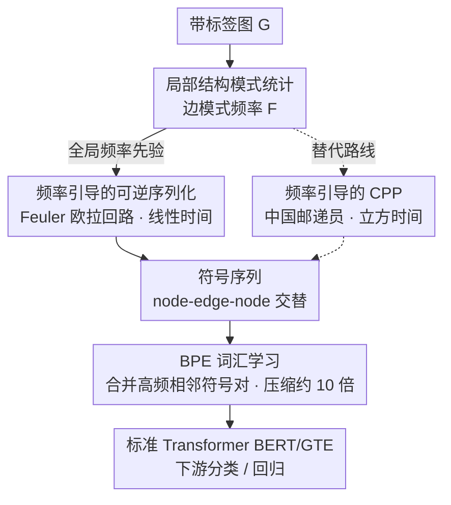

# Graph Tokenization for Bridging Graphs and Transformers

**会议**: ICLR 2026  
**arXiv**: [2603.11099](https://arxiv.org/abs/2603.11099)  
**代码**: 有（补充材料中提供）  
**领域**: 图学习  
**关键词**: graph tokenization, BPE, graph serialization, Transformer, graph classification

## 一句话总结
提出 GraphTokenizer 框架，将图通过可逆的频率引导序列化转换为符号序列，再用 BPE 学习图子结构词汇表，使标准 Transformer（如 BERT/GTE）无需任何架构修改即可直接处理图数据，在 14 个 benchmark 上达到 SOTA。

## 研究背景与动机

**领域现状**：图结构数据的学习主要依赖 GNN（通过消息传递聚合邻居信息）或专门设计的 Graph Transformer（引入注意力机制处理图）。另一条路线是将图转换为连续嵌入供 Transformer 使用。

**现有痛点**：(a) Graph Transformer 需要图特定的架构设计，无法直接复用 LLM 生态的预训练模型和训练技巧；(b) 将图映射到连续嵌入往往存在信息损失或表征不稳定问题；(c) 已有的图序列化方法（Random Walk, BFS/DFS）要么不可逆（丢失边连接信息），要么不确定性（同构图产生不同序列）。

**核心矛盾**：文本天然是路径图，有固定的邻域结构和顺序——tokenization 很简单。但通用图的邻域可以向多个方向分支、没有唯一的节点排序、n-gram 等共现统计无法直接应用。

**本文目标** 设计一个通用的图 tokenizer，将任意带标签的图忠实地转换为离散 token 序列，使标准序列模型可以直接处理图数据。

**切入角度**：将图 tokenization 分解为两步——(1) 可逆且确定性的图序列化，(2) 用 BPE 从序列化语料中学习子结构词汇表。关键洞察是：通过全局频率统计引导序列化，使常见子结构在序列中相邻出现，正好适合 BPE 的贪心合并策略。

**核心 idea**：频率引导的可逆图序列化 + BPE = 图的 tokenizer，将图学习重构为序列建模问题。

## 方法详解

### 整体框架
GraphTokenizer 想回答的核心问题是：能不能不改 Transformer 的任何架构，就让它像处理文本一样处理图？它的答案是把图也变成离散 token 序列。整个流水线记作 $\Phi = T \circ f$，分三步走：先扫一遍训练集，统计每种局部边模式的出现频率 $F$，得到一张全局先验；再用这张频率图引导一次可逆遍历 $f_g(\mathcal{G}, F)$，把图无损地「拉直」成 node-edge-node 交替的符号序列；最后用 BPE tokenizer $T$ 把符号序列压缩成 token 序列 $S_T$，喂给标准 Transformer（BERT/GTE）做分类或回归。由于序列化和 BPE 都可逆，解码时反向走 $f^{-1} \circ T^{-1}$ 就能完整重建原图——这种信息无损正是它能拿到好效果的前提。序列化这一步还提供了两条可互换的路线：默认的欧拉回路（Feuler）和作为对照的中国邮递员（CPP）。

### 关键设计

**1. 局部结构模式统计：为序列化提供全局先验**

整条流水线要回答的第一个问题是「以什么顺序遍历图」，GraphTokenizer 的答案来自训练集的统计先验。它先扫一遍所有图，统计每个局部边模式 $p = (l_u, l_e, l_v)$（起点标签、边标签、终点标签）出现的频率 $F(p)$。之所以选边模式，是因为它是「能保留两个实体间类型关系」的最小子结构：计算开销低，又天然在节点排列下不变，不会因为换个节点编号就统计出不同结果。这张频率图 $F$ 随后会作为全局信号贯穿后续步骤——它既给序列化提供了确定性的优先级（消除排序歧义），又让高频子结构在序列里尽量挨着出现，正好喂给下游 BPE 一个理想的输入。

**2. 频率引导的可逆序列化（Frequency-Guided Eulerian Circuit）：把图无损地拉直成序列**

文本之所以好 tokenize，是因为它本来就是一条有唯一顺序的路径图；而通用图会向多个方向分支、节点又没有天然排序，所以核心难点是「怎么把图忠实地拉成一条线」。本文沿欧拉回路遍历，让每条边恰好被走过一次：先把每条无向边拆成两条有向边，这样任意连通图都满足欧拉回路的存在条件。遍历过程中，每到一个节点 $u$，就在它尚未访问的出边集合 $\mathcal{E}_u$ 里按频率优先级挑下一条边，$e^* = \arg\max_{e_i \in \mathcal{E}_u} \pi(e_i, F)$，其中优先级直接取频率 $\pi(e_i, F) = F(p_i)$；输出时写成 node-edge-node 交替的符号序列。这样设计同时拿下三点好处：欧拉回路保证每条边都被记录，所以序列化天然可逆（解码时反推即可重建原图）；频率引导消除了经典 Hierholzer 算法的不确定性，让同构图产生完全相同的序列；整个遍历只需 $O(|\mathcal{E}|)$ 时间。相比之下，Random Walk 不可逆、BFS/DFS 会丢掉边连接信息、SMILES 又只能用于分子图，都做不到「可逆 + 确定」这两条同时成立。

**3. BPE 词汇学习：从序列里自动发现有语义的子结构 token**

序列化只是把图变成符号串，真正压缩并赋予语义的是 BPE。它在序列化语料上训练，迭代地把出现频率最高的相邻符号对合并成新 token。关键在于前一步已经把高频子结构排在了相邻位置，所以 BPE 的贪心合并恰好会一步步「拼」出有意义的图子结构——每个合并出来的 token 都对应一个可解码的子图片段。这一步带来三重收益：序列长度被压到约原来的 1/10，显著降低 Transformer 的计算开销；学到的词汇是层次化、带语义的（在分子图上就对应官能团这类单元）；整个过程完全数据驱动，不需要任何领域知识注入。

**4. 频率引导的 CPP（Chinese Postman Problem）：欧拉回路之外的替代序列化路线**

作为 Feuler 的对照方案，本文也给出基于中国邮递员问题的序列化：用最小权重的遍历覆盖所有边，并把频率信息编码进边权 $w(e) = \alpha \cdot 1 + (1-\alpha) \cdot g(F(p_e))$，让高频边更倾向于被连续访问。CPP 求解本身就会产出高度结构化的序列，所以频率引导在它身上的增益相对有限。但代价是复杂度——CPP 是 $O(|\mathcal{V}|^3)$，远高于 Feuler 的 $O(|\mathcal{E}|)$，因此实际首选仍是 Feuler，CPP 更多是用来验证「边遍历 + 频率引导」这条思路的稳健性。

### 损失函数 / 训练策略
Tokenizer 本身无需梯度训练（BPE 是统计算法）。下游使用标准 Transformer 训练：
- GT+BERT: BERT-small 架构，prepend [CLS] token
- GT+GTE: 更大的 GTE 模型（约 BERT-base 参数量）
- 标准分类/回归损失

## 实验关键数据

### 主实验

| 模型 | molhiv (AUC↑) | p-func (AP↑) | mutag (Acc↑) | zinc (MAE↓) | qm9 (MAE↓) |
|------|--------------|-------------|-------------|------------|------------|
| GCN | 74.0 | 53.2 | 79.7 | 0.399 | 0.134 |
| GIN | 76.1 | 61.4 | 80.4 | 0.379 | 0.176 |
| GraphGPS | 78.5 | 53.5 | 84.3 | 0.310 | 0.084 |
| GraphMamba | 81.2 | 67.7 | 85.0 | 0.209 | 0.083 |
| GCN+ | 80.1 | **72.6** | 88.7 | 0.116 | 0.077 |
| GT+BERT | 82.6 | 68.5 | 87.5 | 0.241 | 0.122 |
| **GT+GTE** | **87.4** | 73.1 | **90.1** | **0.131** | **0.071** |

GT+GTE 在 14 个 benchmark 中多数达到 SOTA，且使用标准 off-the-shelf Transformer 无任何图特定架构修改。

### 消融实验

| 序列化方法 | molhiv (w/ BPE) | molhiv (w/o BPE) | zinc (w/ BPE) | zinc (w/o BPE) |
|-----------|----------------|-----------------|-------------|--------------|
| BFS | 72.3 | 81.2 | 0.453 | 0.696 |
| DFS | 76.0 | 79.1 | 0.446 | 0.705 |
| Eulerian | 84.5 | 81.0 | 0.164 | 0.160 |
| **Feuler** | **87.4** | 81.3 | **0.131** | 0.171 |
| CPP | 86.9 | 81.2 | 0.141 | 0.145 |

### 关键发现
- **可逆序列化至关重要**：边遍历方法（Eulerian/CPP）显著优于节点遍历方法（BFS/DFS/TOPO），因为保留了完整的边连接信息
- **频率引导有效**：Feuler 稳定优于无引导的 Eulerian，且方差更小
- **BPE 是关键组件**：几乎在所有配置下提升性能，同时带来约 10× 序列压缩和 2.5× 训练加速
- **模型可扩展**：从 GT+BERT 扩展到 GT+GTE 带来一致性能提升，不像 GNN 容易因过平滑而退化
- BPE 学到的词汇有化学语义：token 大小分布峰值在 4-6 节点（对应官能团），原子级 token 仅占 7.1%

## 亮点与洞察
- **图学习的范式转换**：将图学习彻底重构为序列建模问题，解耦了数据表示和模型架构。这意味着图领域可以直接受益于 LLM 生态的所有进展（更长上下文、更高效注意力、预训练模型等）
- **频率引导序列化与 BPE 的协同设计**：两者不是简单串联，而是精心设计的协同——序列化为 BPE 创造理想的压缩输入，BPE 反过来发现有意义的子结构。这种 co-design 思想可迁移到其他非序列数据的 tokenization
- **可逆性作为质量保证**：序列化的可逆性不仅是理论优点，直接关联到更好的下游性能——信息无损是高质量 tokenization 的基础

## 局限与展望
- 仅验证了图级任务（分类/回归），未验证节点级和边级预测任务
- 序列化依赖连通图假设，非连通图需分别序列化后拼接
- 频率统计基于最简单的边模式 $(l_u, l_e, l_v)$，未探索更大子结构模式的统计引导
- BPE 是贪心算法，可能无法找到全局最优的子结构分解
- 未探索预训练+微调范式——如果在大规模图数据上预训练 tokenizer+Transformer，效果可能进一步提升

## 相关工作与启发
- **vs GraphGPS**: GraphGPS 是专门设计的 Graph Transformer，需要位置编码等图特定组件；GT 直接用 off-the-shelf Transformer 且性能更好
- **vs GraphMamba**: GraphMamba 用序列化+Mamba 架构，但序列化方法非可逆且非确定性；GT 的序列化理论性质更好
- **vs GCN+**: GCN+ 是强化版 GNN baseline，在部分数据集上与 GT+GTE 接近，但在 molhiv 上差距很大（80.1 vs 87.4）
- **vs SMILES**: SMILES 是分子图的领域特定序列化，不可推广到通用图；GT 适用于任意带标签图

## 评分
- 新颖性: ⭐⭐⭐⭐⭐ 将 NLP tokenization 范式完整移植到图领域，理念新颖且执行完整
- 实验充分度: ⭐⭐⭐⭐⭐ 14 个 benchmark、全面的消融、效率分析、可视化
- 写作质量: ⭐⭐⭐⭐⭐ 问题定义清晰，理论框架严谨，图表设计精美
- 价值: ⭐⭐⭐⭐⭐ 可能改变图学习的研究范式，使标准 Transformer 直接可用于图数据

<!-- RELATED:START -->

## 相关论文

- [\[AAAI 2026\] GT-SNT: A Linear-Time Transformer for Large-Scale Graphs via Spiking Node Tokenization](../../AAAI2026/graph_learning/gt-snt_a_linear-time_transformer_for_large-scale_graphs_via_spiking_node_tokeniz.md)
- [\[ACL 2025\] Multimodal Transformers are Hierarchical Modal-wise Heterogeneous Graphs](../../ACL2025/graph_learning/multimodal_transformers_are_hierarchical_modal-wise_heterogeneous_graphs.md)
- [\[ICML 2026\] What Structural Inductive Bias Helps Transformers Reason Over Knowledge Graphs? A Study with Tabula RASA](../../ICML2026/graph_learning/what_structural_inductive_bias_helps_transformers_reason_over_knowledge_graphs_a.md)
- [\[NeurIPS 2025\] Relieving the Over-Aggregating Effect in Graph Transformers](../../NeurIPS2025/graph_learning/relieving_the_over-aggregating_effect_in_graph_transformers.md)
- [\[AAAI 2026\] MoToRec: Sparse-Regularized Multimodal Tokenization for Cold-Start Recommendation](../../AAAI2026/graph_learning/motorec_sparse-regularized_multimodal_tokenization_for_cold-start_recommendation.md)

<!-- RELATED:END -->
