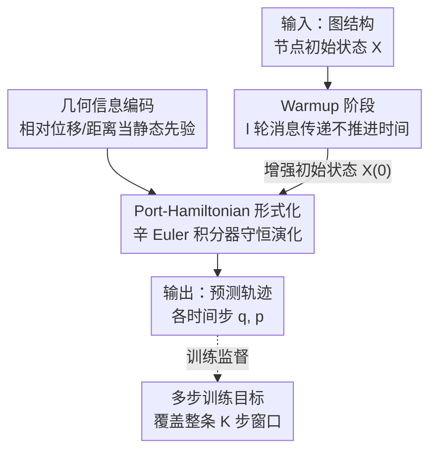

# Improving Long-Range Interactions in Graph Neural Simulators via Hamiltonian Dynamics

**会议**: ICLR 2026  
**arXiv**: [2511.08185](https://arxiv.org/abs/2511.08185)  
**代码**: [thobotics/neural_pde_matching](https://thobotics.github.io/neural_pde_matching)  
**领域**: 3D视觉  
**关键词**: 图神经仿真器, 哈密顿动力学, 长程交互, Port-Hamiltonian, 多步训练

## 一句话总结
提出 Information-preserving Graph Neural Simulators (IGNS)，利用 port-Hamiltonian 动力学结构在图上保持信息不耗散，结合 warmup 初始化、几何编码和多步训练目标，在 6 个物理仿真基准上全面超越现有图神经仿真器。

## 研究背景与动机
物理系统仿真是科学计算的核心任务，传统数值求解器（有限元等）在高精度需求下计算代价极高。Graph Neural Simulators (GNS) 通过学习图结构数据上的动力学，可加速仿真数个数量级。然而现有 GNS 面临两个根本性问题：(1) **长程交互建模困难**——消息传递机制在多层堆叠后因 over-smoothing 和 over-squashing 而丧失远距离节点间的信息；(2) **误差累积**——单步训练后自回归展开时误差迅速放大。现有隐式/显式去噪目标仅能缓解局部噪声，无法捕获多步后出现的低频漂移。核心 idea：利用哈密顿动力学的信息保持特性，让信息在图上不被耗散，从而实现有效的长程传播和稳定的多步展开。

## 方法详解

### 整体框架
IGNS 要解决的是 GNS 在长程交互上信息耗散、在多步展开时误差累积这两个老毛病。它的做法是给图上的动力学套上一层 port-Hamiltonian 结构：先让初始状态经过一段不推进时间的 warmup 把全局上下文扩散开，同时把不规则网格的几何关系当静态先验编码进边、注入到动力学的外力项，再让系统按守恒的哈密顿动力学向前演化，并用覆盖整条窗口的多步损失来监督。守恒结构是整条 pipeline 的地基——它保证 warmup 聚来的全局信息和远处时间步回传的梯度都不会被衰减掉，长程传播和稳定展开因此同时成立。

### 关键设计

**1. Port-Hamiltonian 形式化：让信息在图上守恒、不被耗散**

针对消息传递堆叠后 over-smoothing / over-squashing 导致远距离信息丢失的痛点，IGNS 把动力学参数化成一个 port-Hamiltonian 系统：$\dot{\mathbf{x}}_i = \mathbf{J} \nabla_{\mathbf{x}_i} H_\theta(t, \mathbf{X}) - \begin{bmatrix} 0 \\ \mathbf{D}_\theta \nabla_{\mathbf{p}_i} H_\theta \end{bmatrix} + \begin{bmatrix} 0 \\ \mathbf{r}_\theta(t, \mathbf{X}) \end{bmatrix}$。其中 $\mathbf{J}$ 是反对称矩阵，$H_\theta$ 是通过消息传递参数化、同时吃进节点自身与邻居状态的可学习哈密顿量；纯哈密顿部分负责能量守恒与信息保持，阻尼项 $\mathbf{D}_\theta$ 捕获摩擦等非守恒效应，外力项 $\mathbf{r}_\theta$ 建模外部驱动，并用辛 Euler 积分器保住能量守恒性质。它之所以有效，是因为在无阻尼无外力时系统是纯旋转的（divergence-free），信息完全保留；理论上灵敏度矩阵范数有下界 $\|\partial \mathbf{x}(t) / \partial \mathbf{x}(s)\| \geq 1$（Theorem 2），梯度不会像 GCN 那样指数衰减，从而支撑有效的长程传播。同时 Theorem 1 证明 IGNS 可归约到 neural oscillator 框架、能逼近任意从初始条件到时刻 $\tau$ 解的映射，表达力不因守恒约束而受损。

**2. Warmup 阶段：补上仿真起点缺失的全局上下文**

消息传递每步只把信息送到直接邻居，但物理仿真里长程交互往往从第一步就很关键，单纯靠逐步传播来不及。IGNS 在正式推进时间前先跑 $l$ 轮额外消息传递（不推进时间），让每个节点在半径 $l$ 内先把信息聚齐，得到增强的初始状态 $\mathbf{X}(0) = \bar{\mathbf{X}}^{(l)}$。关键在于哈密顿核心的守恒特性让这批 warmup 聚来的全局信息在整段展开里都能保住，而不像普通 GNN 那样很快被耗散掉。

**3. 几何信息编码：在不规则网格上把几何当静态先验注入**

不规则网格上准确编码几何结构对物理仿真至关重要。IGNS 把相对位移向量 $\mathbf{s}_{ij}$ 和距离 $\mathbf{d}_{ij}$ 编码进边特征用于形成外力项；与 MeshGraphNets 在每个时间步更新边消息不同，IGNS 把边信息当作静态先验来加权邻居消息，从而减少对特定网格的过拟合。

**4. 多步训练目标：让监督信号覆盖整条轨迹而非单步**

针对自回归展开时误差累积的痛点，IGNS 给定窗口 $(q^{(t)}, \ldots, q^{(t+K)})$，从 $q^{(t)}$ 一路展开并优化所有中间预测：$\mathcal{L}_{\text{multi-step}} = \sum_{\tau=1}^{K} \left( \|\hat{q}^{(t+\tau)} - q^{(t+\tau)}\|_2^2 + \|\hat{p}^{(t+\tau)} - p^{(t+\tau)}\|_2^2 \right)$。这个目标与 IGNS 天然契合——非耗散核心保证信号在时间上不衰减，远处步骤的梯度不会消失，模型能真正利用整条轨迹的监督，而不是只学好下一步。

## 实验关键数据

### 主实验
论文在 6 个基准上评估，分为拉格朗日系统和欧拉系统两类：

| 数据集 | 类型 | IGNS MSE | MGN MSE | 改进 |
|--------|------|----------|---------|------|
| Plate Deformation | 长程传播 | **最优** | 1.27 | IGNS 和 MGN 皆好，但 IGNS 不过拟合 |
| Impact Plate | 长程传播 | **最优** | 3095.75 | IGNS 大幅领先 |
| Sphere Cloth | 复杂动力学 | **最优**（~25×10⁻³） | 32.07×10⁻³ | 显著提升 |
| Wave Balls | 振荡动力学 | **最优**（~1.5×10⁻³） | 1.78×10⁻³ | 大幅领先所有基线 |
| Cylinder Flow | 流体动力学 | **最优** | 12.08×10⁻³ | 与 GraphCON 相当 |
| Kuramoto-Sivashinsky | 混沌动力学 | 2.41×10⁻³ | 10.76×10⁻³ | 接近 GraphCON |

### 消融实验

| 配置 | 关键指标 | 说明 |
|------|---------|------|
| 数据效率 (Plate Def.) | IGNS 在 100 样本时优势最大 | port-Hamiltonian 归纳偏置减少对数据的依赖 |
| Warmup 步数 $l$ | $l=1 \to l=30$ 持续改善 | $l=5$ 改进最大，$l>30$ 收益递减 |
| 时变权重矩阵 (IGNS vs IGNSti) | IGNS 在长时域更好 | 时变参数化提升表达力，捕获非平稳动力学 |
| 更长展开 ($T=100$) | IGNS 仍稳定 | 验证长时域稳定性 |

### 关键发现
- port-Hamiltonian 结构在 **所有任务** 上一致领先标准 GNS
- GraphCON 是 IGNS 的特例（质量矩阵为单位矩阵），理论上表达力更弱
- MGN 虽在 Plate Deformation 上竞争力强，但分析表明其依赖非共享处理器导致的大量参数和几何过拟合
- Wave Balls 任务中 IGNS 远超基线，因 port-Hamiltonian 本质上是波方程的推广
- 新提出的三个 benchmark（Plate Deformation, Sphere Cloth, Wave Balls）有效检验长程和振荡动力学

## 亮点与洞察
- **物理归纳偏置 + 数据驱动的完美结合**: 哈密顿动力学不是硬编码物理，而是提供信息保持的结构框架，让数据驱动方法在其中学习
- **理论-实践一致性**: 两个定理（通用性 + 信息保持）不仅是理论装饰，而是直接解释了 IGNS 为什么在长程和多步任务上成功
- **warmup 设计简洁有效**: 用最简单的方式（多轮消息传递不推进时间）解决了 GNS 的初始全局上下文缺失问题
- **参数效率极高**: IGNS 约 216K 参数 vs MGN 的 1.8M 参数，少一个数量级但性能更好

## 局限与展望
- 当前只支持开环 (open-loop) 前向仿真，不支持闭环控制
- warmup 步数 $l$ 需要手动选择，且对不同任务最优值不同
- 对于全局性非常强的系统（如周期性边界条件），warmup 的局部信息扩散仍有限
- 欧拉系统（Cylinder Flow, KS）上优势不如拉格朗日系统显著
- 未探索与层次化/重连线方法的结合

## 相关工作与启发
- **与 MeshGraphNets 的关系**: MGN 用一阶显式欧拉 + 非共享处理器，IGNS 用二阶 port-Hamiltonian + 辛积分器，从一阶到二阶是质的提升
- **与 GraphCON 的关系**: GraphCON 是 IGNS 的特例（$\mathbf{M}=\mathbf{I}$），IGNS 通过可学习的质量/阻尼/刚度矩阵表达力更强
- **与 Neural ODE 的关系**: IGNS 将 Neural ODE 推广到基于图的 port-Hamiltonian 系统，同时享有理论保证
- **启发**: 二阶动力学的振荡特性天然适合物理仿真中的波传播和弹性系统

## 评分
- 新颖性: ⭐⭐⭐⭐⭐
- 实验充分度: ⭐⭐⭐⭐⭐
- 写作质量: ⭐⭐⭐⭐⭐
- 价值: ⭐⭐⭐⭐

<!-- RELATED:START -->

## 相关论文

- [\[ICML 2025\] On Measuring Long-Range Interactions in Graph Neural Networks](../../ICML2025/graph_learning/on_measuring_long-range_interactions_in_graph_neural_networks.md)
- [\[AAAI 2026\] Are Graph Transformers Necessary? Efficient Long-Range Message Passing with Fractal Nodes in MPNNs](../../AAAI2026/graph_learning/are_graph_transformers_necessary_efficient_long-range_messag.md)
- [\[NeurIPS 2025\] Sketch-Augmented Features Improve Learning Long-Range Dependencies in Graph Neural Networks](../../NeurIPS2025/graph_learning/sketch-augmented_features_improve_learning_long-range_dependencies_in_graph_neur.md)
- [\[ICLR 2026\] LogicXGNN: Grounded Logical Rules for Explaining Graph Neural Networks](logicxgnn_grounded_logical_rules_for_explaining_graph_neural_networks.md)
- [\[ICLR 2026\] Are We Measuring Oversmoothing in Graph Neural Networks Correctly?](are_we_measuring_oversmoothing_in_graph_neural_networks_correctly.md)

<!-- RELATED:END -->
