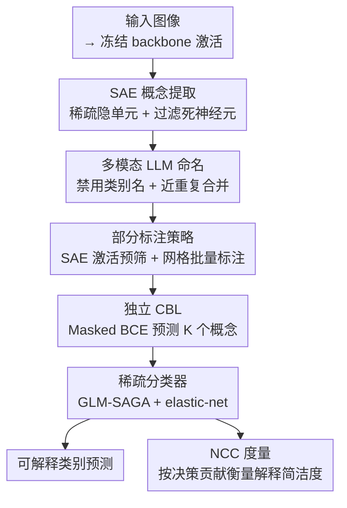

# Learning Concept Bottleneck Models from Mechanistic Explanations

**会议**: ICLR2026  
**arXiv**: [2603.07343](https://arxiv.org/abs/2603.07343)  
**代码**: [GitHub](https://github.com/Antonio-Dee/M-CBM)  
**领域**: 图学习  
**关键词**: Concept Bottleneck Model, Sparse Autoencoder, mechanistic interpretability, Explainable AI, Multimodal LLM

## 一句话总结

提出 Mechanistic CBM (M-CBM)，利用 Sparse Autoencoder 从黑盒模型自身学到的特征中提取概念，再由多模态 LLM 命名和标注，构建可解释的 Concept Bottleneck Model，在控制信息泄露的条件下显著优于现有 CBM 方法。

## 背景与动机

Concept Bottleneck Model (CBM) 是一类先验可解释模型，通过中间层预测可理解的概念，再由概念预测最终类别。现有 CBM 的概念来源主要有四种：人工指定、知识图谱、LLM 生成、CLIP 通用概念。然而这些先验概念存在两个根本问题：

1. **预测能力不足**：先验概念未必对目标任务有足够区分度，甚至在数据中不可学习（如医学图像中 LLM 生成的 "warm to the touch" 等非视觉概念）
2. **信息泄露严重**：Concept Bottleneck Layer (CBL) 会隐式编码类别相关信息，即使用随机词作为概念也能恢复接近黑盒精度，使解释失去意义

作者受机械可解释性（Mechanistic Interpretability）领域的启发——特别是 SAE 在解纠缠模型特征方面的成功——提出了一个核心问题：**能否直接从黑盒模型自身学到的概念出发，构建其可解释近似？**

## 核心问题

如何在不依赖先验概念集的前提下，构建概念瓶颈模型，使其同时满足：(1) 高任务精度，(2) 概念可学习且有预测力，(3) 解释简洁且信息泄露可控？

## 方法详解

### 整体框架

M-CBM 不再从外部知识库或 LLM 列举概念，而是把"概念"反向定义为黑盒模型自己学到的、可被解纠缠的内部特征。整条流水线分四步串起来：先用 Sparse Autoencoder (SAE) 把冻结 backbone 的激活拆成稀疏的候选概念，再让多模态 LLM 给每个候选概念命名并合并近重复，接着借 SAE 激活引导的部分标注为这些概念采集监督信号，最后用这些标签训练一个独立的概念瓶颈层 (CBL) 与稀疏分类器，得到一个可解释且能控制信息泄露的近似模型；评估解释简洁度时再用作者新提的 NCC 指标。

### 关键设计

**1. SAE 概念提取：把激活拆成稀疏的可解释单元**

CBM 的老问题是先验概念未必在数据里可学习，作者干脆从模型自身找概念。给定训练好的 backbone $\phi$，对每个样本的激活 $\mathbf{a}^{(i)} = \phi(\mathbf{x}^{(i)})$ 训练一个 SAE：编码器 $\mathbf{h} = \text{ReLU}(\mathbf{W}_E^\top(\mathbf{a} - \mathbf{b}_D) + \mathbf{b}_E)$ 把激活映射到一个更宽但稀疏的隐空间，解码器 $\hat{\mathbf{a}} = \mathbf{W}_D^\top \mathbf{h} + \mathbf{b}_D$ 再重构回去，目标为重构误差加 L1 稀疏惩罚

$$\mathcal{L}_{\text{SAE}} = \|\mathbf{a} - \hat{\mathbf{a}}\|_2^2 + \lambda_{\text{SAE}} \|\mathbf{h}\|_1$$

稀疏约束逼着每个隐单元只对少数语义模式响应，从而成为一个单义的候选概念。为了让后续 LLM 命名与标注成本可控，扩展因子 $m/n$ 压在 4 倍以内；同时按"移除后黑盒恢复的交叉熵损失上升不超过约 1%"为阈值过滤死亡和近死亡神经元，只保留真正承载信息的概念。

**2. 多模态 LLM 命名：给每个隐单元起一个不泄露类别的名字**

SAE 单元只是一串激活，要变成人能读的概念还得命名。对每个存活单元，作者取激活最强的 10 张图作正例，再配 10 张对比图（一半随机、一半是高余弦相似度的难负例），并基于解码器权重 $\mathbf{W}_D$ 生成加权特征图作为概念显著性图，把"模型在看哪里"也一并喂给 GPT-4.1，让它输出自然语言描述。关键约束是显式禁止使用类别名，违规就重试——这是从源头堵住信息泄露。最后用 text-embedding-3-large 嵌入所有概念名，把余弦相似度大于 0.98 的近重复概念合并，避免概念集冗余。

**3. 部分标注策略：用 SAE 激活引导高效打标签**

概念名只是假设，SAE 单元未必真按这个语义工作，所以不能直接拿 SAE 隐层当瓶颈，而要为每个概念采集监督信号去训练独立 CBL。全数据集标注代价过高，作者用 SAE 激活预筛：每个概念最多标 1000 张图（500 活跃 + 500 非活跃），活跃样本取激活在第 95 百分位以上的图，非活跃样本一半随机、一半是与活跃样本最相似的负例，两类都按类别分层以免标注偏向某类。标注时把 25 张图排成 5×5 网格连同参考网格送进 GPT-4.1 批量判断概念存在与否，结果记为三元向量 $z_k^{(i)} \in \{-1, 0, 1\}$（存在 / 缺失 / 未标注），未标注项在后续训练中被掩掉。

**4. 独立 CBL 与稀疏分类器：用部分标签把瓶颈和决策都训出来**

拿到三元标签后，CBL 从冻结 backbone 特征预测 $K$ 个概念，只在已标注样本对 $\Omega$ 上用 Masked BCE Loss 优化，并加类别不平衡权重以应对正负例失衡。概念 logit 经 z-normalize 后送入稀疏线性分类器，用 GLM-SAGA 求解器配 elastic-net 惩罚（$\alpha=0.99$）训练，通过调节 $\lambda_{\text{CLF}}$ 直接控制每个决策用到多少概念，从而在精度和解释简洁度之间取舍。

**5. NCC 稀疏度度量：在决策层面而非概念总数上衡量简洁度**

作者指出常用的 NEC（Number of Effective Concepts）会限制概念总数 $K$，对类内多样性高的数据集不公平——多样的类天然需要更多概念。于是改提 NCC（Number of Contributing Concepts），只看每个决策实际用到几个概念：

$$\text{NCC}_\tau = \frac{1}{|\mathbb{D}|C} \sum_i \sum_r \min\left\{\kappa : \sum_{s=1}^{\kappa} u_{(s),r}^{(i)} \geq \tau \sum_k u_{k,r}^{(i)}\right\}$$

其中 $u_{k,r}^{(i)} = |[g(\mathbf{a}^{(i)})]_k \cdot [\mathbf{W}_F]_{k,r}|$ 是概念 $k$ 对类别 $r$ 的绝对贡献，把贡献从大到小累加，数到覆盖比例 $\tau$ 需要的概念个数即为该样本该类的 NCC。这样衡量稀疏度不硬性砍掉概念总数，更适合多样性高的任务，也成为后续公平对比各方法的统一坐标轴。

## 实验关键数据

**数据集与 Backbone**：CUB (ResNet18, 200类)、ISIC2018 (ResNet50, 7类)、ImageNet (ResNet50, 1000类)

| 方法 | CUB NCC=5 | CUB avg | ISIC NCC=5 | ISIC avg | ImageNet NCC=5 | ImageNet avg |
|------|-----------|---------|------------|----------|----------------|--------------|
| 黑盒上限 | 76.67% | - | 79.37% | - | 76.15% | - |
| LF-CBM | 58.08% | 71.09% | 61.44% | 67.55% | 62.20% | 69.08% |
| DN-CBM (RN) | 38.21% | 48.98% | 35.38% | 54.61% | 46.71% | 57.24% |
| VLG-CBM_CA | 69.12% | 72.25% | 64.55% | 72.61% | N/A | N/A |
| **M-CBM** | **73.70%** | **74.18%** | **72.75%** | **75.51%** | **72.18%** | **73.64%** |

概念预测质量（ROC-AUC）：M-CBM 在 CUB 上 Macro 90.04% vs VLG-CBM_CA 62.03%，在 ISIC 上 80.57% vs 73.37%，显示从模型自身提取的概念更易学习。

**信息泄露验证**：在 CUB 上用随机词替换概念，原始 VLG-CBM 在 NCC=1.5 即达黑盒精度（严重泄露），去除类别条件标注后泄露减少，M-CBM 在低 NCC 区间显著优于随机基线。

## 亮点

1. **概念来源创新**：首次系统地将 SAE 提取的模型内部概念用于 CBM 构建，避免先验概念与任务不匹配的问题
2. **NCC 度量**：比 NEC 更灵活，在决策层面衡量解释简洁度，不限制概念总数
3. **信息泄露控制**：通过类别无关标注 + 稀疏度控制双管齐下，并用随机词实验定量展示泄露程度
4. **概念可学习性大幅提升**：ROC-AUC 从 62% 提升到 90%（CUB），证明模型自身概念确实更易学习
5. **高效标注策略**：用 SAE 激活预筛候选图像，每概念仅需标注 ~1k 张，避免全数据集标注的计算瓶颈

## 局限与展望

1. **概念学习仍是黑盒**：最终层可解释，但 CBL 本身仍是黑盒，缺乏系统方法验证概念是否按预期学习
2. **信息泄露未根除**：即使控制 NCC，随机词仍能达到远超随机的精度，泄露问题本质未解决
3. **SAE 需要人工监督**：不如其他方法即插即用，需确认 SAE 提取的概念可解释且标注质量可靠
4. **标注成本高**：每个概念 ~0.14 USD，ImageNet 2648 概念标注仍有较大开销
5. **仅限图像分类**：未扩展到检测、分割等视觉任务，也未探索非视觉域的迁移

## 与相关工作的对比

| 方法 | 概念来源 | 是否需 CLIP | 泄露控制 | ImageNet 可行性 |
|------|----------|------------|---------|----------------|
| LF-CBM | LLM 生成 + CLIP-Dissect | 否 | 稀疏惩罚 | 可行 |
| VLG-CBM | LLM 生成 + GroundingDINO | 否 | NEC | ~300 GPU-days，不可行 |
| DN-CBM | CLIP SAE 隐层 | 是（仅限CLIP） | 稀疏惩罚 | 可行但精度低 |
| **M-CBM** | 黑盒 SAE + MLLM 标注 | 否 | NCC | 可行且最优 |

DN-CBM 是最接近的先驱工作，也用 SAE，但受限于 CLIP backbone，且直接用 SAE 隐层作瓶颈而非训练独立 CBL。M-CBM 通过 MLLM 标注 + 独立 CBL 训练解决了这两个限制。

## 启发与关联

- SAE 在将黑盒模型特征分解为可解释概念方面的有效性为 **模型蒸馏** 和 **知识发现** 提供了新范式
- NCC 度量的思想（按贡献排序取覆盖阈值）可推广到其他需要稀疏解释的场景
- 部分标注策略（SAE 激活引导 + 网格批量标注）对大规模数据集的高效标注有借鉴意义
- 未来可结合电路级分析（circuit-level analysis）进一步增强概念间的因果关系建模

## 评分

- 新颖性: ⭐⭐⭐⭐ — 将 MI 领域的 SAE 工具引入 CBM 框架是自然但有效的创新
- 实验充分度: ⭐⭐⭐⭐ — 三个不同规模数据集 + 泄露分析 + 概念质量评估，但缺少 ViT backbone 的 M-CBM 实验
- 写作质量: ⭐⭐⭐⭐⭐ — 动机清晰、方法流程图直观、泄露分析深入
- 价值: ⭐⭐⭐⭐ — 为可解释 AI 提供了更务实的概念来源方案，NCC 度量值得推广

<!-- RELATED:START -->

## 相关论文

- [\[ICML 2025\] Towards Graph Foundation Models: Learning Generalities Across Graphs via Task-Trees](../../ICML2025/graph_learning/towards_graph_foundation_models_learning_generalities_across_graphs_via_task-tre.md)
- [\[ICML 2025\] From RAG to Memory: Non-Parametric Continual Learning for Large Language Models](../../ICML2025/graph_learning/from_rag_to_memory_non-parametric_continual_learning_for_large_language_models.md)
- [\[ACL 2025\] GraphNarrator: Generating Textual Explanations for Graph Neural Networks](../../ACL2025/graph_learning/graphnarrator.md)
- [\[NeurIPS 2025\] Sound Logical Explanations for Mean Aggregation Graph Neural Networks](../../NeurIPS2025/graph_learning/sound_logical_explanations_for_mean_aggregation_graph_neural_networks.md)
- [\[NeurIPS 2025\] GnnXemplar: Exemplars to Explanations -- Natural Language Rules for Global GNN Interpretability](../../NeurIPS2025/graph_learning/gnnxemplar_exemplars_to_explanations_--_natural_language_rules_for_global_gnn_in.md)

<!-- RELATED:END -->
