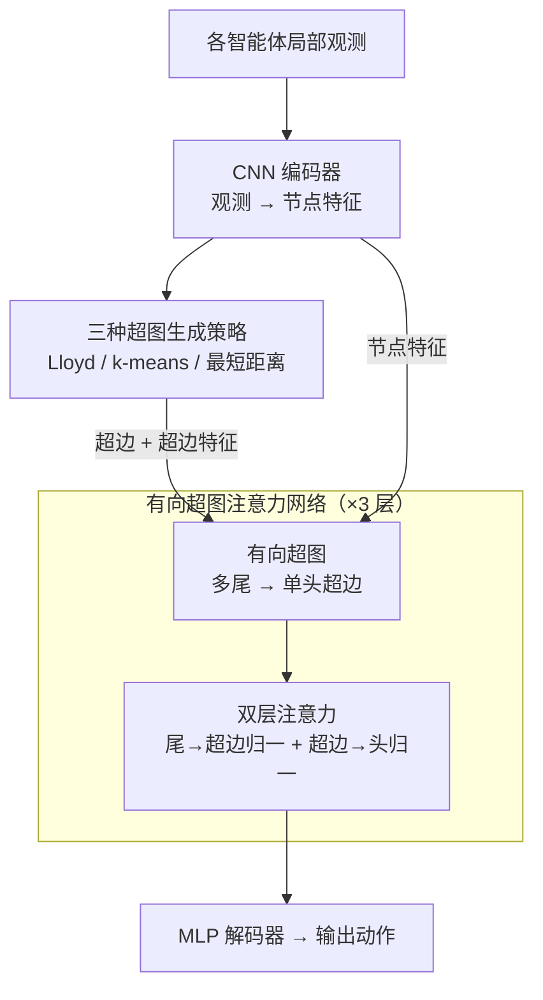

# Pairwise is Not Enough: Hypergraph Neural Networks for Multi-Agent Pathfinding

**会议**: ICLR2026  
**arXiv**: [2602.06733](https://arxiv.org/abs/2602.06733)  
**代码**: [GitHub](https://github.com/proroklab/HMAGAT)  
**领域**: 图学习  
**关键词**: MAPF, 超图神经网络, 注意力机制, 模仿学习, 群体交互  

## 一句话总结
提出 HMAGAT，用有向超图注意力网络替代 GNN 的成对消息传递来建模多智能体路径规划中的群体交互，仅用 1M 参数和 1% 训练数据即超越 85M 参数的 SOTA 模型。

## 背景与动机

**领域现状**：多智能体路径规划 (MAPF) 要求一队智能体无碰撞地各自抵达目标，最优求解是 NP-hard，因此实际系统普遍改用学习方法在线推断动作。主流策略骨架是「CNN 编码局部观测 → 智能体间消息传递 → MLP 解码动作」，消息传递层多用 GNN 或 Transformer。

**现有痛点**：GNN/Transformer 的消息传递本质都是**成对 (pairwise)** 交互——一条边只连两个智能体。而 MAPF 在十字路口、狭窄走廊这类高密度场景里，往往需要三个以上智能体**同时**协调才能避免死锁，成对交互无法表达这种不可分解的联合约束。更糟的是 GNN 把邻域里所有邻居放进同一个 softmax 竞争，高密度下大量无关智能体会**稀释 (attention dilution)** 掉关键交互的注意力权重。

**核心矛盾**：MAPF 本质是群体 (group) 规划问题——只有建模全体智能体的联合状态空间才能保证最优性与完备性，但现有架构的结构先验只到成对一级，天生表达不了高阶群体交互。

**切入角度**：超图 (hypergraph) 的超边能一次连接任意多个节点，天然适合编码群体交互。但已有超图工作只在 ~10 个智能体的简单场景（如轨迹预测里的社交分组）验证过，能否扩展到大规模、强耦合的复杂 MAPF 是一个开放问题。

**核心 idea**：把经典 MAPF 骨架里成对消息传递的 GNN 直接换成**有向超图注意力网络 (HGNN)**，用「多个智能体共同影响一个智能体决策」这一结构先验取代暴力堆数据/堆参数——并实验证明，正确的归纳偏置比模型规模更关键。

## 方法详解

### 整体框架

HMAGAT 沿用了 MAPF 学习方法的经典三段式骨架——CNN 编码器把每个智能体的局部观测压成特征向量，中间堆三层消息传递网络让智能体之间交换信息，最后用 MLP 解码出动作。它和上一代 MAGAT 唯一的区别，就是把中间那三层从成对消息传递的 GNN 换成了有向超图注意力网络 (HGNN)：每一帧先用一套启发式策略把当前智能体分组、构建出若干条超边，再让 HGNN 沿超边做两级注意力聚合，从而把"多个智能体同时影响某个智能体决策"这件事直接写进了网络的结构先验里。

### 关键设计

**1. 有向超图：用单头多尾结构装下"群体影响"**

GNN 的边只能连接两个节点，因此它建模的永远是 A 影响 B 这样的成对关系；当一个十字路口同时挤进三个智能体、必须三方协调才能避免死锁时，成对的边无法表达这种不可分解的联合约束。HMAGAT 改用有向超边，每条超边由多个尾节点（影响者）指向单个头节点（被影响者），于是"周围一群智能体共同决定我下一步怎么走"被自然地编码成一条超边。这正是论文标题"Pairwise is Not Enough"的字面含义——把交互的基本单元从一条边升格为一个群体。

**2. 双层注意力：在超边内部和超边之间各做一次归一化，避免注意力稀释**

信息聚合分两步走。先是尾→超边注意力 $\alpha_{ej}$：以头节点特征的均值作为 query，以尾节点特征拼接超边特征 $\mathbf{w}_{je}$ 作为 key-value，把超边内若干尾节点的信息汇成一个超边表示；再是超边→头注意力 $\alpha_{ie}$：以头节点作为 query、各超边表示作为 key-value，决定不同超边对头节点的贡献权重。关键在于两层 softmax 各自只在本层级内归一化——超边内部的竞争和超边之间的竞争被解耦。相比之下，GNN 把所有邻居放在同一个 softmax 里竞争，邻域里有 $n$ 个邻居、其中 $k$ 个才是关键时，关键邻居分到的注意力约为 $k/n$，随密度 $n$ 增大不断衰减，这就是高密度场景下 GNN 失效的"注意力稀释"根源。超边把相关智能体圈进一个小范围内单独归一化，外部的无关智能体再多也稀释不进来。

**3. 三种超图生成策略：在不同规模和地形下决定"谁和谁组成一条超边"**

超边本身不是学出来的，而是在每一帧用启发式规则现场构建，论文给了三套互补方案。Lloyd 超图基于 Voronoi 划分再加"软边界"做重叠分组，分组质量高、适合中等规模，但更新质心要 $O(|V|^3)$ 时间、大图上吃不消；k-means 超图改用聚类加同样的软边界操作，复杂度降到 $O(k|V|)$，专为大图设计；最短距离超图按智能体间的最短路径距离分组，在障碍物密集、欧氏距离会误导的地图上更可靠。无论哪种策略，构建出的每条超边都会附带超边特征 $\omega_{je}$（成员间的相对位置坐标加曼哈顿距离，再经 MLP $\phi$ 编码成 $\mathbf{w}_{je}$），让注意力层能感知群体的空间布局。

### 损失函数 / 训练策略

主体是模仿学习：用 lacam3 专家求解器在 21K 个实例上收集示范轨迹，再用交叉熵损失让网络模仿专家动作——相比 MAPF-GPT 所需的 3.75M 实例少了约 178 倍。训练中可选开启 DAgger，让专家在线纠正策略漂移到的状态。此外有两个提质模块：后训练阶段在中等难度实例上继续微调，目标是提升解的质量（路径更短）而非仅仅提高成功率；RL 温度采样模块则单独训一个小模型，根据局势动态调节 softmax 温度 $\tau \in [0.5, 1.0]$，在拥堵时让策略更确定、减少犹豫导致的无效动作。

## 实验关键数据

### 主实验对比

| 指标 | HMAGAT (1M, 21K 实例) | MAPF-GPT (85M, 3.75M 实例) | MAGAT (GNN) |
|------|------------|----------------|-------------|
| 参数量 | ~1M (1.2%) | 85M (100%) | ~1M |
| 训练数据 | 21K (~0.56%) | 3.75M (100%) | 21K |
| Dense Warehouse 成功率 | **75%+** | <11% | ~5% |
| ost003d 大地图 | ✓ 可扩展 | ✗ OOM | ✓ |
| 小地图平均 SoC | **最优** | 较优 | 较差 |

## 消融实验与深入分析

| 组件消融 | Dense Warehouse 成功率 | 说明 |
|----------|---------------------|------|
| Full HMAGAT | **39.8%** | 完整模型 |
| HGNN → GNN (MAGAT) | 2.3% | 超图层是核心——退化到成对交互后性能崩塌 |
| 无后训练 | ~30% | 后训练在中等/高密度场景中有 ~10% 提升 |
| 无温度采样 | ~35% | 温度采样减少不确定性动作 |
| Lloyd → k-means 超图 | ~37% | k-means 稍弱但计算更便宜，适合大图 |

### 注意力稀释分析
- 在 GNN 中，随着邻域密度增加，关键交互的注意力权重被大量无关智能体稀释
- 作者证明：在 $n$ 个邻居中有 $k$ 个关键邻居，GNN 分配给关键邻居的注意力约为 $k/n$→随 $n$ 增大衰减
- HGNN 通过超边限定注意力范围——每个超边只含少量相关智能体，注意力不被外部稀释
- 手工构造场景验证：三智能体十字路口场景中，GNN 无法捕获三方协调而 HGNN 可以

### 大规模可扩展性

| 地图 | HMAGAT | MAPF-GPT | 说明 |
|------|--------|----------|------|
| ost003d (194×194) | ✓ 可扩展 | ✗ 无法运行 | MAPF-GPT 的 Transformer 在大地图上 OOM |
| warehouse (高密度) | **75%+** | <11% | HMAGAT 在高密度场景大幅领先 |

## 亮点与洞察
- **归纳偏置 > 数据量/参数量**是最核心的结论——1% 参数 + 1% 数据胜过 85M 大模型，说明在有明确结构的问题上，正确的架构先验（超图）比暴力堆叠数据更有效
- **注意力稀释**的形式化分析和实验验证提供了 GNN 在高密度场景失败的清晰解释
- **手工构造场景**作为"最小失败案例"非常有说服力——直观地展示了为什么三智能体的联合协调无法被分解为三个成对交互
- **实用的超图生成策略**：Lloyd 超图基于 Voronoi 划分，k-means 超图适合大规模——为实际部署提供了灵活选择

## 局限与展望
- 超图生成策略依赖预设的通信半径 $R^{\text{comm}}$ 和颜色数量——未自适应学习最佳超图结构
- 仅在网格环境上评估，未拓展到连续空间或更复杂拓扑（如三维空间）
- 模仿学习仍依赖专家求解器质量——如果专家次优，学出的策略也会次优
- 超图构建本身有额外计算开销——在智能体数量极大（>1000）时的可扩展性需要验证
- 超边的大小（包含的智能体数量）是超图生成策略隐式决定的，未显式分析最佳超边大小

## 相关工作与启发
- **vs MAGAT (Li et al.)**：在完全相同的框架（CNN+消息传递+MLP）下，仅将 GNN 层替换为 HGNN 层——直接证明超图是性能提升的唯一因素
- **vs MAPF-GPT (Andreychuk et al.)**：85M 参数的 GPT 式模型在 375 万实例上训练，HMAGAT 用 1M 参数 + 2.1 万实例超越——模型设计的重要性远超暴力缩放
- **vs SCRIMP (Wang et al.)**：SCRIMP 用 Transformer 建模通信，本质上仍是全对全的成对注意力——在高密度场景同样受注意力稀释困扰
- **vs HyperComm (Zhu et al.)**：HyperComm 首次将超图用于多智能体通信，但仅在 ~10 个智能体的简单场景验证；HMAGAT 首次推向大规模强耦合 MAPF
- **启发**：超图建模"群体交互"的思路可推广到交通管理、机器人集群协调、甚至蛋白质-蛋白质相互作用网络等任何需要建模多体效应的场景

## 评分
- 新颖性: ⭐⭐⭐⭐ 超图 + MAPF 是首次，归纳偏置论点有说服力
- 实验充分度: ⭐⭐⭐⭐⭐ 多地图、消融、注意力分析、手工场景全覆盖
- 写作质量: ⭐⭐⭐⭐ 结构清晰，图表丰富，Figure 1 的三面板设计极其有效
- 价值: ⭐⭐⭐⭐ 对多智能体学习的归纳偏置讨论有广泛启发

### 综合评价
本文最有说服力的地方不是性能数字本身，而是 1M vs 85M 参数、21K vs 3.75M 数据量的极端对比——这直接证明了在有明确结构的问题上，正确的归纳偏置（超图建模群体交互）比暴力堆叠数据和参数更有效。这对多智能体学习、图神经网络和大模型时代的"大力出奇迹"思维都是有价值的反思。

<!-- RELATED:START -->

## 相关论文

- [\[ACL 2026\] EA-Agent: A Structured Multi-Step Reasoning Agent for Entity Alignment](../../ACL2026/graph_learning/ea-agent_a_structured_multi-step_reasoning_agent_for_entity_alignment.md)
- [\[AAAI 2026\] S-DAG: A Subject-Based Directed Acyclic Graph for Multi-Agent Heterogeneous Reasoning](../../AAAI2026/graph_learning/s-dag_a_subject-based_directed_acyclic_graph_for_multi-agent.md)
- [\[ICLR 2026\] Cooperative Sheaf Neural Networks](cooperative_sheaf_neural_networks.md)
- [\[ACL 2026\] LegalGraphRAG: Multi-Agent Graph Retrieval-Augmented Generation for Reliable Legal Reasoning](../../ACL2026/graph_learning/legalgraphrag_multi-agent_graph_retrieval-augmented_generation_for_reliable_lega.md)
- [\[ICLR 2026\] Beyond Simple Graphs: Neural Multi-Objective Routing on Multigraphs](beyond_simple_graphs_neural_multi-objective_routing_on_multigraphs.md)

<!-- RELATED:END -->
