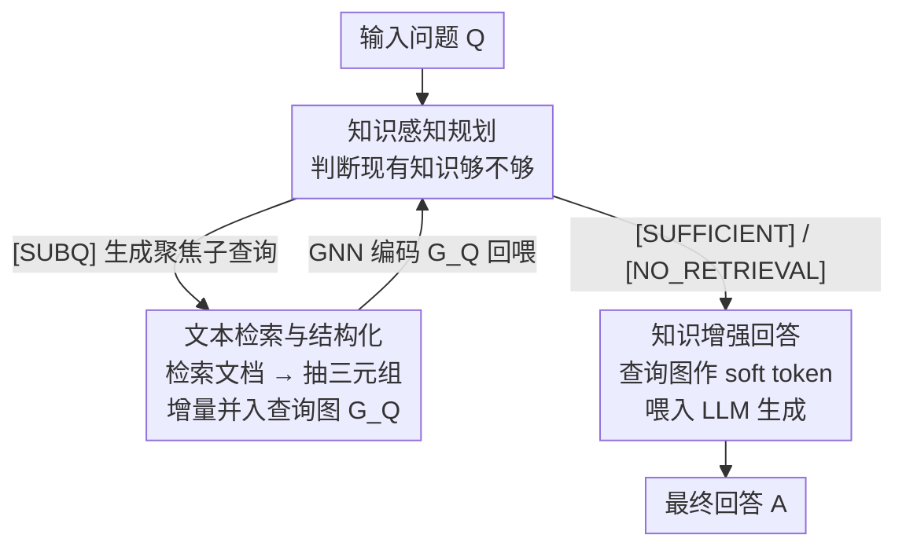

# RAS: Retrieval-And-Structuring for Knowledge-Intensive LLM Generation

**会议**: ICLR 2026  
**arXiv**: [2502.10996](https://arxiv.org/abs/2502.10996)  
**代码**: 有  
**领域**: 图学习  
**关键词**: 检索增强生成, 知识图谱构建, 迭代检索, 图结构化推理, LLM 生成

## 一句话总结

提出 RAS 框架，在推理时为每个问题动态构建查询特定的知识图谱，通过迭代检索规划、文本到三元组转换和图增强回答三个阶段实现结构化推理，在 7 个知识密集型基准上对开源和闭源 LLM 分别取得最高 7.0% 和 8.7% 的提升。

## 研究背景与动机

RAG 虽然为 LLM 提供外部知识，但检索到的文本是非结构化的，存在以下问题：

**隐式推理链脆弱**：LLM 必须在内部桥接不同段落间的逻辑间隙，失败时导致幻觉

**现有 KG-RAG 方法依赖静态全局图**：如 GraphRAG 需要对全库建图，Wikipedia 2018 就需要数百万次 LLM 调用、数万美元成本

**全局图质量问题**：混合多个文档的证据，可能包含矛盾或模糊关系（如同一药物的正负关联）

可解释性研究（Lindsey et al., 2025）表明 LLM 错误往往源于隐式推理链的失败，这强化了显式结构化中间知识的必要性。

**核心思想**：不预建全局 KG，而是在推理时为每个查询"按需"构建轻量级的查询特定知识图谱。

## 方法详解

### 整体框架

RAS 想解决的是：RAG 检索回来的文本是一堆零散段落，LLM 得在脑子里自己把跨段落的逻辑接上，接不上就幻觉。它的思路是别让 LLM 隐式地接，而是在推理时把检索到的文本现场结构化成一张「查询特定」的小知识图，再让模型基于这张图回答。

整篇流程是一个可以多轮循环的三段式：先**知识感知规划（Planning）**判断现有知识够不够、不够就生成一个聚焦的子查询；然后**文本检索与结构化（Text Retrieval & Structuring）**拿子查询去检索文档、抽成三元组、增量并进当前查询图 $G_Q$；最后在知识判定为足够时进入**知识增强回答（Answering）**，基于累积的图生成回答。规划与回答之间可以来回多轮（最多 5 次迭代），图随着每轮检索越长越大。关键是这三段都由同一个 Graph LLM 驱动——一个 LLM 主干加图神经网络（GNN）编码，再用 LoRA 微调，靠**结构感知多任务学习**把规划和回答统一进一个模型，而不是三个独立模块拼起来。

### 关键设计

**1. 知识感知规划：让模型自己判断该不该再检索、检索什么**

这一步直接对应「隐式推理链脆弱」的痛点——与其让 LLM 闷头硬接逻辑，不如显式地一步步把缺的知识补齐。最初拿到问题时，模型先决定走 [SUBQ]（需要检索，初始子查询就等于原问题）还是 [NO_RETRIEVAL]（知识已在参数里、直接回答）。进入迭代后，模型在当前累积知识图 $G_i$ 和历史子查询链 $[q_0, g_0, ..., q_i, g_i]$ 的条件下做下一步决策：要么输出 [SUBQ] $q_{i+1}$ 生成一个更聚焦的新子查询继续补知识，要么输出 [SUFFICIENT] 表示够了、转去回答。这个决策由下式给出，注意条件里既喂了图编码 $\text{GNN}(G_i)$ 也喂了文本形式的子查询链，让模型同时看到「结构化的已知」和「问过的问题」：

$$p_{i+1} \leftarrow \mathcal{M}(\text{GNN}(G_i); \text{INST}_{\text{Plan}}; [q_0, g_0, ..., q_i, g_i]; Q)$$

**2. 文本检索与结构化：把检索到的非结构化文本现场转成图并增量合并**

这是 RAS 区别于普通 RAG 的核心——不直接把段落塞给 LLM，而是先结构化。拿到子查询后，先用 dense retriever（默认 Contriever-MS MARCO）检索 top-k 文档；再用一个轻量的 Text-to-Triples 模型 $f_{t2t}$（基于 LLaMA-3.2-3B-Instruct、在 WikiOfGraph 数据集上训练）把文本抽成 $(s, r, o)$ 三元组；这些三元组组成局部图结构 $g'_i = (V_i, E_i)$，节点和边的属性用 Sentence-BERT 编码后，增量并入这次查询专属的全局图 $G_Q$：

$$G_Q \leftarrow G_Q \cup g'_i$$

之所以「按需建查询特定图」而不是像 GraphRAG 那样预建全局 KG，是因为全局建图既贵（Wikipedia 全库要数百万次 LLM 调用）又会把多文档的矛盾证据混到一起；每次只为当前问题攒一张小图，既省成本又避开了全局图的噪声。

**3. 知识增强回答：让结构化的图以 soft token 形式参与生成**

当 Planning 判定知识足够，模型基于编码后的查询图 $G_Q$ 和子查询链生成最终回答：

$$A \leftarrow \mathcal{M}(\text{GNN}(G_Q); \text{INST}_{\text{Ans}}; [q_0, g_0, ..., q_i, g_i]; Q)$$

这里 GNN 把整张图编码成一段图表示，作为 soft token 拼到 LLM 的输入序列里——图不是被翻译成文字再读，而是直接以向量形式喂进去，让模型的回答锚定在显式结构化的知识上，而非脆弱的隐式推理。

**4. 结构感知多任务学习：用一个 LLM 同时学规划和回答**

Planning 和 Answering 这两个任务并不分给两个模型，而是由同一个 LLM 用标准的 next-token prediction 目标一起训练，训练时在两个任务间随机采样。参数高效靠 LoRA 微调主干、同时一并优化图组件（GNN encoder）。一个模型扛两个角色既省参数，也让规划和回答共享同一套对图结构的理解。

### 损失函数 / 训练策略

- **训练数据**：基于 HotpotQA 构建 HotpotQA-SUBQ 数据集（208K 样本），包含迭代子查询、[SUFFICIENT]、[NO_RETRIEVAL] 标签
- **基座模型**：LLaMA-2-7B 或 LLaMA-3-8B + Graph Transformer encoder
- **训练方式**：LoRA 微调 + 图组件参数训练，多任务随机采样 Planning / Answering 任务
- **Triple 提取器**：LLaMA-3.2-3B 在 WikiOfGraph 上训练，以 vLLM 部署
- **检索库**：Wikipedia 2018（faiss 索引，分 5 段），PopQA 用 Wikipedia 2020
- **最大迭代次数**：5 次

## 实验关键数据

### 主实验

**7 个基准**：TriviaQA、2WikiMultihopQA、PopQA（开放域短文本）、PubHealth、ARC-C（封闭题）、ASQA、ELI5（长文本生成）

| 模型 | TQA(acc) | 2WQA(F1) | PopQA(acc) | Pub(acc) | ARC(acc) | ASQA(rg/mv) | ELI5(rg/mv) |
|------|----------|----------|------------|----------|----------|-------------|-------------|
| Self-RAG 7B | 66.4 | 25.1 | 54.9 | 72.4 | 67.3 | 35.7/74.3 | 17.9/35.6 |
| RPG 7B | 65.1 | 33.6 | 56.0 | 73.4 | 65.4 | 37.6/84.4 | 19.1/46.4 |
| **RAS 7B** | **72.7** | **42.1** | **58.3** | **74.7** | **68.5** | **37.2/95.2** | **19.7/47.8** |
| Sonnet-3.5+RAG | 72.5 | 53.7 | 57.3 | 53.9 | 87.1 | 38.8/61.6 | 20.2/32.3 |
| **RAS Sonnet-3.5** | **77.6** | **57.7** | **62.3** | **71.3** | **93.9** | **39.1/70.5** | **23.3/37.7** |

RAS 7B 相比前 SOTA（Self-RAG/RPG）：短文本 QA 提升 9.7%，长文本生成提升 7.9%。

### 消融实验

| 变体 | TQA | 2WQA | Pub | ASQA(rg/mv) |
|------|-----|------|-----|-------------|
| RAS 7B（完整） | 72.7 | 42.1 | 74.7 | 37.2/95.2 |
| w/o GraphEncode（训练） | 70.2 | 38.4 | 66.4 | 33.1/85.0 |
| w/o LoRA | 71.5 | 37.8 | 54.8 | 32.8/84.8 |
| w/o Text-to-Triple | 70.4 | 38.2 | 71.4 | 36.2/73.8 |
| w/o Multi-Task | 68.6 | 39.2 | 65.5 | 36.7/88.9 |
| w/o Retrieval（推理） | 56.9 | 27.4 | 69.0 | 31.3/70.6 |
| w/o Planning（推理） | 66.7 | 37.8 | 71.5 | 37.2/95.2 |

### 关键发现

1. **图结构化至关重要**：去掉 Text-to-Triple 导致 ASQA MAUVE 从 95.2 降到 73.8（-22.4%）；去掉 GraphEncode 导致 PubHealth 降 11.2%
2. **迭代规划有显著价值**：去掉 Planning 后 TQA 降 8.8%、2WQA 降 9.0%
3. **角色交换实验**：RAS 7B 的规划能力与 Sonnet-3.5 旗鼓相当，但回答能力是主要瓶颈
4. **信息量线性增长**：保留 30-50% 的三元组就已有明显提升，100% 时仍未饱和
5. **Triple 提取器选择**：Claude-3.5-Sonnet 最佳但效率低（68 tokens/s）；LLaMA-3.2-3B 兼顾精度和效率（4885 tokens/s）
6. **数据效率高**：仅用 5% 训练数据（10K 样本）已在 TQA、2WQA、ELI5 上超过前 SOTA

## 亮点与洞察

- **查询特定KG替代全局KG**：避免了全库建图的天文成本和全局图的噪声问题，每次推理只构建相关子图
- **检索-结构化-推理统一框架**：Planning / Structuring / Answering 通过单一 Graph LLM 端到端完成，而非独立模块拼接
- **MAUVE 分数极高**：RAS 7B 在 ASQA 上 MAUVE=95.2，说明生成的长文本不仅准确而且自然流畅
- **模块化设计灵活**：Planning 和 Answering 可解耦，支持用更强模型做回答、弱模型做规划

## 局限与展望

1. 开源版本（7B/8B）与闭源模型差距仍大，尤其 ARC-C（68.5 vs 93.9）
2. Triple 提取器为独立模型，增加系统复杂度和延迟（可考虑端到端训练）
3. 最大 5 次迭代可能不足以应对更复杂的多跳推理链
4. 图编码用的是简单 GNN，未探索更强的图 Transformer 或结构化注意力
5. ELI5 数据集上表现不稳定，可能受训练数据分布偏移影响

## 相关工作与启发

- **vs GraphRAG / G-Retriever**：这些方法依赖预构建的全局 KG，成本高且引入噪声；RAS 按需动态构建
- **vs Self-RAG / RPG**：共享自反思/迭代检索思路，但 RAS 额外将检索内容结构化为图
- **vs Chain-of-Thought**：RAS 的子查询链可视为显式的推理链，但增加了结构化知识的锚定
- 启发：未来可将 RAS 的图构建思路与强化学习（如 Search-Agent）结合，让 agent 学习何时结构化、何时直接回答

## 评分

- 新颖性：★★★★☆ — 动态查询特定 KG 构建是有价值的新范式
- 技术深度：★★★★☆ — 多模块集成完整，多任务训练设计合理
- 实验充分度：★★★★★ — 7 个基准、多种设置、全面消融、开源+闭源对比
- 写作质量：★★★★☆ — 流程图清晰，实验组织有序

<!-- RELATED:START -->

## 相关论文

- [\[ACL 2025\] Knowledge Graph Retrieval-Augmented Generation for LLM-based Recommendation (K-RagRec)](../../ACL2025/graph_learning/kg_rag_recommendation.md)
- [\[CVPR 2026\] M3KG-RAG: Multi-hop Multimodal Knowledge Graph-enhanced Retrieval-Augmented Generation](../../CVPR2026/graph_learning/m3kg_rag_multi_hop_multimodal_knowledge_graph_enhanced_retrieval_augmented_genera.md)
- [\[ACL 2026\] MegaRAG: Multimodal Knowledge Graph-Based Retrieval Augmented Generation](../../ACL2026/graph_learning/megarag_multimodal_knowledge_graph-based_retrieval_augmented_generation.md)
- [\[ACL 2026\] TagRAG: Tag-guided Hierarchical Knowledge Graph Retrieval-Augmented Generation](../../ACL2026/graph_learning/tagrag_tag-guided_hierarchical_knowledge_graph_retrieval-augmented_generation.md)
- [\[ACL 2025\] SimGRAG: Leveraging Similar Subgraphs for Knowledge Graphs Driven Retrieval-Augmented Generation](../../ACL2025/graph_learning/simgrag_leveraging_similar_subgraphs_for_knowledge_graphs_driven_retrieval-augme.md)

<!-- RELATED:END -->
