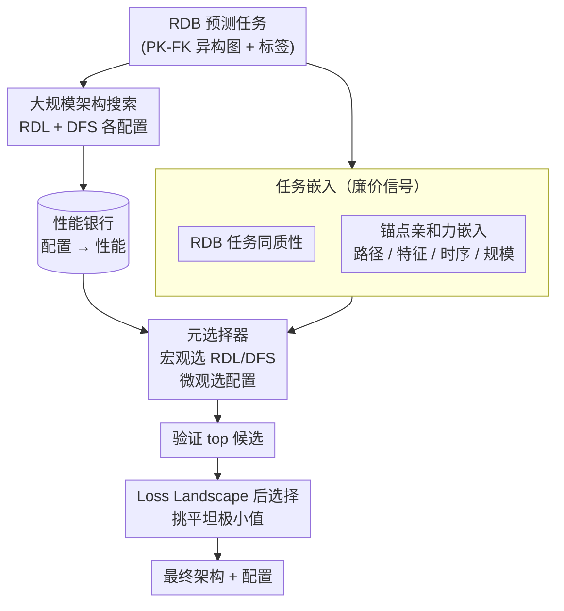

# Relatron: Automating Relational Machine Learning over Relational Databases

**会议**: ICLR 2026  
**arXiv**: [2602.22552](https://arxiv.org/abs/2602.22552)  
**代码**: [https://github.com/amazon-science/Automating-Relational-Machine-Learning](https://github.com/amazon-science/Automating-Relational-Machine-Learning)  
**领域**: 图学习 / AutoML  
**关键词**: 关系数据库, 图神经网络, 深度特征合成, 架构选择, 同质性

## 一句话总结
系统比较关系深度学习（RDL/GNN）和深度特征合成（DFS）在关系数据库预测任务上的性能，发现两者各有优势且高度任务依赖，提出 Relatron——基于任务嵌入的元选择器，通过 RDB 任务同质性和亲和力嵌入实现自动架构选择，在联合架构-超参搜索中提升达 18.5%。

## 研究背景与动机

**领域现状**：关系数据库（RDB）上的预测建模有两大路线：DFS（程序化组合聚合原语生成特征表，再用表格学习器）和 RDL（在异构实体-关系图上端到端训练 GNN）。两者都优于关系无关的基线。

**现有痛点**：两种范式何时更优完全未知。从业者缺乏选择 DFS vs RDL 的原则性指导。验证性能常常是不可靠的选择代理——更多搜索反而导致更差的测试性能（"越调越差"效应）。

**核心矛盾**：(a) 没有单一架构在所有任务上占优；(b) 验证集选择的配置与测试最优配置之间存在显著差距，尤其在时序分割导致分布偏移时。

**本文目标**：给定 RDB 任务，自动选择 RDL 还是 DFS，以及具体架构配置。

**切入角度**：通过大规模架构搜索构建"性能银行"，分析驱动 RDL-DFS 性能差距的因素，发现 RDB 任务同质性和训练规模是关键预测因子。

**核心 idea**：同质性高 → DFS 线性聚合就够；同质性低 → RDL 的非线性聚合有优势。通过任务嵌入（同质性+亲和力+规模）训练元分类器，实现自动宏观和微观架构选择。

## 方法详解

### 整体框架

Relatron 把"该用 RDL 还是 DFS、用什么配置"这个选择问题，转化成一个由任务嵌入驱动的元分类问题。它先对 RDL 和 DFS 两条路线做大规模架构搜索，把每个任务上各配置的性能存成"性能银行"；再为每个 RDB 任务计算一组可廉价获得的任务嵌入特征——RDB 任务同质性、锚点亲和力（含路径、特征、时序、训练规模四类信号）；接着用这些嵌入训练一个元选择器，先在宏观层做 RDL/DFS 路线选择、再在微观层做具体配置选择；最后在验证性能领先的少数候选里，用 Loss Landscape 几何指标挑出对分布偏移更鲁棒的检查点。

### 关键设计

**1. RDB 任务同质性：用一个标量刻画"标签沿关系是否一致"，从而预判 RDL 还是 DFS 占优**

作者的核心观察是：DFS 用的是线性聚合原语，只有当相邻实体的标签倾向一致时才好用；而 RDL 的 GNN 能学非线性聚合，在标签信号互相矛盾时反而能翻转贡献符号。于是需要一个量来衡量任务的这种"一致性"。他们在增强后的异构实体-关系图上定义自循环元路径 $m$，把同质性写成沿该元路径相邻预测目标的平均相似度 $H(\mathcal{G};m) = \frac{1}{|\mathcal{E}_m|}\sum \mathcal{K}(\hat{y}_u, \hat{y}_v)$，其中分类任务用点积度量、回归任务用 Pearson 相关度量；为了不被类别不平衡误导，还引入调整同质性（adjusted homophily）做校正。这个指标确实抓住了关键规律：调整同质性与 RDL-DFS 性能差距的 Spearman $\rho = -0.43$（$p < 0.05$），即同质性越低，RDL 相对 DFS 的优势越大——这正是把宏观选择（选路线）建立在同质性上的依据。

**2. 锚点亲和力嵌入：在同质性之外补齐路径、特征、时序、规模四类廉价信号，让元选择器看得更全**

同质性只反映了消息传递的偏好，不足以决定具体配置，所以作者再叠加一组"锚点亲和力"嵌入，关键是每一项都做到近乎零训练成本。路径亲和力用随机初始化的 GraphSAGE / NBFNet 做单次前向、再拟合一个线性头，借此判断任务更偏好哪类路径模型；特征亲和力直接用 TabPFN 在无需训练的情况下给出验证性能，反映表格特征本身的质量；时序亲和力统计标签随时间的变化量，刻画时序分割下的分布漂移；最后再拼上 $\log(N_{train})$ 表示训练规模。把这几路信号和同质性串起来，元选择器既能做宏观的 RDL/DFS 选择，也能做微观的配置选择，而代价远低于需要反复训练的传统任务嵌入。

**3. Loss Landscape 后选择：在验证领先的候选里，用极小值的平坦度挑出对分布偏移更鲁棒的那个**

由于时序分割会带来验证-测试分布偏移，验证性能最高的配置未必测试最好（即"越调越差"）。作者的思路是：验证-测试差距会体现在损失曲面的几何上，越平坦的极小值越抗偏移。于是在验证性能 top 候选中再引入三个曲面指标做后选择——一阶指标 $P_1$ 取局部最差的有限差分斜率，二阶指标 $P_2$ 取 Hessian 最大特征值，能量势垒 $P_{bar}$ 取沿随机射线方向的最大损失隆起；三者都偏好更平坦、更宽的极小值。这一步不改训练，只是把泛化稳健性当作额外的选择准则，挑出更可能在测试集上保持性能的检查点。

### 损失函数 / 训练策略

元分类器在性能银行上以留一法（LOO）训练和评估，输入即上述同质性、亲和力统计与时序特征。整套流程的一大卖点是高效：因为亲和力嵌入都走零训练或单次前向路径，元选择的计算时间约为基于 Fisher 信息矩阵方法（如 Autotransfer）的 1/10。

## 实验关键数据

### 主实验

| 方法 | LOO 准确率 (val选择) | LOO 准确率 (test选择) | 平均计算时间 |
|------|---------------------|---------------------|-------------|
| Model-free (ours) | 87.5% | 79.2% | 0.48 min |
| Training-free model | 66.7% | 66.7% | 5 min |
| Autotransfer (anchor) | 66.7% | 66.7% | 50 min |
| Simple heuristic | 70.8% | 75.0% | 0 min |

联合 HPO 中 Relatron 比强基线最多提升 18.5%，且计算成本 10× 更低。

### 消融实验

| 配置 | Kendall相关(无g) | Kendall相关(有g) | 说明 |
|------|----------------|----------------|------|
| Model-free | 0.066 | 0.163 | 最佳任务相似性 |
| Training-free | -0.038 | -0.030 | 负相关 |
| Autotransfer | -0.049 | -0.011 | 昂贵且负相关 |

### 关键发现
- **RDL 不总优于 DFS**：性能高度任务依赖，两者各有明显优势领域
- **宏观选择解决了大部分问题**：选对 RDL/DFS 后，验证-测试差距显著缩小
- **同质性是最强预测因子**：调整同质性与 RDL-DFS 差距的 Spearman $\rho = -0.43$
- **越调越差效应**：更多搜索预算反而可能降低性能——Relatron 的宏观选择有效缓解
- **验证不可靠**：时序分割下验证选择的配置与测试最优差距大

## 亮点与洞察
- **DFS 的被低估**：在合适任务上 DFS 完全可以击败复杂的 GNN，关键是匹配任务属性
- **同质性驱动 RDL 优势**的理论解释：低同质性时线性聚合会混淆正负信号，RDL 可学习关系权重翻转贡献
- **loss landscape 后选择**是实用的泛化指标，可迁移到其他 AutoML 场景

## 局限与展望
- 任务嵌入相关性整体偏低（Kendall $\tau$ 最高 0.163），迁移 HPO 效果有限
- 未纳入基础模型（如 KumoRFM）
- 性能银行规模有限（< 20 任务），元学习需要更大规模
- Loss landscape 指标仅适用于同家族内比较

## 相关工作与启发
- **vs KumoRFM**：关系基础模型性能强但细节未公开。Relatron 聚焦于从头训练的高效场景
- **vs Autotransfer**：基于 Fisher 信息矩阵的任务嵌入计算成本高且在 RDB 上效果不佳
- **vs Griffin**：跨表注意力但常输给 GNN

## 评分
- 新颖性: ⭐⭐⭐⭐ RDB 任务同质性定义新颖，但方法框架本身是标准元学习
- 实验充分度: ⭐⭐⭐⭐⭐ 17 任务、大规模架构搜索、性能银行、多层面消融，非常全面
- 写作质量: ⭐⭐⭐⭐ 结构清晰，理论分析有深度
- 价值: ⭐⭐⭐⭐⭐ 解决了 RDB ML 的关键实践痛点，性能银行有长期研究价值

<!-- RELATED:START -->

## 相关论文

- [\[ICLR 2026\] Relational Graph Transformer](relational_graph_transformer.md)
- [\[ICML 2026\] Generative Representation Learning on Hyper-relational Knowledge Graphs via Masked Discrete Diffusion](../../ICML2026/graph_learning/generative_representation_learning_on_hyper-relational_knowledge_graphs_via_mask.md)
- [\[NeurIPS 2025\] MoEMeta: Mixture-of-Experts Meta Learning for Few-Shot Relational Learning](../../NeurIPS2025/graph_learning/moemeta_mixture-of-experts_meta_learning_for_few-shot_relational_learning.md)
- [\[ICLR 2026\] A Geometric Perspective on the Difficulties of Learning GNN-based SAT Solvers](a_geometric_perspective_on_the_difficulties_of_learning_gnn-based_sat_solvers.md)
- [\[ICML 2026\] Rethinking Feature Alignment in Generalist Graph Anomaly Detection: A Relational Fingerprint-based Approach](../../ICML2026/graph_learning/rethinking_feature_alignment_in_generalist_graph_anomaly_detection_a_relational_.md)

<!-- RELATED:END -->
