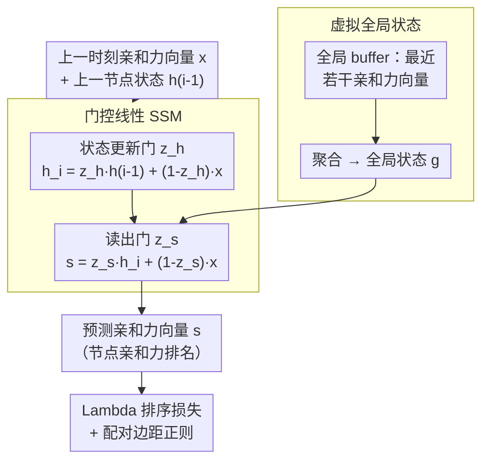

# Revisiting Node Affinity Prediction in Temporal Graphs

**会议**: ICLR 2026  
**arXiv**: [2510.06940](https://arxiv.org/abs/2510.06940)  
**代码**: [https://github.com/orfeld415/NAVIS](https://github.com/orfeld415/NAVIS)  
**领域**: 图学习 / 时序图  
**关键词**: 时序图神经网络, 节点亲和力预测, 状态空间模型, 排序损失, 全局状态

## 一句话总结
分析为什么简单启发式（持续预测、移动平均）在时序图节点亲和力预测上优于复杂 TGNN，证明启发式是线性 SSM 的特例且标准 RNN/LSTM/GRU 无法表达最基本的持续预测，据此提出 NAViS——基于虚拟全局状态的线性 SSM 架构配合排序损失，在 TGB 上超越所有基线。

## 研究背景与动机

**领域现状**：时序图（CTDG）节点亲和力预测要求给定查询节点 $u$，预测其与所有其他节点在未来时间的亲和力排名。TGN、TGAT、DyGFormer 等 TGNN 在链路预测上表现优异。

**现有痛点**：简单启发式（持续预测、移动平均）在亲和力预测上一致优于所有 SOTA TGNN——这是一个令人困惑且少有解释的现象。

**核心矛盾**：复杂的 TGNN 模型为什么连最简单的启发式都打不过？问题出在表达能力（非线性更新无法保持线性记忆）、损失函数不匹配（交叉熵不适合排序）、局部采样丢失全局时序动态、以及批处理导致信息丢失。

**本文目标**：(a) 理论解释 TGNN 的不足；(b) 设计能泛化启发式的更强架构；(c) 解决损失函数不匹配。

**切入角度**：证明启发式（PF/EMA/SMA）是线性 SSM 的特例（Theorem 1），而标准 RNN/LSTM/GRU 连 PF 都表达不了（Theorem 2, 因为有界输出 $\in (-1,1)$），因此需要设计能维持线性输入输出的架构。

**核心 idea**：NAViS = 可学习线性 SSM + 虚拟全局状态 + Lambda 排序损失。门控机制确保输出是输入的凸组合（线性），同时允许门控值根据当前事件自适应。

## 方法详解

### 整体框架

NAViS 把每个查询节点的亲和力预测当作一个线性状态空间模型来跑：为每个节点维护一份状态 $\mathbf{h} \in \mathbb{R}^d$，再维护一份所有节点共享的虚拟全局状态 $\mathbf{g} \in \mathbb{R}^d$（这里 $d = |\mathcal{V}|$，即状态的每一维对应一个潜在目标节点）。每来一个新事件，模型先用一个状态更新门把"上一时刻的节点状态"和"当前观测到的亲和力向量"做凸组合，更新出新的节点状态 $\mathbf{h}_i$；与此同时，一个全局 buffer 缓存最近若干个亲和力向量并聚合成全局状态 $\mathbf{g}$；最后读出门把 $\mathbf{h}_i$、$\mathbf{g}$ 和当前输入再做一次凸组合，读出当前的亲和力排名向量 $\mathbf{s}$。整个流程刻意让输出保持为输入的线性组合，这样才能复现启发式、又比启发式更灵活；训练时则用排序损失对齐"排名"这一真正的下游目标。

### 关键设计

**1. 门控线性 SSM：用可学习的衰减系数泛化 EMA，同时不破坏线性记忆**

理论分析（Theorem 2）指出标准 RNN/LSTM/GRU 连最基本的持续预测都表达不了，根因是它们的 tanh/sigmoid 输出被压在 $(-1,1)$ 内、无法维持线性的输入-输出关系；而启发式（持续预测、EMA、SMA）恰恰是线性 SSM 的特例（Theorem 1，EMA 对应转移矩阵 $\mathbf{A}=\alpha\mathbf{I}$、SMA 对应 $\mathbf{A}=\frac{w-1}{w}\mathbf{I}$）。NAViS 的状态更新写成门控形式 $\mathbf{z}_h = \sigma(W_{xh}\mathbf{x} + W_{hh}\mathbf{h}_{i-1} + \mathbf{b}_h)$，$\mathbf{h}_i = \mathbf{z}_h \odot \mathbf{h}_{i-1} + (1-\mathbf{z}_h) \odot \mathbf{x}$，读出同样用凸组合 $\mathbf{s} = \mathbf{z}_s \odot \mathbf{h}_i + (1-\mathbf{z}_s) \odot \mathbf{x}$。sigmoid 把门控值约束在 $[0,1]$，因此输出永远是历史状态与当前输入的凸组合（线性组合），EMA 只是把 $\mathbf{z}$ 取成常数的退化情形；而门控值随当前事件自适应变化，让模型能学到比固定衰减更细的记忆策略。这套设计还天然兼容 t-Batch，批内的连续更新不会被丢掉。

**2. 虚拟全局状态：补上局部采样 TGNN 看不到的网络级趋势**

亲和力经常被全局事件整体推动——一首新歌发布、一次政权更替会同时改变大量节点的亲和力，但靠局部邻居采样的 TGNN 根本观测不到这种宏观信号。NAViS 用一个 buffer 缓存最近若干个亲和力向量并聚合成全局状态 $\mathbf{g}$，再把 $\mathbf{g}$ 喂进读出门控 $\mathbf{z}_s$ 的计算里，使每次预测都带上"当前整张图往哪个方向漂"的上下文。合成实验里加上全局状态后误差大幅下降，说明这条全局通路确实承担了局部状态补不上的那部分动态。

**3. Lambda 排序损失 + 配对边距正则：把训练目标对齐到排名而非绝对值**

下游真正关心的是亲和力排名，而非分数的绝对大小，但交叉熵对排序是次优的——Theorem 3 给出反例：一个排序正确的预测可能比排序错误的预测有更高的 CE loss，优化 CE 并不保证排名变好。NAViS 改用 Lambda Loss，通过配对的 "lambda" 系数直接近似不可微排序指标（如 NDCG）的梯度。但只用排序损失会让模型偷懒地把所有分数压缩到一起，于是再加一项配对边距正则 $\ell_{Reg} = \sum \max(0,\,-(s_{\pi_i} - s_{\pi_j}) + \Delta)$，强制相邻排名之间留出边距 $\Delta$，防止亲和力分数塌缩。

### 损失函数 / 训练策略

总损失为 $\ell = \ell_{Lambda} + \ell_{Reg}$。训练 50 个 epoch，batch size 取 200，数据按时间做 70/15/15 划分。面对极大规模图时用稀疏化只保留候选目标节点对应的状态维度，因此 tgbn-token 这种 60000+ 节点的数据集也只需约 5000 个参数。

## 实验关键数据

### 主实验

| 方法 | tgbn-trade (Test) | tgbn-genre (Test) | tgbn-reddit (Test) | tgbn-token (Test) |
|------|-------------------|-------------------|--------------------|--------------------|
| Moving Avg | 0.777 | 0.497 | 0.480 | 0.414 |
| TGNv2 | ~0.68 | ~0.50 | ~0.38 | ~0.39 |
| DyGFormer | 0.388 | 0.365 | 0.316 | - |
| **NAViS** | **0.874** | **0.553** | **0.503** | **0.416** |

NAViS 比 TGNv2（最佳 TGNN）在 tgbn-trade 上提升 +12.8%。

### 消融实验

| 配置 | tgbn-trade | tgbn-genre | 说明 |
|------|-----------|-----------|------|
| NAViS (完整) | 0.874 | 0.553 | full model |
| w/o 全局状态 | ~0.84 | ~0.52 | 全局状态有贡献 |
| w/o Lambda Loss | ~0.82 | ~0.50 | 排序损失关键 |
| 标准 CE loss | ~0.79 | ~0.48 | CE 次优 |

### 关键发现
- **标准 RNN/LSTM/GRU 无法表达持续预测**（Theorem 2）：因输出被 tanh/sigmoid 限制在 $(-1,1)$
- **启发式是 SSM 特例**（Theorem 1）：EMA 对应 $\mathbf{A}=\alpha\mathbf{I}$, SMA 对应 $\mathbf{A}=\frac{w-1}{w}\mathbf{I}$
- **交叉熵对排序次优**（Theorem 3）：正确排序可能有更高 CE loss
- **全局趋势重要**：虚拟全局状态在合成实验中大幅降低误差
- **NAViS 在所有 TGB 数据集上 SOTA**，且首次超越启发式

## 亮点与洞察
- **理论驱动设计**：三个定理精确定位了 TGNN 的不足（表达力、损失函数、信息利用），并直接指导架构设计
- **极简高效**：NAViS 参数量极少（tgbn-token 仅~5000），远小于标准 TGNN
- **SSM 视角统一启发式**：将看似 ad-hoc 的启发式纳入统一的动态系统框架

## 局限与展望
- 仅捕获局部/全局线性趋势，复杂多跳依赖仍未解决
- 全局状态通过简单 buffer 聚合，更复杂的全局建模可能更好
- 未探索非线性 SSM（如 Mamba 风格）的扩展
- 参数随节点数线性增长，极大规模图需要稀疏化

## 相关工作与启发
- **vs TGNv2**：TGNv2 使用 GRU 更新节点状态，但 GRU 无法表达 PF。NAViS 的门控线性设计更合适
- **vs DyGMamba / DyGFormer**：非记忆方法依赖固定大小 buffer，截断长期历史。NAViS 的 EMA 式衰减保留无限记忆
- **vs Mamba/S4**：SSM 在序列建模中已成功，本文首次将其理论分析应用于时序图

## 评分
- 新颖性: ⭐⭐⭐⭐⭐ 三个理论结果精准定位问题，SSM-TGNN 连接新颖
- 实验充分度: ⭐⭐⭐⭐ TGB 标准 benchmark + 合成实验 + 消融，但数据集数量有限
- 写作质量: ⭐⭐⭐⭐⭐ 理论推导清晰，问题设置精确，动机逻辑严密
- 价值: ⭐⭐⭐⭐⭐ 解决了时序图中长期存在的"启发式优于 TGNN"之谜

<!-- RELATED:START -->

## 相关论文

- [\[NeurIPS 2025\] TAMI: Taming Heterogeneity in Temporal Interactions for Temporal Graph Link Prediction](../../NeurIPS2025/graph_learning/tami_taming_heterogeneity_in_temporal_interactions_for_temporal_graph_link_predi.md)
- [\[ICML 2025\] L-STEP: Learnable Spatial-Temporal Positional Encoding for Link Prediction](../../ICML2025/graph_learning/learnable_spatial-temporal_positional_encoding_for_link_prediction.md)
- [\[AAAI 2026\] GT-SNT: A Linear-Time Transformer for Large-Scale Graphs via Spiking Node Tokenization](../../AAAI2026/graph_learning/gt-snt_a_linear-time_transformer_for_large-scale_graphs_via_spiking_node_tokeniz.md)
- [\[ICLR 2026\] Towards Improved Sentence Representations using Token Graphs](towards_improved_sentence_representations_using_token_graphs.md)
- [\[ICLR 2026\] Graph Tokenization for Bridging Graphs and Transformers](graph_tokenization_for_bridging_graphs_and_transformers.md)

<!-- RELATED:END -->
