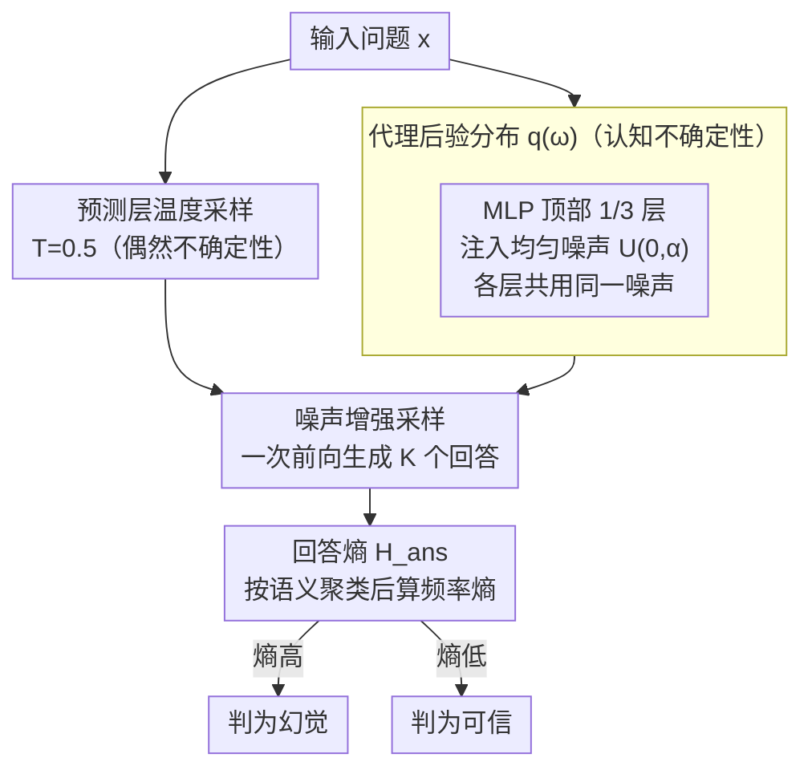

# Enhancing Hallucination Detection through Noise Injection

**会议**: ICLR 2026  
**arXiv**: [2502.03799](https://arxiv.org/abs/2502.03799)  
**代码**: 未公开  
**领域**: 幻觉检测  
**关键词**: 幻觉检测, 噪声注入, 认知不确定性, 贝叶斯近似, 中间表征

## 一句话总结
在 LLM 中间层的 MLP 激活中注入均匀噪声来近似贝叶斯后验，捕获认知不确定性（epistemic uncertainty），与采样温度捕获的偶然不确定性（aleatoric uncertainty）互补，将 GSM8K 上的幻觉检测 AUROC 从 71.56 提升到 76.14。

## 研究背景与动机

**领域现状**：幻觉检测的主流方法通过语义熵（Semantic Entropy）或多次采样一致性来估计 LLM 的不确定性，但这些方法主要捕获偶然不确定性（数据内在的不确定性）。

**现有痛点**：认知不确定性（模型对其知识的不确定性）在当前方法中被忽略。标准采样只改变 token 分布的随机性，不改变模型本身，因此无法捕获"模型不确定自己知道什么"的信号。

**核心矛盾**：完整的贝叶斯推理需要对模型权重的后验分布进行采样，但这在大模型中计算上不可行（MC-Dropout 等近似方法又不够有效）。

**本文目标** 如何在不重新训练的前提下，高效捕获大语言模型的认知不确定性？

**切入角度**：在分布中间表征时注入小幅度噪声，作为权重后验的代理分布。

**核心 idea**：在 MLP 激活值上加均匀噪声，等效于对权重做小扰动，多次采样后的输出差异反映认知不确定性。

## 方法详解

### 整体框架

这篇论文想解决的是：现有幻觉检测只靠预测层的温度采样去估计不确定性，而温度采样只改变 token 分布的随机性、不改变模型本身，所以它捕获的是"数据内在"的偶然不确定性（aleatoric），却漏掉了"模型对自己知识有多确定"的认知不确定性（epistemic）。完整的贝叶斯做法是对权重后验采样，但在大模型上算不动。

作者的整套流程因此分两路并行：对给定问题一路保持 $T=0.5$ 的预测层温度采样来吃下偶然不确定性，另一路在网络顶部 $1/3$ 层的 MLP 激活上注入 $U(0,\alpha)$ 的均匀噪声、用一个**代理后验分布** $q(\omega)$ 逼近真实的权重后验，从而引入认知不确定性。两路在一次前向里叠加（**噪声增强采样**）生成 $K$ 个候选回答，再把回答按语义聚类、用**回答熵**作为最终的不确定性分数——熵越高越可能是幻觉。

### 关键设计

**1. 代理后验分布：用一层有界噪声替代算不动的权重后验**

真正的贝叶斯推理要对模型权重的后验 $p(\omega\mid D)$ 采样，大模型上不可行。作者退一步，定义一个窄的代理分布 $q(\omega)$：非目标层的权重固定为预训练值（退化成 delta 分布），只有目标层的权重在预训练值附近加一个有界扰动，等效于对权重做小幅采样。论文进一步证明，这种"扰动目标层权重"近似等价于扰动该层 MLP 的 bias 项，而后者又可以直接用"在 MLP 激活上加非负均匀噪声"来近似实现——于是把对权重后验采样这件难事，落地成了一行加噪声的操作。一个关键细节是所有被选中的层**共用同一个噪声样本**，因为残差连接会把各层独立采样的扰动相互抵消掉。噪声幅度 $\alpha$ 决定代理后验的"宽度"：太大破坏生成质量、太小又探不出不确定性，最优值落在 $0.01$–$0.11$ 之间，是个数据集相关的超参。

**2. 噪声注入位置：扰动 MLP 顶部 1/3 层而非注意力**

同样是注入噪声，加在哪里效果差很多。作者对比注意力层和 MLP 层，发现注入 MLP 显著更好（AUROC 76.14 vs 71.89），且只取靠近输出的顶部 $1/3$ 层（如 Llama-2-7B 的第 20–32 层）。背后的解释是 MLP 层编码了更多事实性知识，扰动它才能有效探测"模型对某条具体知识有多确定"，而扰动注意力更多搅动的是 token 间的关联、对认知不确定性帮助有限。这条发现也反过来给"MLP=知识存储"的假设提供了实验证据。

**3. 噪声增强采样：双路叠加后用回答熵打分**

把上面两路（偶然的温度采样 + 认知的噪声注入）合到一次前向里，对每个问题采样生成 $K$ 个回答（实验取 $K=10$），按语义把回答聚成若干答案，计算回答熵

$$H_{\text{ans}} = -\sum_j p(a_j)\,\log p(a_j)$$

其中 $p(a_j)$ 是第 $j$ 个答案出现的频率。注入噪声后模型若对某个问题确实"心里没底"，多次采样的答案就会发散、熵升高；反之答案集中、熵低。于是高熵直接对应高不确定性、对应更可能的幻觉。这套打分还不止适配回答熵——论文里预测熵、语义熵、词汇相似度、EigenScore 等度量套上噪声增强采样后都有提升，说明噪声注入是个正交于具体度量的增益。

## 实验关键数据

### 主实验

| 数据集 | 模型 | 基线 AUROC | +噪声 AUROC | 提升 |
|--------|------|-----------|------------|------|
| GSM8K | Llama-2-7B | 71.56 | **76.14** | +4.58 |
| GSM8K | Llama-2-13B | 77.20 | **79.25** | +2.05 |
| TriviaQA | Mistral-7B | 75.86 | **77.76** | +1.90 |
| CSQA | Gemma-2B | 58.97 | **61.71** | +2.74 |

### 消融实验

| 设置 | AUROC (GSM8K) |
|------|--------------|
| 仅偶然 (T=0.5, 无噪声) | 71.56 |
| 仅认知 (T=0, 有噪声) | 74.35 |
| **两者组合** | **76.14** |
| 噪声在注意力层 | 71.89 |

### 关键发现
- 认知不确定性与偶然不确定性互补，组合优于任一单独使用
- MLP 层比注意力层更适合注入噪声（76.14 vs 71.89）
- 所有不确定性度量（预测熵、语义熵、词汇相似度、EigenScore）都因噪声注入而提升
- 模型越大（13B vs 7B），基线越强但噪声注入的绝对提升越小

## 亮点与洞察
- **简洁且通用**：噪声注入无需重新训练、无需额外参数，可即插即用到任何 LLM。
- **贝叶斯视角的实用化**：将理论上优美但实践中难行的贝叶斯推理，简化为"加噪声"这一极简操作，同时保持了理论动机。
- **MLP vs 注意力的发现**：MLP 层对知识编码更敏感的实验证据，支持了"MLP=知识存储"的假设。

## 局限与展望
- 最优噪声幅度 alpha 是数据集相关的超参数，需要在验证集上调优
- 需要多次前向推理（K 次采样），推理成本线性增加
- 在 CSQA 上提升较小（+0.97），可能与任务类型有关
- 噪声注入的理论保证（与真实贝叶斯后验的距离）未建立

## 相关工作与启发
- **vs Semantic Entropy**: 语义熵只捕获偶然不确定性，加噪声后可同时捕获认知不确定性
- **vs MC-Dropout**: Dropout 是另一种近似贝叶斯的方法，但在大模型中不常用且效果有限

## 评分
- 新颖性: ⭐⭐⭐⭐ 噪声注入用于幻觉检测的想法新颖，但技术贡献相对简单
- 实验充分度: ⭐⭐⭐⭐ 多模型多数据集，与多种不确定性度量结合
- 写作质量: ⭐⭐⭐⭐ 贝叶斯框架的阐述清晰
- 价值: ⭐⭐⭐⭐ 即插即用的幻觉检测增强方法

<!-- RELATED:START -->

## 相关论文

- [\[ACL 2026\] Enhancing Hallucination Detection via Future Context](../../ACL2026/hallucination/enhancing_hallucination_detection_via_future_context.md)
- [\[ACL 2026\] The Reasoning Trap: How Enhancing LLM Reasoning Amplifies Tool Hallucination](../../ACL2026/hallucination/the_reasoning_trap_how_enhancing_llm_reasoning_amplifies_tool_hallucination.md)
- [\[ICLR 2026\] VeriTrail: Closed-Domain Hallucination Detection with Traceability](veritrail_closed-domain_hallucination_detection_with_traceable_evidence_synthes.md)
- [\[ACL 2026\] Through the Magnifying Glass: Adaptive Perception Magnification for Hallucination-Free VLM Decoding](../../ACL2026/hallucination/through_the_magnifying_glass_adaptive_perception_magnification_for_hallucination.md)
- [\[ICML 2026\] From Out-of-Distribution Detection to Hallucination Detection: A Geometric View](../../ICML2026/hallucination/from_out-of-distribution_detection_to_hallucination_detection_a_geometric_view.md)

<!-- RELATED:END -->
