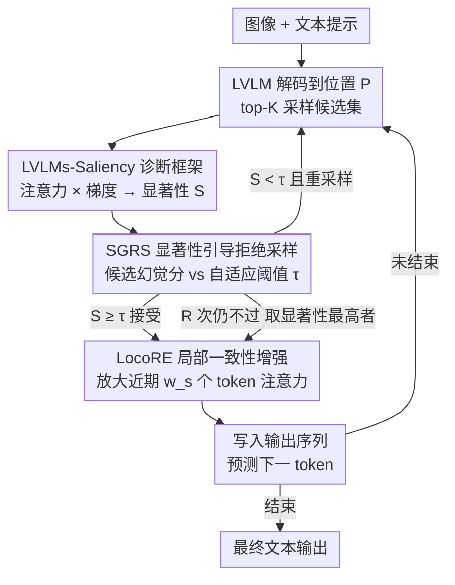

# Hallucination Begins Where Saliency Drops

**会议**: ICLR 2026  
**arXiv**: [2601.20279](https://arxiv.org/abs/2601.20279)  
**代码**: [https://github.com/zhangbaijin/LVLMs-Saliency](https://github.com/zhangbaijin/LVLMs-Saliency)  
**领域**: 幻觉检测  
**关键词**: 幻觉缓解, 大视觉语言模型, 显著性分析, 注意力机制, 推理时干预

## 一句话总结

提出 LVLMs-Saliency 梯度感知诊断框架来量化每个输出 token 的视觉锚定强度，发现"当先前输出 token 对下一个 token 预测的显著性降低时，幻觉就会产生"的关键规律，并基于此设计了 SGRS（显著性引导的拒绝采样）+ LocoRE（局部一致性增强）双机制推理时框架，在多个 LVLM 上显著降低幻觉率。

## 研究背景与动机

大型视觉语言模型（LVLM）如 LLaVA、Qwen2-VL、InternVL 等在跨模态任务上取得了显著进展，但**幻觉问题**始终是核心挑战——模型可能生成图像中不存在的物体或属性。

现有缓解策略主要分为两类：需要重新训练的方法（如额外数据微调）和免训练方法（如 OPERA、VCD、DOPRA 等）。后者主要关注注意力汇聚（attention sink）现象——某些 token 在后续生成中持续吸引高注意力权重，可能导致幻觉。然而，这些方法存在关键不足：**注意力图只反映前向传播中的决策，无法捕捉输入 token 对最终输出的影响链路**。实验表明，仅看注意力图几乎无法区分正确 token 和幻觉 token 的生成模式（图 1）。

本文的核心洞察是：将注意力权重 $\mathbf{A}$ 与其梯度 $\nabla \mathbf{A}$ 的逐元素乘积定义为**显著性**（Saliency），就能清晰地观察到一个决定性规律——幻觉发生在先前输出 token 的显著性下降之时。这意味着模型"遗忘"了近期上下文，上下文记忆崩溃导致了语义不连贯的输出。

## 方法详解

### 整体框架

方法先用 LVLMs-Saliency 诊断框架量化每个输出 token 的视觉锚定强度，再用两个推理时模块把"幻觉始于显著性下降"这条规律转成主动干预：SGRS 充当门卫，在候选 token 提交进序列前过滤掉显著性过低的；LocoRE 充当稳定器，在 token 被接受后增强它对近期上下文的注意力。两者一前一后嵌进逐 token 解码循环，全程无需训练。

### 关键设计

**1. LVLMs-Saliency 诊断框架：让注意力图"显形"出幻觉信号**

仅看注意力权重几乎无法区分正确 token 和幻觉 token 的生成模式，问题在于注意力只反映前向决策、丢掉了"输入 token 究竟影响了哪个输出"的链路。本文把注意力矩阵 $\mathbf{A}^{(l,h)}$ 与它的梯度逐元素相乘并取下三角，得到第 $l$ 层第 $h$ 头的显著性矩阵 $\mathbf{S}^{(l,h)} = \text{tril}(|\mathbf{A}^{(l,h)} \odot \nabla \mathbf{A}^{(l,h)}|)$，再对所有头求和并做 $\ell_2$ 归一化得到层级显著性 $\bar{\mathbf{S}}^{(l)} = \frac{\sum_h \mathbf{S}^{(l,h)}}{\|\sum_h \mathbf{S}^{(l,h)}\|_2}$。梯度加权这一步是关键：它把"这个注意力连接对最终预测有多重要"显式刻画出来。加权之后规律立刻浮现——正确 token 的显著性对近期 token 呈强依赖且随距离平滑衰减，而幻觉 token 的显著性则全面崩溃，等于模型"遗忘"了刚刚生成的上下文。这一现象在 500 样本统计和 LLaVA-1.5、Qwen2-VL、InternVL 三种架构上都稳定复现，因此可以直接拿显著性当幻觉风险的探针。

**2. SGRS 显著性引导拒绝采样：在 token 入列前拦下高风险候选**

诊断框架给出了风险信号，SGRS 就把它用在解码环节做主动过滤。在解码位置 $P$，先按 top-$K$ 采样得到候选集，对每个候选 $c_i$ 在目标层集合 $\mathcal{L}_{\text{target}}$ 与位置集合 $\mathcal{J}$ 上聚合显著性得到幻觉分 $\mathcal{S}(c_i) = \frac{1}{|\mathcal{L}_{\text{target}}| \cdot |\mathcal{J}|} \sum_{l \in \mathcal{L}_{\text{target}}} \sum_{j \in \mathcal{J}} \bar{\mathbf{S}}_{P,j}^{(l)}$。候选只有在 $\mathcal{S}(c_i) \geq \tau^{(P)}$ 时才被接受，而阈值不是固定的，而是随生成历史自适应——取最近 $W$ 个已接受 token 的平均显著性再乘灵敏度系数 $\alpha \in (0,1)$，即 $\tau^{(P)} = \alpha \cdot \frac{1}{|\mathcal{H}|}\sum_{j \in \mathcal{H}} \mathcal{S}(x_j)$。这样阈值会跟着上下文的整体锚定水平浮动，避免一刀切。若候选全被拒，最多重采样 $R$ 次，仍不通过则退而选显著性最高者，保证解码不会卡死。

**3. LocoRE 局部一致性增强：从源头对抗显著性衰减**

SGRS 拦掉了坏 token，但已接受的好 token 仍会随生成推进被逐渐"遗忘"，显著性自然下滑。LocoRE 直接在注意力结构上对症下药：预测位置 $P+1$ 时，给最近 $w_s$ 个输出 token 的注意力乘上一个放大系数 $\gamma_j^{(P)} = 1 + \beta \cdot \mathbb{I}((P - j) \leq w_s)$，其中 $\beta \geq 0$ 控制增强强度，落在窗口内的近期 token 注意力被抬高，超出窗口的保持不变。这相当于人为维持近期上下文对当前预测的影响力，把正在塌陷的显著性"托住"。它纯粹改注意力权重，不需要梯度计算也不动模型参数，即插即用且延迟增加不到 2%，因此实际部署里单用 LocoRE 就能拿到大部分收益。

值得说明的是，整套方法是纯推理时干预，无需任何训练或微调；额外开销主要来自 SGRS 的一次反向传播（约增 30–40% 延迟），LocoRE 几乎零成本。

## 实验关键数据

### 主实验

在 LLaVA-1.5-7B 作为基线模型的 POPE、CHAIR、MME 上的比较：

| 方法 | POPE F1 | POPE Acc | CHAIR S↓ | CHAIR I↓ | MME Total |
|------|---------|----------|----------|----------|-----------|
| Beam Search (基线) | 85.4 | 84.0 | 51.0 | 15.2 | 565.34 |
| OPERA (CVPR 2024) | 84.2 | 85.2 | 47.0 | 14.6 | 549.00 |
| EAH (EMNLP 2025) | 85.7 | 86.0 | 36.4 | 9.9 | 603.99 |
| CausalLLM (ICLR 2025) | 86.0 | 86.5 | - | - | 656.00 |
| MemVR (ICML 2025) | 87.1 | 87.4 | 46.6 | 13.0 | 648.30 |
| LocoRE (本文) | 86.9 | 87.3 | 38.4 | 11.2 | 656.66 |
| **SGRS + LocoRE (本文)** | **87.0** | **87.5** | **35.6** | **8.2** | **668.33** |

跨模型的综合结果（SGRS + LocoRE 相对基线提升）：

| 模型 | LLaVAW | MM-Vet | VizWiz | CHAIR S↓ | POPE Acc |
|------|--------|--------|--------|----------|----------|
| LLaVA-1.5-7B | +4.2 | +5.5 | +6.4 | +12.4 | +3.5 |
| LLaVA-1.5-13B | +4.3 | +5.9 | +3.5 | +7.4 | +0.4 |
| Qwen2-VL-7B | +4.1 | +4.5 | +3.0 | +5.7 | +1.4 |
| InternVL-7B | +3.9 | +5.0 | +4.5 | +12.2 | +1.5 |

### 消融实验

$\alpha$（SGRS）和 $\beta$（LocoRE）的超参数消融（LLaVA-1.5-7B）：

| $\alpha$ | $\beta$ | CHAIR S↓ | POPE F1 | 说明 |
|----------|---------|----------|---------|------|
| 0.0 | 0.0 | 48.0 | 85.4 | 基线 |
| 0.0 | 0.15 | 38.4 | 86.9 | 仅 LocoRE |
| 0.6 | 0.0 | 36.5 | 86.9 | 仅 SGRS |
| 0.6 | 0.15 | **35.6** | **87.0** | 完整方法 |
| 0.6 | 1.0 | 50.2 | 60.3 | 过度增强导致退化 |

### 关键发现

- **核心规律得到跨模型验证**: 在 LLaVA-1.5、Qwen2-VL、InternVL 三种架构上，幻觉 token 的显著性一致低于正确 token，最低显著性区间的幻觉率达 68%-76%，最高区间降至 18%-28%
- **因果验证实验**: 人为降低正确 token 的显著性（衰减因子从 1.0 到 0.2），CHAIR 幻觉率从 35.6 升至 56.0，直接证明了因果关系
- **LocoRE 单独使用时性价比最高**: 仅增加 < 2% 延迟即可获得大部分改善，是实际部署的最佳选择
- **SGRS 的 $\alpha = 0.6$ 是最佳折中**: 抑制 28.3%+ 的幻觉，同时保持推理速度和输出质量；$\alpha = 0.9$ 虽进一步降低幻觉但延迟增加 33%

## 亮点与洞察

- **从"注意力 → 显著性"的范式转变**: 仅看注意力图无法区分正确和幻觉 token，但梯度加权后的显著性能清晰区分——这是对 LVLM 幻觉理解的重要推进
- **发现了简洁而有力的规律**: "幻觉始于显著性下降"——当模型遗忘近期输出上下文时，就会产生不连贯的内容。这一规律在直觉上也非常合理
- **双机制的闭环设计精巧**: SGRS（守门）+ LocoRE（稳固）的协同设计优雅且各有分工
- **LocoRE 的实用性极高**: 无需训练、无需额外模型、无需梯度计算、即插即用、几乎无延迟——非常适合工业落地
- **可视化分析非常有说服力**: 正确 token vs 幻觉 token 的显著性对比图直观清晰

## 局限与展望

- **SGRS 的延迟开销**: 每个 token 需要额外的反向传播（30-40% 开销），不适合实时应用。论文也承认仅 LocoRE 是更实际的选择
- **Failure Case**: 对于"高置信度的幻觉"（模型非常确定地输出了错误内容），显著性可能仍然很高，SGRS 无法检测。这与 OpenAI 发现的"模型会自信地犯错"一致
- **上下文无关生成**: 当模型生成的内容本身就偏离当前上下文时（如模型幻觉出一个全新的话题），SGRS 可能不够有效
- **仅关注文字输出显著性**: 完全忽略了视觉显著性的作用——但论文分析 500 样本后认为 prompt 显著性不是幻觉的主要原因
- **超参数需要针对不同模型调整**: LLaVA-1.5 用 $\beta = 0.15$，Qwen2-VL 用 $\beta = 0.20$，需要手动搜索

## 相关工作与启发

- **OPERA、DOPRA**: 通过惩罚注意力汇聚 token 的 logits 来缓解幻觉，但本文认为仅看注意力不够，需要梯度信息
- **EAH**: 通过替换浅层注意力头来增强视觉信息，效果好但可能损失输出多样性（Recall 较低），LocoRE 保持了更高 Recall
- **TAME、Farsight**: 分析锚点 token 的局部自注意力模式，但忽略了文本输出的上下文依赖
- **启发**: 梯度乘注意力作为显著性度量在 NLP 领域（如归因解释）早有应用，但本文首次将其系统性地用于 LVLM 幻觉诊断，展示了"老方法 + 新场景"的巨大潜力
- **可推广性**: 显著性分析框架可以推广到任何自回归生成模型的质量控制中

## 评分

- 新颖性: ⭐⭐⭐⭐
- 实验充分度: ⭐⭐⭐⭐⭐
- 写作质量: ⭐⭐⭐⭐
- 价值: ⭐⭐⭐⭐⭐

<!-- RELATED:START -->

## 相关论文

- [\[CVPR 2026\] Tell Model Where to Look: Mitigating Hallucinations in MLLMs by Vision-Guided Attention](../../CVPR2026/hallucination/tell_model_where_to_look_mitigating_hallucinations_in_mllms_by_vision-guided_att.md)
- [\[ACL 2025\] HALoGEN: Fantastic LLM Hallucinations and Where to Find Them](../../ACL2025/hallucination/halogen_hallucinations.md)
- [\[ICLR 2026\] Dynamic Multimodal Activation Steering for Hallucination Mitigation in Large Vision-Language Models](dynamic_multimodal_activation_steering_for_hallucination_mitigation_in_large_vis.md)
- [\[ICLR 2026\] Copy-Paste to Mitigate Large Language Model Hallucinations](copy-paste_to_mitigate_large_language_model_hallucinations.md)
- [\[ICLR 2026\] Enhancing Hallucination Detection through Noise Injection](enhancing_hallucination_detection_through_noise_injection.md)

<!-- RELATED:END -->
