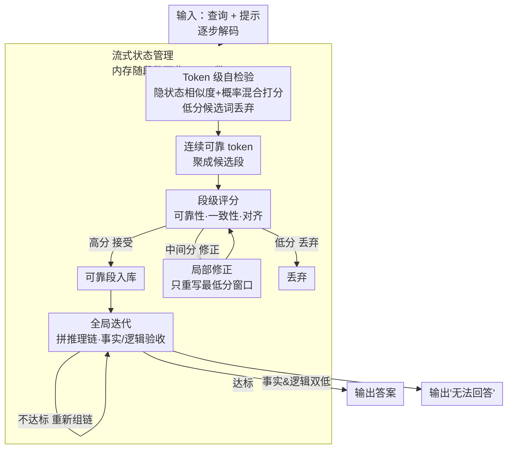

# Token-Guard: Towards Token-Level Hallucination Control via Self-Checking Decoding

**会议**: ICLR 2026  
**arXiv**: [2601.21969](https://arxiv.org/abs/2601.21969)  
**代码**: [https://github.com/rhq945/Token-Guard](https://github.com/rhq945/Token-Guard)  
**领域**: 幻觉检测  
**关键词**: LLM 幻觉控制, Token 级解码, 自检验, 段级评分, 迭代修正

## 一句话总结

提出 Token-Guard，一种基于自检验解码的 token 级幻觉控制方法，通过隐空间中的 token 级/段级评分和迭代修正机制，在解码过程中检测并抑制幻觉生成，F1 平均提升 16.3%。

## 研究背景与动机

- **LLM 幻觉问题**: 大模型常生成与输入不一致的内容，在知识密集型场景尤为严重
- **现有方法的不足**:
    - RAG 和 RLHF 需要昂贵的外部检索或大规模微调
    - 现有解码方法（CoT、ToT 等）缺乏显式 token 级幻觉检查机制
    - 幻觉风险未被显式量化，token 选择缺乏方向性
    - 大多数方法仅支持单次生成，缺乏动态修正能力
- **核心挑战**: 如何在解码阶段以低开销实现精细化的幻觉控制？

## 方法详解

### 整体框架

Token-Guard 想解决的是：LLM 解码时只按概率挑词，没有任何"这个词是不是在胡编"的信号，所以幻觉一旦写下去就只能事后补救。它的思路是在**解码过程中**把幻觉控制铺到三个由细到粗的粒度上层层把关——解码每一步先对候选 token 做自检验、筛掉与上文接不上的可疑词；连续通过检验的 token 聚成一个候选段后，再做一次段级打分，按分数把段分成接受、丢弃或就地修正三档；最后把所有可靠段拼成完整推理链，做一次全局事实/逻辑验收，不达标就重新组链。贯穿这三级的还有一套流式状态管理，让占用的内存只随段数而不随生成长度膨胀。整个流程纯在解码阶段完成，不依赖外部检索，也不需要任何额外训练，可作插件挂到任意 LLM 上。

### 关键设计

**1. Token 级自检验：在选词的瞬间就量化幻觉风险**

现有解码方法（CoT、ToT）只按模型概率挑词，没有任何显式的"这个词是不是在胡编"的信号，幻觉因此从第一个错词起就无人拦截。Token-Guard 给每个候选 token $a_t^{(i)}$ 算一个混合分数 $F_{\text{halu}}^{\text{token}}(a_t^{(i)} \mid s_t) = \lambda \cdot \frac{h_t^{(i)} \cdot \bar{h}_{<t}}{|h_t^{(i)}| |\bar{h}_{<t}|} + (1-\lambda) \cdot P(a_t^{(i)} \mid a_{<t}, x)$，把两路证据捏到一起：前一项是候选 token 隐状态与已接受 token 平均隐状态 $\bar{h}_{<t}$ 的余弦相似度，衡量语义上是否"接得上"；后一项是模型给出的条件概率，衡量统计上是否自然。两项用 $\lambda = 0.6$ 加权，分数低于阈值 $\tau_{\text{token}} = 0.4$ 的 token 直接丢弃。隐状态取自模型倒数第二层（这一层语义信息最稳定），生成首个 token 时还没有历史可比，就用输入上下文的平均隐状态当锚点。这样幻觉风险在 token 被采纳之前就被量化并拦下，而不是事后补救。

**2. 段级表示与评分：跳出单 token 的短视，在语义片段上复核**

单个 token 看着合理，连成一句话却可能整体跑偏，所以光有 token 级把关不够。Token-Guard 把连续通过 token 检验的词聚成候选段 $C_k$，并用 token 各自的幻觉分做 softmax 权重算加权段表示 $H_k = \sum_{i=1}^{n} w_i h_t^{(i)}$，其中 $w_i = \frac{\exp(F_{\text{halu}}^{\text{token}}(a_{t_i} \mid s_{t_i}))}{\sum_j \exp(F_{\text{halu}}^{\text{token}}(a_{t_j} \mid s_{t_j}))}$——越可靠的 token 在段表示里说话越响。段级分数综合三件事：

$$F_{\text{halu}}^{\text{seg}}(C_k) = \alpha F_{\text{halu}}^{\text{token}}(C_k) + \beta \, \text{Consistency}(C_k) + \gamma \, \text{Alignment}(C_k)$$

即 token 可靠性的聚合（$\alpha = 0.5$）、相邻 token 隐状态的平滑度即局部一致性（$\beta = 0.3$）、以及段表示与输入上下文 $H_x$ 的余弦对齐（$\gamma = 0.2$）。两个阈值把段分成三档处理：低于 $\tau_{\text{seg}}^{\text{low}} = 0.55$ 直接丢弃，高于 $\tau_{\text{seg}}^{\text{high}} = 0.75$ 直接接受，落在中间的不一棍打死、转入下面的局部修正。这样把关从"词"升到"语义片段"，能拦下单看每个词都正常、合起来却失真的整段内容。

**3. 局部修正与全局迭代：把"重生成"做成有针对性的小手术加一次总验收**

大多数方法生成完就结束，没有动态纠错的机会；而把整段推翻重写又太浪费。Token-Guard 先做局部修正：在中间分的段里定位分数最低的 token，连同左右邻居取一个窗口 $W_k^{(l)} = \{a_{i-1}, a_i^{\text{low}}, a_{i+1}\}$，只让 LLM 在固定前后文的条件下重写这一小段 $W_k^{(l)'} = \text{LLM\_refine}(W_k^{(l)} \mid a_{<i-1}, a_{>i+1}, H_k)$，修完重算段分，达标就接受、否则最多迭代 $N_{\max}=3$ 次——把坏点修掉而不动周围已经可靠的内容。所有可靠段拼成推理链 $R$ 后再做全局验收，事实分 $F_{\text{fact}}$ 与逻辑分 $F_{\text{logic}}$ 用调和形式融合：

$$F_{\text{global}}(R) = \frac{F_{\text{fact}}(R) \cdot F_{\text{logic}}(R)}{F_{\text{fact}}(R) + F_{\text{logic}}(R) - F_{\text{fact}}(R) \cdot F_{\text{logic}}(R)}$$

任一维度短板都会把整体分拉低。$F_{\text{global}} < \tau_{\text{global}} = 0.7$ 就触发重新组链（段先经 TF-IDF + KMeans 聚类、再选最靠近各簇中心的候选链，最多迭代 $M_{\max}=2$ 次）；若 $F_{\text{fact}}$ 和 $F_{\text{logic}}$ 双双低于 0.5，则诚实输出"无法回答"，而不是硬编一个答案。

**4. 流式状态管理：让内存开销与生成长度脱钩**

三级评分若都把隐状态缓存下来，长文本会把显存吃光，方法也就没法当通用插件用。Token-Guard 在每一级都只保留必要的紧凑状态：token 级仅维护一个运行平均 $\bar{h}_{<t}$，复杂度 $\mathcal{O}(L_{\max} \cdot K_{\text{active}} \cdot d)$；段一旦形成就释放其中的临时 token 隐状态，只留下段向量 $H_k$；全局阶段则只在段向量集合 $\{H_k\}$ 上操作，复杂度 $\mathcal{O}(K \cdot d)$。由此整体内存正比于段数而非 token 数，这才让前三级把关能作为即插即用的插件挂到任意 LLM 解码管线上，而不引入随长度膨胀的负担。

## 实验

### 主实验（Meta-Llama-3.1-8B-Instruct）

| 方法 | FinanceBench F1 | DROP_hist F1 | DROP_nfl F1 | HaluEval F1 | Avg F1 |
|------|----------------|-------------|-------------|-------------|--------|
| BaseModel | 16.00 | 44.21 | 39.10 | 42.16 | 28.29 |
| Guided Decoding | 16.44 | 55.95 | 36.71 | 57.41 | 34.73 |
| Chain-of-Thoughts | 11.01 | 49.26 | 49.21 | 55.32 | 34.63 |
| Tree-of-Thought | 14.44 | 47.73 | 37.69 | 56.02 | 33.33 |
| **Token-Guard** | **30.80** | **68.52** | **58.10** | **78.54** | **51.03** |

### Qwen3-8B 结果

| 方法 | Avg EM | Avg F1 |
|------|--------|--------|
| BaseModel | 0.22 | 44.25 |
| CoT | 0.23 | 45.10 |
| **Token-Guard** | **0.35** | **53.98** |

### 消融实验

| 变体 | DROP_hist F1 | RAGTruth F1 | Avg BLEU |
|------|-------------|-------------|----------|
| Full Token-Guard | **68.52** | **43.94** | **51.74** |
| w/o Token-Level | 47.51 | 27.10 | 34.97 |
| w/o Segment-Level | 60.10 | 39.20 | 46.32 |
| w/o Global Iteration | 63.05 | 41.05 | 36.26 |
| w/o Prompt | 55.23 | 32.50 | 39.70 |

### 关键发现

- Token 级评分对性能贡献最大（移除后 F1 下降最多）
- 全局迭代主要提升 BLEU（语言流畅性），对 EM/F1 也有贡献
- 在需要多步推理的任务（DROP_nfl）上优势最大
- 在知识密集型任务（PubMedQA）上改进有限，因为无法补偿缺失领域知识
- 两个骨干模型（Llama3.1-8B、Qwen3-8B）上均有效

## 亮点

- **多层次幻觉控制**: Token→段→全局三级递进，兼顾精度和效率
- **无需外部资源**: 不需要检索系统或额外训练，纯解码阶段方案
- **模块化设计**: 可作为插件集成到任何 LLM 解码管线
- **内存友好**: 巧妙的状态管理使内存与生成长度无关

## 局限性

- 多级评分引入额外计算开销（每个 token 需多次隐状态计算和余弦相似度计算）
- 超参数较多（$\lambda$、$\tau_{\text{token}}$、$\alpha/\beta/\gamma$、$\tau_{\text{seg}}$、$\tau_{\text{global}}$ 等），调参复杂
- 基于隐状态相似度的幻觉检测假设"与上下文一致=真实"，可能在模型本身有知识错误时失效
- 仅在 8B 级别模型上验证，对更大/更小模型的适用性未知
- 全局迭代使用 TF-IDF + KMeans 聚类，引入了传统 NLP 方法的额外依赖

## 相关工作

- **RAG 方法**: 外部检索增强，计算密集且领域相关
- **RLHF/对齐方法**: 需大规模微调，资源消耗大
- **解码方法**: DoLa（层间对比）、KCTS（知识约束树搜索）、Phi-Decoding（前瞻采样）
- **Token-Guard**: 首个融合 token 级自检验、段级评分和全局迭代的统一幻觉控制框架

## 评分

| 维度 | 分数 |
|------|------|
| 创新性 | ★★★★☆ |
| 理论深度 | ★★★☆☆ |
| 实验充分性 | ★★★★☆ |
| 实用价值 | ★★★★☆ |
| 写作质量 | ★★★☆☆ |

<!-- RELATED:START -->

## 相关论文

- [\[CVPR 2025\] HalLoc: Token-Level Localization of Hallucinations for Vision Language Models](../../CVPR2025/hallucination/halloc_token-level_localization_of_hallucinations_for_vision_language_models.md)
- [\[CVPR 2025\] One Token, Two Fates: A Unified Framework via Vision Token Manipulation Against MLLMs Hallucination](../../CVPR2025/hallucination/one_token_two_fates_a_unified_framework_via_vision_token_manipulation_against_ml.md)
- [\[ACL 2026\] TPA: Next Token Probability Attribution for Detecting Hallucinations in RAG](../../ACL2026/hallucination/tpa_next_token_probability_attribution_for_detecting_hallucinations_in_rag.md)
- [\[NeurIPS 2025\] Robust Hallucination Detection in LLMs via Adaptive Token Selection](../../NeurIPS2025/hallucination/robust_hallucination_detection_in_llms_via_adaptive_token_selection.md)
- [\[CVPR 2026\] Beyond the Global Scores: Fine-Grained Token Grounding as a Robust Detector of LVLM Hallucinations](../../CVPR2026/hallucination/beyond_global_scores_fine_grained_token_grounding_as_robust_detector_of_lvlm_hallucinations.md)

<!-- RELATED:END -->
