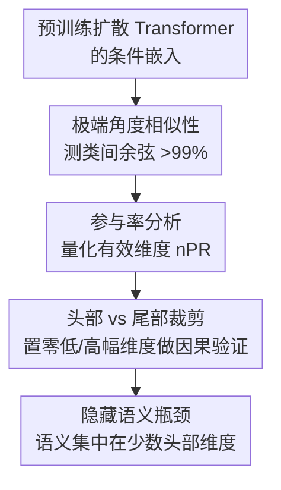

# A Hidden Semantic Bottleneck in Conditional Embeddings of Diffusion Transformers

**会议**: ICLR 2026  
**arXiv**: [2602.21596](https://arxiv.org/abs/2602.21596)  
**代码**: 有  
**领域**: 扩散模型  
**关键词**: diffusion transformer, conditioning, embedding sparsity, cosine similarity, AdaLN  

## 一句话总结
对扩散 Transformer 的条件嵌入进行首次系统分析，发现极端的角度相似性（类间余弦相似度>99%）和维度稀疏性（仅 1-2% 的维度携带语义信息），裁剪掉 2/3 的低幅维度后生成质量基本不变，揭示了条件嵌入中隐藏的语义瓶颈。

## 研究背景与动机
**领域现状**：DiT、SiT、REPA 等基于 Transformer 的扩散模型通过 AdaLN 注入条件信号（类标签+时间步的嵌入向量），取得了 SOTA 生成性能。

**现有痛点**：尽管条件嵌入是扩散 Transformer 的核心组件，其内部结构和语义编码方式几乎完全未知——没有人分析过这些嵌入长什么样。

**核心矛盾**：1000 个类别的条件嵌入在 1152 维空间中竟然高度相似（>99% 余弦相似度），但模型仍然能够正确区分类别生成高质量图像——这种"几乎相同的向量如何产生完全不同的图像"的矛盾需要解释。

**本文目标** 系统理解扩散 Transformer 如何编码和使用条件信号。

**切入角度**：直接分析学到的条件向量——测量余弦相似度、维度参与率、方差分布，并通过裁剪实验验证哪些维度重要。

**核心 idea**：扩散 Transformer 将语义信息压缩到条件嵌入的极少数"头部"维度中，其余大量"尾部"维度是冗余的。

## 方法详解

### 整体框架
这是一篇纯分析论文，不提出新模型，而是把扩散 Transformer 学到的条件嵌入（类标签 + 时间步经 AdaLN 注入的向量）当成解剖对象，回答一个反直觉的矛盾：方向上几乎重合的向量，凭什么生成截然不同的图像。分析在 6 个 ImageNet SOTA 模型（DiT/MDT/SiT/REPA/LightningDiT/MG）和 2 个连续条件任务（姿态引导人像、视频到音频）上展开，按"先相关、后因果"的逻辑分三步层层逼近：先用**极端角度相似性**测向量方向有多接近，再用**参与率分析**量化到底有多少维度在承载信息，最后用**头部 vs 尾部裁剪**做因果验证、定位语义究竟藏在哪里——最终坐实条件嵌入里存在一个"隐藏的语义瓶颈"。

### 关键设计

**1. 极端角度相似性：揭示"几乎相同的向量为何能区分类别"**

第一步是直接测量学到的条件向量两两之间的方向有多接近。结果反直觉：1000 个 ImageNet 类别的嵌入余弦相似度普遍在 99% 以上，REPA 高达 99.46%；连续条件任务更极端，姿态和音频任务都达到 99.9%+。也就是说从方向上看这些向量几乎重合，但模型却能据此生成截然不同的图像。本文给出的解释假说是：扩散训练要求嵌入在所有时间步上都提供稳定的去噪信号，这种跨步优化天然偏好一个全局对齐的方向，把所有类别的向量都"拉"到同一个锥形区域里；真正区分类别的语义差异不体现在整体方向上，而是被压缩进极少数高幅度的"头部"维度。这就把矛盾化解为：方向几乎一致，差异藏在幅度里。

**2. 参与率分析：量化到底有多少维度在干活**

为了把"语义集中在少数维度"这个直觉变成可测量的量，本文用参与率（Participation Ratio）刻画嵌入向量幅度分布的有效宽度，并归一化为 $\alpha_{norm} = \text{PR}(|c|) / d$，即有效维度占总维度 $d$ 的比例。测量发现 MDT、REPA、MG 等 SOTA 模型的归一化参与率（nPR）仅 1.5–2.3%——在 1152 维空间里实际只有约 18–26 维在承载信息。DiT 是个例外（10.5%），原因是它架构较老、压缩程度更低。连续条件任务的 nPR 反而更高（13–48%），因为姿态、音频这类条件本身需要编码更细粒度的连续信息，单靠十几维装不下。这一指标把"稀疏"从定性观察坐实成了具体数字。

**3. 头部 vs 尾部裁剪：用因果实验定位语义所在**

前两步只是相关性观察，本文用裁剪实验做因果验证：把幅度低于阈值 $\tau$ 的维度直接置零，看生成质量如何变化。尾部裁剪时，移除 38.9% 的低幅维度（$\tau=0.01$）后 FID 从 7.17 几乎不变地降到 7.16，甚至移除 66.2% 的维度（$\tau=0.02$）FID 也只升到 9.22 仍可接受——说明这些尾部维度近乎冗余。头部裁剪则形成鲜明对照：仅移除幅度最高的 2/1152 维（0.2%）FID 就升到 7.85，移除 8/1152 维（0.69%）FID 直接暴涨到 523、图像彻底崩溃。两组对比构成了完整的因果证据链：语义信息几乎全部集中在少数头部维度，尾部维度可以安全丢弃，这也正是"隐藏的语义瓶颈"得名的由来。

### 损失函数 / 训练策略
不涉及训练，全部基于预训练模型在推理时做分析与裁剪。

## 实验关键数据

### 主实验（条件嵌入统计）

| 模型 | 维度 | nPR | 余弦相似度 |
|------|------|-----|-----------|
| DiT-XL | 1152 | 10.47% | 90.01% |
| MDT-XL | 1152 | 1.60% | 99.05% |
| SiT-XL | 1152 | 2.28% | 98.52% |
| REPA-XL | 1152 | 1.53% | **99.46%** |
| LightningDiT | 1152 | 2.05% | 97.79% |
| X-MDPT (姿态) | 1024 | 48.42% | 99.98% |
| MDSGen (音频) | 768 | 13.57% | **99.99%** |

### 裁剪消融（REPA-XL）

| 裁剪 | 移除维度 | FID↓ | IS↑ | CLIP↑ |
|------|---------|------|-----|-------|
| 无裁剪 | 0% | 7.17 | 176.0 | 29.75 |
| 尾部 τ=0.01 | 38.9% | **7.16** | 176.0 | **29.81** |
| 尾部 τ=0.02 | 66.2% | 9.22 | 125.2 | 29.22 |
| 头部 τ=5.0 | 0.2% (2维) | 7.85 | 164.2 | 29.56 |
| 头部 τ=1.0 | 0.69% (8维) | **523.8** | 1.95 | 22.69 |

### 关键发现
- 裁剪 39% 的尾部维度后 FID 甚至微降（7.17→7.16），CLIP 微升——说明这些维度不仅无用，可能还是噪声
- 方差分析显示仅 15-20 个头部维度携带跨类别的有意义方差，其余 98% 维度方差几乎为零
- 训练动态追踪显示余弦相似度和稀疏性在训练过程中逐步增加——是训练的自然结果而非随机初始化
- 在晚期去噪步骤执行裁剪比早期效果更好，因为晚期条件信号更精细

## 亮点与洞察
- **反直觉的发现**：1000 个完全不同的类别的条件嵌入竟然 99%+ 相似，模型靠 <2% 的维度差异就能生成完全不同的图像——挑战了对条件编码的常识理解
- **对高效条件设计的启示**：既然只需 ~20 个有效维度，未来的条件注入机制可以大幅简化——降低维度、减少参数、加速推理
- **与对比学习坍塌的区别**：虽然现象类似（嵌入高度相似），但这里并非有害坍塌——因为扩散过程的迭代精炼可以放大微小差异

## 局限与展望
- 仅分析了 AdaLN 注入方式，cross-attention 条件注入（如文本引导）的嵌入结构可能不同
- "为什么会这样"的解释停留在假说层面，缺乏严格的理论证明
- 仅使用预训练模型分析，未尝试基于发现重新设计和训练更高效的条件机制
- 裁剪实验在推理时执行，训练时是否可以利用稀疏性加速尚未探索

## 相关工作与启发
- **vs AlignTok**: AlignTok 关注编码器如何影响潜空间的语义性，本文关注条件嵌入如何编码语义——两者互补
- **vs 对比学习坍塌**: 虽然现象相似（极端相似的嵌入），但扩散模型中这是一种有效的压缩而非有害坍塌
- **vs 信息瓶颈理论**: 与 IB 理论一致——模型学会将条件信息压缩到最小必要子空间

## 评分
- 新颖性: ⭐⭐⭐⭐⭐ 首次系统揭示扩散 Transformer 条件嵌入的隐藏结构
- 实验充分度: ⭐⭐⭐⭐⭐ 6+ 个模型、3 种任务、详细裁剪消融、训练动态追踪
- 写作质量: ⭐⭐⭐⭐ 发现清晰但理论解释偏弱
- 价值: ⭐⭐⭐⭐⭐ 对条件生成模型的理解产生根本性影响

<!-- RELATED:START -->

## 相关论文

- [\[ICML 2026\] Recovering Hidden Reward in Diffusion-Based Policies](../../ICML2026/image_generation/recovering_hidden_reward_in_diffusion-based_policies.md)
- [\[ICLR 2026\] HierLoc: Hyperbolic Entity Embeddings for Hierarchical Visual Geolocation](hierloc_hyperbolic_entity_embeddings_for_hierarchical_visual_geolocation.md)
- [\[ICLR 2026\] FlowCast: Advancing Precipitation Nowcasting with Conditional Flow Matching](flowcast_advancing_precipitation_nowcasting_with_conditional_flow_matching.md)
- [\[CVPR 2026\] Interpretable and Steerable Concept Bottleneck Sparse Autoencoders](../../CVPR2026/image_generation/interpretable_and_steerable_concept_bottleneck_sparse_autoencoders.md)
- [\[ICLR 2026\] Routing Matters in MoE: Scaling Diffusion Transformers with Explicit Routing Guidance](routing_matters_in_moe_scaling_diffusion_transformers_with_explicit_routing_guid.md)

<!-- RELATED:END -->
