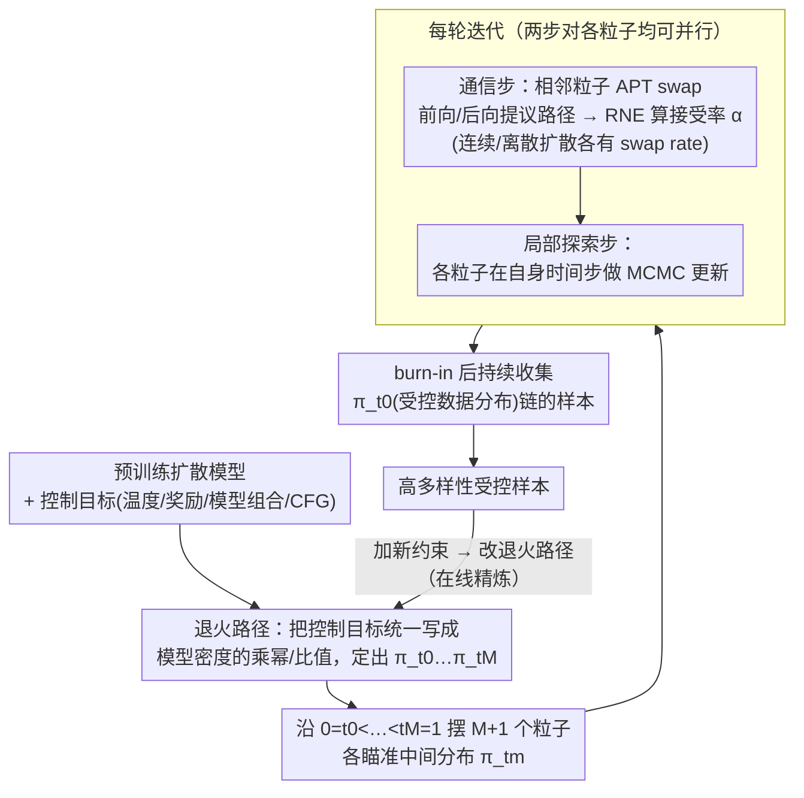

# CREPE: Controlling Diffusion with Replica Exchange

**会议**: ICLR 2026  
**arXiv**: [2509.23265](https://arxiv.org/abs/2509.23265)  
**代码**: 有（GitHub）  
**领域**: 扩散模型 / 推理时控制  
**关键词**: replica exchange, parallel tempering, inference-time control, SMC alternative, reward tilting, CFG debiasing  

## 一句话总结
提出 CREPE，一种基于 Replica Exchange（并行回火/Parallel Tempering）的扩散模型推理时控制方法，作为 SMC 的计算对偶——在去噪步维度上并行、在样本维度上串行生成，具有高样本多样性、可在线精炼、支持温度退火/奖励倾斜/模型组合/CFG 去偏等多种任务。

## 研究背景与动机

**领域现状**：推理时控制扩散模型（不重训练就满足新约束）是热门方向。目前主流方法是 SMC（序贯蒙特卡洛），通过在去噪轨迹上维护一批加权粒子来纠正启发式 guidance 的偏差。

**现有痛点**：SMC 有三大局限：(a) 需要在整个去噪轨迹中同时维护大量粒子，内存开销大；(b) 样本多样性差，尤其粒子数少时退化严重（重采样导致粒子坍缩）；(c) 采样完成后无法精炼——如果结果不满意或加入新约束，必须从头生成。

**核心矛盾**：SMC 的"并行粒子 + 串行时间步"的模式决定了它天然存在多样性和灵活性的瓶颈。需要一种计算上对偶的方案。

**本文目标** 提出 SMC 的替代方案，实现：(a) 粒子逐个生成而非批量 (b) burn-in 后保持高多样性 (c) 支持在线精炼和早停 (d) 覆盖 tempering、reward-tilting、model composition、CFG debiasing 等多种任务

**切入角度**：Replica Exchange / Parallel Tempering 恰好是 SMC 的计算对偶——它在不同去噪步上并行运行链，串行生成样本。将这个 MCMC 采样框架适配到扩散模型的设定中。

**核心 idea**：将 Parallel Tempering 的 swap move 适配到扩散模型路径空间上，利用 Radon-Nikodym Estimator 计算接受概率，实现无需显式目标密度的推理时控制。

## 方法详解

### 整体框架

CREPE 要解决的是「不重训练扩散模型、只在推理时纠偏」这件事，而它的切入点是把当前主流方案 SMC 的工作模式整个翻转过来。SMC 是"一批粒子在同一条去噪轨迹上并行前进、时间步串行推进"；CREPE 则让每个粒子各自驻留在一个固定的扩散时间步上，样本一个接一个串行生成。具体地，它沿一串从数据分布到纯噪声的时间步 $0=t_0 < t_1 < ... < t_M=1$ 摆放 $M+1$ 个粒子，每个粒子瞄准对应的中间分布 $\pi_{t_m}$；这一串中间分布由**退火路径**给定，它把"温度退火 / 奖励倾斜 / 模型组合 / CFG 去偏"等控制目标统一改写成预训练模型密度的乘幂或比值。

整条链每一轮迭代只做两步：**通信步（communication step）**让相邻时间步的两个粒子像并行回火那样尝试"交换位置"——各自模拟一条前向、一条后向的提议路径，用 RNE 算出接受率后决定是否真的交换，从而把高温（接近噪声、容易混合）链的探索力传导给低温（接近数据、要满足约束）链；**局部探索步（local exploration step）**让每个粒子在自身时间步上再做一次局部 MCMC 更新。两步对各粒子都可并行。链跑过一段 burn-in 后，最低温那条 $\pi_{t_0}$（即想要的受控数据分布）链上不断吐出的状态就是最终样本；想加新约束时只改退火路径，链可继续跑而不必从头重来。

### 关键设计

**1. 退火路径：把各类控制任务统一写成预训练模型密度的乘幂/比值**

通信步要算交换接受率，就得有一串明确的目标分布 $\pi_{t_0},...,\pi_{t_M}$，而推理时控制场景里我们手上只有一个预训练扩散模型、没有任何任务专属的密度。CREPE 的关键是把所有控制目标都改写成只用预训练模型密度组合出来的形式：温度退火 $\pi_t(x) \propto p_t^j(x)^\beta$、奖励倾斜 $\pi_t(x) \propto p_t^j(x)\exp(r_t(x))$、模型组合 $\pi_t(x) \propto \prod_j p_t^j(x)$、CFG 去偏 $\pi_t(x) \propto p_t(x)^{1-w}p_t(x|c)^w$。这样统一之后，每个目标分布都只涉及模型密度的乘幂或比值，下一步的接受率就始终落在 RNE 能直接估计的范围内，不必为每个任务单独推导密度——一套框架就把四类控制任务全接住了。

**2. 扩散路径空间上的 APT swap move：在没有显式目标密度时完成粒子交换**

并行回火的核心动作是让相邻温度的粒子交换位置，但标准 PT 算接受率必须知道目标分布的未归一化密度，而上面只给出了密度的"比值关系"、拿不到密度本身。CREPE 把交换搬到扩散路径空间上做：驻留在时间步 $t$、$t'$ 的两个粒子 $(x, x')$，让 $x$ 沿前向过程走到 $t'$、$x'$ 沿反向过程走到 $t$，凑成一对前向/后向提议路径，再用 Metropolis-Hastings 接受率 $\alpha_{t,t'}$ 决定是否真交换。要点在于 $\alpha_{t,t'}$ 由 Radon-Nikodym Estimator (RNE) 给出——它用预训练模型自身的前向/后向转移概率之比，借助 $p_{t'}(x_{t'})/p_t(x_t)=R_{t,t'}^{-1}$ 把"密度比"换成"路径概率比"，全程不显式评估任何目标密度。为覆盖不同模态，CREPE 在高斯扩散（连续 SDE，对应图像）和离散掩码扩散（CTMC，如 MDLM，对应文本）两种设定下分别推导了 swap rate，使同一套交换机制不局限于单一扩散形式。

**3. 在线精炼：MCMC 链可一直跑，中途加约束只需改退火路径**

SMC 是一次性的——采样一结束，想换约束或对结果不满意就只能从头再来。CREPE 是一条可以无限运行的 MCMC 链：任何时候想加新奖励项或改约束，只要相应改一下退火路径，并行回火会自然收敛到新的目标分布上，已跑出的进度不必丢弃。这让交互式生成、迭代设计这类"边看边调"的场景成为可能，也支持随时早停取样。

### 损失函数 / 训练策略

- 无需训练，完全在推理时运行
- 需要预训练扩散模型的前向和反向过程
- 计算开销与 SMC 可比但分布不同——PT 需 burn-in，但之后每个样本成本恒定

## 实验关键数据

### 主实验

**分子温度退火（Alanine Dipeptide/Tetrapeptide/Hexapeptide）**

| 方法 | Energy TVD ↓ | TICA MMD ↓ | 说明 |
|------|-------------|-----------|------|
| FKC (SMC) | 0.345 | 0.116 | SMC baseline |
| CREPE (Ours) | **0.224** | **0.096** | Dipeptide |
| CREPE | **0.122** | **0.035** | Tetrapeptide |

**CFG Debiasing（ImageNet-64）**

| 方法 | #Samples | IR ↑ | CLIP ↑ | FID ↓ |
|------|----------|------|--------|-------|
| FKC (SMC) | 8 | **-0.29** | **24.17** | **1.85** |
| CREPE | 8 | -0.30 | 24.10 | 1.92 |
| FKC | 512 | -0.08 | 24.31 | 1.96 |
| CREPE | 512 | **0.09** | 24.28 | **1.79** |

### 关键发现
- 少量样本时 SMC 更优（CREPE 需要 burn-in），但随样本数增加 CREPE 超越 SMC，尤其 FID 持续改善
- CREPE 的核心优势是**多样性**——SMC 的重采样导致粒子坍缩（同一 batch 内视觉相似），CREPE 的 MCMC 链天然探索更广
- 在线精炼实验中，添加新约束后 CREPE 仅需 1k 次迭代即可满足，展示了灵活性
- 在离散扩散（MNIST MDLM）上也有效，说明方法的通用性

## 亮点与洞察
- **SMC 的计算对偶视角**极为优雅——将"并行粒子×串行时间"翻转为"串行粒子×并行时间"，一句话就讲清了核心创新。这种对偶关系（Syed et al., 2024）来自采样理论的深层联系。
- **在线精炼**是 SMC 完全做不到的——对实际应用（交互式生成、迭代设计）非常有用。
- **统一框架**覆盖 tempering、reward-tilting、model composition、CFG debiasing 等多种任务，还可以自由组合。方法论上很通用。

## 局限与展望
- Burn-in 期间样本质量差，少量样本场景不如 SMC
- 每个 swap move 需要模拟前向+后向扩散路径，计算开销非平凡
- 高维图像（ImageNet-512）上主要展示 reward-tilting 的定性结果，缺少定量对比
- 接受率可能随维度增加而下降，需要更细的退火调度
- 未探索与 guidance 方法（如 DPS、FreeDoM）的组合

## 相关工作与启发
- **vs FKC (SMC)**: 计算对偶关系。少样本 SMC 优，多样本 CREPE 优。CREPE 多样性更好。
- **vs Twisted SMC/DDRM**: 都是推理时控制的纠偏方法，但 CREPE 基于 MCMC 而非重要性采样。
- **与 APT (Zhang et al., 2025)**: CREPE 将 APT 从已知未归一化密度的设定扩展到只有预训练扩散模型的设定。

## 评分
- 新颖性: ⭐⭐⭐⭐⭐ 将 Parallel Tempering 首次适配到扩散模型推理时控制，SMC 对偶视角非常优雅
- 实验充分度: ⭐⭐⭐⭐ 覆盖分子/图像/轨迹/离散数据多模态，但高分辨率图像定量实验较少
- 写作质量: ⭐⭐⭐⭐ 理论严谨但符号密度高，需要较强的随机过程背景
- 价值: ⭐⭐⭐⭐ 为扩散模型推理时控制提供了新的范式，尤其在多样性和在线精炼方面有独特优势

<!-- RELATED:START -->

## 相关论文

- [\[ECCV 2024\] Controlling the World by Sleight of Hand](../../ECCV2024/image_generation/controlling_the_world_by_sleight_of_hand.md)
- [\[ECCV 2024\] StyleTokenizer: Defining Image Style by a Single Instance for Controlling Diffusion Models](../../ECCV2024/image_generation/styletokenizer_defining_image_style_by_a_single_instance_for_controlling_diffusi.md)
- [\[ICLR 2026\] Generalization of Diffusion Models Arises with a Balanced Representation Space](generalization_of_diffusion_models_arises_with_a_balanced_representation_space.md)
- [\[ICLR 2026\] Diffusion Blend: Inference-Time Multi-Preference Alignment for Diffusion Models](diffusion_blend_inference-time_multi-preference_alignment_for_diffusion_models.md)
- [\[ICLR 2026\] AlignTok: Aligning Visual Foundation Encoders to Tokenizers for Diffusion Models](aligntok_aligning_visual_foundation_encoders_to_tokenizers_for_diffusion_models.md)

<!-- RELATED:END -->
