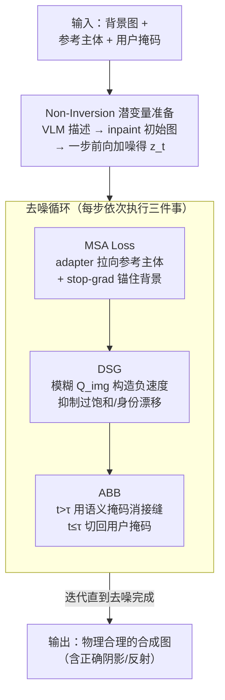

# Does FLUX Already Know How to Perform Physically Plausible Image Composition?

**会议**: ICLR2026  
**arXiv**: [2509.21278](https://arxiv.org/abs/2509.21278)  
**代码**: [GitHub](https://github.com/ZhumingLian/SHINE)  
**领域**: 图像生成  
**关键词**: image composition, training-free, diffusion model, FLUX, physically plausible

## 一句话总结
提出 SHINE，一个无需训练的图像合成框架，通过 Manifold-Steered Anchor Loss、Degradation-Suppression Guidance 和 Adaptive Background Blending 三个组件，利用预训练 T2I 模型（如 FLUX）内在的物理先验，实现在复杂光照条件下（阴影、水面反射等）的高质量物体插入。

## 背景与动机
图像合成（Image Composition）旨在将用户指定的物体无缝插入新场景。尽管多模态大模型（GPT-5、Gemini-2.5 等）进步巨大，但在图像合成任务上仍表现不佳，常出现物体放置不精确、光照不一致、主体身份漂移等问题。

现有方法面临两大困境：

1. **训练方法的局限**：基于微调的合成模型受限于合成数据质量，难以处理复杂光照（如准确的阴影生成、水面反射），且被绑定到固定分辨率。关键观察是——这些问题在基础模型中并不存在，说明物理先验已经存在于基础模型中，只是被微调过程损害了。
2. **无训练方法的瓶颈**：(a) 依赖图像反演（inversion）的方法会锁定物体姿态到参考图的朝向，且对 CFG 蒸馏模型（如 FLUX）效果差；(b) 基于注意力手术的方法不稳定且对超参数敏感。

核心洞察：现代 T2I 扩散模型已编码了丰富的物理先验和分辨率先验，关键在于如何在不破坏这些先验的前提下释放它们。

## 核心问题
如何在不进行额外训练、不依赖反演和注意力操纵的前提下，充分利用预训练 T2I 模型的物理先验，实现物理上合理的（有正确阴影、反射等）高保真图像合成？

## 方法详解

### 整体框架
SHINE（Seamless, High-fidelity Insertion with Neutralized Errors）想回答一个问题：既然预训练 T2I 模型（FLUX、SDXL、SD3.5）已经内含了正确的光照/阴影/反射先验，能不能不微调、不反演、不做注意力手术就把这些先验"借"出来做物体插入？它的做法是把整件事拆成"准备一个好的起点"和"在去噪过程中把物体一点点调对"两段。第一段用 **Non-Inversion 潜变量准备** 绕开传统反演：先让 VLM 描述参考主体，再用 inpainting 模型在背景目标区域生成一张初始图、只前向加一步噪声得到 $\bm{z}_t$，避免反演把物体姿态锁死。第二段进入标准去噪循环，每一步依次叠三件事——**MSA Loss** 在锚住背景的同时把潜变量拉向参考主体，**DSG** 用图像侧负向引导压住过饱和与身份漂移，**ABB** 按去噪进度切换掩码来消接缝又保住阴影反射。整套流程与模型无关，只用到现代 T2I 模型的标准功能。

### 关键设计

**1. Non-Inversion Latent Preparation：绕开反演带来的姿态锁定**

传统无训练方法靠图像反演拿到噪声潜变量，但反演会把物体姿态锁死到参考图的朝向，而且对 FLUX 这类 CFG 蒸馏模型效果很差。SHINE 改走一步前向扩散：先用 VLM（BLIP-3）给主体图生成描述，再用该描述驱动 inpainting 模型（FLUX.1-Fill）在背景的目标区域生成初始图像 $\bm{x}^{\text{init}}$，最后一步加噪 $\bm{z}_t = (1 - \sigma_t)\bm{z}^{\text{init}} + \sigma_t \bm{\epsilon}$。因为初始潜变量来自前向生成而非反向反演，物体可以自由地以场景适宜的朝向出现，物理先验也得以保留。

**2. Manifold-Steered Anchor (MSA) Loss：在保住背景的前提下逼近参考主体**

物体既要像参考主体，又不能把背景结构搅乱，二者天然冲突。MSA 把预训练定制化 adapter（IP-Adapter、InstantCharacter 等）当作隐式先验，在去噪中直接优化噪声潜变量，损失为

$$\mathcal{L}_{\text{MSA}}(\bm{z}_t) = \|\bm{v}_{\bm{\theta}+\bm{\Delta\theta}}(\bm{z}_t, t, \bm{c}, \bm{z}^{\text{subj}}) - \text{sg}[\tilde{\bm{v}}_t]\|_2^2$$

其中基础模型在原始潜变量上的预测 $\tilde{\bm{v}}_t$ 被 stop-gradient 固定为锚点、负责锁住背景结构，加了 adapter 的预测 $\bm{v}_{\bm{\theta}+\bm{\Delta\theta}}$ 则把潜变量拉向参考主体；梯度只在 mask 区域内更新，并仿照 SDS 省略 Jacobian 项。其有效性来自一个数学直觉：对冻结生成模型优化潜变量，相当于把它隐式投影回模型学到的数据流形，于是结果既忠实又自然。

**3. Degradation-Suppression Guidance (DSG)：用图像侧负向引导压住过饱和与身份漂移**

MSA 优化有时会带来颜色过饱和、身份一致性下降。常规做法是文本负提示，但作者发现对 FLUX 无效——给它荒谬文本它照样生成高质量图像。于是改在注意力机制里构造负速度 $\bm{v}_t^{\text{dsg}} = \bm{v}_t + \eta(\bm{v}_t - \bm{v}_{\bm{\theta}+\Delta\bm{\theta}}^{\text{neg}})$，关键是 $\bm{v}^{\text{neg}}$ 怎么来。作者逐一模糊注意力中的各分量：模糊文本侧的 $Q_{\text{txt}}$/$K_{\text{txt}}$/$V_{\text{txt}}$ 几乎无影响，模糊图像值 $V_{\text{img}}$ 直接让输出崩坏，模糊 $K_{\text{img}}$ 影响中等，唯有模糊图像查询 $Q_{\text{img}}$ 能产生明显退化又保持结构完整，因此被选为构造负速度的方式。这与理论一致——模糊 $Q_{\text{img}}$ 等价于模糊 self-attention 权重，而抑制注意力激活本就会降低生成质量，正好被用作"反向"参照。

**4. Adaptive Background Blending (ABB)：分阶段切换掩码消除可见接缝**

直接用固定的用户掩码做混合，会在合成边缘留下肉眼可见的接缝，而且容易把物体投出的阴影、反射一并裁掉。ABB 按去噪进度切换掩码：前期步（$t > \tau$）改用 cross-attention 图生成的语义自适应掩码 $M^{\text{attn}}$，让边界随物体语义自然过渡、消除接缝；后期步（$t \leq \tau$）再切回用户掩码 $M^{\text{user}}$，确保阴影和反射这些落在原始 mask 外的物理效果不被裁剪。

## 实验关键数据

### 基准数据集
提出 ComplexCompo 基准（300 对合成样本），包含多分辨率、横竖构图、低光照/强光/复杂阴影/水面反射等挑战场景，弥补了现有 512×512 固定分辨率基准的不足。

### 主要结果（DreamEditBench，220 对）

| 方法 | DINOv2↑ | DreamSim↓ | ImageReward↑ | VisionReward↑ |
|------|---------|-----------|--------------|---------------|
| AnyDoor | 0.7283 | 0.3764 | 0.4511 | 3.3946 |
| UniCombine | 0.7332 | 0.3984 | 0.4565 | 3.6108 |
| EEdit | 0.6590 | 0.6160 | 0.0216 | 3.3606 |
| **SHINE-Adapter** | **0.7415** | **0.3730** | **0.5709** | **3.6234** |
| **SHINE-LoRA** | **0.7452** | **0.3577** | **0.5906** | **3.6161** |

在人类偏好对齐指标（DreamSim、ImageReward、VisionReward）上全面超越所有基线。ComplexCompo 上优势更加明显，其他方法在非方形分辨率和复杂场景上性能显著下降，SHINE 保持领先。

### 消融实验
- MSA 贡献最大：显著提升主体身份一致性（DINOv2 从 0.6745 → 0.7204）
- DSG 提升图像质量分数（ImageReward、VisionReward 提升）
- ABB 有效消除可见接缝（视觉效果明显，但 LPIPS/SSIM 难以完全捕捉）

## 亮点
1. **无需训练的框架设计**：完全利用预训练模型的先验，避免了数据驱动方法的合成数据污染问题
2. **巧妙的 DSG 设计**：通过系统性实验发现模糊 $Q_{\text{img}}$ 是构造负速度的最优策略，理论解释优雅
3. **全面的模型无关性**：在 FLUX、SDXL、SD3.5、PixArt 上均可运行，仅依赖标准模型功能
4. **ComplexCompo 基准贡献**：填补了复杂光照条件下图像合成评估的空白

## 局限与展望
1. 当 inpainting 提示指定错误颜色时，最终结果会继承该错误颜色
2. 插入物体与参考物体的相似度取决于定制化 adapter 的质量，LoRA 需要逐概念测试时微调
3. MSA 优化需要多次前向传播（$k$ 步梯度下降），计算开销较大
4. 作者未充分讨论对 VLM 描述质量的依赖性

## 与相关工作的对比
- **vs 训练方法（AnyDoor、UniCombine）**：训练方法受合成数据质量限制，在复杂光照下表现差；AnyDoor 倾向于复制粘贴主体导致不自然
- **vs 无训练反演方法（TF-ICON、EEdit）**：反演会锁定姿态且对 FLUX 等 CFG 蒸馏模型效果差
- **vs SDS**：MSA loss 借鉴 SDS 中省略 Jacobian 项的策略，但目标不同——SDS 用于 3D 生成，MSA 用于受约束的 2D 合成

## 启发与关联
- 核心思路"预训练模型已具备所需先验，关键在于如何释放"具有普适性，可迁移到视频合成、3D 场景编辑等任务
- DSG 中对 FLUX 注意力组件的系统性分析，对理解 MMDiT 架构的内部工作机制有参考价值
- Manifold projection 的思想（用冻结模型约束优化方向）可用于其他需要平衡保真度和编辑灵活性的任务

## 评分
- 新颖性: 8/10 — 三个组件各有创新，DSG 的注意力扰动分析尤其巧妙
- 实验充分度: 9/10 — 多基准、多指标、多基线、消融完整，提出新基准
- 写作质量: 8/10 — 结构清晰，数学推导与直觉解释结合良好
- 价值: 8/10 — 无训练方法实用性强，ComplexCompo 基准有长期价值

<!-- RELATED:START -->

## 相关论文

- [\[ICCV 2025\] ScoreHOI: Physically Plausible Reconstruction of Human-Object Interaction via Score-Guided Diffusion](../../ICCV2025/image_generation/scorehoi_physically_plausible_reconstruction_of_human-object_interaction_via_sco.md)
- [\[ICLR 2026\] Concept-TRAK: Understanding how diffusion models learn concepts through concept-level attribution](concept-trak_understanding_how_diffusion_models_learn_concepts_through_concept-l.md)
- [\[ICLR 2026\] Does Semantic Noise Initialization Transfer from Images to Videos? A Paired Diagnostic Study](does_semantic_noise_initialization_transfer_from_images_to_videos_a_paired_diagn.md)
- [\[CVPR 2026\] SketchDeco: Training-Free Latent Composition for Precise Sketch Colourisation](../../CVPR2026/image_generation/sketchdeco_training-free_latent_composition_for_precise_sketch_colourisation.md)
- [\[CVPR 2025\] Pattern Analogies: Learning to Perform Programmatic Image Edits by Analogy](../../CVPR2025/image_generation/pattern_analogies_learning_to_perform_programmatic_image_edits_by_analogy.md)

<!-- RELATED:END -->
