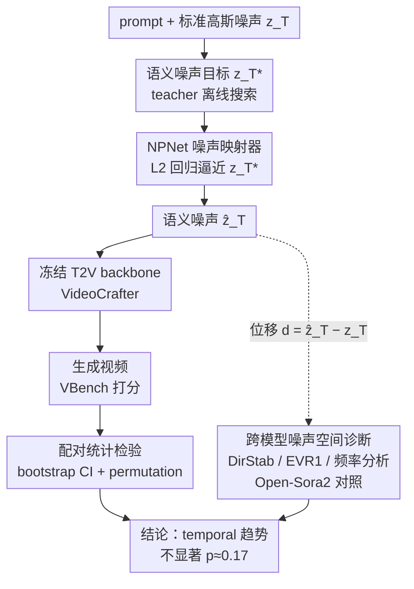

# Does Semantic Noise Initialization Transfer from Images to Videos? A Paired Diagnostic Study

**会议**: ICLR 2026  
**arXiv**: [2603.06672](https://arxiv.org/abs/2603.06672)  
**代码**: [GitHub](https://github.com/klkds/golden-noise-transfer)  
**领域**: 图像/视频生成  
**关键词**: semantic noise initialization, text-to-video diffusion, golden noise, paired evaluation, noise-space diagnostics

## 一句话总结

通过严格的 prompt 级别配对统计检验，发现将图像领域的 semantic noise initialization（golden noise）迁移到视频扩散模型后，temporal 指标呈微弱正向趋势但统计不显著（p≈0.17），噪声空间诊断揭示了方向稳定性不足和时空频率结构差异是根因。

## 研究背景与动机

文本到视频（T2V）扩散模型对随机种子高度敏感：相同 prompt 下不同的初始高斯噪声可能产生语义和运动差异极大的视频。近年来，图像生成领域的研究表明，通过 teacher-aligned 的 semantic noise initialization（即"golden noise"策略）可以提升生成的鲁棒性和可控性——核心思想是将初始噪声分布移动到更接近高质量生成的区域。

一个自然的假设是：视频生成可能更加受益于这种策略，因为时间维度的动态变化会放大种子引起的方差。然而，视频的时空耦合引入了额外的自由度和不稳定性，这一迁移能否成功尚不清楚。

本文的核心目标是进行一项系统的诊断研究：semantic noise initialization 是否能从图像成功迁移到视频扩散模型？如果不能，原因是什么？

## 方法详解

### 整体框架

这是一项诊断性研究而非追求 SOTA 的方法论文，要回答一个具体问题：图像领域的 golden noise 初始化能不能照搬到视频扩散模型？整条 pipeline 是这样转的：先让一个 teacher 扩散模型在噪声空间里离线搜出"好噪声"目标 $z_T^*$，用它训练一个轻量级噪声映射器 NPNet，把标准高斯噪声 $z_T$ 和 prompt 映射成语义噪声 $\hat z_T$；推理时把采样起点换成 $\hat z_T$、backbone 全程冻结，干净地隔离"只换初始噪声"这一个变量。评估端用 VBench 在 100 个 prompt 上打分，再以 prompt 为统计单位做配对检验，严格量化这点效果到底显不显著。最后并行做一条跨模型的噪声空间诊断（Open-Sora2 对照 VideoCrafter），从几何和频率角度回答"如果迁移失败，信号在哪一步被冲散"。

### 关键设计

**1. 语义噪声目标：把"好初始化"定义成可学习的回归靶子**

迁移的前提是先有一个"好噪声"的监督信号。作者沿用 golden noise 的 teacher-in-noise 原则，用 teacher 扩散模型的 DDIM inversion / 优化过程，在噪声空间里搜索能产生更高语义和时间质量的初始化，得到目标噪声 $z_T^*$。这一步在图像上尚可接受，但在视频上代价陡增——每个候选噪声都要跑完整的时空去噪过程才能评估好坏，所以目标只能离线预提取、再交给一个网络去摊销，这也是下一步引入 NPNet 的直接动机。

**2. NPNet 轻量级噪声映射器：把昂贵的噪声搜索摊销成一次前向**

有了目标 $z_T^*$ 后，逐 prompt 在线搜索仍然太贵，于是训练一个以 prompt 为条件的映射网络 $f_\varphi$，输入标准高斯噪声 $z_T$ 和文本 prompt $p$（经 text embedding 注入），输出语义对齐的噪声 $\hat z_T = f_\varphi(z_T, p)$，训练目标就是逼近预提取的 golden 目标：

$$L(\varphi) = \mathbb{E}\big[\|f_\varphi(z_T, p) - z_T^*\|_2^2\big]$$

推理时只需把采样起点从 $z_T$ 换成 $\hat z_T$，backbone、sampler、guidance 全部保持不变、不改一个权重。这样改造成本极低，更关键的是能干净地隔离"换初始噪声"这一个变量的效果——基线和 NPNet 共享完全相同的 prompt、种子和去噪流程，唯一区别就是 $t=T$ 时刻喂进 sampler 的那个初始 latent。

**3. 配对统计检验：让微弱效应在噪声里也能被诚实地量化**

这是本文方法论上的核心贡献，针对的是扩散模型社区常见的"看几个 cherry-pick 样例就下结论"。每个 prompt 跑 5 个随机种子，先在种子维度取平均压掉采样噪声，再把统计单位定为 prompt（$N=100$）做配对差分析（NPNet 减 baseline）；报告差值均值的 bootstrap 95% 置信区间，以及 sign-flip permutation test 在"零均值差"零假设下的 $p$ 值。正因为这套设计够严格，temporal style 那点 $+0.0018$ 的正向趋势才被如实判为不显著（95% CI 跨零，$p\approx0.17$），而不是被包装成"提升"。

**4. 跨模型噪声空间诊断：用几何与频率指标定位信号在哪一步被冲散**

光知道"不显著"还不够，作者进一步在 Open-Sora2 和 VideoCrafter 上各自分析位移向量 $d = z_g - z$（golden noise 与标准噪声之差）的统计结构，拆出三类指标：方向稳定性 DirStab 取跨种子单位位移向量的平均余弦相似度，衡量"好方向"在不同种子间是否一致；解释方差比 EVR1 取 PCA 第一主成分的方差占比，衡量位移是否集中在低维子空间；再用 FFT 拆出位移的空间/时间高频比率，看扰动落在哪个频段。跨模型对比之所以关键，是因为它能区分"噪声结构是内在的还是被采样器决定的"——VideoCrafter 的 DirStab 只有 0.200，远低于 Open-Sora2 的 0.631，说明它的好方向在不同种子间根本对不齐，加上位移在时间维度上偏高频，信号在 DDIM 采样里被旋转、扩散掉，这正是迁移失败的机制根因。

### 损失函数 / 训练策略

NPNet 仅用上面的 L2 回归损失训练，golden noise 目标由 teacher 模型预先离线提取，VideoCrafter backbone 全程冻结、不参与训练。

## 实验关键数据

### 主实验

在 100 个 VBench prompt 上评估，每个 prompt 5 个种子：

| 指标 | Baseline | NPNet | 差值 |
|------|----------|-------|------|
| aesthetic_quality | 0.638 | 0.635 | -0.003 |
| imaging_quality | 0.715 | 0.708 | -0.007 |
| background_consistency | 0.977 | 0.977 | +0.000 |
| subject_consistency | 0.978 | 0.978 | +0.000 |
| temporal_style | 0.077 | 0.079 | +0.002 |

temporal_style 的 95% bootstrap CI 包含零，p=0.1687，不显著。

### 噪声空间诊断

| 指标 | Open-Sora2 | VideoCrafter |
|------|-----------|-------------|
| DirStab（方向稳定性）| 0.631 | 0.200 |
| EVR1（主成分解释方差）| 0.464 | 0.343 |
| CV_||d||（位移范数变异系数）| 0.064 | 0.110 |
| Spatial HF Δ | -0.0005 | -0.0149 |

### 关键发现

- Open-Sora2 中黄金噪声位移方向稳定性远高于 VideoCrafter（0.631 vs 0.200）
- VideoCrafter 的 DDIM 采样会旋转和扩散初始方向扰动，导致信号退化
- 位移 d 在空间上平滑但在时间维度上高频，这种时空不平衡可能通过去噪过程放大 flicker/jitter
- 整体处于低信噪比（low-SNR）regime：prompt 级别方差远大于效应量

## 亮点与洞察

1. **方法论示范**: 展示了如何用严格的配对统计检验评估小效应，这对扩散模型社区常见的不严谨对比是很好的纠正
2. **噪声空间诊断工具**: 提出的方向稳定性、频率分析等指标为理解噪声空间变换提供了系统化的工具
3. **负面结果的价值**: 诚实地报告了迁移不成功的结果，并给出了深入的机制分析，这比只报告正面结果更有学术价值
4. **跨模型对比揭示机制**: 通过 Open-Sora2 vs VideoCrafter 的对比，揭示了采样器（DDIM vs 其他）对噪声扰动传播的关键影响
5. **"信号存在但脆弱"的诊断**: 精确描述了问题本质——不是没有信号，而是信号的时空频率特性使其在标准evaluation下不够稳定

## 局限与展望

1. 仅在 VideoCrafter 风格 backbone 上验证，不同架构（如 DiT-based 模型）可能有不同结果
2. VBench 指标可能无法完全捕捉人类偏好，特别是 prompt-specific 的运动伪影
3. 频率分析揭示了相关性但不构成因果证明
4. Golden noise 目标提取的计算开销对视频来说非常大，即使有改进，性价比可能不高
5. 未探索动态采样策略（如自适应 guidance scale）是否能缓解信号不稳定问题

## 相关工作与启发

- **Golden Noise（Zhou et al., 2025）**: 原始的图像领域 semantic noise 方法，本文是其视频扩展
- **Noise Hypernetworks（Eyring et al., 2025）**: 另一种摊销测试时计算到噪声空间的方法
- **VBench（Huang et al., 2024）**: 标准化视频生成评估套件
- 对视频生成中噪声初始化策略的研究提供了重要的 baseline 和方法论参考
- 提示未来工作应该在噪声空间操作前先分析采样器的传播特性

## 评分

- 新颖性: ⭐⭐⭐
- 实验充分度: ⭐⭐⭐⭐
- 写作质量: ⭐⭐⭐⭐⭐
- 价值: ⭐⭐⭐

<!-- RELATED:START -->

## 相关论文

- [\[ICML 2026\] Initialization is Half the Battle: Generating Diverse Images from a Guidance Potential Posterior](../../ICML2026/image_generation/initialization_is_half_the_battle_generating_diverse_images_from_a_guidance_pote.md)
- [\[CVPR 2026\] Beyond Pixel Simulation: Pathology Image Generation via Diagnostic Semantic Tokens and Prototype Control](../../CVPR2026/image_generation/beyond_pixel_simulation_pathology_image_generation_via_diagnostic_semantic_token.md)
- [\[ICLR 2026\] Diverse Text-to-Image Generation via Contrastive Noise Optimization](diverse_text-to-image_generation_via_contrastive_noise_optimization.md)
- [\[ICLR 2026\] Does FLUX Already Know How to Perform Physically Plausible Image Composition?](does_flux_already_know_how_to_perform_physically_plausible_image_composition.md)
- [\[CVPR 2025\] SCSA: A Plug-and-Play Semantic Continuous-Sparse Attention for Arbitrary Semantic Style Transfer](../../CVPR2025/image_generation/scsa_a_plug-and-play_semantic_continuous-sparse_attention_for_arbitrary_semantic.md)

<!-- RELATED:END -->
