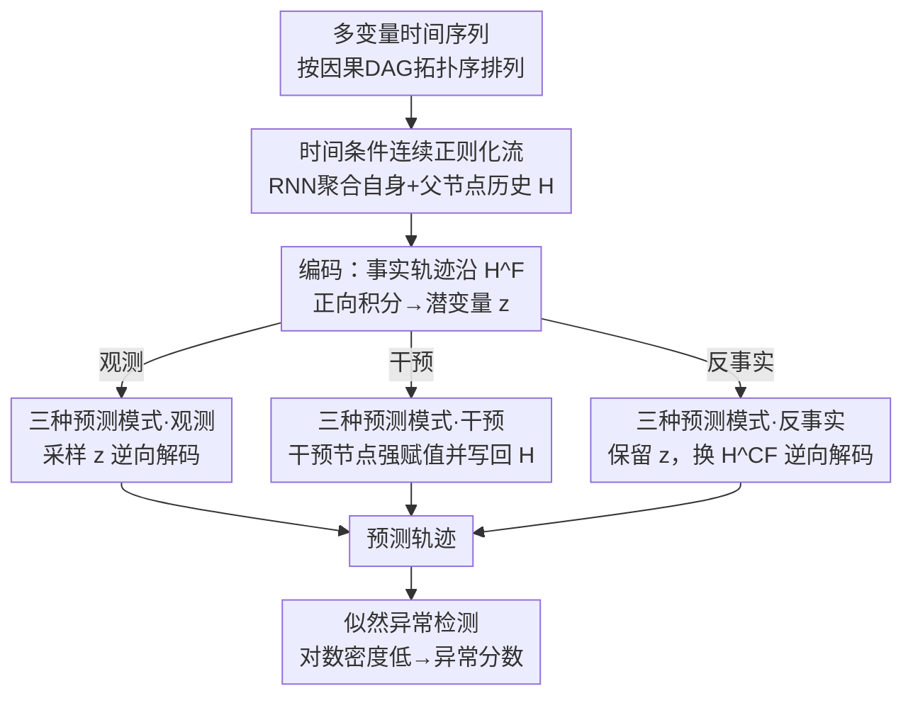

# DoFlow: Flow-based Generative Models for Interventional and Counterfactual Forecasting

**会议**: ICLR 2026  
**arXiv**: [2511.02137](https://arxiv.org/abs/2511.02137)  
**代码**: [有](https://github.com/StatFusion/DoFlow_Causal_Time_Series)  
**领域**: 图像生成  
**关键词**: 因果推断, 连续正则化流, 时间序列预测, 反事实推理, 异常检测

## 一句话总结

提出DoFlow，一种基于连续正则化流（CNF）的因果生成模型，在因果DAG上统一实现观测、干预和反事实时间序列预测，并可通过显式似然进行异常检测，在合成和真实医疗数据上验证了有效性。

## 研究背景与动机

时间序列预测是统计学和机器学习的核心问题。传统预测模型（ARIMA、LSTM、Transformer等）是**纯观测性的**——学习历史相关性并外推。但实际应用中常需回答因果性的"what if"问题：

**干预查询**："如果改变控制变量，系统如何演化？"例如水电站中改变涡轮控制信号，功率输出如何变化。观测预测器对固定历史只能给出固定预测，无法模拟不同控制方案。

**反事实查询**："如果当时采取不同干预，已观测到的轨迹会如何改变？"例如在医疗中，观察到患者的治疗和结局轨迹后，问在不同用药方案下这个特定患者的结局是否会更好。

**核心挑战**：现有因果生成模型主要面向静态数据，时间序列的因果反事实预测尚无通用框架。需要一个既具因果结构又具生成能力的模型。

## 方法详解

### 整体框架

DoFlow把 $K$ 维多变量时间序列的每个变量看作因果DAG上的一个节点，并按拓扑序排列。它用结构因果模型（SCM）刻画每个节点的生成机制——节点 $X_{i,t}$ 由自身历史 $X_{i,t-}$、父节点历史 $X_{\text{pa}(i),t-}$ 和独立外生噪声 $U_{i,t}$ 共同决定，即 $X_{i,t} := f_i(X_{i,t-}, X_{\text{pa}(i),t-}, U_{i,t})$。序列被切成上下文窗口 $\{1,\dots,\tau\}$ 和预测窗口 $\{\tau+1,\dots,T\}$，前者作条件、后者作预测目标。核心思路是给每个节点配一个连续正则化流（CNF），把因果推断的「溯因—行动—预测」三步映射成流的「编码—改条件—解码」，从而用一套模型统一吐出观测、干预、反事实三类预测，并顺带用流的显式密度做异常检测。

### 关键设计

**1. 时间条件连续正则化流：让因果结构和流绑定在一起**

如果对所有节点共用一个无条件流，就丢掉了因果DAG里"谁依赖谁"的信息。DoFlow为每个节点 $i$ 学一个跨时间步共享的CNF，并把因果历史作为条件注入。流由一个Neural ODE定义，在 $s\in[0,1]$ 上把数据分布连续地搬运到基底分布 $\mathcal{N}(0,1)$：$\frac{dx_{i,t}(s)}{ds} = v_i(x_{i,t}(s), s; H_{i,t-1})$。这里的条件 $H_{i,t-1}=\text{concat}(h_{i,t-1}, h_{\text{pa}(i),t-1})$ 由RNN聚合自身和父节点的历史隐状态——速度场 $v_i$ 因此显式依赖因果父节点，DAG结构被编码进了流的动力学里。

**2. 编码—解码的可逆映射：一条流同时承担推断噪声和生成预测**

CNF天然可逆，正反两个方向各对应因果推断里的一半。正向（编码）把观测值 $x_{i,t}^F$ 沿事实隐状态 $H_{i,t-1}^F$ 积分到潜变量 $z_{i,t}^F = x_{i,t}^F + \int_0^1 v_i(x_{i,t}(s), s; H_{i,t-1}^F)\,ds$，相当于反推出该样本对应的外生噪声；逆向（解码）则从潜变量出发、沿新的隐状态 $\hat{H}_{i,t-1}$ 反向积分 $\hat{x}_{i,t} = z_{i,t} - \int_0^1 v_i(x_{i,t}(s), s; \hat{H}_{i,t-1})\,ds$，生成预测值。正是这种"编码出噪声、换掉条件、再解码"的结构，让反事实可以在保留个体噪声的前提下改变干预，而不需要额外的反事实专用模块。

**3. 三种预测模式：同一套编解码切换出观测、干预、反事实**

观测预测最简单：直接采样 $z\sim\mathcal{N}(0,1)$，按拓扑序逐节点逆向解码。干预预测在解码时对干预集合 $(i,t)\in\mathcal{I}$ 强制赋值 $\hat{x}_{i,t}\leftarrow\gamma_{i,t}$，非干预节点照常解码——但由于干预后的值会写回隐状态向下游传播，下游节点自然"感知"到上游被动了手脚，这就是不具因果结构的基线做不到的地方。反事实预测则走完整三步：先用事实隐状态 $H^F$ 把事实轨迹编码成 $z_{i,t}^F$（溯因，锁住个体噪声），再施加干预（行动），最后用反事实隐状态 $\hat{H}^{CF}$ 把同一组 $z_{i,t}^F$ 解码出反事实轨迹（预测）。

**4. 似然异常检测：免费拿到的显式密度**

CNF不仅能采样，还能算出预测轨迹的精确对数密度，因为变换的雅可比可以通过速度场的散度积分得到：$\log p_{\theta}(\hat{x}_{\tau+1:T}\mid\hat{H}_\tau) = \sum_{t=\tau+1}^{T}\big[\log q(z_t) + \int_0^1 \nabla\cdot v_\theta(x_t(s), s; \hat{H}_{t-1})\,ds\big]$。当上下文异常时，模型给出的预测轨迹会落在低密度区，于是这个对数似然天然成了异常分数，无需另训判别器。

### 一个完整示例

以医疗反事实为例：观测到某患者在事实用药方案下的治疗与结局轨迹后，要问"换一种剂量结局会不会更好"。DoFlow先用事实隐状态 $H^F$ 沿正向积分，把这段事实轨迹逐节点编码成潜变量 $z_{i,t}^F$，这一步把"这个特定患者"的外生噪声固定下来；接着在反事实剂量上施加干预、并据此重算下游节点的隐状态 $\hat{H}^{CF}$；最后把同一组 $z_{i,t}^F$ 沿 $\hat{H}^{CF}$ 逆向解码，得到这名患者在新剂量下的反事实结局。因为编码与解码共用一条可逆流、且潜变量被保留，结果反映的是同一个体在不同干预下的差异，而非群体平均效应。

### 损失函数 / 训练策略

训练用条件流匹配（CFM）损失，参考路径取数据点与基底样本之间的直线插值 $\phi(x_{i,t},z;s)$，回归对应的恒定速度 $z-x_{i,t}$：$\mathcal{L}_{\text{CFM}}(\theta) = \mathbb{E}\big[\frac{1}{K(T-\tau)}\sum_{i,t}\|v_i(\phi(x_{i,t},z;s), s; H_{i,t-1}) - (z - x_{i,t})\|_2^2\big]$。隐状态用真实观测自回归更新（teacher forcing），保证训练时条件与数据对齐。理论上（Corollary 4.5），在SCM单调且训练精确的假设下，上述编码—解码流程可精确恢复真实的反事实轨迹，为方法提供了可识别性保证。

## 实验关键数据

### 主实验

**合成数据观测/干预/反事实预测RMSE（多种DAG结构）**

| 方法 | Tree-Obs | Tree-Int | Tree-CF | Diamond-Obs | Diamond-Int | Diamond-CF |
|------|:---:|:---:|:---:|:---:|:---:|:---:|
| DoFlow | **0.57** | **0.54** | **0.11** | **0.55** | **0.57** | **0.12** |
| GRU | 0.65 | 1.01 | NA | 0.58 | 0.94 | NA |
| TFT | 0.58 | 0.97 | NA | 0.63 | 1.18 | NA |
| TiDE | 0.60 | 1.15 | NA | 0.50 | 1.05 | NA |

**关键观察**：
- DoFlow在干预预测上大幅领先（RMSE差距~0.5），因为基线不具备因果结构
- 反事实预测是DoFlow独有能力，基线无法实现
- 非线性非加性（NLNA）场景也表现稳健

**真实数据：水电站干预预测**

DoFlow在水电站数据上成功预测不同涡轮控制方案下游信号的变化，因果结构与物理一致。

**真实数据：癌症治疗效果估计**

| 方法 | 均方根政策误差（RMSE of PEHE）↓ |
|------|:---:|
| DoFlow | **最优** |
| CRN | 次优 |

### 消融实验

- 加性 vs 非线性非加性噪声模型：DoFlow在两种设置下均表现良好
- 不同DAG结构（Chain/Tree/Diamond/FC-Layer）：一致性优异
- 异常检测AUROC：DoFlow在合成和真实水电站数据上有效检测异常

### 关键发现

1. DoFlow统一了观测、干预、反事实三种查询，是首个通用时间序列反事实框架
2. CNF的可逆性是核心：编码→修改条件→解码，天然支持反事实
3. 隐状态传播干预效应，下游节点自然感知上游干预
4. 显式似然密度提供异常检测的额外能力

## 亮点与洞察

- **统一框架**：用一个模型同时支持三种因果查询，架构设计自然优雅
- **CNF的因果对齐**：流的可逆性与因果推断的溯因-行动-预测三步法完美契合
- **理论支持**：证明了在单调SCM下的反事实精确恢复性质
- **显式似然**：除预测外免费获得异常检测能力，增加实用价值
- **RNN+CNF的组合**：RNN编码时序上下文，CNF处理不确定性和可逆映射

## 局限与展望

- 假设因果DAG已知，实际中可能需要因果发现
- 假设无同时步内因果效应（所有因果影响至少有一步时滞）
- 反事实恢复理论需要SCM单调性和精确训练假设
- 每个节点一个独立CNF，节点数多时扩展性待验证
- 真实场景中反事实真值不可观测，仅能在合成数据上定量评估
- 未与更复杂的时间序列因果效应估计方法深入对比

## 相关工作与启发

- **vs 传统因果效应方法**：后者关注离散动作的短期期望差异，DoFlow支持连续变量在任意时间的干预
- **vs 静态因果生成模型**（Javaloy等）：DoFlow扩展到时间序列，捕获跨时间的因果依赖
- **vs 现代预测器**（TFT/TiDE/TSMixer）：它们是观测性的，无法回答因果问题
- **医疗应用潜力**：个体化治疗方案比较、药物剂量优化、临床决策支持

## 评分

| 维度 | 分数 |
|------|:---:|
| 创新性 | ★★★★★ |
| 理论深度 | ★★★★☆ |
| 实验充分性 | ★★★★☆ |
| 实用价值 | ★★★★☆ |
| 写作质量 | ★★★★☆ |

<!-- RELATED:START -->

## 相关论文

- [\[ICLR 2026\] Conditionally Whitened Generative Models for Probabilistic Time Series Forecasting](conditionally_whitened_generative_models_for_probabilistic_time_series_forecasti.md)
- [\[ICLR 2026\] FlowCast: Trajectory Forecasting for Scalable Zero-Cost Speculative Flow Matching](flowcast_trajectory_forecasting_for_scalable_zero-cost_speculative_flow_matching.md)
- [\[ICLR 2026\] Laplacian Multi-scale Flow Matching for Generative Modeling](laplacian_multi-scale_flow_matching_for_generative_modeling.md)
- [\[ICML 2026\] Barriers to Counterfactual Credit Attribution for Autoregressive Models](../../ICML2026/image_generation/barriers_to_counterfactual_credit_attribution_for_autoregressive_models.md)
- [\[ICLR 2026\] CMT: Mid-Training for Efficient Learning of Consistency, Mean Flow, and Flow Map Models](cmt_mid-training_for_efficient_learning_of_consistency_mean_flow_and_flow_map_mo.md)

<!-- RELATED:END -->
