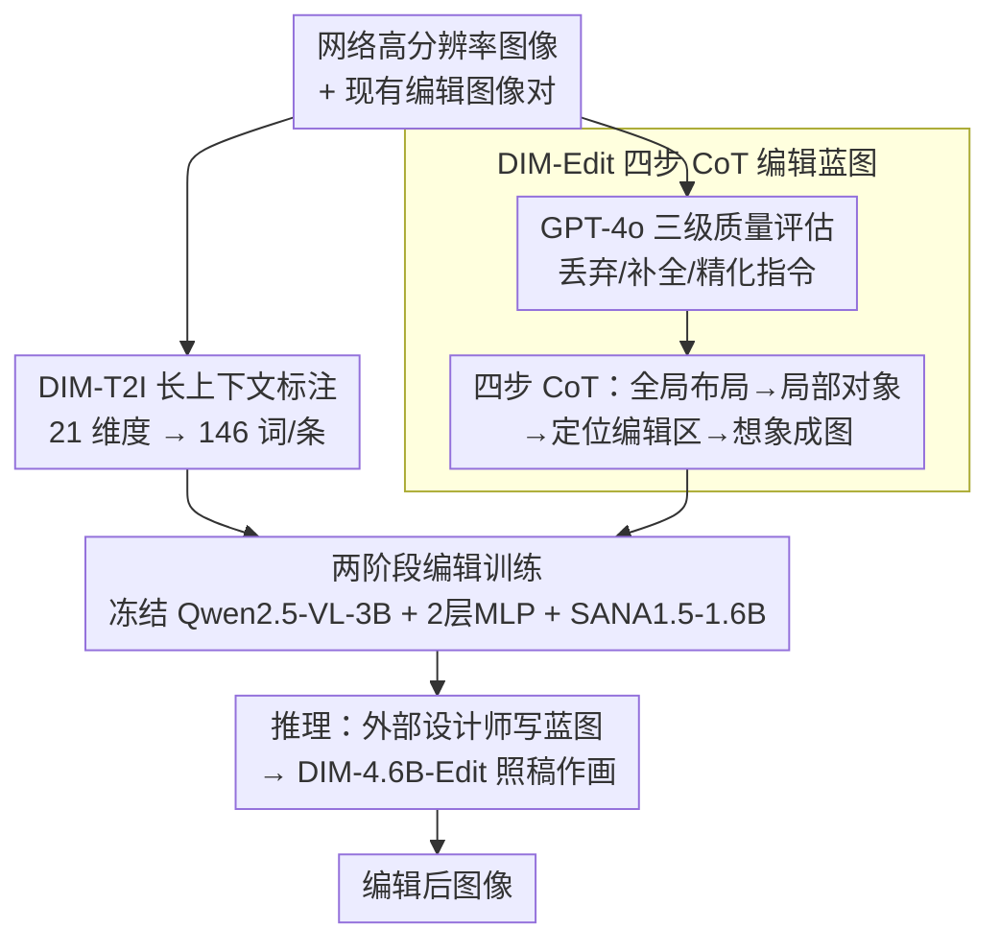

# Draw-In-Mind: Rebalancing Designer-Painter Roles in Unified Multimodal Models Benefits Image Editing

**会议**: ICLR 2026  
**arXiv**: [2509.01986](https://arxiv.org/abs/2509.01986)  
**代码**: [GitHub](https://github.com/showlab/DIM)  
**领域**: 扩散模型 / 图像编辑  
**关键词**: Unified Multimodal Model, Chain-of-Thought, image editing, Designer-Painter, Data-Centric

## 一句话总结
指出当前统一多模态模型中理解模块仅作翻译器而生成模块被迫同时充当"设计师"和"画家"的职责失衡问题，通过构建 DIM 数据集（14M 长上下文文图对 + 233K CoT 编辑蓝图）将设计责任转移给理解模块，4.6B 参数即超越 5 倍大的模型。

## 研究背景与动机
**领域现状**：统一多模态理解与生成的模型（如 Show-o、BAGEL、UniWorld）在 T2I 生成上表现出色，但在指令引导的图像编辑上仍与 GPT-4o-Image 等专有模型有显著差距。

**现有痛点**：现有编辑模型的理解模块仅将用户指令编码为语义条件（充当"翻译器"），而生成模块需同时推断原始布局、定位编辑区域、渲染新内容（同时担任"设计师"和"画家"）。这种职责分配极不合理。

**核心矛盾**：理解模块通常在数倍于生成模块的数据上训练复杂推理任务，却未被充分利用来做设计规划。单纯扩大参数规模（如 Step1X-Edit 的 12.5B 生成参数）并非有效策略。

**本文目标** 如何重新平衡理解与生成模块的职责分工，让编辑更高效？

**切入角度**：数据驱动——构建包含 CoT 推理蓝图的编辑数据集，让外部设计师（MLLM）在文本空间完成编辑规划，生成模块只需执行"绘画"。

**核心 idea**：将"设计"职责从生成模块转移给理解模块，通过 CoT 编辑蓝图显式降低生成模块的认知负担。

## 方法详解

### 整体框架
DIM 想解决的是统一多模态模型里"理解模块只当翻译器、生成模块被迫同时当设计师和画家"的职责失衡。它的架构本身极简：冻结的 Qwen2.5-VL-3B 当理解模块，只经过两层 MLP 接到可训练的 SANA1.5-1.6B 生成模块，总参数才 4.6B。真正让这套架构跑起来的不是模型而是数据——一份长上下文 T2I 标注让生成模块先学会精细的文图对应，一份带四步 CoT 编辑蓝图的指令数据把"该改哪里、改成什么样"的设计责任从生成端搬到文本空间；两者通过两阶段训练依次注入模型。推理时由一个外部设计师（默认 GPT-4o）先写出编辑蓝图，生成模块只负责照着蓝图把图画出来。

### 关键设计

**1. DIM-T2I 长上下文标注：让理解模块先学会"看懂全局"**

生成模块要想在编辑时少犯错，前提是它见过足够细的图文对应关系，可现有 T2I 数据的 prompt 普遍偏短、描述粒度太粗。DIM 从网络收集高分辨率（≥512²）图像，用内部模型沿 21 个维度生成长上下文标注，把平均 prompt 长度推到 146.76 词。这一步不直接教编辑，而是在 T2I 预训练阶段就让 connector 和生成模块习惯于"密集文本→精细图像"的映射，为后面消化复杂 CoT 蓝图打底。

**2. DIM-Edit 四步 CoT 编辑蓝图：把编辑拆成可被生成模块执行的设计稿**

这是全文核心，要解决的是"生成模块同时充当设计师和画家"的过载问题。数据来源上，DIM 从 UltraEdit、ShareGPT-4o-Image、人工编辑等现有编辑数据中汇集共 233K 对图像（其中按 SSIM/DINO/CLIP 联合筛 UltraEdit 的高一致性子集）。光有图像对还不够，原始指令质量参差，于是先让 GPT-4o 把每条 prompt 判成三类——Misaligned 直接丢弃、Partially aligned 补全指令里没提到的修改、Aligned 做消歧和精化，保证指令和图像变化严格对齐。清洗之后再把优化指令连同源图喂给 GPT-4o，让它写出四步 CoT 蓝图：先做全局布局感知（Global Layout Perception，认出所有关键对象及位置）、再做局部对象感知（Local Object Perception，描述每个对象的形状/颜色/纹理/状态）、然后定位编辑区域（Edit Area Localization）、最后想象编辑后的图像（Edited Image Imagination）。这条推理链把"该改哪里、改成什么样"显式写进文本，平均 prompt 长度达 252.64 词，生成模块拿到的不再是一句模糊指令，而是一份接近成稿的设计方案，认知负担被实质性卸到了文本空间。

**3. 两阶段编辑训练：先学基础编辑手感，再学照蓝图作画**

把 T2I 能力和 CoT 编辑能力一口气塞进去容易互相干扰，所以训练分步走。T2I 阶段在 DIM-T2I 加 6.9M 公开数据上训练 connector 和 SANA1.5-1.6B、冻住 Qwen2.5-VL-3B，建立密集文图映射；编辑第一阶段在 UltraEdit 上微调，源图沿通道维度与噪声拼接，让模型先掌握"给定源图和指令做出改动"的基本编辑手感；编辑第二阶段才在带 CoT 蓝图的 DIM-Edit 上微调，把生成模块的角色彻底收缩为"按设计稿执行"，最终得到 DIM-4.6B-Edit。

### 损失函数 / 训练策略
全程只用 vanilla flow matching 作为目标函数，不引入额外蒸馏或对齐损失。优化器为 AdamW，T2I 阶段学习率 $2 \times 10^{-5}$、batch size 256 训练 8 epochs；编辑阶段 I 学习率 $1 \times 10^{-4}$、batch size 32 训练 10 epochs；阶段 II 学习率降到 $1 \times 10^{-5}$、训练 50 epochs。数据上刻意排除 BLIP3-o-60K 等蒸馏数据，避免数据泄露和 benchmark hacking。推理侧默认用 GPT-4o 当设计师，并验证 GPT-5、Claude 等同样能驱动模型；关键是设计师在推理时只拿到源图加指令、看不到目标图，与真实使用场景一致，避免了"偷看答案"带来的虚高。

## 实验关键数据

### 主实验（ImgEdit Benchmark）

| 模型 | 参数量 | Add | Replace | Remove | Background | Style | Action | Overall |
|------|--------|-----|---------|--------|------------|-------|--------|---------|
| Step1X-Edit | 7B+12.5B | 3.88 | 3.40 | 2.41 | 3.16 | 4.63 | 2.52 | 3.06 |
| BAGEL | 14B | 3.56 | 3.30 | 2.62 | 3.24 | 4.49 | 4.17 | 3.20 |
| UniWorld-V1 | 7B+12B | 3.82 | 3.47 | 3.24 | 2.99 | 4.21 | 2.74 | 3.26 |
| GPT-4o-Image | — | 4.61 | 4.35 | 3.66 | 4.57 | 4.93 | 4.89 | 4.20 |
| **DIM-4.6B-Edit** | **3B+1.6B** | **4.09** | **4.00** | **3.43** | **3.87** | **4.92** | **4.08** | **3.67** |

*DIM 以不到 5B 参数显著超越 14B-19B 级别的开源模型，缩小了与 GPT-4o-Image 的差距。*

### GEdit-Bench-EN（去除 Text Change 任务后）

| 模型 | BC | CA | MA | MC | SC | SA | SRM | SRP | TT | AVG (w/o TC) |
|------|----|----|----|----|----|----|-----|-----|----|-------------|
| Step1X-Edit | 7.03 | 6.26 | 6.46 | 3.66 | 7.24 | 7.17 | 6.42 | 7.39 | 6.62 | 6.35 |
| **DIM-4.6B-Edit** | **7.02** | **6.81** | **6.00** | **4.67** | **7.16** | **7.48** | **6.67** | **6.76** | **6.55** | **6.50** |

### 关键发现
- 仅 1.6B 生成参数即可超越 12B FLUX 后端的 Step1X-Edit，验证了数据质量 > 参数规模
- 在同数据（ShareGPT-4o-Image）训练的 Janus-4o（7B）表现远逊 DIM，说明提升来自 CoT 蓝图本身而非数据源
- 不同外部设计师（GPT-4o、GPT-5、Claude 等）均能有效驱动 DIM，证明框架的泛化性
- T2I 质量也很强：GenEval 0.77，MJHQ-30K FID 最优 5.50

## 亮点与洞察
- **洞察深刻**：将编辑失败归因于"职责失衡"而非模型大小不足，这一视角非常新颖
- **数据工程出色**：CoT 蓝图的四步设计（感知→定位→想象）与人类编辑思维过程高度吻合
- **极致效率**：仅用两层 MLP 作 connector（MetaQuery 用 1.6B transformer），证明复杂连接器非必需
- **严谨的数据清洗**：三级 prompt 质量评估 + 多维筛选，避免了 AI 生成数据的常见噪声
- **设计/执行分离范式**：可推广到其他需要复杂推理的生成任务

## 局限与展望
- 依赖外部 MLLM（GPT-4o）作为设计师，增加推理成本和 API 依赖
- Text Change 任务表现较弱（缺乏对应训练数据），未来可补充文字编辑数据
- 未探索将设计师内化到模型中（当前设计师是外部的），端到端方案可能更优
- 编辑阶段的两阶段训练可能引入遗忘，课程学习策略有待优化
- DIM-T2I 的 14M 数据量级对计算资源仍有较高要求
- MagicBrush 测试集上 L1 和 CLIP-I 指标虽优，但 DINO 指标不如某些方法，细粒度语义保持仍有空间
- 当前仅支持单轮编辑，多轮迭代编辑（如先改背景再改前景）的支持有待探索

## 相关工作与启发
- **MetaQuery**：同为 connector-based 统一模型，但使用 1.6B 大 transformer connector；DIM 用两层 MLP 即可比肩，说明关键瓶颈在数据而非连接器架构
- **BAGEL**：14B 集成式统一模型，编辑效果不如 DIM 的 4.6B，证实了"大不一定好"
- **Step1X-Edit / UniWorld-V1**：最新大规模编辑模型（7B+12B 后端），均被 DIM 以更少参数超越
- **Janus-4o**：同在 ShareGPT-4o-Image 上训练但 Overall 仅 3.19（DIM 为 3.67），说明 CoT 蓝图的增益不来自数据源本身
- **InstructPix2Pix**：早期编辑模型，DIM 的两阶段训练策略源自其通道拼接设计
- **UltraEdit**：大规模 AI 编辑数据集，DIM 在其基础上筛选高一致性子集作为第一阶段训练数据
- 启发：在模型架构红利趋于饱和时，**高质量数据设计**（特别是 CoT 推理链）可能是更高效的突破路径。人类编辑工作流中"先构思再动手"的范式可以直接转化为数据设计原则

## 评分
- 新颖性: ⭐⭐⭐⭐⭐ — "设计-画家"职责分离的洞察极为新颖，且用数据验证而非架构改动
- 实验充分度: ⭐⭐⭐⭐ — 多 benchmark 验证 + 多设计师泛化测试，但消融可更深入
- 写作质量: ⭐⭐⭐⭐⭐ — 逻辑清晰，类比直觉，图示精良
- 价值: ⭐⭐⭐⭐⭐ — 为统一模型的图像编辑提供了全新思路，数据已开源

<!-- RELATED:START -->

## 相关论文

- [\[ICLR 2026\] Uni-X: Mitigating Modality Conflict with a Two-End-Separated Architecture for Unified Multimodal Models](uni-x_mitigating_modality_conflict_with_a_two-end-separated_architecture_for_uni.md)
- [\[ECCV 2024\] LayoutDETR: Detection Transformer Is a Good Multimodal Layout Designer](../../ECCV2024/image_generation/layoutdetr_detection_transformer_is_a_good_multimodal_layout_designer.md)
- [\[CVPR 2026\] ConsistCompose: Unified Multimodal Layout Control for Image Composition](../../CVPR2026/image_generation/consistcompose_multimodal_layout_control.md)
- [\[ICLR 2026\] EditScore: Unlocking Online RL for Image Editing via High-Fidelity Reward Modeling](editscore_unlocking_online_rl_for_image_editing_via_high-fidelity_reward_modelin.md)
- [\[CVPR 2026\] MICON-Bench: Benchmarking and Enhancing Multi-Image Context Image Generation in Unified Multimodal Models](../../CVPR2026/image_generation/micon-bench_benchmarking_and_enhancing_multi-image_context_image_generation_in_u.md)

<!-- RELATED:END -->
