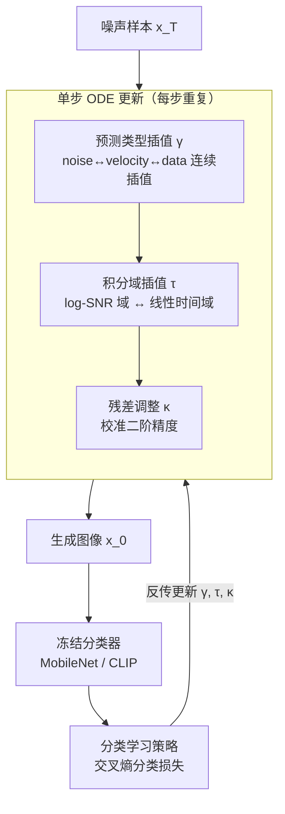

# Dual-Solver: A Generalized ODE Solver for Diffusion Models with Dual Prediction

**会议**: ICLR 2026  
**arXiv**: [2603.03973](https://arxiv.org/abs/2603.03973)  
**代码**: 无  
**领域**: 扩散模型 / 采样加速  
**关键词**: ODE solver, learnable sampler, prediction interpolation, domain selection, low-NFE  

## 一句话总结
提出 Dual-Solver，通过三组可学习参数（预测类型插值 $\gamma$、积分域选择 $\tau$、残差调整 $\kappa$）泛化扩散模型多步采样器，用冻结预训练分类器（MobileNet/CLIP）的分类损失学习参数（无需教师轨迹），在 3-9 NFE 低步区间全面优于 DPM-Solver++ 等方法。

## 研究背景与动机

**领域现状**：推理加速是扩散模型的核心挑战。ODE 求解器（DPM-Solver、DEIS 等）利用扩散动力学结构设计高效采样。学习型求解器（BNS-Solver、DS-Solver）优化时间步和采样参数以进一步提升质量。

**现有痛点**：(a) 传统求解器固定预测类型（noise/data/velocity）和积分域（对数/线性），但不同选择在不同 NFE 下表现不一，没有通用最优方案；(b) 学习型求解器需要大量教师轨迹或高 NFE 采样生成目标样本，准备开销大。

**核心矛盾**：预测类型和积分域的选择影响采样质量，但最优选择依赖 backbone 和 NFE——需要自适应方法。

**本文目标**：统一不同预测类型和积分域到一个连续参数化框架，并用无需目标样本的分类损失来学习最优参数。

**切入角度**：观察到 noise prediction、velocity prediction、data prediction 可以通过线性组合互换，积分在 $\log$ SNR 域 vs 线性 $t$ 域也是连续插值，这些都可以参数化并端到端学习。

**核心 idea**：将预测类型、积分域、残差项全部参数化，然后用冻结分类器的分类准确率作为无目标样本的训练信号。

## 方法详解

### 整体框架

Dual-Solver 沿用扩散模型标准的 predictor-corrector 多步采样骨架，但把以往被人手固定下来的三个采样设计——预测类型、积分域、残差项——全部改写成三组连续可学习参数 $\gamma$、$\tau$、$\kappa$。每一步 ODE 更新都依次受这三个参数调制，从 $x_T$ 一路解到 $x_0$。整套参数不靠教师轨迹或高 NFE 目标样本来拟合，而是把生成图像喂给一个冻结的预训练分类器，用它的交叉熵分类损失反向传播来端到端优化这三组参数（backbone 与分类器全程冻结），从而在 3-9 步的低 NFE 区间自动找到当前 backbone 下的最优配置。

### 关键设计

**1. 预测类型插值 $\gamma$：让一步更新自由游走在 noise / velocity / data 预测之间**

传统求解器要么用 noise prediction $\hat{\epsilon}_\theta$、要么用 data prediction $\hat{x}_\theta$，但在不同 NFE 下哪种更优并无定论，硬选一种就把性能锁死了。本文注意到这几种预测目标本就是同一网络输出的线性重组，于是用一个标量把它们连续插值成 $\hat{p}_\gamma = (1-\gamma)\,\hat{\epsilon}_\theta + \gamma\,\hat{x}_\theta$，$\gamma$ 可逐步取值。这样每一步都能挑出最适合的预测形态，消融里固定 $\gamma=-1$（纯 noise prediction）在 NFE=3 时 FID 灾难性飙到 7.87，而让 $\gamma$ 自适应则降到 0.574，差距说明这个自由度正是低步采样的关键。

**2. 积分域插值 $\tau$：在 log-SNR 域和线性时间域之间连续过渡**

ODE 离散化既可以在 $\lambda=\log(\alpha_t/\sigma_t)$ 域上做、也可以在线性 $t$ 域上做，两者对低步采样的数值误差影响不同，但同样没有一刀切的最优。Dual-Solver 不再二选一，而是用 $\tau$ 把两个积分域加权混合成一个连续谱，让模型在训练中决定每一步该偏向哪个域，把"域选择"从离散超参变成可微分的连续量。

**3. 残差调整 $\kappa$：在放开前两个自由度后稳住二阶精度**

一旦预测类型和积分域都被改成可学习的插值，多步更新里原本配平的残差项就会失配，可能掉到一阶精度。$\kappa$ 专门用来重新校准多步公式中的残差权重，使整条更新在 $\gamma$、$\tau$ 任意取值下仍保持二阶局部精度。消融中固定 $\kappa=0$ 会让 NFE=3 的 FID 从 0.574 退化到 0.944，印证了它对低步稳定性的作用。

**4. 分类学习策略：用冻结分类器的判别损失取代回归目标，免去目标样本**

学习型求解器通常要先用高 NFE 采样一批目标样本，再让低步输出去回归它们，准备开销极大。Dual-Solver 改用一个冻结的预训练分类器（如 MobileNet / CLIP）对生成图像打分，以交叉熵分类损失（条件类别作为标签）作为训练信号反传去更新 $\gamma,\tau,\kappa$，整条 backbone 与分类器都不动。这样既不需要任何目标样本，又把"图像是否落在正确类别流形上"作为质量代理，在 NFE=3 时把 FID 从最强回归基线（VGG 特征回归）的 41.58 压到 24.91。论文还发现分类器的强弱存在 V 形曲线：测评 20 个分类器后，中等精度的效果最好——太强会过约束、太弱信号不足。

### 损失函数 / 训练策略

训练时整个扩散 backbone 和分类器全部冻结，只优化 $\gamma,\tau,\kappa$ 三组参数，目标为带条件类别标签的交叉熵分类损失。由于待学参数极少且无需目标样本，该方案可即插即用地迁移到 DiT、GM-DiT、SANA、PixArt-α 等多种 backbone；学到的参数还能跨 NFE 线性插值到未训练过的步数，仍优于手工求解器。

## 实验关键数据

### 主实验（ImageNet 256, DiT-XL/2, 50k样本评估, CFG=1.5）

不同学习策略在 DiT 上的 FID 对比：

| 学习方法 | NFE=3 FID↓ | NFE=5 FID↓ | NFE=7 FID↓ | NFE=9 FID↓ |
|---------|-----------|-----------|-----------|-----------|
| Sample 回归 | 107.13 | 11.71 | 4.60 | 2.99 |
| Trajectory 回归 | 100.89 | 11.59 | 3.66 | 2.84 |
| Feature 回归 (AlexNet) | 47.75 | 7.24 | 3.42 | 2.91 |
| Feature 回归 (VGG) | 41.58 | 5.48 | 3.23 | 2.88 |
| **分类学习 (Hard-label)** | **24.91** | **3.52** | **2.75** | **2.67** |

分类学习在所有 NFE 下均显著优于回归方法，NFE=3 时 FID 从 41.58 降至 24.91（-40%）。

### 消融实验

参数配置消融（DiT, p1c2 配置）：

| 配置 | NFE=3 FID | NFE=5 FID | NFE=7 FID | NFE=9 FID |
|------|----------|----------|----------|----------|
| all learnable | **0.574** | **0.197** | 0.178 | 0.173 |
| $\gamma=0$ 固定 | 0.600 | 0.202 | 0.183 | 0.180 |
| $\gamma=1$ 固定 | 0.816 | 0.223 | 0.182 | 0.176 |
| $\gamma=-1$ 固定 | 7.871 | 7.676 | 0.238 | 0.196 |
| $\kappa=0$ 固定 | 0.944 | 0.256 | 0.202 | 0.190 |
| p1 (无corrector) | 0.667 | 0.225 | 0.183 | 0.175 |
| p2 | 1.023 | 0.253 | 0.222 | 0.181 |

多 backbone 覆盖：DiT（ImageNet条件生成）、GM-DiT（flow matching, ImageNet）、PixArt-α（T2I, 512px）、SANA（flow matching T2I, 512px）均验证有效。

### 关键发现
- **$\gamma$ 的自适应至关重要**：固定 $\gamma=-1$（noise prediction）在低 NFE 下灾难性退化（FID 7.87），而自适应 $\gamma$ 可自动在不同步骤选择最优预测类型
- **分类器选择存在 V 形曲线**：测评 20 个预训练分类器发现，中等精度的分类器效果最好——太强则过约束、太弱则信号不足
- **参数可跨 NFE 插值**：相邻 NFE 的学习参数形态相似，线性插值到未见 NFE 仍优于手工求解器
- GM-DiT（flow matching）在 NFE 7-9 下 Dual-Solver 表现略差，加入 trajectory 回归后恢复优势

## 亮点与洞察
- **三维参数化**统一了大量采样器的设计选择——DPM-Solver++ 是 $\gamma=0, \tau=0$ 的特例。
- **分类学习**替代回归学习是关键创新——不需要生成高 NFE 目标样本，只需一个冻结分类器。这种思路可以迁移到任何可微指标的优化。

## 局限与展望
- 参数依赖 backbone 和 NFE，每个配置需要重新学习
- 分类损失可能偏向可分类性而非视觉质量
- 仅在 3-9 NFE 区间验证，更高 NFE 下优势是否保持未知

## 相关工作与启发
- **vs DPM-Solver++**: Dual-Solver 是其泛化版本，通过学习参数自适应选择最优配置
- **vs BNS/DS-Solver**: 同为学习型求解器但 Dual-Solver 不需要目标样本
- 可以与一致性蒸馏等方法正交使用

## 评分
- 新颖性: ⭐⭐⭐⭐ 统一参数化框架+分类学习是有新意的组合
- 实验充分度: ⭐⭐⭐⭐ 多 backbone (DiT/SANA/PixArt) + 多 NFE 全面
- 写作质量: ⭐⭐⭐⭐ 公式推导清晰
- 价值: ⭐⭐⭐⭐ 低 NFE 区间的实用改进，即插即用

<!-- RELATED:START -->

## 相关论文

- [\[CVPR 2026\] Image Diffusion Preview with Consistency Solver](../../CVPR2026/image_generation/image_diffusion_preview_with_consistency_solver.md)
- [\[ICLR 2026\] LVTINO: LAtent Video consisTency INverse sOlver for High Definition Video Restoration](lvtino_latent_video_consistency_inverse_solver_for_high_definition_video_restora.md)
- [\[ICLR 2026\] Generating Directed Graphs with Dual Attention and Asymmetric Encoding](generating_directed_graphs_with_dual_attention_and_asymmetric_encoding.md)
- [\[CVPR 2025\] Dual Diffusion for Unified Image Generation and Understanding](../../CVPR2025/image_generation/dual_diffusion_for_unified_image_generation_and_understanding.md)
- [\[CVPR 2026\] Enhancing Image Aesthetics with Dual-Conditioned Diffusion Models Guided by Multimodal Perception](../../CVPR2026/image_generation/enhancing_image_aesthetics_with_dualconditioned_di.md)

<!-- RELATED:END -->
