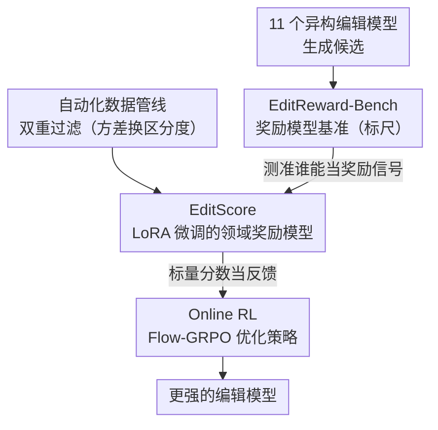

# EditScore: Unlocking Online RL for Image Editing via High-Fidelity Reward Modeling

**会议**: ICLR 2026  
**arXiv**: [2509.23909](https://arxiv.org/abs/2509.23909)  
**代码**: [GitHub](https://github.com/VectorSpaceLab/EditScore)  
**领域**: 扩散模型 / 图像编辑  
**关键词**: reward model, Reinforcement Learning, image editing, Online RL, Flow-GRPO

## 一句话总结
提出首个系统性的"基准评测→奖励模型→强化学习训练"图像编辑 RL 管线：构建 EditReward-Bench 基准，训练 EditScore 系列奖励模型（7B-72B，超过 GPT-5），并成功将其用于 Online RL 训练显著提升编辑模型性能。

## 研究背景与动机
**领域现状**：强化学习在 LLM 和 T2I 领域已展现巨大价值（如 FlowGRPO），但在图像编辑领域的应用几乎空白。RL 理论上可通过试错-反馈过程发现超越静态数据集的编辑策略。

**现有痛点**：Online RL 的核心瓶颈在于缺乏高保真、高效、可扩展的奖励信号。GPT-5 等大 VLM 成本过高无法大规模查询；开源 VLM（即使 Qwen2.5-VL-72B）作为奖励信号也不够准确，导致训练不稳定或策略崩溃。

**核心矛盾**：参数规模无法替代领域对齐的准确性——通用 VLM 评估精细编辑质量时表现不佳（一致性判断甚至不如随机），特别是在一致性（Consistency）维度。

**本文目标** 构建一个高保真、领域专用的奖励模型来解锁图像编辑的在线 RL。

**切入角度**：全栈系统——benchmark 驱动奖励模型开发，奖励模型驱动 RL 训练。

**核心 idea**：高保真的领域专用奖励模型是解锁图像编辑在线 RL 的关键。

## 方法详解

### 整体框架
整套系统要解决的问题是：图像编辑的在线 RL 卡在"没有可靠奖励信号"上——GPT-5 太贵、开源 VLM 又不准。作者的破局思路是先把奖励模型本身做扎实，再用它去训练编辑策略，于是整条链路按"造标尺→建数据→训奖励模型→喂给 RL"展开。EditReward-Bench 是一把专门衡量奖励模型好坏的标尺，告诉我们哪个模型能当奖励信号；一条自动化数据管线用"方差换区分度"的过滤喂出训练样本；EditScore 系列在此之上微调出领域专用奖励模型，并经基准验证测得又准又快；最后 Online RL 管线把 EditScore 的标量分数当作 Flow-GRPO 的反馈，逐步优化编辑模型。贯穿全程的关键判断是：通用大 VLM 给不出可靠的编辑奖励，必须先有一个领域对齐的奖励模型，在线 RL 才走得通。

### 关键设计

**1. EditReward-Bench：先给奖励模型造一把标尺**

在线 RL 走不通的根因是没人知道哪个 VLM 能当可靠奖励信号，所以第一步不是训模型而是建一个专测奖励模型的基准。它覆盖 Subject、Appearance、Scene、Advanced 四大类共 13 项编辑任务，让 GPT-4o-Image、Gemini-2.5 等 11 个异构编辑模型各自生成候选，从而把候选质量拉开梯度；评估拆成 Prompt Following、Consistency、Overall Quality 三个正交维度，用 pairwise accuracy 在 3072 个偏好对（PF 944、C 890、O 1238）上打分。标注上没有采用各自独立打标的常规做法，而是让两位 AI 专家实时讨论、争议处对齐后再达成共识，把一致性率推到 97% 以上——尤其在最难判断的 Consistency 维度，讨论式标注让一致性率提升了 12.12%，而这恰恰是通用 VLM 最薄弱、奖励质量最容易塌的环节。

**2. 数据构建：用方差换区分度的双重过滤**

奖励模型要训得准，喂进去的数据得能区分好坏。训练数据走一条自动化管线：先由 Qwen2.5-VL-72B 生成指令并配合 K-center greedy 采样保证多样性，再让 5 个编辑模型生成候选输出，最后由 GPT-4.1 给出 SC/PQ 分数和推理。原始样本不能直接用，作者加了双维度过滤——最大分数过滤剔除连最好候选都做不到位的"不可实现"编辑，标准差过滤剔除所有候选都差不多、区分不出好坏的低信息样本，最终留下奖励模型 70K、RL 训练 60K 两份数据。一个反直觉的取舍是刻意保留高方差数据：GPT-4.1 标注的方差（3.309）大于 GPT-5（2.942），更分散的分数反而给策略提供了更强的好坏对比信号，最终 RL 效果更好。

**3. EditScore：把奖励建成可微调、可自集成的生成任务**

有了标尺和数据，作者在 Qwen2.5-VL 上用 LoRA 微调出 7B 到 72B 的 EditScore 系列，把"打分"重新表述成条件文本生成：输入指令、原图、编辑结果，输出一段推理外加一个标量分数。打分沿用 VIEScore 思路拆成两个正交方面——语义一致性 $S_{SC}$ 和感知质量 $S_{PQ}$，再用几何平均 $S_{final}=\sqrt{S_{SC}\cdot S_{PQ}}$ 合成总分，使任一维度崩掉都会拖累总分，避免模型靠单边高分蒙混。更关键的是一个推理时自集成策略：对同一样本做 $K$ 次带随机性的前向，再把分数平均 $S_{final}(\mathbf{z})=\frac{1}{K}\sum_{i=1}^{K}s_i$，相当于把 $K$ 条推理路径当作不同评审视角聚合，降低单次判断的噪声。实验显示这种"加推理次数"远比"加参数"划算——EditScore-7B 在 $K=4$ 下就压过 EditScore-32B 的单次推理，而借助共享 KV-cache prefilling，延迟只是亚线性增长。正是这个又准又快的奖励模型，让前面那条卡死的在线 RL 链路终于跑通。

### 损失函数 / 训练策略
奖励模型用标准自回归目标加 LoRA 微调，评分范围扩到 $[0,25]$（实验上优于 $[0,10]$ 和 $[0,30]$，区间太窄分辨不开、太宽又稀释信号），且采用 reasoning-before-scoring 的"先推理后打分"格式，比直接出分高出 0.038 的准确率。RL 侧用 Flow-GRPO，采样步 $T=20$、组大小 $G=12$、噪声水平 $\sigma=0.9$、KL 权重 $\beta=0.04$，把 EditScore 的标量分数作为组内相对优势的奖励来源驱动策略更新。

## 实验关键数据

### 奖励模型评估（EditReward-Bench Overall Accuracy）

| 模型 | PF | C | O |
|------|-----|-----|-----|
| GPT-4.1 | 0.673 | 0.602 | 0.705 |
| GPT-5 | 0.777 | 0.669 | 0.755 |
| Qwen2.5-VL-72B | 0.540 | 0.435 | 0.621 |
| EditScore-7B (Avg@4) | 0.722 | 0.720 | 0.727 |
| EditScore-72B (Avg@4) | **0.755** | **0.735** | **0.763** |

*EditScore-7B 即超越 10 倍大的 Qwen2.5-VL-72B；EditScore-72B (Avg@4) 超过 GPT-5。*

### RL 训练效果（OmniGen2 Base）

| 奖励信号 | GEdit SC | GEdit PQ | GEdit O | ImgEdit O |
|----------|---------|---------|---------|-----------|
| No RL | 6.72 | 7.20 | 6.28 | 3.40 |
| Qwen2.5-VL-72B | 6.89 | 7.21 | 6.42 | 3.60 |
| GPT-4.1 | 7.24 | 7.41 | 6.73 | 3.66 |
| **EditScore-7B (Avg@4)** | **7.20** | **7.46** | **6.68** | **3.63** |

*EditScore-7B 即可匹敌 GPT-4.1 作为奖励信号的效果，而 Qwen2.5-VL-72B 几乎无法提供有效引导。*

### 关键发现
- 通用开源 VLM 即使 72B 参数也无法作为有效奖励信号（训练不稳定），参数规模 ≠ 领域准确性
- 推理时自集成比参数扩展更高效：EditScore-7B (K=4) > EditScore-32B (K=1)，且延迟亚线性增长
- Score range [0,25] 最优；reasoning + score 比直接 score 提升 0.038
- GPT-4.1 标注的数据训练出的奖励模型在 RL 中表现优于 GPT-5 标注的，因为 GPT-4.1 数据方差更大（3.309 vs 2.942），更强的区分度有助于策略学习
- TempFlow-GRPO（时间感知损失权重）+ EditScore 可进一步提升至 Overall 7.21

## 亮点与洞察
- **全栈贡献**：从 benchmark 到奖励模型到 RL 训练的完整管线，填补领域空白
- **反直觉发现**：标注方差越大反而 RL 训练效果越好，指出了奖励模型设计的新维度
- **推理时扩展效率极高**：利用 shared KV-cache prefilling，自集成延迟亚线性增长
- **跨模型/跨算法泛化**：EditScore 在 OmniGen2 和 FLUX-Kontext-dev 上均有效，兼容 Flow-GRPO 和 TempFlow-GRPO
- **双专家讨论标注**：显著提升标注一致性（Consistency 维度一致性率提升 12.12%）

## 局限与展望
- 数据构建依赖 GPT-4.1 标注，成本不低且可能引入偏差
- EditScore 基于 Qwen2.5-VL 微调，随 VLM 迭代需持续更新（已验证 Qwen3-VL-8B 更优）
- Text Change 等需要 OCR 能力的任务评估可能不够充分
- RL 训练的计算开销（多采样 + 奖励评估）限制了实际部署规模
- 仅验证了 Flow-GRPO 及其变体，未探索 PPO/DPO 等其他算法

## 相关工作与启发
- **FlowGRPO / DanceGRPO**：T2I 领域的 RL 成功案例，EditScore 将此范式扩展到编辑
- **VIEScore**：编辑评估框架，EditScore 在其基础上增加了 reasoning 和评分范围优化
- **Adjoint Matching**：奖励对齐的模型训练方法；EditScore 关注的是推理时奖励模型
- 启发：在 RL 应用中，**领域专用奖励模型**比通用大模型更有价值——这一结论可能推广到其他视觉生成任务

## 评分
- 新颖性: ⭐⭐⭐⭐ — 全栈管线首创，但各组件设计相对标准
- 实验充分度: ⭐⭐⭐⭐⭐ — benchmark 构建严谨 + 消融全面 + 跨模型/算法验证
- 写作质量: ⭐⭐⭐⭐ — 结构清晰，但论文篇幅较长需要仔细跟踪大量表格
- 价值: ⭐⭐⭐⭐⭐ — 为图像编辑领域的 RL 训练铺平道路，代码/模型/数据全开源

<!-- RELATED:START -->

## 相关论文

- [\[ICML 2026\] SpatialReward: Bridging the Perception Gap in Online RL for Image Editing via Explicit Spatial Reasoning](../../ICML2026/image_generation/spatialreward_bridging_the_perception_gap_in_online_rl_for_image_editing_via_exp.md)
- [\[ICLR 2026\] Visual Autoregressive Modeling for Instruction-Guided Image Editing](visual_autoregressive_modeling_for_instruction-guided_image_editing.md)
- [\[ICLR 2026\] Training-Free Reward-Guided Image Editing via Trajectory Optimal Control](training-free_reward-guided_image_editing_via_trajectory_optimal_control.md)
- [\[ICLR 2026\] EditReward: A Human-Aligned Reward Model for Instruction-Guided Image Editing](editreward_a_human-aligned_reward_model_for_instruction-guided_image_editing.md)
- [\[ICLR 2026\] DiffusionNFT: Online Diffusion Reinforcement with Forward Process](diffusionnft_online_diffusion_reinforcement_with_forward_process.md)

<!-- RELATED:END -->
