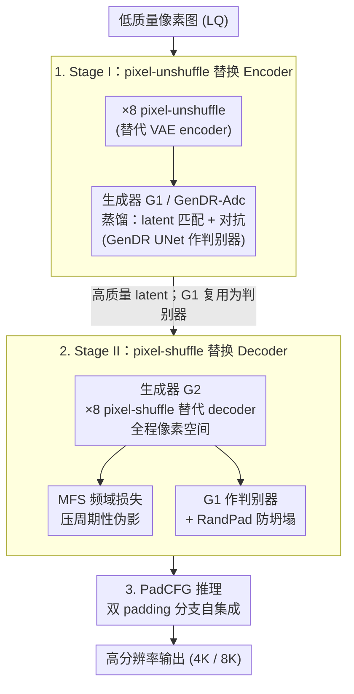

# Eliminating VAE for Fast and High-Resolution Generative Detail Restoration

**会议**: ICLR 2026  
**arXiv**: [2602.10630](https://arxiv.org/abs/2602.10630)  
**代码**: 无（基于 GenDR 的改进）  
**领域**: 图像生成  
**关键词**: VAE消除, 超分辨率, 像素空间扩散, 对抗蒸馏, pixel-shuffle

## 一句话总结

通过用 ×8 pixel-(un)shuffle 替代 VAE 的编码器和解码器，将潜空间扩散超分（GenDR）逆转为像素空间超分（GenDR-Pix），结合多阶段对抗蒸馏和 PadCFG 推理策略，实现 2.8× 加速和 60% 显存节省，同时保持可忽略的视觉退化，首次实现 1 秒内 4K 图像恢复仅需 6GB 显存。

## 研究背景与动机

扩散模型在真实世界超分（Real-World SR）任务上取得了突破，但面临**推理慢**和**显存大**两大瓶颈。现有加速方案（如步数蒸馏）将扩散步数降至 1 步，但**显存边界仍限制最大处理尺寸**，需要逐块（tile-by-tile）处理高分辨率图像。

**关键发现：VAE 是瓶颈**。通过 profiling 分析发现：
- 对于 1024² 输入，VAE 时间是 UNet 的 2.6×（191ms vs 73ms）
- VAE 显存是 UNet 的 1.3×（3.5GB vs 2.7GB）
- 对于 2880² 输入，VAE 时间是 UNet 的 1.89×（3228ms vs 1710ms）
- 4096² 时 VAE 直接 OOM

**保真度瓶颈**：即使 16 通道 VAE 的重建 PSNR 也低于 35dB，有损压缩丢失高频细节。

**核心矛盾**：现有方案（如 AdcSR）只简化 VAE 但仍在潜空间工作，简化带来的生成-重建矛盾无法根本解决（如删掉 decoder attention 导致纹理丢失）。

**核心 idea**：pixel-(un)shuffle 与 VAE 执行类似的空间尺度变换，可以用来完全替代 VAE，将潜空间扩散逆转为像素空间。但 ×8 的 pixel-shuffle 会引入棋盘格/重复模式伪影，且缺乏合适的判别器。

## 方法详解

### 整体框架

核心观察是 ×8 pixel-(un)shuffle 与 VAE 执行类似的空间尺度变换，因此可以把潜空间扩散超分（GenDR）整体逆转回像素空间。GenDR-Pix 用「两阶段对抗蒸馏」把 VAE 一步步拆掉：Stage I 先用 pixel-unshuffle 顶掉 encoder，蒸馏出一个低质量像素→高质量 latent 的生成器 $\mathcal{G}_1$（GenDR-Adc）；Stage II 再用 pixel-shuffle 顶掉 decoder，让整条管线彻底进入像素空间，同时把上一阶段的 $\mathcal{G}_1$ 复用为判别器，并配合频域损失和随机填充压制 ×8 上采样带来的伪影；最后推理时换上像素空间专属的 PadCFG。三件事一脉相承——前一阶段的产物既是后一阶段的起点，又是它的判别器。

### 关键设计

**1. Stage I：用 pixel-unshuffle 替换 Encoder**

第一刀砍向输入侧的 VAE encoder。作者把它直接换成无参数的 ×8 pixel-unshuffle 层，让低质量像素图原地折叠成与原 latent 同尺度的张量，再蒸馏出一个「低质量像素 → 高质量 latent」的生成器 $\mathcal{G}_1$（记作 GenDR-Adc）。蒸馏沿用对抗框架，借原 GenDR 的 UNet 当判别器特征提取器，生成器损失为 $\mathcal{L}_{\mathcal{G}_1} = \|z_{\text{tea}} - z_{\text{stu}}\|_1 + \lambda_1 \cdot \text{softplus}(-\mathcal{D}(z_{\text{stu}}))$——前一项把学生 latent 对齐教师 latent，后一项保证生成分布逼真。这一步既把 encoder 的算力开销直接清零，又顺手产出一个带 pixel-unshuffle 输入接口的 $\mathcal{G}_1$，为 Stage II 埋下伏笔。

**2. Stage II：用 pixel-shuffle 替换 Decoder**

把 decoder 也换成 ×8 pixel-shuffle 层后，整条管线彻底进入像素空间，这是本文真正的难点——×8 上采样连带三个问题，需要三个机制逐一化解。其一是**重复模式伪影**：尾层一个不当的权重就会在所有 8×8 patch 上复制出相同棋盘格；作者发现这类伪影在频域里表现为与 pixel-shuffle 缩放因子对齐的周期性高光点，于是用 Masked Fourier Space（MFS）损失只惩罚这些异常振幅，$\mathcal{L}_{\mathcal{F}} = \|\mathcal{M} \cdot (|\mathcal{F}\{y_{\text{stu}}\}| - |\mathcal{F}\{y_{\text{tea}}\}|)\|_1$，其中 mask $\mathcal{M}$ 只在异常频段开窗，精准抑制而不伤其他细节。其二是**缺乏合适判别器**：latent 空间的判别器吃不下 pixel-shuffled 特征，作者顺势把 Stage I 训好的 $\mathcal{G}_1$ 拿来当判别器——它天然带 pixel-unshuffle 输入接口，正好接收像素图。其三是**判别器坍塌**：固定的 pixel-unshuffle 划分模式会诱导判别器只盯着离散分块表示，于是引入 Random Padding（RandPad）增强，随机采样 $p_h, p_w \in \{0,...,7\}$ 对 SR 和 HQ 图做 $\text{randpad}(y) = \text{pad}(y, [p_h, 8-p_h, p_w, 8-p_w])$，打散固定分块边界、逼判别器学连续表示，从而避免坍塌。

**3. PadCFG：像素空间专属的 Classifier-Free Guidance**

最后是推理。在像素空间直接套用标准 CFG 反而会放大上述伪影，作者把 self-ensemble 思想揉进 CFG，让正负两个分支各用一组不同 padding：$\bar{y} = \omega \times \mathcal{G}_2(\text{pad}(x,[4,4,4,4]), c_{\text{pos}}) + (1-\omega) \times \mathcal{G}_2(\text{pad}(x,[3,5,3,5]), c_{\text{neg}})$。这样在保持标准 CFG 同样 2 次前向开销的前提下，额外蹭到多 padding 融合的 ensemble 平滑效果——既增强引导，又顺带抹平伪影。

### 损失函数 / 训练策略

Stage II 生成器总损失把上述设计串起来：$$\mathcal{L}_{\mathcal{G}_2} = \|y_{\text{tea}} - y_{\text{stu}}\|_1 + \lambda_1 \cdot \text{softplus}(-\mathcal{G}_1(y_{\text{stu}})) + \lambda_2 \mathcal{L}_{\mathcal{P}} + \lambda_3 \mathcal{L}_{\mathcal{F}}$$ 依次为像素重建项、以 $\mathcal{G}_1$ 为判别器的对抗项、感知损失 $\mathcal{L}_{\mathcal{P}}$ 和频域损失 $\mathcal{L}_{\mathcal{F}}$，权重取 $\lambda_{1,2,3} = 0.05, 1, 0.1$。训练用 AdamW、学习率 1e-5、BFloat16、8×A100 GPU、DeepSpeed ZeRO2。

## 实验关键数据

### 主实验

**ImageNet-Test 定量对比（×4 SR，512² 输入）**：

| 方法 | 参数量 | MACs | PSNR↑ | SSIM↑ | CLIPIQA↑ | MUSIQ↑ |
|------|-------|------|-------|-------|----------|--------|
| StableSR-50 | 1410M | 79940G | 26.00 | 0.7317 | 0.5768 | 64.54 |
| DiffBIR-50 | 1717M | 24234G | 25.45 | 0.6651 | 0.7486 | 73.04 |
| OSEDiff-1 | 1775M | 2265G | 24.82 | 0.7017 | 0.6778 | 71.74 |
| GenDR-1 | 933M | 1637G | 24.14 | 0.6878 | 0.7395 | 74.68 |
| **GenDR-Pix** | **866M** | **344/744G** | **25.49** | **0.7286** | 0.7168 | 72.85 |

**效率对比（4K 输出，A100）**：

| 模型 | VAE 状态 | 时间 | 显存 | MUSIQ |
|------|---------|------|------|-------|
| GenDR | 完整 VAE | 4.92s | 20.75GB | 70.96 |
| GenDR-Adc | 移除 Encoder | 2.69s (-45%) | 17.75GB (-14%) | 70.44 |
| **GenDR-Pix** | **移除 VAE** | **1.75s (-64%)** | **8.01GB (-61%)** | 70.23 |
| GenDR-Pix⋆ | 无 CFG | 0.87s (-82%) | 5.03GB (-76%) | 68.64 |

### 消融实验

**判别器设计**：

| 判别器 | RandPad | MUSIQ | CLIPIQA |
|-------|---------|-------|---------|
| 无判别器 | - | 60.95 | 0.4924 |
| GenDR | - | 61.07 | 0.5457 |
| GenDR-Adc | ✗ | 63.87 | 0.5764 |
| GenDR-Adc | ✓ | **63.89** | **0.5937** |

**MFS Loss**：无频域损失导致 NIQE 从 4.11 升至 4.84，LIQE 从 3.21 降至 2.91。

**PadCFG**：PadCFG(4,4)+(3,5) 在保持 vanilla CFG 延迟的同时，MUSIQ +0.45、CLIPIQA +0.0061。

### 关键发现

- VAE 移除带来的加速比远超架构剪枝等方案
- ×8 pixel-shuffle 的伪影问题可通过频域损失 + 随机填充有效解决
- GenDR-Pix 是唯一支持不裁剪直接 SR 到 8K 的模型
- 用户研究显示 GenDR-Pix 与原 GenDR 获得相当的质量评价

## 亮点与洞察

- **VAE 是一步扩散 SR 的效率和保真度双重瓶颈**这一发现具有广泛指导意义
- pixel-(un)shuffle 与 VAE 的角色类比简洁优雅，motivate 了一条全新的加速路径
- 多阶段蒸馏策略中"用上一阶段模型作下一阶段判别器"的设计很巧妙
- RandPad 解决判别器坍塌的方案简单高效，受 E-LPIPS 启发
- 1 秒 4K + 6GB 显存的实际性能具有工业部署价值

## 局限与展望

- 目前仅在 GenDR（SD2.1 UNet）上验证，未推广到 SDXL、Flux 等更新架构
- 仅支持 ×4 SR，其他缩放因子的适配需要调整 pixel-shuffle 参数
- PadCFG 的 padding 参数选择较经验化，缺乏理论指导
- Stage II 训练仍需要 Stage I 模型作为判别器，训练流程较复杂
- 对于极端退化（如严重压缩伪影），与 GenDR 的差距可能更大

## 相关工作与启发

- **AdcSR**：仅用 ×2 pixel-unshuffle 替代 encoder，本文推进到 ×8 替代完整 VAE
- **PixelFlow**：像素空间扩散的探索
- **GenDR / SiD / VSD**：一步扩散 SR 的基础
- **E-LPIPS**：随机变换增强感知损失，启发了 RandPad 设计
- 启发：其他使用 VAE 的扩散应用（如图像编辑、inpainting）也可考虑类似的 VAE 消除策略

## 评分

- 新颖性: ⭐⭐⭐⭐ 完全移除 VAE 的方向新颖，但核心思路（pixel-shuffle 替代）较直觉，贡献在于解决工程挑战
- 实验充分度: ⭐⭐⭐⭐⭐ 多数据集、多指标、详尽消融、用户研究、效率分析面面俱到
- 写作质量: ⭐⭐⭐⭐ 路线图式的展示清晰直观，但公式密度较高
- 价值: ⭐⭐⭐⭐⭐ 实际加速效果显著（2.8× 加速/60% 省显存），4K/1秒具有工业应用价值

<!-- RELATED:START -->

## 相关论文

- [\[ICLR 2026\] GenDR: Lighten Generative Detail Restoration](gendr_lighten_generative_detail_restoration.md)
- [\[ICLR 2026\] LVTINO: LAtent Video consisTency INverse sOlver for High Definition Video Restoration](lvtino_latent_video_consistency_inverse_solver_for_high_definition_video_restora.md)
- [\[CVPR 2026\] DA-VAE: Plug-in Latent Compression for Diffusion via Detail Alignment](../../CVPR2026/image_generation/da-vae_plug-in_latent_compression_for_diffusion_via_detail_alignment.md)
- [\[CVPR 2026\] PixelRush: Ultra-Fast, Training-Free High-Resolution Image Generation via One-step Diffusion](../../CVPR2026/image_generation/pixelrush_ultrafast_trainingfree_highresolution_im.md)
- [\[ICLR 2026\] TAVAE: A VAE with Adaptable Priors Explains Contextual Modulation in the Visual Cortex](tavae_a_vae_with_adaptable_priors_explains_contextual_modulation_in_the_visual_c.md)

<!-- RELATED:END -->
