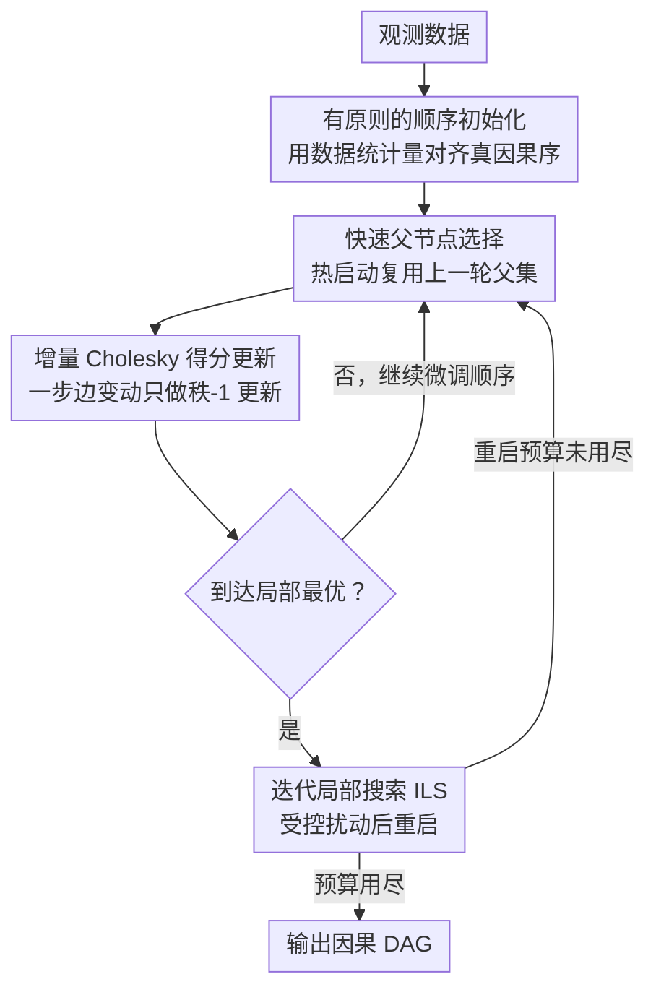

# Embracing Discrete Search: A Reasonable Approach to Causal Structure Learning

**会议**: ICLR 2026  
**arXiv**: [2510.04970](https://arxiv.org/abs/2510.04970)  
**代码**: [https://github.com/CausalDisco/flopsearch](https://github.com/CausalDisco/flopsearch)  
**领域**: 图像生成  
**关键词**: 因果结构学习, 离散搜索, 得分优化, DAG学习, 线性模型

## 一句话总结

提出 FLOP（Fast Learning of Order and Parents），一个面向线性模型的基于得分的因果发现算法，通过快速父节点选择与迭代 Cholesky 得分更新大幅降低运行时间，使得迭代局部搜索（ILS）变得可行，在标准因果发现基准上实现近乎完美的图恢复，重新确立离散搜索在因果发现中的合理地位。

## 研究背景与动机

因果结构学习的核心任务是从观测数据中学习变量之间的有向无环图（DAG）。基于得分的方法为每个 DAG 分配惩罚似然得分，寻找得分最优的图。

**现有方法的格局**：

**精确算法**：保证找到得分最优图，但运行时间指数级，仅适用于约30个变量

**局部搜索**（如 GES、BOSS）：通过评估邻居图进行爬山，但容易陷入局部最优

**连续优化方法**（如 NOTEARS）：将无环性编码为光滑约束进行连续优化，但实证和理论上存在质疑，且面临收敛问题和边阈值设定困难

关键洞察：常被引用来否定离散搜索的 NP-hard 结果**不适用于**常见的因果发现设定——标准的困难构造依赖于不可观测变量，而在分布可由稀疏 DAG 表示时，离散搜索可在多项式时间内恢复目标图。

**核心动机**：在有限样本下，得分不精确导致局部搜索陷入局部最优是实践中的核心问题。FLOP 通过加速计算使得可以"完全拥抱离散搜索"——用充足的计算预算进行更彻底的探索来逃离局部最优。

## 方法详解

### 整体框架

FLOP 走的是基于顺序（order-based）的 DAG 搜索路线：先确定变量的一个因果顺序，再为该顺序贪心地挑选每个节点的最优父节点集，得到一张候选 DAG，然后用局部搜索不断微调顺序、爬向更高的 BIC 得分。它的整体思路不是去发明更聪明的搜索准则，而是把每一步搜索算得足够快——于是同样的时间预算下能搜得更彻底，甚至能反复重启逃离局部最优。具体地，方法从一个**有原则的顺序初始化**出发给搜索一个干净起点，进入局部搜索后用**快速父节点选择**热启动、用**增量 Cholesky 得分更新**把每步打分压到秩-1 更新，爬到局部最优后再靠**迭代局部搜索（ILS）**施加扰动重启，反复跳出局部最优直到计算预算用尽，最后输出因果 DAG。这四件事共同把"离散搜索太慢所以不可行"的旧印象推翻。

### 关键设计

**1. 有原则的顺序初始化：让搜索从一个更接近真因果序的起点出发**

随机初始化下，那些距离远、依赖弱的祖先-后代对在有限样本里特别容易被父节点选择搞错，而错误的起点会把后续局部搜索拖进糟糕的局部最优。FLOP 改用基于数据统计量的初始化，让初始顺序就已经较好地对齐真实因果顺序，从而显著减少这类远距离弱依赖关系上的失配，给后续的局部搜索一个干净的出发点。

**2. 快速父节点选择：用热启动避免每换一次顺序就重算父节点**

顺序在局部搜索中会被反复微调，传统做法是每次顺序一变就从头为所有节点重新挑父节点，这部分计算占了绝大多数开销。FLOP 观察到顺序的一次局部移动通常只改变少数几个变量的最优父集，于是直接把上一个顺序学到的父节点集作为新一轮的热启动初值，只对受影响的变量重算。这样既省了大量重复的回归计算，也省了内存，而实验显示搜索质量并不下降，因为大多数变量的最优父集在相邻顺序间本就保持不变。

**3. 增量 Cholesky 得分更新：把一次边变动的代价从完整分解降到秩-1 更新**

线性高斯模型的 BIC 得分要靠回归残差来算，而回归本质上是在解一个正规方程，每次都重新做 Cholesky 分解代价很高。FLOP 利用 Cholesky 因子的增量性质：当一步局部移动只改动一条边时，对应的系统矩阵只变化一个秩-1 项，因此只需对已有的 Cholesky 因子做一次秩-1 更新而不必重新分解。这样得分更新的成本被摊销在一连串局部移动之间，每一步的计算量大幅压缩。整套数值核心用 Rust 实现以榨干效率，并通过 Python 包 `flopsearch` 对外发布。

**4. 迭代局部搜索（ILS）：用受控扰动反复跳出局部最优，并把计算预算变成可调旋钮**

BOSS 这类局部搜索一旦爬到局部最优就停下，而有限样本下的得分并不精确，局部最优往往不是真图。FLOP 在到达局部最优后施加一次受控扰动再重新搜索，如此反复迭代；执行 $k$ 次重启即记作 $\text{FLOP}_k$，其中 $k$ 直接充当计算预算超参数。正是前面三个设计把每步搜索算得足够快，ILS 这种"反复重来"才在时间上变得可行——它在运行时间与有限样本精度之间建立了一条显式联系：给得越多的重启，越有机会找到得分更高、也更接近真图的结构。

### 损失函数 / 训练策略

得分函数采用标准的 BIC（贝叶斯信息准则）

$$\text{BIC}(G) = -2 \log L(G \mid \mathcal{D}) + k \log n,$$

其中 $L$ 是似然，$k$ 为参数数量，$n$ 为样本量。在线性高斯模型下该得分具有一致性：当样本趋于无穷时，得分最优的图即恢复真实因果图（或其等价类 CPDAG），这也是 FLOP 把全部精力放在"更快、更彻底地优化 BIC"上而非另设目标的底气所在。

## 实验关键数据

### 主实验

实验在线性加性噪声模型（ANM）生成的数据上进行，考虑 Erdős-Rényi (ER) 和 Scale-Free (SF) 两种图类型。

| 方法 | ER-50-deg8 SHD ↓ | ER-50-deg8 精确恢复率 | 运行时间 |
|------|-------------------|---------------------|---------|
| PC | ~350 | 0% | ~50s |
| GES | ~250 | 0% | ~200s |
| DAGMA | ~200 | 0% | ~300s |
| BOSS (FLOP_0) | ~50 | 40% | ~30s |
| FLOP_20 | ~20 | 60% | ~100s |
| FLOP_100 | ~10 | 60% | ~400s |

在50节点、平均度8、1000样本的 ER 图上，FLOP 明显优于所有基线。

### 消融实验

| 配置 | 效果说明 |
|------|---------|
| FLOP_0（无ILS重启） | 与 BOSS 精度相当（40%精确恢复），但运行更快 |
| FLOP_20（20次重启） | 精确恢复率提升至60%，SHD 大幅下降 |
| FLOP_100（100次重启） | 与 FLOP_20 精确恢复率相当，但在困难实例上 SHD 更低 |
| 随机初始化 vs. 有原则初始化 | 有原则初始化在远距离弱依赖关系上显著减少错误 |
| 无 Cholesky 加速 | 运行时间成数倍增长，使 ILS 不可行 |

### 关键发现

1. **离散搜索的合理性**：在标准因果发现设定下，离散搜索可以近乎完美地恢复因果图结构，挑战了"NP-hard 因此不可行"的常见认知
2. **计算换精度**：FLOP_k 中的 k 参数建立了明确的**运行时间—精度权衡**，用户可根据计算预算灵活调节
3. **连续优化无优势**：DAGMA 等连续方法在相同计算预算下不如离散搜索，且存在额外的阈值、收敛等问题
4. **有限样本是核心挑战**：即使在渐近理论保证下，有限样本中搜索可能找到比真实图得分更高的图——ILS 是有效的应对策略
5. **Rust 实现使大规模可行**：高效实现使50+节点的完整离散搜索变得实际可行

## 亮点与洞察

1. **重要的认识论贡献**：不仅是算法改进，更是对因果发现方法论的重新审视。NP-hard 论点被仔细解构——标准困难构造依赖不可观测变量，不适用于常见设定
2. **工程与理论结合**：Cholesky 增量更新是经典数值线性代数技巧在因果发现中的巧妙应用，Rust 实现提供了实际可用的工具
3. **ILS 元启发式的引入**：将运筹学中的经典优化范式引入因果发现，建立了计算/精度的显式联系
4. **简洁优雅**：整个方法建立在成熟的统计基础上（BIC 得分、Cholesky 分解），没有引入神经网络或复杂优化，回归到"简单可解释"的路线

## 局限与展望

1. **仅适用于线性模型**：FLOP 的 Cholesky 加速依赖线性高斯假设，非线性因果关系场景需要新的得分函数和搜索策略
2. **因果充分性假设**：假设没有未观测的混杂因子，在实际应用中这一假设常被违反
3. **大规模扩展**：虽然50节点表现优秀，但对于数百或数千变量的基因调控网络等应用，扩展性仍需进一步提升
4. **仅支持观测数据**：未利用干预数据，而干预实验在因果发现中能提供更多信息
5. **ILS 重启次数需要人工设定**：虽然建立了运行时间—精度联系，但缺乏理论指导确定所需的最优重启次数

## 相关工作与启发

- **BOSS**（Andrews et al., 2023）：最强的基于顺序的局部搜索基线，FLOP 在此基础上加速并引入 ILS
- **GES**（Chickering, 2002）：经典的基于等价类的搜索，渐近最优但有限样本表现不佳
- **NOTEARS / DAGMA**：连续优化代表，本文实验表明其不如离散搜索
- **Partition MCMC / Order MCMC**（Kuipers et al., 2022）：贝叶斯方法通过模拟退火逃离局部最优，但计算开销更大

本文对因果发现领域的启发：计算效率的提升可以根本性地改变算法范式的可行性。当离散搜索变得足够快时，它的理论优势（无需阈值、无连续松弛、直接优化 BIC）就能充分发挥。

## 评分
- 新颖性: ⭐⭐⭐⭐
- 实验充分度: ⭐⭐⭐⭐
- 写作质量: ⭐⭐⭐⭐⭐
- 价值: ⭐⭐⭐⭐

<!-- RELATED:START -->

## 相关论文

- [\[ICLR 2026\] Discrete Adjoint Matching](discrete_adjoint_matching.md)
- [\[NeurIPS 2025\] Non-Markovian Discrete Diffusion with Causal Language Models](../../NeurIPS2025/image_generation/non-markovian_discrete_diffusion_with_causal_language_models.md)
- [\[ICLR 2026\] Loopholing Discrete Diffusion: Deterministic Bypass of the Sampling Wall](loopholing_discrete_diffusion_deterministic_bypass_of_the_sampling_wall.md)
- [\[ICLR 2026\] JointDiff: Bridging Continuous and Discrete in Multi-Agent Trajectory Generation](jointdiff_bridging_continuous_and_discrete_in_multi-agent_trajectory_generation.md)
- [\[ICML 2026\] Learning General Causal Structures with Hidden Dynamic Process for Climate Analysis](../../ICML2026/image_generation/learning_general_causal_structures_with_hidden_dynamic_process_for_climate_analy.md)

<!-- RELATED:END -->
