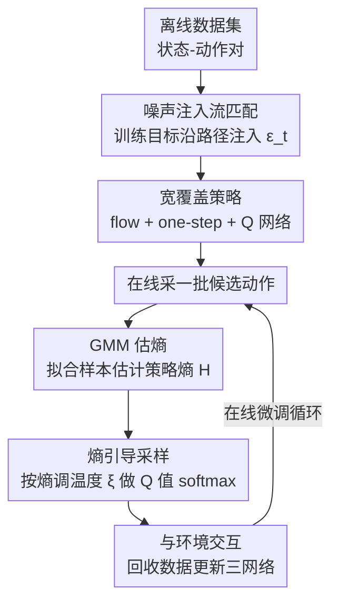

# Flow Matching with Injected Noise for Offline-to-Online Reinforcement Learning

**会议**: ICLR 2026  
**arXiv**: [2602.18117](https://arxiv.org/abs/2602.18117)  
**代码**: [GitHub](https://github.com/CTID282/FINO)  
**领域**: 流匹配/强化学习  
**关键词**: Flow Matching, 离线-在线RL, 噪声注入, 探索-利用平衡, 熵引导采样

## 一句话总结
通过在流匹配训练中注入可控噪声扩大策略覆盖范围，并结合熵引导的采样机制在在线微调时动态平衡探索与利用，在有限交互预算下显著提升离线到在线RL的样本效率。

## 研究背景与动机

**领域现状**：生成模型（扩散/流匹配）因能建模多模态分布，在离线RL中作为策略表示表现优异。Flow Q-Learning (FQL) 已在离线设置中证明了流匹配策略的有效性。

**现有痛点**：离线预训练的策略过度约束于数据集分布，在线微调阶段探索能力不足。现有方法（如FQL）将在线微调简单视为离线预训练的延续，未专门设计探索机制。在antmaze-giant任务中，FQL agent几乎只沿数据集中存在的上方路径到达目标，完全忽略了其他可行路线。

**核心矛盾**：离线RL需要保守约束（避免分布外动作），但在线阶段需要广泛探索（超出数据覆盖）。这两个阶段对策略分布的要求本质对立。

**本文目标**：如何在不增加数据集的前提下，让策略在离线预训练阶段就学到比数据集更广的动作覆盖，并在在线微调时有效利用这种多样性？

**切入角度**：观察到flow matching的条件概率路径在 $\sigma_{\min}=0$ 时会将分布坍缩到单个数据点上，限制了覆盖范围。通过向flow matching注入受控噪声，可以扩展条件概率路径的方差。

**核心 idea**：在flow matching目标中注入噪声以扩大策略支持集，配合熵引导采样在在线阶段自适应地平衡探索与利用。

## 方法详解

### 整体框架
FINO (Flow matching with Injected Noise for Offline-to-online RL) 要解决的核心问题是：离线预训练出来的流匹配策略覆盖太窄，到了在线微调阶段探索不动。它的思路是在「训练目标」和「采样策略」两端同时下手。整体仍沿用 FQL 的双策略 + Q 网络骨架（flow policy 负责表达多模态分布，one-step policy 蒸馏自 flow policy 并直接与环境交互），但做了两处改动：离线阶段把标准 flow matching 的训练目标改成注入噪声的版本，让策略从一开始就学到比数据集更宽的动作支持集；在线阶段不再用固定的贪心或固定温度采样，而是按策略熵自适应调节一个 softmax 温度，动态在探索与利用之间切换。输入是状态-动作对数据集，输出是一个能在有限在线交互预算下高效探索的策略。

### 关键设计

**1. 噪声注入流匹配：把覆盖范围写进训练目标**

标准 flow matching 的条件概率路径在 $\sigma_{\min}=0$ 时会把分布坍缩到单个数据点上，这正是 FQL 策略覆盖窄、在线探索不动的根源。FINO 的做法是沿插值路径注入时间依赖的高斯噪声 $\epsilon_t \sim \mathcal{N}(0, \alpha_t^2 I)$，把训练目标改写为

$$\mathcal{L}_{\text{FINO}}(\theta) = \mathbb{E}\big[\|v_\theta(t, s, x_t + \epsilon_t) - (x_1 - (1-\eta)x_0)\|^2_2\big]$$

其中噪声幅度由 $\alpha_t^2 = (\eta^2 - 2\eta)t^2 + 2\eta t$ 决定，$\eta \in [0,1]$ 是唯一的控制旋钮，$\eta=0$ 时整个目标退化回标准 flow matching。这个改法之所以站得住脚，靠的是三条理论保证：Theorem 1 说明注入噪声后仍然构成有效的连续归一化流；Theorem 2 进一步证明 FINO 诱导的边际概率路径方差不小于标准 FM，即 $\text{Var}(X_t^{\text{FINO}}) \geq \text{Var}(X_t^{\text{FM}})$，也就是策略能覆盖更广的动作空间——这正是后续在线探索所需要的多样性。

**2. 熵引导采样：让温度跟着学习进度自己动**

离线阶段把覆盖撑开还不够，在线微调时还得真的去利用这种多样性。FINO 在线时从策略中采一批候选动作，再按 Q 值构建 softmax 采样分布

$$p(i) = \frac{\exp(\xi \cdot Q_\phi(s, a_i))}{\sum_j \exp(\xi \cdot Q_\phi(s, a_j))}$$

关键在于温度 $\xi$ 不固定，而是按策略熵闭环更新：$\xi_{\text{new}} = \xi - \alpha_\xi[\mathcal{H} - \bar{\mathcal{H}}]$。固定温度无法适应学习过程的动态变化——训练早期策略还很乱，晚期已经收敛，同一个温度不可能两头都合适。用熵做信号后，策略熵高（动作还很发散）时温度增大、偏向利用收敛，熵低（动作已经集中）时温度减小、偏向探索发散，整个探索-利用权衡不用手动调参就能自动平衡。

**3. 用 GMM 估熵：补上 one-step policy 不可求导的缺口**

熵引导采样依赖一个前提——得能算出策略熵，但 FINO 在线推理用的是经蒸馏和 Q 值优化得到的 one-step policy，它的分布没有解析形式，没法直接求熵。FINO 的处理是从同一状态采样多个动作，用高斯混合模型 (GMM) 拟合这批样本后再估计熵，绕开了不可求导的问题。两个工程取值也在这里固定：噪声幅度 $\eta=0.1$（基于动作范围 $[-1,1]$ 选定），候选动作数设为动作维度的一半。

### 损失函数 / 训练策略
- 离线阶段：同时训练flow policy（Eq.7）、one-step policy（Eq.5）和Q网络（TD loss）
- 在线阶段：继续优化三个网络，每 $N_\xi$ 步更新一次温度 $\xi$
- 推理时：确定性选择Q值最高的动作

## 实验关键数据

### 主实验
在OGBench和D4RL共45个任务上评估，10个随机种子取平均：

| 任务类别 | 指标 | FINO | FQL | Cal-QL | 提升 |
|---------|------|------|-----|--------|------|
| OGBench humanoidmaze-medium | 在线微调后得分 | 最优 | 3±3 | 0±0 | 显著 |
| D4RL antmaze (6任务平均) | 在线微调后得分 | 最优 | 次优 | - | 稳定提升 |
| D4RL adroit (4任务平均) | 在线微调后得分 | 最优 | 次优 | - | 稳定提升 |
| OGBench (5任务平均) | 在线微调后得分 | 最优 | 次优 | - | 显著 |

### 消融实验

| 配置 | 关键表现 | 说明 |
|------|---------|------|
| Full FINO | 最优 | 噪声注入 + 熵引导采样 |
| w/o 噪声注入 (η=0) | 明显下降 | 退化为标准FQL |
| w/o 熵引导 | 下降 | 固定温度无法自适应 |
| 仅噪声注入 | 中等 | 缺乏在线阶段的探索-利用平衡 |

### 关键发现
- 在antmaze-giant任务中，FINO能发现多条到达目标的路线（包括下方路径），而FQL只走上方路径
- 噪声注入使策略在toy实验中明显覆盖了数据点周围更广的区域，但仍以数据为中心
- 在高维动作空间任务（如humanoidmaze）中优势更显著，因为噪声注入提供的探索在高维中更关键

## 亮点与洞察
- **噪声注入的理论保证**：三个定理完整论证了噪声注入的合理性——保持有效流（Theorem 1）、扩大覆盖（Theorem 2）、构成合法分布（Proposition 1）。理论严谨且实际有效。
- **离线为在线服务的设计理念**：不把离线训练独立看待，而是从一开始就为后续在线微调做准备（注入噪声保留多样性），这种前瞻性设计值得借鉴。
- **自适应温度**方案简洁优雅，用策略熵作为信号闭环调节探索-利用权衡，无需手动调参。

## 局限与展望
- $\eta$ 统一设为0.1，未考虑不同任务/不同状态的最优噪声幅度可能不同
- 熵估计依赖GMM拟合，在极高维动作空间中GMM的准确性可能下降
- 候选动作数设为动作维度的一半，这一启发式规则缺乏理论依据
- 实验主要在locomotion和navigation任务上，未验证在manipulation等精细操作任务上的效果

## 相关工作与启发
- **vs FQL**: FQL直接用标准flow matching做策略，FINO在训练目标中注入噪声扩大覆盖。FINO在在线微调后性能显著优于FQL，尤其在需要探索的任务中。
- **vs Cal-QL/RLPD**: 这些方法不使用生成模型作为策略，FINO利用flow matching的表达力优势在复杂任务中更有竞争力。
- **可迁移思路**：噪声注入扩大分布覆盖的思路可以迁移到其他生成模型场景，如扩散模型的fine-tuning、条件生成的多样性增强等。

## 评分
- 新颖性: ⭐⭐⭐⭐ 噪声注入flow matching的想法新颖，理论分析扎实
- 实验充分度: ⭐⭐⭐⭐⭐ 45个任务、10个种子、多个baseline、详细消融
- 写作质量: ⭐⭐⭐⭐ 动机清晰，理论推导完整，大量附录支撑
- 价值: ⭐⭐⭐⭐ 为离线-在线RL提供了实用且有理论保障的解决方案

<!-- RELATED:START -->

## 相关论文

- [\[ICLR 2026\] DiffusionNFT: Online Diffusion Reinforcement with Forward Process](diffusionnft_online_diffusion_reinforcement_with_forward_process.md)
- [\[ICML 2026\] Offline Preference Optimization for Rectified Flow with Noise-Tracked Pairs](../../ICML2026/image_generation/offline_preference_optimization_for_rectified_flow_with_noise-tracked_pairs.md)
- [\[ICML 2026\] Offline Multi-agent Reinforcement Learning via Sequential Score Decomposition](../../ICML2026/image_generation/offline_multi-agent_reinforcement_learning_via_sequential_score_decomposition.md)
- [\[ICLR 2026\] Laplacian Multi-scale Flow Matching for Generative Modeling](laplacian_multi-scale_flow_matching_for_generative_modeling.md)
- [\[AAAI 2026\] ORVIT: Near-Optimal Online Distributionally Robust Reinforcement Learning](../../AAAI2026/image_generation/orvit_near-optimal_online_distributionally_robust_reinforcement_learning.md)

<!-- RELATED:END -->
