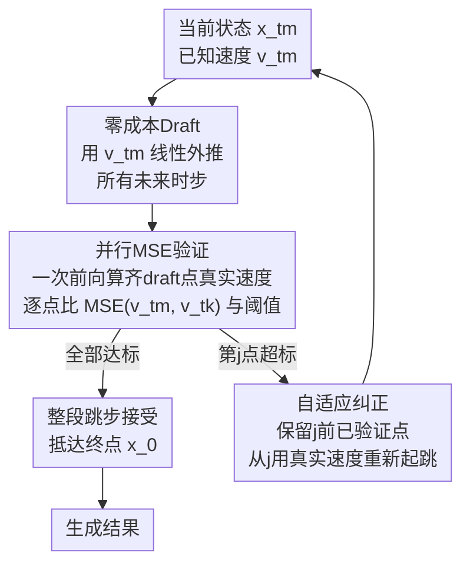

# FlowCast: Trajectory Forecasting for Scalable Zero-Cost Speculative Flow Matching

**会议**: ICLR 2026  
**arXiv**: [2602.01329](https://arxiv.org/abs/2602.01329)  
**代码**: 无  
**领域**: 扩散模型/推理加速  
**关键词**: Flow Matching, 推测解码, 零成本加速, 推理优化, 轨迹预测

## 一句话总结
提出FlowCast框架，将投机解码思想引入Flow Matching模型，利用速度场的局部平滑性将当前速度预测作为零成本draft外推未来状态，通过MSE验证选择性跳过冗余步骤，实现>2.5×加速且无质量损失。

## 研究背景与动机

**领域现状**：Flow Matching (FM) 已成为高质量生成建模的主流方法（FLUX.1、Wan视频生成等），通过求解ODE将噪声映射到数据。但ODE积分本质上是顺序的，每步依赖前一步输出，推理速度慢。

**现有痛点**：现有加速方法（蒸馏、轨迹截断、一致性训练）要么降低质量（纹理模糊、语义漂移），要么需要昂贵的重训练，要么缺乏泛化性。视频生成中问题更严重——时间维度增加使推理负担成倍增长。

**核心矛盾**：FM的高保真度依赖足够多的采样步数，但步数多意味着推理慢。需要在不重训练的前提下智能跳过"不必要"的步骤。

**本文目标**：如何在不引入辅助模型、不进行任何训练的情况下，自适应地加速FM推理？

**切入角度**：FM模型被训练为保持近乎恒定的速度，经验上速度场在相邻步骤间变化缓慢。这意味着当前步的速度预测可以作为未来步的"免费草稿"。

**核心 idea**：用FM模型自身的速度预测作为零成本draft做投机外推，MSE验证通过则跳步，不通过则回退。

## 方法详解

### 整体框架
FlowCast要解决的是Flow Matching推理慢的老问题：求解ODE把噪声变成数据，每一步都得等上一步的输出，整条轨迹只能顺序跑。它的做法是把LLM里的投机解码搬过来，但不引入任何小模型、也不做任何训练。一轮推理分三步走：先在当前时步用已经算出来的速度，一口气把后面所有时步的状态都线性外推出来（零成本Draft）；再把这些draft点的真实速度并行算出来，逐个和draft速度做MSE比对（并行MSE验证）；从第一个不达标的点开始丢弃、回退重算（自适应纠正）。平稳的区段一跳一大片，剧烈的区段退回去精细积分，整体既快又不掉质量。

### 关键设计

**1. 零成本Draft：把当前速度当成未来步的免费草稿**

投机解码的第一个难题是"draft从哪来"。LLM里要专门训一个小模型来猜，但FM根本不需要——它的训练目标本身就鼓励沿线性插值路径走、保持近乎恒定的速度，经验上相邻步之间速度变化极小。于是FlowCast直接拿当前时步 $t_m$ 算出的速度 $v_{t_m}$，对后面每一个时步做线性外推：

$$\tilde{x}_{t_k} = x_{t_m} + (t_k - t_m) \cdot v_{t_m}, \quad k = m+1, \ldots, K$$

这一步没有任何额外前向计算，draft是真正"零成本"的，这也是它比LLM投机解码更轻量的根本原因——省掉了一整个draft模型。

**2. 并行MSE验证：在速度空间里判断draft能不能信**

draft白送了，但不能照单全收，否则速度真正发生剧变的地方会被外推带偏。验证的关键选择是**在速度空间而不是数据空间做比对**：对每个draft状态 $\tilde{x}_{t_k}$ 算出它的真实速度 $v(\tilde{x}_{t_k}, t_k)$，再和当初外推用的 $v_{t_m}$ 比，只要 $\text{MSE}(v_{t_m}, v_{t_k}) < \epsilon$ 就接受这个draft。速度比数据更能灵敏地反映局部动态有没有变化，验证开销也更小。更妙的是这些draft点彼此独立，所有点的真实速度可以一次前向并行算完，因此"评估很多个候选步"实际只花一次前向的代价。沿着时步往后扫，找到第一个MSE超标的点 $j$，就把这个点连同它之后的所有draft全部丢掉。

**3. 自适应纠正：拒绝点之后退回来重新起跳**

验证卡在 $j$ 之后，前面 $\{x_{m+1}, \ldots, x_{j-1}\}$ 这些点已经验证通过、直接保留；从 $j$ 开始则用该点附近算出的真实速度 $v_{t_{j-1}}$ 作为新起点，再外推一轮。这套"接受—回退—再外推"的循环让步长自适应轨迹的局部动态：速度平稳的区段一次跳过一大串步（激进加速），速度剧烈变化的区段被验证拦下、退回精细积分（保证忠实度），最终在加速和精度之间自动找平衡。

**4. 误差界：跳步带来的全局误差有理论上界，阈值可据此反推**

激进跳步最让人担心的是误差失控，FlowCast用两条结论把它钉死。Lemma 4.1 假设速度场Lipschitz连续（常数 $M$）、二阶导有界（$N$），证明投机积分的全局误差满足 $\|x(t_k) - x_k\| \leq \frac{e^{Mt_k}-1}{2M}(hN + 2p\sqrt{\epsilon})$——误差由步长 $h$ 和验证阈值 $\epsilon$ 共同控制，二者都缩小则误差缩小。Theorem 4.2 把这条不等式反过来用：给定想要的容差 $q_d$，只要把阈值取到 $\epsilon \leq (\frac{q_d}{2A})^2$（其中 $A = \frac{e^M-1}{M}$），就能保证投机误差不超过 $q_d$。这意味着阈值 $\epsilon$ 不必纯靠手调，而是有一个由目标精度推出的理论上界兜底。

## 实验关键数据

### 主实验
文本到图像生成（GenEval数据集 + FLUX模型）：

| 方法 | Overall↑ | CLIPIQA↑ | 加速比 |
|------|----------|----------|--------|
| FLUX 50步 | 0.65 | 0.83 | 1.0× |
| FLUX 25步 | 0.64 | 0.80 | 2.0× |
| FLUX 10步 | 0.57 | 0.59 | 5.0× |
| FlowCast + FLUX | 0.65 | 0.83 | **>2.5×** |

### 多任务验证

| 任务 | 模型 | 加速比 | 质量损失 |
|------|------|--------|---------|
| 文本到图像 | FLUX | >2.5× | 无 |
| 文本到图像 | BAGEL | >2.5× | 无 |
| 图像编辑 | GEdit | >2.5× | 无 |
| 多轮编辑 | EditBench | >2.5× | 无 |
| 视频生成 | VBench | >2.5× | 无 |

### 关键发现
- FlowCast实现>2.5×加速且质量与完整50步生成完全一致，而简单减步到25/10步质量明显下降
- 在多轮编辑任务中优势尤其明显——减步方法的误差会跨轮累积，FlowCast保持精度不累积
- 关键insight：FM轨迹中约60%以上的步骤的速度变化在阈值内，可安全跳过
- 阈值 $\epsilon$ 在一定范围内对质量不敏感，说明方法鲁棒

## 亮点与洞察
- **零成本draft的洞察**：利用FM训练目标本身的恒定速度性质，不需要训练任何辅助模型，完全"免费"的draft。这比LLM中的投机解码（需要小模型）更加轻量。
- **从LLM到视觉的投机解码迁移**：虽然FM不是自回归模型，但其ODE积分的顺序依赖与自回归类似。论文巧妙利用速度平滑性解决了"如何设计draft模型"和"如何验证draft"两个关键问题。
- **即插即用且可堆叠**：与现有加速手段正交，可以在蒸馏/截断的基础上进一步使用。

## 局限与展望
- 加速比依赖速度场的平滑性，对某些模型/场景（如高频细节丰富的音频生成）加速比可能有限
- 仅验证了Euler求解器，高阶求解器（如midpoint、RK4）下的效果未知
- 并行验证需要一次计算所有draft点的速度，内存开销随步数增加
- 阈值 $\epsilon$ 需要手动设定，虽然鲁棒但最优值可能因任务而异

## 相关工作与启发
- **vs TeaCache**: TeaCache用时间步嵌入相似度跳步，FlowCast直接用速度MSE做验证，更直接且有理论保证
- **vs 蒸馏方法(InstaFlow等)**: 蒸馏需要训练、降低质量，FlowCast零训练零损失
- **vs 一致性模型**: 一致性模型需要修改训练流程，FlowCast完全后处理加速
- **可迁移思路**: 投机生成框架可以推广到任何基于ODE求解的生成模型

## 评分
- 新颖性: ⭐⭐⭐⭐⭐ 首次将投机解码引入FM推理，零成本draft设计优雅
- 实验充分度: ⭐⭐⭐⭐ 覆盖图像生成、编辑、视频生成等多任务，有理论分析
- 写作质量: ⭐⭐⭐⭐ 动机和方法解释清晰，理论与实验结合好
- 价值: ⭐⭐⭐⭐⭐ 即插即用的免训练加速方案，对FM社区价值极高

<!-- RELATED:START -->

## 相关论文

- [\[ICLR 2026\] FlowCast: Advancing Precipitation Nowcasting with Conditional Flow Matching](flowcast_advancing_precipitation_nowcasting_with_conditional_flow_matching.md)
- [\[ICLR 2026\] DoFlow: Flow-based Generative Models for Interventional and Counterfactual Forecasting](doflow_flow-based_generative_models_for_interventional_and_counterfactual_foreca.md)
- [\[ICLR 2026\] Laplacian Multi-scale Flow Matching for Generative Modeling](laplacian_multi-scale_flow_matching_for_generative_modeling.md)
- [\[ICLR 2026\] SenseFlow: Scaling Distribution Matching for Flow-based Text-to-Image Distillation](senseflow_scaling_distribution_matching_for_flow-based_text-to-image_distillatio.md)
- [\[ICLR 2026\] Flow Matching with Injected Noise for Offline-to-Online Reinforcement Learning](flow_matching_with_injected_noise_for_offline-to-online_reinforcement_learning.md)

<!-- RELATED:END -->
