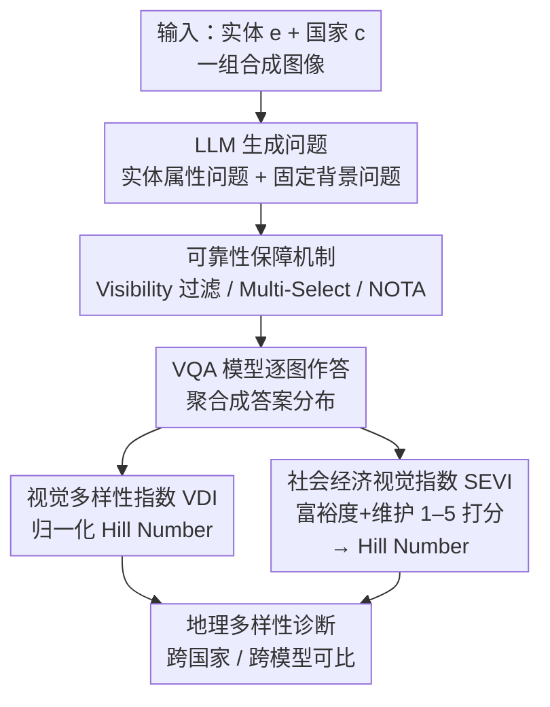

# GeoDiv: Framework for Measuring Geographical Diversity in Text-to-Image Models

**会议**: ICLR 2026  
**arXiv**: [2602.22120](https://arxiv.org/abs/2602.22120)  
**代码**: [GitHub](https://github.com/moha23/geodiv)  
**领域**: 文本到图像生成 / 公平性评估  
**关键词**: 地理多样性, 文本到图像模型, 社会经济偏见, VLM评估, 可解释指标

## 一句话总结
提出 GeoDiv 框架，利用 LLM 和 VLM 的世界知识，从社会经济视觉指数（SEVI）和视觉多样性指数（VDI）两个维度系统评估 T2I 模型的地理多样性，揭示了模型对印度、尼日利亚等国家存在系统性贫困化偏见。

## 研究背景与动机
- **领域现状**: T2I 模型（如 Stable Diffusion、FLUX.1）在商业中广泛应用，但其生成结果常缺乏地理多样性，对不同地区的描绘存在刻板印象
- **现有痛点**: 现有多样性指标要么依赖标注数据集（如 GeoDE），要么仅关注低层视觉相似性（如 Vendi-Score），无法解释性地捕获地理多样性的多维度特征
- **核心矛盾**: 地理多样性涵盖经济、环境、文化等多维度变化，单一指标无法全面衡量，且现有方法在国家级别的精细偏见检测上能力有限
- **切入角度**: 利用 LLM/VLM 的隐含世界知识，设计可解释的自动化评估框架
- **核心 idea**: 将地理多样性分解为 SEVI（富裕度+维护状态）和 VDI（实体外观+背景外观）四个可解释维度，用 Hill Number 量化多样性

## 方法详解

### 整体框架
GeoDiv 想回答一个看似简单却很难量化的问题：一个 T2I 模型在画"某国的某个实体"（比如"印度的厨房""尼日利亚的房子"）时，到底有多丰富、有没有把当地一律画成贫穷破败的样子。整条流水线围绕一组合成图像展开——给定实体 $e$ 和国家 $c$，先让 LLM 生成两类问题：一类是和 $e$ 强相关的属性问题（厨房会问灶台类型、橱柜材质），一类是跨实体固定的背景问题（地形、植被）；接着一组可靠性约束先把"看不见的属性"过滤掉、再用多选和 NOTA 选项护住 VQA 的作答，VQA 模型对整组图像逐张作答，把答案聚合成分布；最后这个分布同时喂给两个互补的指标——VDI 从"视觉变化够不够多"的角度量化多样性，SEVI 从"经济富裕程度"的角度刻画模型是否系统性地把某些国家画穷。两个指标都把"多样性"统一归结为对一个离散分布算 Hill Number，因此可以跨问题、跨国家直接比较。

### 关键设计

**1. 视觉多样性指数 VDI：把"画面够不够丰富"变成可比较的分布熵**

直接看图像像素的相似度（如 Vendi-Score）只能抓到低层视觉变化，说不清"为什么不多样"。VDI 改成让 LLM 集合先把每个实体拆成若干语义属性问题（实体外观轴）外加固定的背景问题（背景外观轴），再让 VQA 模型对图像组逐题作答，得到每个问题 $k$ 上的答案分布 $\hat{P_k}$。多样性就用这个分布的标准化 Hill Number 衡量：

$$\text{Diversity-Score} = \frac{\exp(H(\hat{P_k})) - 1}{|\hat{\mathcal{A}_k}| - 1}$$

其中 $H(\cdot)$ 是 Shannon 熵，$|\hat{\mathcal{A}_k}|$ 是该问题的可选答案数。分子 $\exp(H)-1$ 把熵换算成"有效答案种类数"再减 1，分母 $|\hat{\mathcal{A}_k}|-1$ 是这个有效数的理论上限——因为不同问题的可选答案数量天差地别（地形可能 5 种、橱柜材质可能 12 种），不做这步标准化就没法把它们放在一起比，标准化后分数统一落在 $[0,1]$，1 表示答案均匀铺满所有可能、0 表示模型只会画一种。

**2. 社会经济视觉指数 SEVI：把"模型是否把这个国家画穷"量化成可验证的分数**

光有视觉多样性还不够——一个模型可以画得很"多样"却清一色是破败景象。SEVI 直接针对这种偏见，让 VLM 对每张图像在两个 1–5 分的主观轴上打分：Affluence（富裕度）和 Maintenance（维护状态）。这两个轴的平均分刻画模型把某国画得多富/多新，而把这些分数当成分布再算一次 Hill Number，就能看出模型在富裕度上是只会画一种状态（低多样性）还是覆盖了从贫到富的连续光谱。关键挑战是"富裕""维护"是主观概念，论文靠后面的可靠性机制和 14 国本地标注者的大规模验证（SEVI 与人工判断的相关系数 ρ 达 0.76/0.69）来证明 VLM 的打分确实和当地人的直觉一致，而不是 VLM 自己拍脑袋。

**3. 可靠性保障机制：堵住 VQA 在主观/不可见属性上的幻觉与偏差**

整个框架的可信度系于 VQA/VLM 作答是否靠谱，论文为此叠了一组互相补位的约束。Visibility Step 先过滤掉那些被问属性根本看不见的图像（比如问"灶台类型"但图里没拍到灶台），从源头减少 VQA 凭空编答案的幻觉；Multi-Select 允许一张图选多个答案，避免强制单选时把本来共存的多个属性硬压成一个、扭曲分布；NOTA 选项给每题补一个"以上都不是"出口，让模型在真的不确定时有处可去而不是乱猜（实测仅 2.6% 的作答落到这个选项，说明候选答案集设计得足够全）。最后由 14 个国家的本地标注者做大规模人工验证，确认 SEVI 的打分与当地人对富裕/维护的判断一致——这一步把前面三个偏向 VDI 答案质量的机制和 SEVI 的主观打分都纳入了同一套可信度背书。

## 实验关键数据

### 主实验

GeoDiv 在 4 个开源 T2I 模型、10 个实体、16 个国家上生成 16 万张合成图像评估；落地前先验证哪个 VQA/VLM 最适合当裁判（主用 Gemini-2.5-flash，最优精度 86%）：

| VQA 模型 | VDI 实体精度 | VDI 背景精度 | SEVI-Affluence ρ | SEVI-Maintenance ρ |
|----------|-------------|-------------|-------------------|---------------------|
| Gemini-2.5-flash | 0.87 | 0.85 | 0.76 | 0.69 |
| gpt-4o | 0.85 | 0.81 | 0.76 | 0.76 |
| Qwen2.5-VL | 0.85 | 0.77 | 0.69 | 0.71 |
| LLaVA-v1.6 | 0.70 | 0.66 | 0.65 | 0.68 |

### 关键发现：国家级偏见

| 国家组 | 平均 Affluence | 平均 Maintenance | 多样性分数 |
|--------|---------------|------------------|-----------|
| 印度/尼日利亚/哥伦比亚 | 2.31 | 3.34 | 低 |
| 日本/阿联酋/英国 | 3.53 | 4.30 | 低 |
| FLUX.1 全局 | 3.82 | 4.73 | 极低(0.15) |

### 关键发现
- FLUX.1 生成最精致的图像但多样性最低，揭示了"精致"与"多样"间的权衡
- 新模型版本的整体地理多样性反而在下降
- 背景多样性（0.31）远低于实体多样性（0.44），山脉仅在 12% 图像中出现
- 与 Vendi-Score 对比：仅实体多样性有中等相关（ρ=0.56），其余维度低

## 亮点与洞察
- 首个系统化、可解释的 T2I 地理多样性评估框架，支持任意实体和国家扩展
- 发现 FLUX.1 的"高质量低多样性"权衡，对模型开发有直接指导意义
- 开源了全部数据、标注和代码

## 局限与展望
- 仅覆盖 16 国 10 实体，扩展到更多地区可能揭示新偏见模式
- 依赖 LLM/VLM 的世界知识，其本身可能带有偏见
- 文化表征方面仍有局限，注释者与 VQA 模型在某些国家不一致

## 相关工作与启发
- **vs Vendi-Score**: VendiScore 仅衡量视觉变化，无法捕获社会经济维度
- **vs GRADE**: GRADE 仅评估日常物品多样性，未涉及地理维度的复杂性

## 评分
- 新颖性: ⭐⭐⭐⭐ 首次将地理多样性分解为 SEVI+VDI 四维度评估
- 实验充分度: ⭐⭐⭐⭐⭐ 160K 图像、大规模人工验证、多模型多国家对比
- 写作质量: ⭐⭐⭐⭐ 结构清晰，发现有洞察力
- 价值: ⭐⭐⭐⭐ 对 T2I 公平性评估有直接应用价值

<!-- RELATED:START -->

## 相关论文

- [\[ICLR 2026\] The Intricate Dance of Prompt Complexity, Quality, Diversity, and Consistency in T2I Models](the_intricate_dance_of_prompt_complexity_quality_diversity_and_consistency_in_t2.md)
- [\[AAAI 2026\] How Bias Binds: Measuring Hidden Associations for Bias Control in Text-to-Image Compositions](../../AAAI2026/image_generation/how_bias_binds_measuring_hidden_associations_for_bias_control_in_text-to-image_c.md)
- [\[CVPR 2026\] AutoDebias: An Automated Framework for Detecting and Mitigating Backdoor Biases in Text-to-Image Models](../../CVPR2026/image_generation/autodebias_automated_framework_for_debiasing_text-to-image_models.md)
- [\[ICML 2026\] GASS: Geometry-Aware Spherical Sampling for Disentangled Diversity Enhancement in Text-to-Image Generation](../../ICML2026/image_generation/gass_geometry-aware_spherical_sampling_for_disentangled_diversity_enhancement_in.md)
- [\[ICLR 2026\] Asynchronous Denoising Diffusion Models for Aligning Text-to-Image Generation](asynchronous_denoising_diffusion_models_for_aligning_text-to-image_generation.md)

<!-- RELATED:END -->
