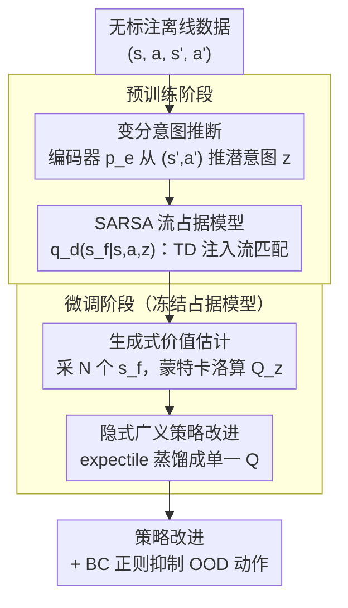

# Intention-Conditioned Flow Occupancy Models

## 一句话总结

提出 InFOM，利用流匹配（flow matching）构建意图条件化的占据模型（occupancy model），通过变分推断推理数据中的潜在意图，实现无标注数据上的 RL 预训练，在 36 个状态任务和 4 个视觉任务上取得 1.8× 中位回报提升和 36% 成功率提升。

## 研究背景与动机

大规模预训练 - 微调范式在 NLP 和 CV 中取得巨大成功，但在强化学习（RL）中仍然是一个开放问题。RL 的核心难点在于：

**时间推理**：智能体需要推理当前动作的长期影响，而世界模型（world model）受累积误差限制，长距离推理能力有限

**意图推理**：大规模离线数据集通常由多个用户执行不同任务收集而来，这些隐含的"意图"未被显式标注

**现有方法的局限**：行为克隆（BC）只模仿动作、不捕获意图；判别式占据模型训练困难；后继特征（successor features）方法通常忽略用户意图

本文提出 InFOM（Intention-conditioned Flow Occupancy Models），同时学习一个概率模型来捕获时间信息和意图信息，使预训练模型能够感知不同用户的行为目的，从而在下游任务微调时实现更高效的策略学习。

## 方法详解

### 整体框架

InFOM 分预训练和微调两个阶段：预训练时从无标注数据中用变分推断抽出潜在意图 $z$，并用带 TD 思想的流匹配学一个意图条件化的占据模型 $q_d(s_f|s,a,z)$，刻画"从当前状态出发、在意图 $z$ 驱动下未来会落到哪些状态"。微调时把这个生成模型当作未来状态采样器，用蒙特卡洛估计 Q 值，再通过隐式 GPI 蒸馏成可用于策略改进的单一价值函数。

### 关键设计

**1. 变分意图推断：把数据里没标注的"用户目的"显式抽出来**

离线数据集 $D=\{(s,a,s',a')\}$ 往往由多个用户执行不同任务收集而来，这些隐含意图从未被标注，BC 等方法只能照搬动作而无法感知背后的目的。InFOM 把意图视作潜变量 $z$，用变分推断从转移中推断它：意图编码器 $p_e(z|s',a')$ 从下一步转移 $(s',a')$ 出发推断意图，背后是"一致性假设"——一段连续转移共享同一个意图。训练目标是最大化 ELBO $\mathbb{E}[\log q_d(s_f|s,a,z)] - \lambda D_{\mathrm{KL}}(p_e(z|s',a') \,\|\, p(z))$，先验取标准高斯 $p(z)=\mathcal{N}(0,I)$，系数 $\lambda$ 控制 KL 正则的强度，把后验向先验拉拢以防意图编码退化成无意义的噪声。这样占据模型就能按不同意图分别建模未来，下游微调时也能感知不同用户的行为目的。

**2. SARSA 流占据模型：用流匹配把"未来占据分布"学成可采样的生成模型，并注入动态规划能力**

占据度量描述了从 $(s,a)$ 出发、按折扣 $\gamma$ 加权的未来状态分布，判别式建模训练困难，于是 InFOM 改用流匹配（flow matching）学一个生成式占据模型 $q_d(s_f|s,a,z)$ 直接采样未来状态。但单纯的流匹配只会拟合数据中出现过的轨迹，缺乏拼接（stitching）与组合泛化能力，因此作者把时序差分（TD）思想注入流匹配损失：占据损失拆成当前项与未来项 $(1-\gamma)\mathcal{L}_{\text{current}} + \gamma \mathcal{L}_{\text{future}}$，前者拟合"下一步真实到达的状态"，后者用自举（bootstrap）把下一状态的占据流回传给当前状态，相当于在流空间里做动态规划。实现上选 SARSA 变体而非 Q-learning 变体——前者沿数据中真实出现的 $(s',a')$ 自举，不引入 OOD 动作，因而更简单稳定，在大数据集上表现更好。

**3. 生成式价值估计：把训练好的占据模型当采样器，蒙特卡洛算意图条件 Q 值**

微调时占据模型被冻结，价值估计不再需要单独的 critic 网络：对每个 $(s,a)$ 直接从 $q_d(s_f|s,a,z)$ 采 $N=16$ 个未来状态 $s_f^{(i)}$，代入奖励函数后取平均即得意图条件化 Q 函数 $Q_z(s,a)=\frac{1}{(1-\gamma)N}\sum_i r(s_f^{(i)})$。这里意图 $z$ 从先验 $p(z)$ 采样而非后验，因为下游任务的真实意图未知，从先验采样相当于枚举"如果用户抱着各种可能的意图，价值各是多少"，为下一步的策略改进提供一组候选 $Q_z$。

**4. 隐式广义策略改进：用 expectile loss 把一族 $Q_z$ 蒸馏成单一 Q，绕开 ODE 反传**

朴素 GPI 需要对一组意图取 max 选出最优价值，但意图是连续潜空间、只能采样有限个 $z$，硬取 max 既受限于采样集合、又要对 $Q_z$ 求梯度而被迫穿过 ODE 求解器反向传播，极不稳定。InFOM 改用上分位数期望损失（upper expectile loss）把这族 $Q_z$ 隐式地蒸馏成单一标量函数 $Q$：$\mathcal{L}(Q)=\mathbb{E}[L_2^\mu(Q_z(s,a)-Q(s,a))]$，其中 $\mu>0.5$ 的非对称权重让 $Q$ 偏向逼近 $Q_z$ 分布的上分位数，从而近似 max 的效果却无需显式枚举与 ODE 反传。策略提取再附加一项行为克隆正则抑制 OOD 动作。消融显示这一隐式做法比朴素 GPI 回报高 44%、方差小 8×。

## 实验

### 实验一：ExORL 和 OGBench 基准测试

在 36 个状态任务和 4 个视觉任务上与 8 种基线方法对比：

| 任务域 | InFOM | 最强基线 | 提升 |
|--------|-------|----------|------|
| walker (4 tasks avg) | **380.9** | 327.6 (MBPO+ReBRAC) | ~16% |
| jaco (4 tasks avg) | **727.4** | 67.7 (IQL) | ~20× |
| cube single (5 tasks) | **92.5** | 77.8 (MBPO+ReBRAC) | ~19% |
| visual tasks (4 tasks) | — | — | +31% over best |

- 在 9 个域中的 7 个上匹配或超越所有基线
- jaco 域改进最为显著（约 20×），归因于高维状态空间和稀疏奖励
- image-based 任务比最强基线高 31%
- 整体中位回报提升 1.8×，成功率提升 36%

### 实验二：隐式 GPI 消融实验

| 策略提取方式 | quadruped jump 回报 | scene task 1 成功率 |
|-------------|---------------------|---------------------|
| InFOM (implicit GPI) | **最高** | **最高** |
| InFOM + GPI (朴素 max) | 低 44% | 低，方差 8× |
| FOM + one-step PI | 显著更低 | 显著更低 |

- 隐式 GPI 比朴素 GPI 性能高 44%、方差小 8×
- 去除意图编码器（FOM + one-step PI）导致性能大幅下降，验证意图推理的重要性

## 亮点

- **统一框架**：首次将意图推断和流匹配占据模型结合，在一个框架中同时捕获时间和意图信息
- **隐式 GPI**：用 expectile loss 替代显式 max 操作，避免了 ODE 反向传播不稳定问题和有限意图集合的局限
- **强实验表现**：36+4 个任务上全面优于 8 种基线，jaco 域有 20× 改进
- **意图可视化**：t-SNE 可视化表明 InFOM 能发现与真实意图对齐的聚类结构，而 FB 和 HILP 的表征混杂

## 局限性

1. 从连续状态-动作对推断意图的简化可能无法准确捕获完整轨迹级别的原始意图
2. MC Q 估计带来方差（部分任务跨种子标准差较大）
3. 需要同时预训练编码器和流模型，计算开销高于纯 BC 方法
4. 一致性假设（连续转移共享意图）在实际复杂场景中可能不成立

## 相关工作

- **离线无监督 RL**：FB（Touati & Ollivier, 2021）、HILP（Park et al., 2024）学习技能/表征但通常不同时建模占据度量
- **占据模型/后继表征**：Dayan (1993)、Janner et al. (2020)、TD flows（Farebrother et al., 2025）使用流匹配建模占据度量但不建模意图
- **生成式 RL**：Decision Transformer、Diffuser 等用生成模型建模轨迹/策略，但通常不显式预测长期状态分布
- **表征学习**：对比学习、MAE 等学习通用表征，但不保证有利于策略适应
- **InFOM 的创新点**：相比最接近的 TD flows，引入变分潜变量建模意图 + 隐式 GPI 替代有限集上的显式 GPI

## 评分

⭐⭐⭐⭐ (4/5)

- 理论动机清晰，将变分推断与流匹配占据模型有机结合
- 实验覆盖广、基线充分，36+4 任务 × 8 基线 × 8 种子
- 隐式 GPI 是优雅的工程/理论贡献
- 扣分点：意图一致性假设较强，MC 估计方差问题未完全解决

<!-- RELATED:START -->

## 相关论文

- [\[ICCV 2025\] SCFlow: Implicitly Learning Style and Content Disentanglement with Flow Models](../../ICCV2025/image_generation/scflow_implicitly_learning_style_and_content_disentanglement_with_flow_models.md)
- [\[ICCV 2025\] MAVFlow: Preserving Paralinguistic Elements with Conditional Flow Matching for Zero-Shot AV2AV Multilingual Translation](../../ICCV2025/image_generation/mavflow_preserving_paralinguistic_elements_with_conditional_flow_matching_for_ze.md)
- [\[ICCV 2025\] Joint Diffusion Models in Continual Learning](../../ICCV2025/image_generation/joint_diffusion_models_in_continual_learning.md)
- [\[ICLR 2026\] ToProVAR: Efficient Visual Autoregressive Modeling via Tri-Dimensional Entropy-Aware Semantic Analysis and Sparsity Optimization](toprovar_efficient_visual_autoregressive_modeling_via_tri-dimensional_entropy-aw.md)
- [\[NeurIPS 2025\] Emergence and Evolution of Interpretable Concepts in Diffusion Models](../../NeurIPS2025/image_generation/emergence_and_evolution_of_interpretable_concepts_in_diffusi.md)

<!-- RELATED:END -->
