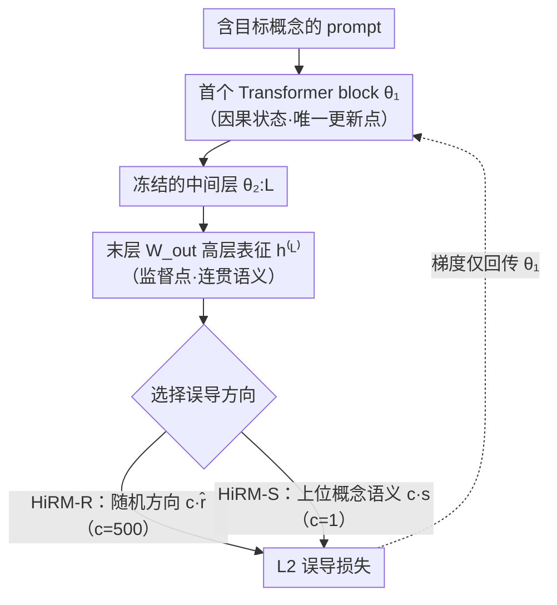

# Localized Concept Erasure in Text-to-Image Diffusion Models via High-Level Representation Misdirection

**会议**: ICLR 2026  
**arXiv**: [2602.19631](https://arxiv.org/abs/2602.19631)  
**代码**: [GitHub](https://github.com/Coffeeloveman/HiRM)  
**领域**: 扩散模型 / 安全 / 遗忘  
**关键词**: 概念擦除, 文本编码器, 因果定位, 表征误导, 模块化安全补丁  

## 一句话总结

HiRM 提出"更新位置与擦除目标解耦"的概念擦除策略——仅更新 CLIP 文本编码器第一层的权重，但将擦除监督施加在最后一层的高层语义表征上，通过引导目标概念表征偏向随机方向（HiRM-R）或语义方向（HiRM-S），在 UnlearnCanvas 和 NSFW 基准上实现风格/物体/裸体的高效擦除，且可零样本迁移到 Flux 架构。

## 研究背景与动机

**领域现状**：概念擦除主要分为训练式（fine-tune U-Net，如 ESD、SalUn、MACE）和免训练式（闭式编辑或 prompt 操控，如 UCE、RECE、SAFREE）。两类方法都主要修改 U-Net/denoiser。

**现有痛点**：修改 U-Net 计算成本高、易损害不相关概念生成质量；免训练方法在擦除效果与保持之间难以平衡。

**核心矛盾**：Basu et al. 的因果追踪发现 CLIP 文本编码器的第一层是视觉属性的因果状态（causal state），理论上可直接在此处干预。但直接编辑早期层（如 Diff-QuickFix）在抽象概念（如 NSFW/裸体）上效果差且损害模型整体质量，因为早期层表征是"概念袋"（bag of concepts），修改它会波及所有共享的基础特征。

**本文目标** 在文本编码器内实现精准概念擦除，兼顾：(a) 对具体概念（风格/物体）和抽象概念（裸体）的擦除效果；(b) 不损害非目标生成质量；(c) 计算效率高且可跨架构迁移。

**切入角度**：Toker et al. 发现最后几层才形成连贯的高层语义表征，而早期层是分散的底层特征。因此更新点和监督点应该分开——在第一层（因果状态所在）做梯度更新，但在最后一层（高层语义形成处）定义擦除损失。

**核心 idea**：通过更新第一层权重来"远程"误导最后一层中目标概念的高层语义表征，实现精准定位的概念擦除。

## 方法详解

### 整体框架

HiRM 要解决的是：在 CLIP 文本编码器内部精准擦掉一个概念（某种风格、物体或裸体），而不去改扩散模型的 U-Net。整篇方法围绕一个反直觉的拆分展开——**在哪里改权重**和**按什么标准改**分属编码器的两端：梯度只更新首个 Transformer block 的参数 $\theta_1$（视觉属性的"因果状态"所在），而擦除损失却定义在末层 $W_{\text{out}}$ 投影输出的高层语义表征 $h^{(L)}$ 上（连贯语义真正成形处）。

具体地说，含目标概念的 prompt 正向走完全部 $L$ 层、在末层得到表征 $h^{(L)}$；损失把它"误导"到一个指定方向——随机方向（HiRM-R）或语义相关的上位概念（HiRM-S）；反传时梯度只流回 $\theta_1$，让首层的微小改动通过冻结的中间层"远程"重塑末层语义。这样既守住了"因果状态在首层"的定位，又借助"高层语义在末层"避免了直接改早期层带来的连带破坏。

### 关键设计

**1. 解耦更新点与监督点：在首层改权重，却按末层语义定目标**

这是 HiRM 区别于既有文本编码器编辑方法的结构性核心，也是上图首层→中间层→末层这条主干的由来。最自然的想法是直接改"因果层"：Basu et al. 的因果追踪确认视觉属性几乎完全集中在 CLIP 文本编码器的首个 Transformer block，所以更新点放这里没错；但若把擦除目标也定义在早期层（如 Diff-QuickFix 直接改首层投影矩阵，或其改进版 Diff-Q\* 在首层 fc2 输出上施加随机误导损失），擦除虽强、非目标生成质量却崩——因为早期层是共享的"概念袋"（bag of concepts），承载所有概念的基础特征，改它会波及无关概念，引发"表征粉碎"（representation shattering）。

HiRM 的解法是把两件事拆到编码器两端：梯度更新仍只施加在首层 $\theta_1$，但擦除损失改定义在**末层** $W_{\text{out}}$ 投影输出的高层表征 $h^{(L)}$ 上，因为 Toker et al. 指出只有最后几层才把分散特征整合成对单个概念精确、连贯的语义。首层的权重改动通过冻结的中间层 $\theta_{2:L}$ "远程"传导到末层，由高层语义来界定"该擦什么"。消融印证了这一点：把监督点从早期层逐步移到末层 $W_{\text{out}}$ 时，擦除与保持之间达到最佳平衡。

**2. HiRM-R：用随机方向粗暴打散末层语义**

确定了在末层施加监督后，第一种误导方式是把目标表征推向一个"无意义"的地方。HiRM-R 给目标概念在末层的每个 token 表征 $h_t^{(L)}$ 各采样一个随机单位向量 $\hat{r}_t$，用较大的转向系数 $c=500$ 把表征强行拉过去：

$$\mathcal{L}_{\text{HiRM-R}} = \frac{1}{T} \sum_{t=1}^T \|h_t^{(L)} - c \cdot \hat{r}_t\|^2$$

随机方向的好处是通用——无论擦梵高风格还是某个物体，都不必事先定义"应该变成什么"，随机噪声本身就足以破坏原语义；$c$ 取得大，是因为随机目标没有语义牵引力，需要更强的转向力把表征拉离原位。代价是它只管"打散"不管"打到哪里"，更适合追求强力擦除的场景。

**3. HiRM-S：导向语义相邻的上位概念，擦得更干净**

HiRM-R 把表征推到语义空间里完全无关的角落，容易牵连周边。HiRM-S 改成把目标表征对齐一个语义相关的上位概念——比如把 "Van Gogh" 推向 "Painting"——擦除后仍落在合理的语义邻域，对非目标生成扰动更小：

$$\mathcal{L}_{\text{HiRM-S}} = \frac{1}{T} \sum_{t=1}^T \|h_t^{(L)} - c \cdot s_t^{(L)}\|^2$$

这里 $s_t^{(L)}$ 是上位概念的末层表征，系数取 $c=1$ 即可——目标方向自带语义，不需要 HiRM-R 那样的大转向力。对抽象的 NSFW 概念没有现成上位词，HiRM-S 转而构建"安全误导向量"：借鉴 Ring-A-Bell 框架，用含裸体的 prompt 表征减去经验裸体向量 $V_e$，把剩下的"去裸体"分量作为引导目标。

### 损失函数 / 训练策略

- 风格擦除：lr=5e-5，40 epochs（HiRM-R）/ 30 epochs（HiRM-S），单词 prompt
- 物体擦除：lr=5e-5，25 epochs（HiRM-R）/ 15 epochs（HiRM-S）
- 裸体擦除：lr=1e-4，50 epochs（HiRM-R）/ 25 epochs（HiRM-S），多关键词联合
- 训练时间 ~1.2s，显存 1.60 GB，无需 retain set

## 实验关键数据

### UnlearnCanvas 基准（风格 + 物体）

| 方法 | 训练式 | Style UA↑/IRA↑/AA↑ | Object UA↑/IRA↑/AA↑ | 训练时间(s) |
|------|--------|-------------------|---------------------|-------------|
| ESD | ✓ | 98.58/80.97/91.17 | 92.15/55.78/64.05 | 7372 |
| MACE | ✓ | 54.69/89.85/81.10 | 67.65/98.52/87.85 | 175 |
| SalUn | ✓ | 86.26/90.39/90.58 | 86.91/96.35/94.28 | 610 |
| Diff-Q | ✗ | 96.40/93.91/95.81 | 94.00/98.37/96.19 | - |
| **HiRM-R** | ✓ | 95.50/89.31/94.24 | 93.20/98.18/94.65 | **1.20** |
| **HiRM-S** | ✓ | **96.20/92.67/95.54** | **96.20/97.77/96.94** | **1.20** |

### NSFW 擦除（对抗攻击鲁棒性）

| 方法 | Ring-16↓ | Ring-77↓ | MMA↓ | I2P↓ | COCO CLIP↑ |
|------|----------|----------|------|------|------------|
| SalUn | 0.00 | 2.11 | 0.90 | 0.57 | 0.293 |
| RECE | 1.05 | 1.05 | 0.40 | 0.57 | 0.277 |
| Ediff | 2.11 | 1.05 | 4.10 | 0.85 | 0.307 |
| **HiRM-R** | **0.00** | **0.00** | 8.00 | 0.96 | 0.304 |
| **HiRM-S** | 1.05 | **0.00** | **3.30** | **0.66** | **0.306** |

### 关键发现

- HiRM-S 在风格和物体擦除上同时取得最佳 AA，且训练时间仅 1.2s（vs ESD 7372s），比最快的训练式方法 MACE 也快 145×
- 与 denoiser 方法的协同效应：HiRM-R + EraseAnything 在 Flux 上将 Ring-16 从 29.47% 降至 3.16%，CLIP score 几乎不变
- 零样本迁移 Flux：仅替换文本编码器，无需额外训练，Ring-16 从 88.42% 降至 37.89%
- 多概念擦除（S-HiRM-S = SPEED + HiRM-S）：在 50 名人擦除 + 裸体擦除上保持 MMA 1.70%、Ring-16 1.05%
- t-SNE 可视化确认：仅目标概念表征被移动，非目标概念保持稳定

## 亮点与洞察

- **"解耦更新-监督"的思路极其优雅**：第一层做更新（因为是因果状态），最后一层做监督（因为有高层语义），两者通过冻结的中间层自然连接
- **模块化安全补丁**：因为只修改文本编码器，可以即插即用地叠加到任何使用相同 CLIP 的模型上（包括 LoRA 微调版本、Flux），无需重新训练
- **与 U-Net 方法正交互补**：HiRM 修改文本编码器 + 其他方法修改 denoiser = 双重防线，协同效应显著

## 局限与展望

- HiRM 对所有 token 均匀施加误导，未区分 token 重要性，可能抑制与目标无关的信息表征
- 对 UnLearnDiffAtk（白盒对抗）的鲁棒性相对较弱（22.54% ASR），不如 SalUn/RECE
- 多概念擦除目前通过简单权重平均融合 LoRA 模块，IRA 有所下降（65.56%），需要更精细的融合策略
- 模型无关设计虽然简洁但也限制了利用模型内部结构的可能性

## 相关工作与启发

- **vs Diff-QuickFix**：同为文本编码器编辑，但 Diff-Q 用闭式解直接修改第一层投影矩阵，在 NSFW 任务上效果差（I2P 7.09%但 CLIP 降到 0.273）；HiRM 通过解耦监督点解决此问题
- **vs ESD**：U-Net fine-tuning，风格擦除强但物体擦除严重退化（Object AA 仅 64.05%），且训练时间 7372s
- **vs SPEED**：互补关系——SPEED 修改交叉注意力的 U-Net 权重擦除多概念（5s/100 概念），HiRM 修改文本编码器擦除裸体，两者组合（S-HiRM-S）效果最佳
- 启发：因果追踪 → 定位 → 解耦干预的范式可推广到 LLM 的安全对齐

## 评分

- 新颖性: ⭐⭐⭐⭐⭐ 更新-监督解耦设计极具洞察力，首次系统在文本编码器内实现全品类概念擦除
- 实验充分度: ⭐⭐⭐⭐⭐ UnlearnCanvas + NSFW + 对抗攻击 + Flux 迁移 + LoRA 迁移 + 协同效应，极为全面
- 写作质量: ⭐⭐⭐⭐ 动机阐述清晰，消融合理
- 价值: ⭐⭐⭐⭐⭐ 1.2s 训练 + 零样本跨架构迁移 + 模块化安全补丁，实用价值极高

<!-- RELATED:START -->

## 相关论文

- [\[CVPR 2026\] Neighbor-Aware Localized Concept Erasure in Text-to-Image Diffusion Models](../../CVPR2026/image_generation/neighbor-aware_localized_concept_erasure_in_text-to-image_diffusion_models.md)
- [\[ICLR 2026\] SPEED: Scalable, Precise, and Efficient Concept Erasure for Diffusion Models](speed_scalable_precise_and_efficient_concept_erasure_for_diffusion_models.md)
- [\[ICLR 2026\] Generalization of Diffusion Models Arises with a Balanced Representation Space](generalization_of_diffusion_models_arises_with_a_balanced_representation_space.md)
- [\[AAAI 2026\] Mass Concept Erasure in Diffusion Models with Concept Hierarchy](../../AAAI2026/image_generation/mass_concept_erasure_in_diffusion_models_with_concept_hierarchy.md)
- [\[ICML 2026\] Orthogonal Concept Erasure for Diffusion Models](../../ICML2026/image_generation/orthogonal_concept_erasure_for_diffusion_models.md)

<!-- RELATED:END -->
