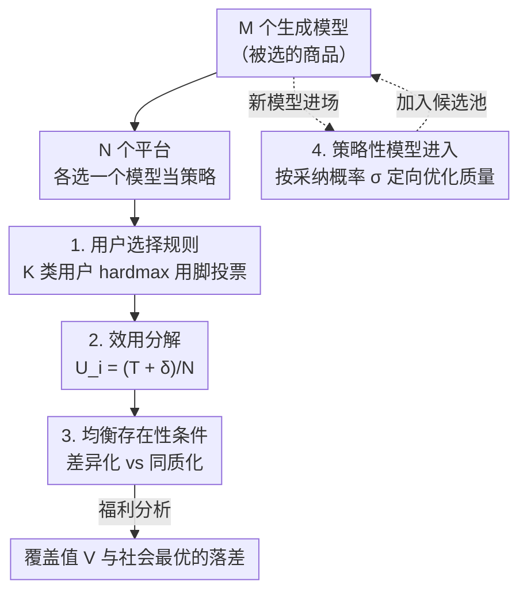

# Market Games for Generative Models: Equilibria, Welfare, and Strategic Entry

**会议**: ICLR 2026  
**arXiv**: [2602.17787](https://arxiv.org/abs/2602.17787)  
**代码**: [GitHub](https://github.com/osu-srml/Generative_Competition)  
**领域**: 博弈论 / 生成模型市场  
**关键词**: 市场博弈, Nash 均衡, 生成模型竞争, 社会福利, 策略性进入

## 一句话总结

形式化三层模型-平台-用户市场博弈，分析生成模型竞争下纯策略 Nash 均衡的存在条件、市场结构、社会福利影响，并设计模型提供者的最优进入策略。

## 研究背景与动机

- 生成模型生态系统已形成竞争性多平台市场（如 Azure vs Bedrock, Midjourney vs Stability AI）
- 现有研究多局限于两层市场（模型开发者直接服务用户），忽略了平台中间层
- 关键问题：竞争何时导致同质化？增加模型/平台是否提升用户福利？模型提供者如何策略性进入？

## 方法详解

### 整体框架

论文把生成模型市场抽象成一个三层博弈，自上而下串成一条因果链。最底层是 $M$ 个生成模型 $\mathbb{G}=\{g_1,\dots,g_M\}$，它们是被挑选的"商品"；中间层是 $N$ 个平台，每个平台挑一个模型 $f_i\in\mathbb{M}$ 当作自己的策略，互相争抢用户；顶层是 $K$ 类异质用户 $\Theta=\{\boldsymbol{\theta}_1,\dots,\boldsymbol{\theta}_K\}$，他们用脚投票、流向能给自己最高得分的平台。

整套分析就沿着这条链展开：先用一条**用户选择规则**把"用脚投票"写成平台的用户份额函数（设计 1），再把平台份额带来的效用**分解**成"全局质量 + 局部错位优势"两股力量（设计 2），由此推出市场会走向差异化还是同质化的**均衡存在性条件**（设计 3）。最后把视角换到一个想进场的新模型提供者，问它该训练一个怎样的模型才最容易被平台采纳——这就是**策略性模型进入**（设计 4）。

### 关键设计

**1. 用户选择规则：把"用脚投票"写成可分析的份额函数**

要研究平台竞争，首先得刻画用户怎么在平台间分流。论文采用 hardmax 选择，即每个类型 $\boldsymbol{\theta}$ 的用户只会涌向当前得分最高的平台，并在并列最优者之间均分：

$$p_i(\boldsymbol{\theta}) = \begin{cases} 0 & \text{if } f_i \notin \arg\max_{i'} S_{f_{i'}}(\boldsymbol{\theta}) \\ \frac{1}{|\arg\max_{i'} S_{f_{i'}}(\boldsymbol{\theta})|} & \text{otherwise} \end{cases}$$

这种"赢者通吃、并列平分"的设定让每个平台的用户份额成为模型得分 $S$ 的离散函数，从而把连续的市场竞争压缩成可枚举的策略博弈，是后续所有均衡推导的基础（论文也讨论了用温度 $\tau$ 控制随机性的 softmax 平滑版本，以覆盖更现实的概率选择）。

**2. 效用分解：把平台收益拆成"全局质量 + 局部错位优势"**

直接分析平台效用很难看出竞争的结构，于是论文把平台 $i$ 选模型 $f_i$ 后的效用拆成两项：

$$U_i(f_i; \boldsymbol{f}_{-i}) = \frac{1}{N}(T_{f_i} + \delta_{f_i}(\boldsymbol{f}))$$

其中 $T_j=\sum_{\boldsymbol{\theta}}\pi_{\boldsymbol{\theta}}S_j(\boldsymbol{\theta})$ 是模型在全体用户分布上的平均分数，刻画"硬实力"；偏差优势 $\delta_{f_i}$ 则刻画"在别人没覆盖好的用户群上错位竞争"能多抢到的净份额。这一分解是全文的分析杠杆——它说明平台既想选平均最强的模型，又想避开扎堆去吃差异化红利，市场最终走向哪种均衡，正是这两股力量博弈的结果。

**3. 均衡存在性条件：刻画差异化与同质化的分水岭**

基于上面的分解，论文给出两类纯策略均衡的精确条件。完全差异化均衡（每个平台选不同模型）存在，当且仅当对每个平台 $i$、偏离到任意替代模型 $f_i$ 都不划算：

$$T_{f_i^*} - T_{f_i} \geq \delta_{f_i}(\boldsymbol{f}_{-i}^* \cup f_i) - \delta_{f_i^*}(\boldsymbol{f}^*)$$

直观说就是"放弃自身平均分数的损失"要盖过"偏离换来的错位优势增益"。反过来，当某个主导用户类型占比足够大（$\pi_{\boldsymbol{\theta}^*}\geq 1-\frac{1}{1+2\Gamma/\rho}$，其中 $\rho$ 是该类型上的质量优势、$\Gamma$ 是少数类型能贡献的上界）时，吃下这群人的诱惑压倒一切，所有平台会趋同到同一个模型，形成同质化均衡。这一对条件正是论文解释"为何竞争有时反而导致趋同"的理论核心——市场结构不由平均性能单独决定，一个平均分更低但在高权重人群上有强局部优势的模型，照样能在均衡里站住脚。

**4. 策略性模型进入：让新模型针对采纳概率定向优化**

站在模型提供者一方，问题变成"训练一个怎样的模型才最容易被平台采纳、被用户选中"。论文把目标设为采纳加权的质量：

$$\max F(\phi) = \sum_{\boldsymbol{\theta}} \pi_{\boldsymbol{\theta}} \sigma_{\boldsymbol{\theta}} S_\phi(\boldsymbol{\theta})$$

其中采纳概率用一个 Bradley-Terry 软门 $\sigma_{\boldsymbol{\theta}}=\sigma(\beta\Delta_{\boldsymbol{\theta}})$ 表示，它随新模型相对最强对手的优势 $\Delta_{\boldsymbol{\theta}}=S_\phi(\boldsymbol{\theta})-\bar{S}(\boldsymbol{\theta})$ 单调上升（$\beta$ 控制软硬程度）——也就是说提供者应该把火力集中在那些"现有模型还没占牢、自己又能反超"的用户群上。落地有两条互补路径：一是训练数据重采样，按采纳概率加权偏置训练分布，让模型自然偏向高回报人群；二是直接梯度优化，在原训练损失上加正则项 $\arg\min_\phi \mathcal{L}(\phi)-\lambda F(\phi)$，用 $\lambda$ 权衡通用质量与定向采纳收益。

## 实验关键数据

### 实验设置

基于 CIFAR-10 的 DDPM 模型池（5 个 LoRA 变体）+ 6 个异质用户组 + ResNet20 奖励函数。

### 模型池扩大对市场的影响

| 模型数/平台数 | HHI 多样性变化 | 覆盖值变化 | 均衡类型 |
|-------------|-------------|----------|---------|
| M=2, N=3 | 高度同质化 | 基线 | 同质均衡 |
| M=3, N=3 | 显著降低（差异化）| 提升 | 差异化均衡 |
| M=4, N=3 | 出现最优响应循环 | 波动 | 无纯策略均衡 |
| M=5, N=3 | 重新同质化 | 下降 | 同质均衡 |

### 消融实验：平台数增加

| 平台数 | HHI 多样性 | 覆盖值 | 关键发现 |
|-------|-----------|-------|---------|
| N=1 | 1.00 | 最低 | 垄断 |
| N=3 | 适中 | 提升 | 差异化出现 |
| N=6 | 最低 | 最高 | 更多采纳机会 |

### 关键发现

1. 扩大模型池不一定增加多样性——只有足够独特的模型才能促进差异化
2. 增加平台数通常提升多样性但福利永远达不到社会最优
3. 先入者常选择"最佳"模型但后来者可能获得更高个体效用
4. 市场结构由平均性能和局部偏差优势共同决定

## 亮点与洞察

1. **反直觉发现**：增加竞争（更多模型或平台）可能降低用户福利和市场多样性
2. **理论贡献**：完整刻画了纯策略 Nash 均衡的存在条件，包括 hardmax 和 softmax 用户选择模型
3. **实践意义**：为 AI 生态系统治理提供了理论基础，解释了当前生成模型市场同质化趋势

## 局限性

- hardmax 用户选择假设过于理想化，尽管扩展到 softmax 但实际用户行为更复杂
- 实验仅在 CIFAR-10 上进行，缺乏真实市场数据验证
- 假设平台只选择一个模型，实际中平台可能提供多个模型
- 未考虑动态博弈和重复博弈场景

## 相关工作

- **分类器市场竞争**：Einav & Rosenfeld (2025), Jagadeesan et al. (2023)
- **生成模型竞争**：Taitler & Ben-Porat (2025), Raghavan (2024)
- **三层市场结构**：Fallah et al. (2024)

## 评分

- 新颖性：⭐⭐⭐⭐⭐ — 首次形式化三层生成模型市场博弈
- 技术深度：⭐⭐⭐⭐ — 严谨的博弈论分析，完整的均衡条件推导
- 实验完整性：⭐⭐⭐ — 合成和真实数据验证但规模有限
- 实用价值：⭐⭐⭐⭐ — 对 AI 治理和市场设计有重要指导意义

<!-- RELATED:START -->

## 相关论文

- [\[ICCV 2025\] GameFactory: Creating New Games with Generative Interactive Videos](../../ICCV2025/image_generation/gamefactory_creating_new_games_with_generative_interactive_videos.md)
- [\[ICLR 2026\] Beyond Confidence: The Rhythms of Reasoning in Generative Models](beyond_confidence_the_rhythms_of_reasoning_in_generative_models.md)
- [\[ICLR 2026\] NeuralOS: Towards Simulating Operating Systems via Neural Generative Models](neuralos_towards_simulating_operating_systems_via_neural_generative_models.md)
- [\[ICLR 2026\] QVGen: Pushing the Limit of Quantized Video Generative Models](qvgen_pushing_the_limit_of_quantized_video_generative_models.md)
- [\[ICLR 2026\] DoFlow: Flow-based Generative Models for Interventional and Counterfactual Forecasting](doflow_flow-based_generative_models_for_interventional_and_counterfactual_foreca.md)

<!-- RELATED:END -->
