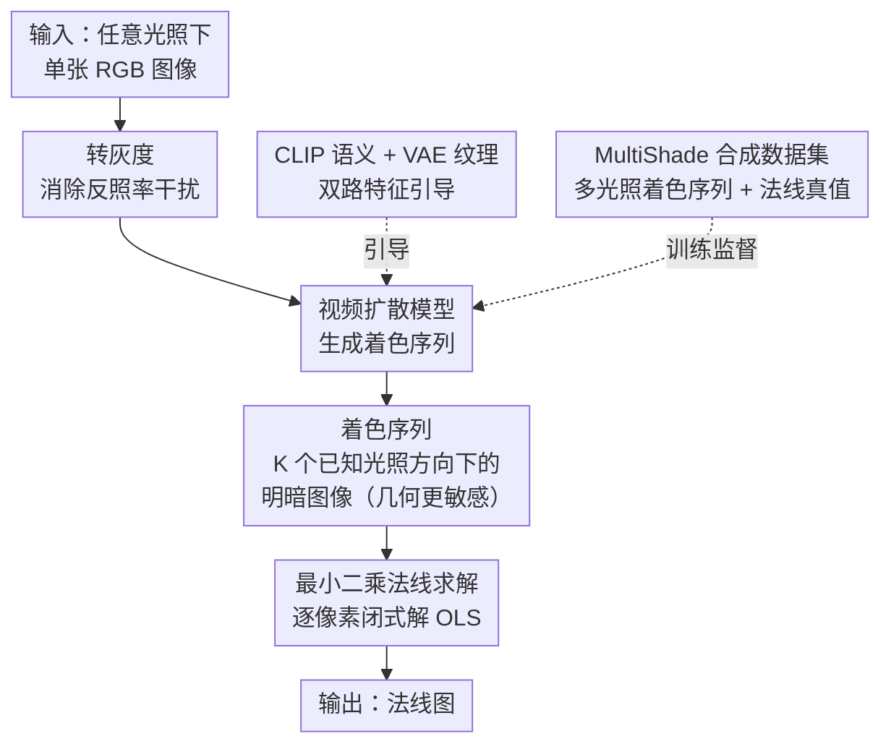

# Monocular Normal Estimation via Shading Sequence Estimation

**会议**: ICLR 2026 (Oral)  
**arXiv**: [2602.09929](https://arxiv.org/abs/2602.09929)  
**代码**: [GitHub](https://github.com/LMozart/ICLR2026-RoSE)  
**领域**: 图像生成 / 3D视觉  
**关键词**: 法线估计, 着色序列, 视频生成模型, 最小二乘求解, 单目3D重建

## 一句话总结

本文提出了RoSE方法，将单目法线估计问题重新定义为着色序列（Shading Sequence）估计问题，利用图像到视频（Image-to-Video）生成模型预测多光照下的着色序列，再通过简单的最小二乘法将着色序列转换为法线图，在真实世界基准数据集上达到SOTA性能。

## 研究背景与动机

单目法线估计旨在从单张任意光照下的RGB图像估计物体的法线图（Normal Map），这是3D重建和渲染的关键中间表示。现有方法面临的核心问题是**3D错位（3D Misalignment）**：

**表面看似正确但几何失真**: 现有深度模型直接预测法线图，估计结果在视觉上看起来合理，但重建出的3D表面经常与真实几何细节不匹配

**原因分析 —— 颜色变化过于微妙**: 法线图中不同几何结构的差异仅通过相对微弱的颜色变化来反映。模型难以从这些微妙的颜色差异中准确区分和重建不同的几何结构

**直接预测范式的局限**: 当前的"输入RGB → 直接输出Normal Map"范式强迫模型在一步推理中同时完成光照解耦和几何推断，任务难度过高

本文的核心洞察是：**着色序列（多光照下的明暗变化序列）对几何信息更加敏感**。不同的表面法线方向在不同光照方向下会产生截然不同的明暗模式，这比单张法线图中的颜色差异要显著得多。因此，先估计着色序列，再从着色序列恢复法线，可以有效缓解3D错位问题。

## 方法详解

### 整体框架

RoSE 把"单张 RGB → 法线图"的一步映射拆成三段串联的流程：先把输入 RGB 转成灰度图消除反照率干扰，再用图像到视频（I2V）扩散模型以灰度图为首帧、在 CLIP 语义与 VAE 纹理两路特征引导下生成同一物体在 $K$ 个已知光照方向下的着色序列，最后对这串着色值逐像素跑一次最小二乘把法线解出来。整条链路里只有"生成着色序列"是需要学习的难活，法线求解则退化为一个有闭式解的线性问题；训练所需的多光照监督来自合成数据集 MultiShade。

### 关键设计

**1. 着色序列重构范式：把"难以分辨的颜色差异"换成"放大的明暗变化"**

现有方法逼模型从单张法线图里读出几何，而法线图上不同结构的差异只体现为微弱的 RGB 色差，这正是 3D 错位的根源。本文转而要求模型预测一组着色序列——同一物体在不同已知光照方向 $\{l_1, l_2, \dots, l_K\}$ 下的明暗图像。其物理依据是朗伯反射模型，像素亮度满足 $I_k = \rho \,(n \cdot l_k)$，其中 $\rho$ 为反照率、$n$ 为法线、$l_k$ 为第 $k$ 个光照方向。法线方向略有不同的两个点，在多光照下会呈现截然不同的亮度变化曲线，这种差异比单张法线图里的色差显著得多，相当于用多光照把几何信息"放大"出来，让模型更容易捕获。

**2. 视频扩散模型生成着色序列：借 I2V 的时序一致性凑出多光照帧**

着色序列本质上是一段随光照连续变化的"视频"，与 I2V 模型擅长生成时间一致序列的特性天然契合。RoSE 把灰度输入当作首帧，让 I2V 扩散模型续生出对应不同光照的后续帧。为保证序列既语义一致又纹理准确，生成同时受两路特征引导：CLIP 编码器提供全局语义、帮助模型理解物体是什么；VAE 编码器提供细粒度纹理与结构，约束局部明暗的正确性。训练时只更新视频扩散模型，CLIP 与 VAE 编码器全程冻结。

**3. 最小二乘法线求解：把法线还原退化成一次闭式线性解**

拿到 $K$ 帧着色值和对应光照方向后，朗伯方程对每个像素变成线性方程组 $I = L\,n$，其中 $I \in \mathbb{R}^{K}$ 是该像素的着色值向量、$L \in \mathbb{R}^{K \times 3}$ 是堆叠的光照方向矩阵、$n \in \mathbb{R}^3$ 是待求法线。直接用普通最小二乘解析求解 $n = (L^{\top} L)^{-1} L^{\top} I$ 即可，无需任何额外学习，计算量极小且数学上保证最优。由于着色定义里有 $\max(\cdot,0)$ 截断，负值会让 OLS 估计产生偏差，因此求解时只取该像素着色值大于 0 的帧作为有效方程；为保证每点可解，光照按光度立体的环形布置在上半球纬度环上（论文用 9 个光源效果最好）。这一步把"困难的着色估计"与"简单的线性求解"清晰切开，避免再让网络去拟合本就有闭式解的部分、防止误差累积。

**4. MultiShade 合成数据集：用渲染换取真实世界拿不到的多光照监督**

真实世界几乎不可能为同一物体采集到多光照着色序列加配套法线真值，于是本文构建了大规模合成数据集 MultiShade。它覆盖多样的 3D 形状、材质与光照条件，每个样本同时给出物体图像、多光照着色序列与真实法线图，从渲染管线直接拿到完美的 ground truth。多样化的形状—材质—光照组合也提升了模型对真实数据的泛化与鲁棒性。

### 损失函数 / 训练策略

视频扩散模型用标准去噪损失训练，数据全部来自 MultiShade 合成集；CLIP 与 VAE 编码器保持冻结，只训练扩散主干。推理阶段的法线求解是纯解析过程，不涉及任何训练。

## 实验关键数据

### 主实验

| 数据集 | 指标 | RoSE | 之前SOTA | 说明 |
|--------|------|------|----------|------|
| DiLiGenT | Mean Angular Error (MAE)↓ | SOTA | - | 真实世界物体法线估计基准 |
| DiLiGenT-102 | MAE↓ | SOTA | - | 更大规模的真实基准 |
| Apple/Google数据集 | MAE↓ | SOTA | - | 工业级物体扫描数据 |
| 复杂物体场景 | MAE↓ | SOTA | - | 具有复杂几何和材质的物体 |

### 消融实验

| 配置 | 关键指标 | 说明 |
|------|---------|------|
| 直接预测法线 vs 着色序列 | 着色序列显著更优 | 验证了核心范式创新的有效性 |
| 无CLIP引导 | 性能下降 | 语义特征对生成质量重要 |
| 无VAE引导 | 性能下降 | 纹理细节特征不可或缺 |
| 着色序列帧数K | 最优K存在 | 帧数过少信息不足，过多增加生成难度 |
| 不同视频生成主干 | 性能差异 | 基础模型能力影响最终效果 |
| 真实数据 vs 合成数据训练 | 合成更优 | MultiShade数据集的多样性是关键 |

### 关键发现

1. **范式突破有效**: 着色序列范式显著优于直接预测法线的传统范式，验证了"间接但更易于学习"的路线
2. **3D错位问题缓解**: RoSE重建的表面几何与真实几何的对齐度明显优于基线方法
3. **视频生成模型的新用途**: 将I2V模型用于结构化物理序列生成是一个新颖且有效的方向
4. **解析求解的可靠性**: OLS求解器的解析特性避免了额外学习可能带来的误差累积
5. **合成训练的泛化性**: 在MultiShade合成数据上训练的模型可以良好泛化到真实世界数据
6. **ICLR Oral认可**: 作为Oral论文，其范式创新得到了研究社区的高度认可

## 亮点与洞察

1. **范式级创新**: 不是在现有的"直接预测"框架上修补，而是提出了全新的"着色序列+解析求解"范式，这是本文最大的贡献
2. **物理直觉与深度学习的完美融合**: 利用朗伯反射模型的物理先验来设计学习目标，让深度模型学习"更容易学的东西"
3. **优雅的问题分解**: 将一个困难的端到端学习问题分解为"学习+解析求解"两步，各自利用最适合的工具
4. **生成模型的跨界应用**: 将视频生成模型创造性地应用于3D几何估计任务，开辟了生成模型在3D视觉中的新应用方向
5. **简洁的Pipeline**: 尽管涉及视频扩散模型等复杂组件，整体pipeline的逻辑链条清晰简洁

## 局限与展望

1. **朗伯假设**: 着色模型基于朗伯反射假设，对高光、透明或半透明材质的处理能力有限
2. **推理速度**: 视频扩散模型的推理需要多步采样，速度可能较慢
3. **光照方向假设**: 需要预设光照方向序列，这些方向的选择可能影响估计质量
4. **物体级约束**: 目前主要针对物体级（object-level）的法线估计，场景级（scene-level）的扩展需要更多工作
5. **合成-真实域差距**: 虽然泛化效果良好，MultiShade数据集与真实世界之间仍存在域差距
6. **遮挡和自阴影**: 对复杂遮挡关系和自阴影的处理可能不够完善
7. **分辨率限制**: 视频扩散模型的生成分辨率可能限制法线图的细节程度

## 相关工作与启发

- **Photometric Stereo**: 经典的多光照法线估计方法，RoSE可以看作是其深度学习版本的推广
- **Marigold / GeoWizard**: 基于扩散模型的单目深度/法线估计，但采用直接预测范式
- **Video Diffusion Models (SVD, AnimateDiff)**: RoSE利用了这些模型生成时间一致序列的能力
- **Shape from Shading**: 经典的单光照法线估计方法，RoSE通过生成多光照扩展了其能力
- **启发**: 
    - "将难以直接学习的目标转化为更容易学习的中间表示"是一个通用策略，可以推广到深度估计、材质估计等任务
    - 视频生成模型在3D感知任务中有巨大潜力，如动态3D场景重建、4D生成等
    - 物理先验与生成模型的结合是一个值得深挖的方向

## 评分
- 新颖性: ⭐⭐⭐⭐⭐
- 实验充分度: ⭐⭐⭐⭐
- 写作质量: ⭐⭐⭐⭐⭐
- 价值: ⭐⭐⭐⭐⭐

<!-- RELATED:START -->

## 相关论文

- [\[ICLR 2026\] Learning a Distance Measure from the Information-Estimation Geometry of Data](learning_a_distance_measure_from_the_information-estimation_geometry_of_data.md)
- [\[ICLR 2026\] Sample-Efficient Evidence Estimation of Score-Based Priors for Model Selection](sample-efficient_evidence_estimation_of_score_based_priors_for_model_selection.md)
- [\[ICML 2026\] DiScoFormer: Plug-In Density and Score Estimation with Transformers](../../ICML2026/image_generation/discoformer_plug-in_density_and_score_estimation_with_transformers.md)
- [\[CVPR 2025\] Can Generative Video Models Help Pose Estimation?](../../CVPR2025/image_generation/can_generative_video_models_help_pose_estimation.md)
- [\[AAAI 2026\] Diffusion Reconstruction-Based Data Likelihood Estimation for Core-Set Selection](../../AAAI2026/image_generation/diffusion_reconstruction-based_data_likelihood_estimation_for_core-set_selection.md)

<!-- RELATED:END -->
