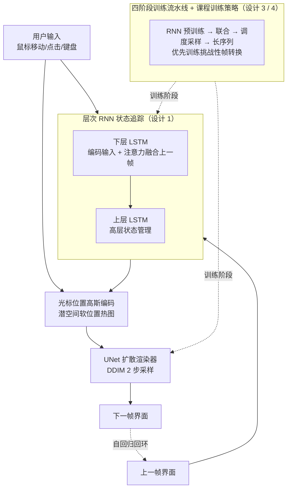

# NeuralOS: Towards Simulating Operating Systems via Neural Generative Models

**会议**: ICLR 2026  
**arXiv**: [2507.08800](https://arxiv.org/abs/2507.08800)  
**代码**: [neural-os.com](https://neural-os.com)  
**领域**: 图像生成 / 交互式世界模型  
**关键词**: operating system simulation, world model, diffusion rendering, GUI generation, interactive systems

## 一句话总结

提出 NeuralOS，使用 RNN 状态追踪 + 扩散渲染器的双组件架构，直接从用户输入事件（鼠标移动/点击/键盘）预测操作系统图形界面帧序列，首次实现用神经生成模型模拟操作系统。

## 研究背景与动机

**领域现状**：生成模型已从文本生成、图像生成发展到视频生成和交互式虚拟环境模拟（如游戏世界模型 GameGen、Oasis）。这些进展表明，计算界面有可能从手工编程转向完全生成式。

**现有痛点**：现有的交互式世界模型主要针对视频游戏，依赖短上下文窗口（因为游戏状态通常可从近几帧中推断）。但操作系统界面有本质不同：(1) 状态转换有长延迟（如打开 Firefox 可能需要 30 帧）；(2) 用户操作空间巨大（鼠标位置是像素级的大离散空间）；(3) 需要长期状态记忆（隐藏窗口、之前的操作等）。

**核心矛盾**：OS 界面需要即时响应不可预测的用户输入，经常引起界面的突变（如启动新应用），这与视频生成中平滑可预测的转换形成鲜明对比。模型必须同时维护精确的状态追踪和高质量视觉渲染。

**本文目标**：能否用神经生成模型端到端模拟操作系统的图形界面？这涉及精确的光标建模、长期状态追踪、应用程序启动/关闭等复杂交互。

**切入角度**：借鉴 OS 中内核（状态管理）与桌面渲染（GUI输出）的功能分离，设计 RNN（状态追踪）+ 扩散渲染器（生成画面）的双模块架构，配合多阶段训练策略。

**核心 idea**：用层次 RNN 追踪系统状态，用扩散模型渲染界面帧，通过多阶段训练让神经网络学会模拟操作系统。

## 方法详解

### 整体框架

NeuralOS 把模拟操作系统看成一个自回归生成问题：给定历史画面和到当前为止的全部用户输入，逐帧预测下一张界面图，形式化为 $P(x_{1:T}\mid a_{1:T};\theta) = \prod_t P(x_t\mid x_{<t}, a_{\leq t};\theta)$。它借鉴真实 OS 里"内核管状态、桌面管渲染"的分工，把模型拆成两块协作的组件：一个层次 RNN 充当"内核"，在隐状态里持续追踪打开了哪些应用、哪些窗口被隐藏、之前做过什么；一个 UNet 扩散渲染器充当"显示器"，根据 RNN 当前状态加上最新的鼠标键盘输入把界面画出来。推理时这两块逐帧自回环：渲染出的当前帧又作为视觉输入回喂给 RNN，驱动下一帧。两个组件不会自动学好，还要靠四阶段训练流水线和课程训练策略把它们逐步逼到位。

### 关键设计

**1. 层次 RNN 状态追踪：用恒定算力记住任意远的历史**

操作系统界面的难点在于状态会长期潜伏——一个窗口被最小化几十帧后还得能恢复，打开 Firefox 这种动作要等三十帧才出结果，这让依赖短窗口的 Transformer 世界模型力不从心。NeuralOS 改用两层 LSTM（各 4096 维隐状态）来扛长程记忆：下层 LSTM 先编码当前用户输入（鼠标坐标、点击、按键），再用多头注意力把上一帧的视觉信息融进来；上层 LSTM 在这个注意力增强表示上做高层状态管理，其输出又反馈回下层形成循环。选 RNN 而非 Transformer 的关键在于：RNN 每一步的计算量恒定，把无限历史压进固定大小的隐状态，天然适合需要实时逐帧推进、又要记住很久之前事件的长序列模拟；两层分工也让"读输入"和"管状态"各司其职。

**2. 光标位置高斯编码：让像素级的鼠标坐标不被潜空间抹平**

鼠标位置是像素级的巨大离散空间，但渲染发生在分辨率被压缩的潜在空间里，如果直接把坐标做 one-hot 投进去，精度会被潜空间的粗格子吃掉，画出来的光标位置会严重漂移。NeuralOS 的做法是在潜在空间里铺一张以光标坐标为中心的二维高斯热图 $M_t(i,j) = \exp\!\left(-\frac{(i-a_t^x/s)^2 + (j-a_t^y/s)^2}{2}\right)$（$s$ 为潜空间下采样倍率），把它和 RNN 输出拼接后一起喂给渲染器，相当于用连续的软位置信号替代离散硬编码。效果非常直接：不加高斯图时光标横纵向误差高达 130 / 95.8 像素，加上后降到 1.6 / 1.4 像素，不到帧尺寸的 0.5%。

**3. 四阶段训练流水线：先各自学会，再连起来扛误差**

如果端到端硬训，扩散渲染器会发现自己光看上一帧就能糊弄出差不多的画面，于是干脆忽略 RNN 输出，回传给 RNN 的梯度极其微弱，状态追踪根本学不起来。为此 NeuralOS 把训练拆成四步逐级加压：Stage 1 先单独用 MSE 损失预训练 RNN，让它学会预测潜在帧，强行打通这条本来梯度消失的通路；Stage 2 把预训练好的 RNN 和扩散渲染器联合优化；Stage 3 引入调度采样（scheduled sampling），以概率 $p$ 把训练输入里的真实帧换成模型自己生成的帧，让模型提前适应推理时只能吃自己输出的处境，缓解暴露偏差和长序列误差积累；Stage 4 再把训练序列拉长，捕获更长程的依赖。每一步都在确保两个组件都真正被用上，而不是一个组件偷懒。

**4. 课程训练策略：把学习信号花在真正会变的帧上**

真实 OS 录屏里绝大多数相邻帧只差一点光标位移，画面几乎不动，直接全量训练等于让模型反复学"什么都没发生"，有效学习信号被稀释。NeuralOS 先用"挑战性帧转换"——前后两帧像素差异超过阈值的帧对——做训练，把算力优先投到应用启动、窗口弹出这类真正的状态突变上，等模型抓住了这些有意义的变化，再扩展到全数据集。

### 损失函数 / 训练策略

训练损失随阶段切换：Stage 1 用 MSE，约束 RNN 输出的前 $C$ 个通道逼近目标潜在帧；Stage 2–4 切回标准 DDPM 扩散损失。整套模型 RNN 部分 2.2B、UNet 渲染器 263M 参数，靠 64 个并行 Docker 收集交互数据，总训练开销约 23,000 GPU 小时（H200 + H100）。推理时用 DDIM 仅 2 步采样，在单卡 H100 上跑到 18 fps，逼近可交互的实时体验。

## 实验关键数据

### 主实验

**光标位置精度**

| 方法 | Δx (pixels) | Δy (pixels) |
|------|-------------|-------------|
| NeuralOS (with 高斯图) | 1.6 | 1.4 |
| NeuralOS (无高斯图) | 130.0 | 95.8 |
| 随机基线 | 175.4 | 126.9 |

**状态转换准确率**：37.7%（73 类聚类，远超多数投票基线 1.4%）

**人类辨识实验**：

| 片段长度 | 人类识别真实 OS 的成功率 |
|----------|----------------------|
| 10s | 58.3% |
| 20s | 55.0% |

短片段下人类仅略好于随机猜测。

### 消融实验

| 组件 | 影响 |
|------|------|
| 无高斯光标编码 | Δx 从 1.6 → 130.0 px |
| 无调度采样 (Stage 3) | RMSE 误差持续增长，长序列严重退化 |
| 仅随机数据 | 出现虚假关联（光标移向关闭按钮就关窗口） |
| 仅 agent 数据 | 交互多样性不足 |

### 关键发现

1. **精确光标建模至关重要**：高斯空间编码将光标误差从 130px 降至 1.6px
2. **RNN 预训练是必要的**：没有预训练，扩散渲染器会完全忽略 RNN 输出
3. **调度采样有效缓解误差积累**：长序列生成质量显著改善
4. **合成数据可教会新应用**：Doom 从未安装但模型能通过合成示范学会模拟
5. **数据多样性需平衡**：随机+agent 两种数据源互补，任一单独使用都不够

## 亮点与洞察

- **愿景宏大**：首次提出并初步实现"用神经网络模拟操作系统"的想法，代表了生成模型从内容生成到系统模拟的跃迁
- **Doom 实验极具想象力**：通过合成训练数据，让模型模拟从未安装的应用程序，暗示生成式界面可以完全脱离真实软件
- **工程深度**：从数据收集（64 个并行 Docker）到训练策略（4 阶段课程）到推理优化（DDIM 2步/18fps），展现了系统级工程能力
- **光标建模的洞察**：高斯空间编码简洁有效，为交互式生成模型中的精确位置控制提供了通用解决方案
- **对 agent 训练的启发**：NeuralOS 可提供安全的模拟环境供 computer-use agent 训练和评估，无需真实系统命令

## 局限与展望

1. **分辨率受限**：仅 512×384，远低于实际 OS 分辨率
2. **应用范围窄**：仅包含 Home、Trash、Terminal、Firefox 四个应用
3. **键盘输入建模困难**：计算资源限制使精确建模细粒度键盘输入受阻
4. **训练成本极高**：23,000 GPU 小时，且数据处理 + 训练约 4 个月
5. **状态转换准确率偏低**：37.7% 虽远超基线但离实用有较大差距
6. **无法扩展到复杂真实应用**：如多窗口应用、系统设置等场景

## 相关工作与启发

- 与游戏世界模型（GameGen、Oasis）的区别：OS 界面需要更长期的状态记忆和更大的动作空间
- 与 **World Labs / Genie** 等交互式世界模型的联系：都在探索用生成模型替代手工编程的环境
- 对 **computer-use agents**（如 Claude computer use）的启发：提供安全训练环境
- 对未来 UI 设计的启示：生成式界面可以根据用户需求实时个性化适配

## 评分

- **新颖性**: ⭐⭐⭐⭐⭐ — 首次提出并实现用神经生成模型模拟操作系统，开创性工作
- **实验充分度**: ⭐⭐⭐⭐ — 多角度评估（光标/状态转换/人类实验/消融），但环境简化严重
- **写作质量**: ⭐⭐⭐⭐⭐ — 叙事引人入胜，问题形式化清晰，训练策略描述详尽
- **价值**: ⭐⭐⭐⭐ — 愿景激动人心且初步验证可行，但离实际应用仍有很大距离

<!-- RELATED:START -->

## 相关论文

- [\[NeurIPS 2025\] AccuQuant: Simulating Multiple Denoising Steps for Quantizing Diffusion Models](../../NeurIPS2025/image_generation/accuquant_simulating_multiple_denoising_steps_for_quantizing.md)
- [\[ACL 2025\] Planning with Diffusion Models for Target-Oriented Dialogue Systems](../../ACL2025/image_generation/difftod_diffusion_dialogue_planning.md)
- [\[NeurIPS 2025\] Neural Entropy](../../NeurIPS2025/image_generation/neural_entropy.md)
- [\[ICLR 2026\] Amortising Inference and Meta-Learning Priors in Neural Networks (BNNP)](amortising_inference_and_meta-learning_priors_in_neural_networks.md)
- [\[ICLR 2026\] Beyond Confidence: The Rhythms of Reasoning in Generative Models](beyond_confidence_the_rhythms_of_reasoning_in_generative_models.md)

<!-- RELATED:END -->
