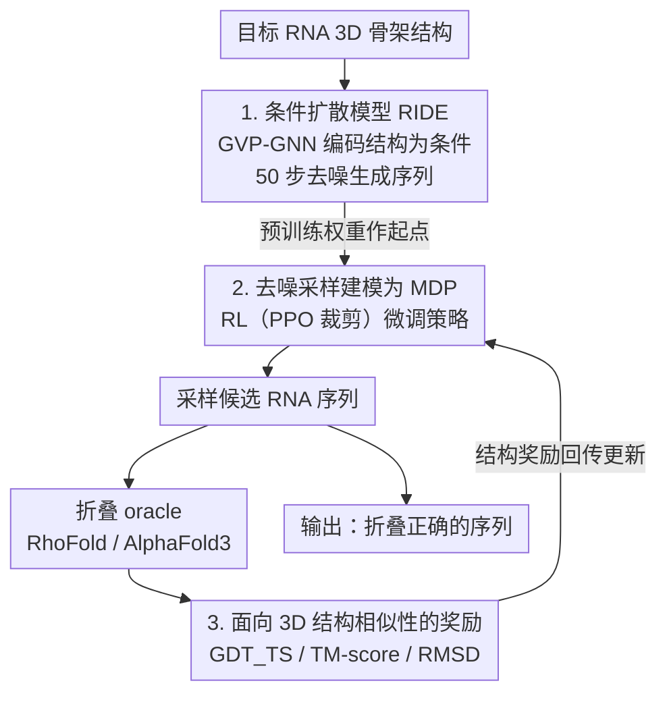

# RIDER: 3D RNA Inverse Design with Reinforcement Learning-Guided Diffusion

**会议**: ICLR 2026  
**arXiv**: [2602.16548](https://arxiv.org/abs/2602.16548)  
**代码**: —  
**领域**: 生物分子设计 / 扩散模型 / 强化学习  
**关键词**: RNA 逆向设计, 3D 结构相似性, 扩散模型, 强化学习微调, DDPO

## 一句话总结

提出 RIDER 框架，首次将强化学习引入 RNA 3D 逆向设计，先预训练条件扩散模型 RIDE 学习序列-结构关系，再用 RL 微调以直接优化 3D 结构相似性而非序列恢复率，在所有 3D 自一致性指标上实现超过 100% 的提升。

## 研究背景与动机

RNA 逆向设计（给定目标 3D 结构，找到能折叠为该结构的核苷酸序列）是治疗药物和合成生物学的关键问题。

**现有方法的根本问题**：几乎所有 SOTA 方法（gRNAde、RiboDiffusion、RDesign 等）都优化**天然序列恢复率 (NSR)**作为代理目标。但 RNA 存在高度简并性——多个不同序列可折叠为相似结构，且相似序列不一定产生相似结构。因此：

1. NSR 与结构相似性无明显相关（在 NSR≈50% 时，GDT_TS 可从 0 变到 0.9）
2. 过度优化 NSR 限制了对非天然序列的探索

## 方法详解

### 整体框架

RIDER 想解决的是 RNA 逆向设计里"优化目标错位"的问题：大家都在优化序列恢复率（NSR），但真正想要的是序列能折回目标 3D 结构。它用两个阶段把代理目标换掉——先预训练一个条件扩散模型 RIDE，让它根据目标骨架结构学会生成分布内的合理序列；再把整条去噪采样过程当成一段决策轨迹，用强化学习直接拿折叠后的结构相似度当奖励去微调策略。预训练保证生成质量在分布内不跑飞，RL 微调把优化方向从"像天然序列"扳到"折叠对了"，而奖励本身则由一组面向 3D 结构相似性的指标拼成，从外部把"折得像不像"的信号回传给采样策略。

### 关键设计

**1. 条件扩散模型 RIDE：把目标结构编码成可生成序列的条件**

要让模型"看着结构写序列"，先得把 3D 骨架变成模型能消化的条件。RIDER 把 RNA 骨架表示成几何图——节点是核苷酸、边编码空间邻近，用 5 层 GVP-GNN 编码器抽出等变的节点嵌入 $\mathbf{h}_c$ 作为扩散条件。扩散模型学的是条件分布 $p(\mathbf{x}_0 \mid \mathbf{h}_c)$，其中 $\mathbf{x}_0 \in \{0,1\}^{N \times 4}$ 是独热编码的序列，前向加噪为 $\mathbf{x}_t = \alpha_t \mathbf{x}_0 + \sigma_t \varepsilon$。训练就是标准的噪声预测目标 $\mathcal{L}_{\text{pretrain}}(\theta) = \mathbb{E}_{t, \mathbf{x}_0, \varepsilon, \mathbf{h}_c}[\|\varepsilon - \epsilon_\theta(\alpha_t \mathbf{x}_0 + \sigma_t \varepsilon, t, \mathbf{h}_c)\|^2]$，噪声预测网络同样由 GVP-GNN 组成，推理时用 50 步 DDIM 采样。这一步先把序列-结构的对应关系学进模型，相当于给后续 RL 一个质量过关的起点——预训练后单论 NSR 就已经做到 61%，高于 gRNAde 的 50%。

**2. 把去噪采样建模成 MDP 并用 RL 微调：让训练直接对准结构奖励**

扩散模型本身只会模仿训练序列，无法主动优化"折叠结果好不好"。RIDER 的关键一步是把 50 步去噪采样看成一段马尔可夫决策过程：状态 $s_t = (\mathbf{x}_t, t, \mathbf{h}_c)$，动作 $a_t$ 是从 $\mathbf{x}_t$ 到 $\mathbf{x}_{t-\Delta t}$ 的一步转移，策略 $\pi_\theta(a_t\mid s_t)$ 就由扩散模型参数化，奖励只在轨迹末尾——拿到完整序列、折叠出结构后——才给出。这样优势函数携带的就是真实的结构信号。为稳住高方差的轨迹奖励，优势估计用批量奖励均值 $b = \mathbb{E}_\tau[R_{\text{traj}}]$ 作基线，并进一步做滑动平均 $b^{(i)} = \beta_{\text{baseline}} \cdot b^{(i-1)} + (1-\beta_{\text{baseline}}) \cdot \bar{R}^{(i)}_{\text{batch}}$ 抑制跨批波动；更新则套用 PPO 裁剪目标 $\mathcal{L}^{RL}(\theta) = \mathbb{E}[\sum_{k}\min(r_k(\theta)A, \text{clip}(r_k(\theta), 1-\epsilon_{\text{clip}}, 1+\epsilon_{\text{clip}})A)]$，防止单步更新过大把预训练模型带崩。

**3. 面向 3D 结构相似性的奖励设计：把抽象目标翻译成可优化的标量**

RL 的方向完全由奖励决定，所以奖励必须直接反映"折叠得像不像"。RIDER 基于三种结构相似性指标构造奖励：$R^{\text{gdt}} = (\text{GDT\_TS} \times w)^2$、$R^{\text{tm}} = (\text{TM-score} \times w)^2$、$R^{\text{rmsd}} = -(\text{RMSD} \times w)^2$，以及把 GDT 和 RMSD 拼起来的组合奖励 $R^{\text{gdt\_rmsd}}$。平方放大了高分区间的梯度，让模型更愿意去够接近完美折叠的序列；再叠一个阈值奖励 $R_{\text{bonus}}$——当 GDT_TS > 0.5 或 RMSD < 2.0Å 时额外加分——给"已经折得不错"的样本一个明确的鼓励信号。这些指标都需要先把采样序列送进折叠 oracle（RhoFold 或 AlphaFold3）预测出 3D 结构，再与目标结构对齐计算，因此奖励是从外部"折叠—对齐"环节算出来、回传给设计 2 的采样策略的。实验里组合奖励 $R^{\text{gdt\_rmsd}}$ 在各指标上最均衡，因为它同时兼顾了全局对齐（GDT）和逐原子误差（RMSD）这两类互补的衡量角度。

## 实验

### 预训练结果

| 方法 | NSR ↑ |
|------|------|
| gRNAde | 50% |
| RiboDiffusion | 52% |
| **RIDE (Ours)** | **61%** |

### RL 微调结果

| 方法 | GDT_TS ↑ | RMSD ↓ | TM-score ↑ |
|------|----------|--------|-----------|
| gRNAde | 0.28 (27%) | 10.89 (3%) | 0.30 (28%) |
| RIDE (预训练) | 0.33 (31%) | 10.36 (8%) | 0.33 (36%) |
| **RIDER** ($R^{\text{tm}}$) | **0.62 (72%)** | 4.31 (31%) | **0.61 (72%)** |
| **RIDER** ($R^{\text{gdt\_rmsd}}$) | **0.62 (72%)** | **3.35 (33%)** | 0.56 (68%) |

百分比表示超过设计阈值的比例。RIDER 在所有指标上实现 100%+ 提升。

### 跨预测器验证

使用 AlphaFold3 替代 RhoFold 验证泛化性：RIDER 的 GDT_TS = 0.57，比 gRNAde (0.26) 提升 119%，证明框架捕获了可泛化的 RNA 设计原则。

### 关键发现

- NSR 确实与 3D 结构相似性无明显相关
- RL 微调后 NSR 通常降低，但 GDT_TS 提升，说明模型发现了不同于天然序列但折叠正确的新序列
- GDT_TS 和 TM-score 相关性高（Pearson 0.885），但各有侧重
- 组合奖励 $R^{\text{gdt\_rmsd}}$ 效果最均衡

## 亮点

- 首个面向 RNA 3D 逆向设计的 RL 框架，直接优化结构相似性
- 从数据和理论两方面证明了 NSR 作为代理目标的不足
- RL 微调策略（滑动平均基线 + PPO 裁剪）稳定有效
- 轻量模型（仅 10.2M 参数）即可取得显著效果

## 局限性

- 依赖 RhoFold 等结构预测模型作为折叠 oracle，其预测误差会传播
- RL 训练需要大量采样（每 epoch 60 条轨迹 × 80 epochs）
- 仅在 12,011 个 RNA 结构上训练和评估，数据规模有限
- 尚未进行实验验证（设计序列的湿实验验证）

## 相关工作

- **RNA 逆向设计**：gRNAde、RiboDiffusion、RDesign 等基于监督学习
- **RNA 结构预测**：RhoFold、AlphaFold3 等预测工具
- **RL 微调生成模型**：DDPO、RLHF、Constitutional AI 等

## 评分

- 新颖性：⭐⭐⭐⭐⭐ — 首个 RL 驱动的 RNA 3D 逆向设计
- 动机：⭐⭐⭐⭐⭐ — NSR 缺陷的分析清晰有力
- 实验：⭐⭐⭐⭐ — 多种奖励函数 + 跨 oracle 验证
- 影响力：⭐⭐⭐⭐ — 对 RNA 药物设计有重要意义

<!-- RELATED:START -->

## 相关论文

- [\[ICLR 2026\] Hierarchical Entity-centric Reinforcement Learning with Factored Subgoal Diffusion](hierarchical_entity-centric_reinforcement_learning_with_factored_subgoal_diffusi.md)
- [\[AAAI 2026\] Structure-based RNA Design by Step-wise Optimization of Latent Diffusion Model](../../AAAI2026/image_generation/structure-based_rna_design_by_step-wise_optimization_of_latent_diffusion_model.md)
- [\[CVPR 2026\] Refining Few-Step Text-to-Multiview Diffusion via Reinforcement Learning](../../CVPR2026/image_generation/refining_few-step_text-to-multiview_diffusion_via_reinforcement_learning.md)
- [\[ICML 2025\] Hierarchical Reinforcement Learning with Uncertainty-Guided Diffusional Subgoals](../../ICML2025/image_generation/hierarchical_reinforcement_learning_with_uncertainty-guided_diffusional_subgoals.md)
- [\[ICLR 2026\] Flow Matching with Injected Noise for Offline-to-Online Reinforcement Learning](flow_matching_with_injected_noise_for_offline-to-online_reinforcement_learning.md)

<!-- RELATED:END -->
