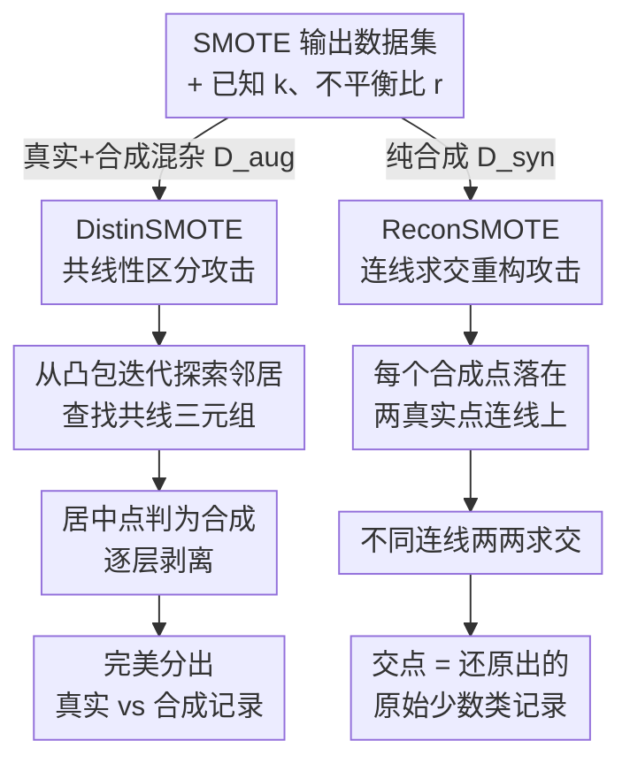

# SMOTE and Mirrors: Exposing Privacy Leakage from Synthetic Minority Oversampling

**会议**: ICLR 2026  
**arXiv**: [2510.15083](https://arxiv.org/abs/2510.15083)  
**代码**: 未提供  
**领域**: 图像生成  
**关键词**: SMOTE, 隐私泄露, 重构攻击, 区分攻击, 少数类过采样

## 一句话总结

首次系统研究 SMOTE 的隐私泄露问题，提出 DistinSMOTE 和 ReconSMOTE 两种攻击，证明 SMOTE 本质上是非隐私保护的，且过度暴露少数类记录。

## 研究背景与动机

**领域现状**：SMOTE（Synthetic Minority Over-sampling Technique）是处理类不平衡和生成合成数据最广泛使用的方法之一（原始论文被引近 4 万次，Azure 内置支持）。它在少数类样本间做线性插值生成合成样本，既被用作数据增强提高分类器性能（医疗诊断、欺诈检测等），也常作为 GAN、VAE 等复杂生成模型的基线。

**核心痛点**：尽管 SMOTE 被广泛用于隐私敏感场景，其隐私影响几乎未被研究。更严重的是，一些扩散模型论文仅凭「比 SMOTE 的 DCR 指标更优」就声称自己具有隐私保护性——这种把 SMOTE 当作隐私基线的评估方式存在根本缺陷：如果 SMOTE 本身就严重泄露隐私，那么以它为参照的全部结论都站不住脚。本文要做的，就是把 SMOTE 的隐私泄露彻底摊开。

## 方法详解

### 整体框架

整篇工作把 SMOTE 的线性插值机制当成攻击的突破口：只要拿到一份 SMOTE 输出的数据集，并且知道它用的是 SMOTE 以及邻居数 $k$、不平衡比 $r$，攻击者无需任何辅助数据、影子模型或重复查询，就能从纯几何规律反推出隐私。作者在这个「只看输出、只知参数」的最小威胁模型下，按攻击者手里数据集的形态分出两条互补路线：拿到真实与合成混杂的增强数据集 $D_{aug}$，就用 **DistinSMOTE** 把两者分开；拿到纯合成数据集 $D_{syn}$，就用 **ReconSMOTE** 直接还原出原始少数类记录。两者共享同一个底层事实——合成点严格落在两个真实点的连线上——只是一个利用「中点共线」做区分，一个利用「连线求交」做重构。

### 关键设计

**1. DistinSMOTE：用共线性把合成点从真实点里揪出来**

当真实记录和合成记录被混在 $D_{aug}$ 里时，朴素方法（如比较最近邻距离）几乎查不出任何泄露——这正是当前实践误以为 SMOTE「安全」的原因。DistinSMOTE 抓住了 SMOTE 的一个硬性几何事实：合成点是在两个真实点之间严格线性插值得到的，因此在任意共线三元组里，居中的那一点必定是合成的——而真实点之间在实值高维特征下几乎不可能恰好共线。攻击从少数类记录的凸包出发，迭代探索邻居，一旦发现共线三元组就把中间点标记为合成并移出候选集，再把它的邻居加入队列继续检查，像剥洋葱一样层层剥掉合成点。作者证明，只要满足实值特征、全局非共线性、$k \geq 3$ 这三个相当温和的假设，DistinSMOTE 就能达到精确率和召回率双双完美——也就是说，「合成点混进真实数据里就藏住了」这个隐含假设根本不成立。

**2. ReconSMOTE：让合成点的连线交点暴露真实记录**

比区分更危险的是直接重构：即使数据集里一条真实记录都没有，纯合成的 $D_{syn}$ 仍然会泄露原始数据。原理同样来自插值——每个合成点都落在两个真实点的连线上，于是只要找到足够多落在不同真实点对连线上的合成点，把这些连线两两求交，交点就恰好是真实记录本身。能否恢复某条真实记录，取决于围绕它的合成点是否密集到能凑出多条相交的连线，因此召回率随着不平衡比 $r$ 增大（每个真实点被更多次用于插值、连线更密）以约 $r/k$ 的速率指数上升，在 $k=5,\ r \geq 20$ 时达到 1.0；而精确率始终保持完美（1.0），因为任何被还原出的交点都是货真价实的原始记录，不会无中生有。

两种攻击的时间复杂度均为 $O(n^2 d + n(kr)^2)$，在全部 8 个实验数据集上都只需分钟级运行时间，说明它们不仅理论上成立，落地成本也极低。

## 实验

### 数据集
8个标准不平衡数据集

### 主要结果

| 攻击方法 | 增强数据精度 | 合成数据精度 |
|---------|-----------|-----------|
| Naive 区分（当前实践） | 0.01 ± 0.01 | — |
| Naive 指标（DCR） | — | 0.16 ± 0.10 |
| MIA（成员推理） | 0.68 ± 0.07 | 0.93 ± 0.02 |
| DistinSMOTE | **1.00 ± 0.00** | — |
| ReconSMOTE | — | **1.00 ± 0.00** |

### 关键发现

1. **现有评估完全失败**：Naive 区分和 DCR 指标无法检测任何泄露
2. **MIA首次应用于SMOTE**：对100个脆弱目标达到较高 AUC
3. **DistinSMOTE 完美区分**：增强数据集中真实vs合成记录
4. **ReconSMOTE 完美精确率**：重构真实少数类记录，平均召回率0.85，不平衡比≥20时达1.0

### 消融实验

| 参数 | 对 ReconSMOTE 的影响 |
|------|-------------------|
| 不平衡比 r 增大 | 召回率指数增长 |
| 邻居数 k 增大 | 召回率降低 |
| 特征维度 d | 非共线性更容易满足 |

## 亮点与洞察

1. **首次系统揭示 SMOTE 的隐私风险**：从理论和实验双重角度证明 SMOTE 本质上非隐私保护
2. **最小假设的近完美攻击**：不需要辅助数据或模型访问
3. **揭示评估方法的根本缺陷**：DCR 指标和 naive 区分方法完全不可靠
4. **对研究社区的重要警示**：质疑了大量使用 SMOTE+DCR 评估隐私的生成模型论文

## 局限与展望

1. 攻击假设攻击者知道使用了 SMOTE 及其参数
2. 主要针对标准 SMOTE，变体（如 Borderline-SMOTE、ADASYN）未充分探讨
3. 非共线性假设在极低维度或离散特征场景可能不满足
4. 未提供具体的防御方案

## 相关工作

- **SMOTE变体**：Borderline-SMOTE、SMOTE-ENN 等改进方法
- **隐私攻击**：MIA (Shokri 2017)、重构攻击 (Carlini 2021)
- **合成数据隐私**：DCR 指标 (Zhao 2021)、差分隐私生成模型
- **引发质疑的论文**：多篇发表在顶会的扩散模型论文使用 SMOTE+DCR 声称隐私保护

## 评分

- **创新性**: ⭐⭐⭐⭐⭐ — 首次揭示被广泛使用方法的根本隐私缺陷
- **实用性**: ⭐⭐⭐⭐⭐ — 对真实部署场景有直接影响
- **实验**: ⭐⭐⭐⭐ — 8个数据集，多种攻击对比
- **写作**: ⭐⭐⭐⭐⭐ — 问题动机清晰，理论分析严谨

<!-- RELATED:START -->

## 相关论文

- [\[ICML 2025\] Privacy Amplification Through Synthetic Data: Insights from Linear Regression](../../ICML2025/image_generation/privacy_amplification_through_synthetic_data_insights_from_linear_regression.md)
- [\[AAAI 2026\] Exposing DeepFakes via Hyperspectral Domain Mapping](../../AAAI2026/image_generation/exposing_deepfakes_via_hyperspectral_domain_mapping.md)
- [\[ICML 2026\] Beyond Generative Priors: Minority Sampling with JEPA-Guided Diffusion](../../ICML2026/image_generation/beyond_generative_priors_minority_sampling_with_jepa-guided_diffusion.md)
- [\[CVPR 2025\] Minority-Focused Text-to-Image Generation via Prompt Optimization](../../CVPR2025/image_generation/minority-focused_text-to-image_generation_via_prompt_optimization.md)
- [\[AAAI 2026\] Copyright Infringement Detection in Text-to-Image Diffusion Models via Differential Privacy](../../AAAI2026/image_generation/copyright_infringement_detection_in_text-to-image_diffusion_models_via_different.md)

<!-- RELATED:END -->
