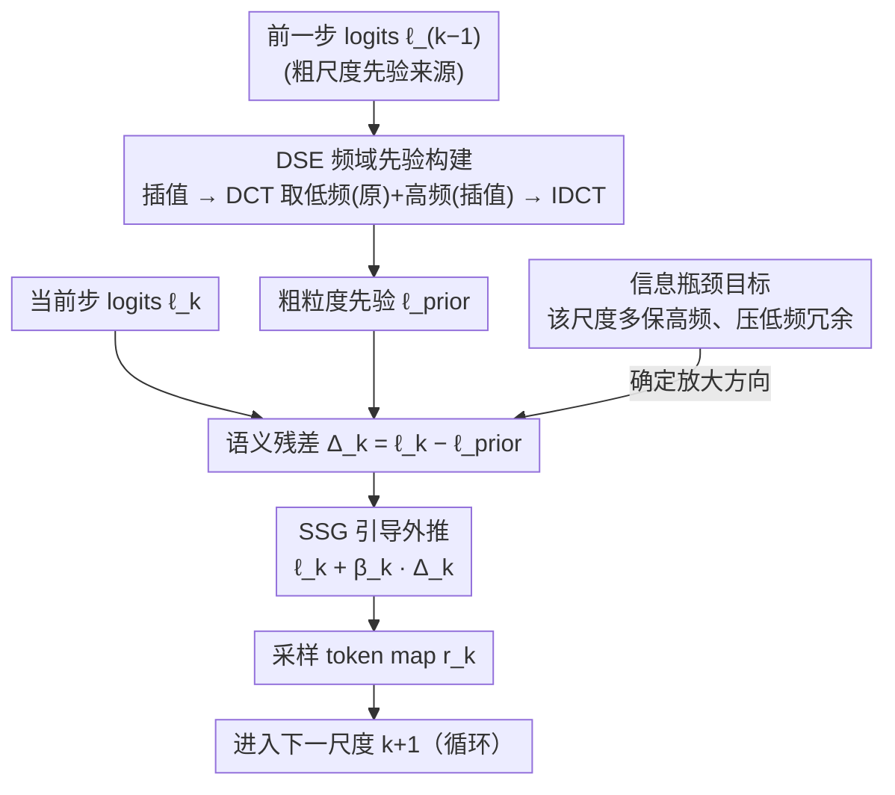

# SSG: Scaled Spatial Guidance for Multi-Scale Visual Autoregressive Generation

**会议**: ICLR 2026  
**arXiv**: [2602.05534](https://arxiv.org/abs/2602.05534)  
**代码**: [GitHub](https://github.com/Youngwoo-git/SSG)  
**领域**: 视觉自回归模型 / 图像生成 / 推理时引导  
**关键词**: VAR, 下一尺度预测, 信息瓶颈, 频域引导, 训练免费

## 一句话总结

提出 Scaled Spatial Guidance (SSG)，一种无需训练的推理时引导方法，通过频域先验构建和语义残差放大，增强视觉自回归模型的粗到细层级生成质量。

## 研究背景与动机

视觉自回归（VAR）模型通过下一尺度预测（next-scale prediction）生成图像，天然实现粗到细的层级合成。然而：

**训练-推理偏差**：有限的模型容量和累积误差导致模型在推理时偏离粗到细的本质，低频信息被冗余预测

**现有改进方法的限制**：
   - 辅助精炼模块（CoDe、HMAR）需要重新训练
   - 流匹配集成增加开销
   - 自校正机制需要修改架构

**核心问题**：如何在不修改模型参数的情况下，引导每一步生成该尺度特有的新颖高频信息？

## 方法详解

### 整体框架

SSG 要解决的是 VAR 推理时的训练-推理偏差：模型在每一步下一尺度预测里倾向于重复已经确定的低频结构，而不是补上该尺度特有的高频细节。SSG 把这一步看成一个信息瓶颈（IB）优化——只想保留属于当前尺度的新颖高频信号、压掉与前面粗尺度重合的低频冗余。具体怎么转：对第 $k$ 步，先把前一步的 logits $\ell_{k-1}$ 在频域里搭成一个不失真的粗粒度先验 $\ell_{\text{prior}}$（DSE 模块），再用当前 logits $\ell_k$ 减去它得到语义残差 $\Delta_k$，把这部分高频信号沿 $\Delta_k$ 方向按逐步缩放因子 $\beta_k$ 放大后回注采样分布，最后采样出本尺度 token、进入下一尺度。整套流程只在采样循环里改 logits、复用已缓存的逐步输出，不加任何额外前向、不动模型权重，因此能零成本挂到现成 VAR 上。

### 关键设计

**1. 信息瓶颈目标：把"该尺度该生成什么"形式化**

VAR 的训练-推理偏差本质是模型每一步重复预测已确定的低频结构，而不补充该尺度特有的高频信息——但"该补什么"原本是个模糊的直觉。SSG 从 IB 原理出发把它写成变分优化 $\mathcal{L}_{\text{VAR-IB}} = \max_{z_k} \beta I(z_k; H(\hat{f}_K)) - I(z_k; L(\hat{f}_K))$：第一项最大化第 $k$ 步隐变量 $z_k$ 与最终特征高频成分 $H(\hat{f}_K)$ 的互信息（多生成新细节），第二项最小化它与低频成分 $L(\hat{f}_K)$ 的冗余互信息（少重复粗结构），其中利用了 $L(\hat{f}_K)\approx \hat{f}_{k-1}$ 即低频近似等于前一步累积特征。这一步把"该尺度该生成什么"变成可操作的"多要高频、少要低频"权衡，给后面的闭式引导提供理论落点——也正是框架图里那个决定残差放大方向的目标节点。

**2. DSE 频域先验构建：搭一个不失真的粗粒度参照**

整个引导的质量取决于先验 $\ell_{\text{prior}}$ 准不准：若先验失真，残差 $\Delta_k$ 会错位、反而压掉本该保留的细节。朴素做法是把前一步 logits 直接空间插值到当前分辨率，但线性插值过度平滑、衰减掉本应保留的结构，最近邻插值又引入块状不连续和伪高频，两者都会污染 $\Delta_k$。DSE 改在频域融合：先对前一步 logits $\ell_{k-1}$ 做空间插值得到 $\ell'_{\text{interp}}$，再对 $\ell_{k-1}$ 与 $\ell'_{\text{interp}}$ 分别做 DCT，取 $\ell_{k-1}$ 的低频系数与 $\ell'_{\text{interp}}$ 的高频系数拼接，最后 IDCT 还原成 $\ell_{\text{prior}}$。利用 DCT 正交性，这种拼接能量守恒地精确分离频段——低频来自原图保真、高频来自插值的平滑外推，从而给出一个既不模糊又无伪影的先验，让 $\Delta_k$ 真正只反映该尺度的新增细节。

**3. SSG 引导外推：用语义残差放大高频**

有了目标和先验，剩下的是怎么把"多高频少低频"落到采样上。直接求解 IB 目标不现实，SSG 把它转成一个 MAP 风格的代理函数 $\mathcal{L}(\ell') = \beta(\ell')^{\top}\Delta_k - \tfrac12\|\ell'-\ell_k\|_2^2$；该二次型严格凹（Hessian 为 $-I$），有唯一闭式最大值，给出引导公式 $\ell_k^{\text{SSG}} = \ell_k + \beta_k \Delta_k = \ell_k + \beta_k(\ell_k - \ell_{\text{prior}})$。残差 $\Delta_k = \ell_k - \ell_{\text{prior}}$ 正好对应当前尺度相对粗结构新增的高频，沿它以逐步缩放因子 $\beta_k$ 外推就放大了该尺度特有的语义残差、压制了与先验重合的低频冗余；$\beta_k$ 越大注入的高频越多、但越偏离基模型的全局一致性，需要折中。形式上它和 CFG 同属"沿某个差向量外推 logits"，但这里的差向量来自尺度间的频率差异而非条件差异，因此天然契合 VAR 粗到细的层级结构，且复用已缓存 logits、不需要额外一次无条件前向。

## 实验

### ImageNet 256×256 类条件生成

| 模型 | FID↓ | sFID↓ | IS↑ | Pre↑ | Rec↑ |
|------|------|-------|-----|------|------|
| VAR-d16 | 3.42 | 8.70 | 275.6 | 0.84 | 0.51 |
| +SSG | **3.27** | **8.39** | **285.3** | **0.85** | 0.50 |
| VAR-d20 | 2.67 | 7.97 | 299.8 | 0.83 | 0.55 |
| +SSG | **2.49** | **7.60** | **305.2** | 0.83 | **0.56** |
| VAR-d24 | 2.39 | 8.18 | 314.7 | 0.82 | 0.58 |
| +SSG | **2.20** | **6.95** | **324.0** | **0.83** | **0.59** |
| VAR-d30 | 2.02 | 8.52 | 302.9 | 0.82 | 0.60 |
| +SSG | **1.68** | **8.50** | **313.2** | 0.81 | **0.62** |

### 跨模型泛化

SSG 在不同 tokenization 方案上均有效：
- 标准 VAR (Tian et al.)
- HART（混合 token）
- Infinity（bitwise token）

### 与其他生成模型对比

VAR-d30 + SSG (FID 1.68) 与扩散模型和掩码模型具有竞争力，同时保持 VAR 的低延迟优势（10步推理）。

### 消融实验

| 组件 | FID | IS |
|------|-----|-----|
| 无 SSG（基线） | 2.02 | 302.9 |
| SSG + 线性插值先验 | 改善有限 | — |
| SSG + 最近邻先验 | 可能恶化 | — |
| SSG + DSE（频域融合） | **1.68** | **313.2** |

## 亮点

1. **信息论驱动的优雅设计**：从 IB 原理严格推导出 SSG 的闭式解
2. **完全训练免费**：无需修改模型权重、无需额外数据、无需微调
3. **频域先验构建（DSE）理论合理**：利用 DCT 正交性实现能量无损的频段融合
4. **一致性强**：在不同 VAR 模型尺度和 tokenization 设计上均有效
5. **实现极简**：几行代码即可集成

## 局限性

1. SSG 的效果依赖于合理的 $\beta_k$ 调度，需要根据模型调参
2. 在第一步（最粗尺度）无先验可用，SSG 不生效
3. 本质上是后验修正，无法弥补 tokenizer 本身的信息损失
4. 仅适用于离散视觉 token 的 VAR 模型

## 相关工作

- **VAR模型**：VAR (Tian 2024)、HART (Tang 2025)、Infinity (Han 2025)
- **视觉引导**：CFG、SAG、PAG、STG，但均非针对 VAR 设计
- **训练-推理偏差缓解**：CoDe、HMAR，但需要重训

## 评分

- **创新性**: ⭐⭐⭐⭐⭐ — 信息论到实践的优雅桥接
- **实用性**: ⭐⭐⭐⭐⭐ — 零成本集成，即插即用
- **实验**: ⭐⭐⭐⭐ — 多模型多设置验证
- **写作**: ⭐⭐⭐⭐⭐ — 理论推导清晰，直觉解释充分

<!-- RELATED:START -->

## 相关论文

- [\[ICLR 2026\] MVAR: Visual Autoregressive Modeling with Scale and Spatial Markovian Conditioning](mvar_visual_autoregressive_modeling_with_scale_and_spatial_markovian_conditionin.md)
- [\[CVPR 2026\] Markovian Scale Prediction: A New Era of Visual Autoregressive Generation](../../CVPR2026/image_generation/markovian_scale_prediction_a_new_era_of_visual_autoregressive_generation.md)
- [\[ICLR 2026\] Laplacian Multi-scale Flow Matching for Generative Modeling](laplacian_multi-scale_flow_matching_for_generative_modeling.md)
- [\[ICLR 2026\] Visual Autoregressive Modeling for Instruction-Guided Image Editing](visual_autoregressive_modeling_for_instruction-guided_image_editing.md)
- [\[ICML 2026\] Visual Implicit Autoregressive Modeling](../../ICML2026/image_generation/visual_implicit_autoregressive_modeling.md)

<!-- RELATED:END -->
